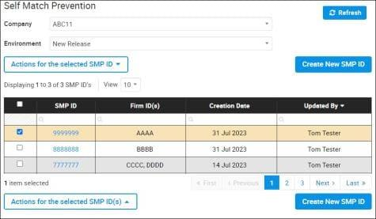

## Table of Contents

## What is self-match prevention?

Self-match prevention is a rule used in trading and financial markets to stop people from buying and selling the same thing to themselves. This rule helps keep trading fair and stops people from tricking the market. If someone tries to do a self-match, the trade won't happen, and they might get in trouble.

This rule is important because it stops people from making fake trades to change prices or to make it look like there is more trading happening than there really is. By not allowing self-matches, the market stays honest and everyone can trust that the trades they see are real. This helps keep the market working well for everyone.

## Why is self-match prevention important?

Self-match prevention is important because it keeps trading fair and honest. Without this rule, people could trick the market by buying and selling the same thing to themselves. This would make it look like there is more trading happening than there really is, which can confuse other traders and change prices unfairly. By stopping self-matches, the rule helps make sure that all trades are real and that the market stays trustworthy.

This rule also protects everyone who trades in the market. If self-matches were allowed, some people might try to cheat by making fake trades to make money or to move prices in their favor. This would be bad for other traders who are trying to make honest trades. By having self-match prevention, the market stays a fair place where everyone can trust that the prices they see are real and that they have a fair chance to trade.

## How does self-match prevention work?

Self-match prevention works by stopping people from buying and selling the same thing to themselves. When someone tries to do a self-match, the trading system checks if the buyer and seller are the same person or if they are connected in a way that could be cheating. If the system finds a self-match, it will not let the trade happen. This keeps the market fair and stops people from making fake trades.

This rule is used in many trading places, like stock markets and [cryptocurrency](/wiki/cryptocurrency) exchanges. The system uses special computer programs to watch all trades and make sure no self-matches happen. If someone tries to do a self-match, they might get in trouble, like getting a warning or even being banned from trading. By stopping self-matches, the market stays honest and everyone can trust that the trades they see are real.

## What are common scenarios where self-match prevention is needed?

Self-match prevention is needed in many common situations in trading. One big scenario is in stock markets, where traders might try to buy and sell the same stock to themselves to make it look like there is more trading happening. This can trick other people into thinking a stock is more popular than it really is, which can change the price unfairly. Another scenario is in cryptocurrency exchanges, where people might try to do self-matches to move the price of a cryptocurrency up or down to make money.

Another common situation is in high-frequency trading, where computers make trades very quickly. Sometimes, these computers might accidentally try to buy and sell the same thing to themselves if they are not set up right. Self-match prevention stops these mistakes from happening and keeps the market fair. It's also important in markets where people can trade things like futures and options, where self-matches could be used to trick the market and change prices unfairly.

## What are the basic techniques used for self-match prevention?

Self-match prevention uses a few basic techniques to stop people from buying and selling the same thing to themselves. One common way is by using special computer programs that watch all trades happening in the market. These programs check if the person trying to buy something is the same as the person trying to sell it. If they find a match, they stop the trade from happening. This helps keep the market fair and stops people from making fake trades.

Another technique is to use rules that say people who are connected, like family members or people working for the same company, can't trade with each other. This stops them from working together to do self-matches. Sometimes, markets also use a thing called a "self-match prevention key" that traders have to use when they make a trade. This key helps the system know if a trader is trying to do a self-match, and if they are, the trade won't go through.

## How can self-match prevention be implemented in software?

To implement self-match prevention in software, you need to use special computer programs that keep an eye on all the trades happening in the market. These programs check if the person trying to buy something is the same as the person trying to sell it. If they find a match, they stop the trade from happening. This means you need to write code that can compare the buyer and seller information for every trade. If the buyer and seller are the same, or if they are connected in a way that could be cheating, the software will not let the trade go through.

Another way to implement self-match prevention is by using a special key called a "self-match prevention key." Traders have to use this key when they make a trade. The software checks this key to see if the trader is trying to do a self-match. If it finds a self-match, the trade is stopped. You also need to make rules in the software that stop people who are connected, like family members or people working for the same company, from trading with each other. This helps keep the market fair and stops people from working together to do self-matches.

## What are the challenges faced in implementing self-match prevention?

One big challenge in implementing self-match prevention is making sure the software can check all trades quickly and correctly. The system needs to look at a lot of information for every trade, like who is buying and who is selling, and it has to do this very fast. If the software is too slow, it might miss some self-matches or stop trades that should be allowed. This can make traders unhappy and cause problems in the market. Also, the software has to be smart enough to know when people are trying to trick it, like using different accounts to do self-matches.

Another challenge is making rules that are fair for everyone. Sometimes, it's hard to decide if two people are connected in a way that could be cheating. For example, should cousins be stopped from trading with each other? Or what if two people work for different parts of the same big company? The rules need to be clear and fair, but also strong enough to stop cheating. If the rules are too strict, they might stop trades that are okay, and if they are too loose, they might let self-matches happen. Finding the right balance is hard and takes a lot of work.

## Can you explain an advanced algorithm used for self-match prevention?

One advanced algorithm used for self-match prevention is called the "Bloom Filter Algorithm." This algorithm helps quickly check if a trader is trying to do a self-match without looking at every single trade in detail. It uses a special kind of list called a "Bloom filter" to keep track of who is trading. When someone tries to make a trade, the algorithm checks this list to see if the buyer and seller might be the same person or connected in a way that could be cheating. If the algorithm finds a possible match, it stops the trade from happening and looks at it more closely to make sure it's not a self-match.

Using the Bloom Filter Algorithm is good because it can check trades very fast, even when there are a lot of trades happening at the same time. This helps keep the market running smoothly without slowing down. However, the algorithm can sometimes make mistakes and stop trades that should be allowed, or it might miss some self-matches. To fix these problems, the system needs to keep the Bloom filter up to date and use other checks to make sure it's working right. This way, the market stays fair and traders can trust that the trades they see are real.

## How do different industries apply self-match prevention?

In the stock market, self-match prevention is really important to keep trading fair. When people trade stocks, they can't buy and sell the same stock to themselves. This rule stops them from making the stock price go up or down on purpose. The stock market uses special computer programs to watch all trades and make sure no self-matches happen. If someone tries to do a self-match, the trade won't go through, and they might get in trouble. This helps keep the stock market honest and makes sure everyone can trust the prices they see.

In the world of cryptocurrencies, self-match prevention is also used to stop people from cheating. People who trade cryptocurrencies can't buy and sell the same coin to themselves because it could trick other traders and change the price unfairly. Cryptocurrency exchanges use software to check every trade and stop self-matches from happening. This rule helps keep the cryptocurrency market fair and stops people from making fake trades to make money. By using self-match prevention, the cryptocurrency market stays a place where people can trust that the trades are real.

## What are the best practices for maintaining self-match prevention systems?

To keep self-match prevention systems working well, it's important to always update the software. This means fixing any mistakes and making the system better at finding self-matches. You should also check the system often to make sure it's stopping self-matches correctly. If you find any problems, fix them quickly so the system stays fair and trustworthy. It's also a good idea to teach people who use the system about the rules and why they are important. This helps everyone understand how to trade the right way and keeps the market honest.

Another good practice is to have clear rules about who can trade with each other. This means deciding if people who are related or work together should be allowed to trade. The rules need to be fair but strong enough to stop cheating. It's also important to keep an eye on how the system is working and listen to what traders say about it. If traders think the system is not fair, you might need to change the rules or the software. By doing these things, you can make sure the self-match prevention system keeps the market fair and safe for everyone.

## How can the effectiveness of self-match prevention be measured?

To measure how well self-match prevention is working, you can look at how many self-matches the system stops. If the system is catching a lot of self-matches, it means it's doing a good job. You can also check how fast the system works. If it can check trades quickly and doesn't slow down the market, that's a good sign. Another way to measure effectiveness is to see if traders trust the system. If traders think the market is fair and they're happy with how the system works, it's probably doing a good job.

It's also important to see if the system is making mistakes. If the system stops trades that should be allowed, it might be too strict. On the other hand, if it misses self-matches, it might be too loose. You can measure this by looking at how often the system makes these mistakes. By keeping an eye on these things and listening to what traders say, you can tell if the self-match prevention system is working well and helping to keep the market fair and honest.

## What future developments are expected in the field of self-match prevention?

In the future, self-match prevention systems will likely get even better at stopping people from cheating in trading. One big change we might see is the use of new technology like [artificial intelligence](/wiki/ai-artificial-intelligence) (AI) and [machine learning](/wiki/machine-learning). These tools can help the system learn from past trades and get better at spotting self-matches. They can also check trades faster and more accurately, making the market safer and fairer for everyone. As more and more trades happen online, these smart systems will be really important to keep up with all the trading going on.

Another thing that might happen is that self-match prevention rules will become more clear and fair. People who make the rules will keep working to find the right balance between stopping cheating and letting honest trades happen. They might also make it easier for traders to understand the rules and why they are important. By doing this, everyone can trust the market more and feel good about trading. Overall, the future of self-match prevention looks bright, with new technology and better rules helping to keep trading honest and fair.

## References & Further Reading

[1]: Aitken, M., Harris, F., & Ji, S. (2015). ["Who Trades at the Close? Implications for Earnings Announcements."](https://researchers.mq.edu.au/en/publications/a-worldwide-examination-of-exchange-market-quality-greater-integr) Journal of Financial and Quantitative Analysis.

[2]: Snape, M., & Alina, M. (2019). ["The Microstructure of the European Sovereign Bond Market and the Effect of QE."](https://www.sciencedirect.com/science/article/abs/pii/S037842661830253X) Cass Business School.

[3]: Harris, L. (2003). ["Trading & Exchanges: Market Microstructure for Practitioners"](https://www.amazon.com/Trading-Exchanges-Market-Microstructure-Practitioners/dp/0195144708). Oxford University Press.

[4]: Hasbrouck, J. (2007). ["Empirical Market Microstructure: The Institutions, Economics, and Econometrics of Securities Trading"](https://academic.oup.com/book/52241). Oxford University Press.

[5]: SEC. (2010). ["Concept Release on Equity Market Structure."](https://www.sec.gov/rules-regulations/2010/01/concept-release-equity-market-structure) U.S. Securities and Exchange Commission.

[6]: Hendershott, T., & Riordan, R. (2013). ["Algorithmic Trading and Information."](https://faculty.haas.berkeley.edu/hender/ATInformation.pdf) Journal of Financial and Quantitative Analysis.

[7]: Pascal, J., & Sanderson, K. (2018). ["Self-Matching Prevention Techniques in Execution Algorithms."](https://psycnet.apa.org/record/2018-40428-006) Quantitative Finance.