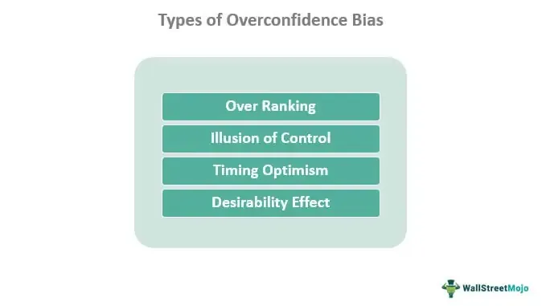

In the rapidly evolving world of algorithmic trading, understanding cognitive biases is crucial to maintaining a competitive edge. Cognitive biases are systematic errors in thinking that influence decisions and judgments, often without conscious awareness. In the context of trading, these biases can lead to suboptimal decisions and negatively impact the performance and outcomes of trading algorithms.

A particularly prominent bias that affects traders is the self-serving bias, which leads individuals to attribute their successes to personal skill while blaming failures on external factors. This bias not only distorts self-perception but also impacts decision-making processes, potentially leading to overconfidence and other detrimental trading behaviors. In automated trading, where algorithms execute decisions without human intervention, these biases can be particularly insidious because they may be embedded into the algorithms themselves by their human creators.



This article aims to explore self-serving bias within trading, examining its implications in algorithmic contexts and providing insights into how traders can mitigate its potentially adverse effects. Understanding and addressing cognitive biases such as self-serving bias is essential for traders looking to enhance the effectiveness of their strategies, make more rational decisions, and ultimately improve their trading outcomes.

## Table of Contents

## Understanding Self-Serving Bias

Self-serving bias is a cognitive bias characterized by the tendency of individuals to attribute their own positive actions or successes to internal factors, such as personal skill or effort, and negative outcomes to external factors beyond their control, such as bad luck or unfavorable circumstances. This psychological pattern is rooted in the human desire to cultivate a positive self-image and maintain self-esteem, often leading individuals to interpret events in a manner that reinforces their ego.

As a subtype of attribution bias, self-serving bias can significantly affect decision-making processes. When individuals consistently interpret successes as reflections of their own abilities while attributing failures to external influences, they may develop a skewed perception of their capabilities. This distorted self-esteem can foster overconfidence, leading to suboptimal decision-making. For instance, a trader who attributes a profitable trade to their own intelligence may ignore underlying market conditions, potentially making riskier decisions in the future.

The boost in confidence and self-worth offered by self-serving bias can be psychologically beneficial in some contexts, helping individuals to recover from setbacks by externalizing failures. Yet, it often constrains personal growth and learning by preventing people from critically examining their role in negative outcomes. Recognizing and correcting for self-serving bias is crucial for objective self-assessment and effective decision-making. By acknowledging one's cognitive biases, individuals can better calibrate their perceptions and judgments, leading to more rational and informed choices.

## Self-Serving Bias in Investing

In investment, self-serving bias manifests when investors attribute their successful trades to personal skill and insight, while dismissing their unsuccessful ones by citing market [volatility](/wiki/volatility-trading-strategies) or unpredictable external factors. This bias distorts an investor's perception of their own performance, leading to overconfidence. For instance, if an investor believes that their successful stock picks are solely due to their expertise, they may develop an inflated sense of their own abilities. This overconfidence may propel them into making riskier investment decisions, such as heavily investing in volatile stocks or increasing leverage, under the assumption that they have a unique edge over the market.

Moreover, the reluctance to accept responsibility for losses can foster a resistance to necessary change and adaptation. Investors who consistently blame external factors for their losses are less likely to engage in reflective learning processes, missing critical opportunities for self-improvement. Rather than analyzing lapses in their investment strategies or judgment errors, these individuals may persist with ineffective approaches, potentially resulting in compounded losses over time.

For example, consider an investor who persists in a failing strategy because they consistently attribute poor outcomes to market conditions, not flawed decision-making. If market conditions shift markedly, such an investor may struggle to adapt due to a lack of critical self-assessment and learning from past mistakes. They miss out on valuable insights—such as recognizing patterns in poor trades—that could lead to better decision-making in the future.

In summary, self-serving bias in investing not only skews self-perception but can also lead to behaviors that endanger financial success. Recognizing and mitigating this bias is crucial for investors who wish to improve their strategies and adapt to ever-changing market dynamics.

## Self-Serving Bias in Algorithmic Trading

In [algorithmic trading](/wiki/algorithmic-trading), the assumption of objectivity often accompanies the use of complex algorithms and automated systems. However, these algorithms are not created in a vacuum; they inherently contain the biases of their developers, including self-serving bias. This bias, characterized by attributing positive outcomes to one's own skill and negative outcomes to external factors, can subtly infiltrate trading strategies guided by automated systems.

Developers and traders often imbue their algorithms with parameters and model assumptions based on personal convictions and expectations about how markets should behave. This can introduce biases such as overconfidence or excessive optimism regarding market predictions. For instance, if a developer believes they have recognized a foolproof pattern in historical trading data, this conviction might lead them to design an algorithm that overemphasizes similar patterns in real-time trading, ignoring broader market contexts or unforeseen variables. 

To mitigate self-serving bias in algorithmic trading, it is essential to implement strategies that introduce checks and balances against personal biases. One approach is to employ [backtesting](/wiki/backtesting) practices that rigorously test trading algorithms against historical data, ensuring they perform well under various market conditions without overfitting to particular datasets. Moreover, using out-of-sample testing can evaluate the robustness of an algorithm in unfamiliar scenarios, helping to confirm its reliability without being skewed by developer bias.

Incorporating diverse perspectives during algorithm development can also reduce self-serving bias. Teams comprising individuals with varied backgrounds and analytical approaches can provide insights that a single developer may overlook. Additionally, adopting objective, rule-based constraints within algorithms can curtail the influence of subjective bias. These rules should be well-defined and derived from a comprehensive analysis of market behavior, rather than individual intuition.

For illustration, consider an algorithm that trades based on moving averages:

```python
def moving_average_strategy(prices, short_window=40, long_window=100):
    signals = np.zeros(len(prices))
    short_mavg = pd.Series(prices).rolling(window=short_window, min_periods=1).mean()
    long_mavg = pd.Series(prices).rolling(window=long_window, min_periods=1).mean()

    signals[short_mavg > long_mavg] = 1  # Buy signal
    signals[short_mavg <= long_mavg] = -1  # Sell signal

    return signals

# Example usage:
# prices = fetch_historical_prices(ticker='AAPL', start_date='2021-01-01', end_date='2023-01-01')
# trade_signals = moving_average_strategy(prices)
```

In the example above, the moving average crossover system seeks to remain objective by relying on quantitative rules for decision-making. Yet, if a trader's inherent bias leads them to select windows (e.g., short_window=40, long_window=100) that reflect personal beliefs rather than empirical evidence, the strategy may still be affected by self-serving bias.

Ultimately, by recognizing and actively countering these biases, algorithmic traders can enhance the effectiveness of their systems, aligning them more closely with actual market behaviors and improving their overall trading outcomes.

## Techniques to Mitigate Self-Serving Bias

Traders aiming to mitigate self-serving bias can benefit from several practical strategies that enhance objectivity and improve decision-making processes. One effective method is maintaining comprehensive trading journals. These records should detail the rationale behind each trading decision, explicitly stating the expected outcomes, market conditions, and any assumptions made at the time. By systematically documenting trades, traders can later review their decisions with greater objectivity, identifying patterns of bias in their decision-making process. This practice encourages transparency and facilitates learning from both successes and failures, thus reducing the likelihood of unjustly attributing outcomes to external factors.

In addition to self-assessment through journaling, incorporating feedback from peers and mentors is highly beneficial. Engaging with others invites diverse perspectives that can counteract personal biases. Regular discussions about trading strategies and outcomes with a trusted group provide valuable insights that may not be apparent from a singular viewpoint. This collaborative approach not only identifies potential biases but also fosters a culture of continual learning and improvement.

Implementing structured, rule-based trading strategies is another robust approach to mitigating self-serving bias. These systems rely on pre-defined rules and criteria for making trades, which reduces the influence of emotional and cognitive biases. Algorithms and models can be employed to enforce discipline in trading, ensuring decisions are based on data-driven insights rather than subjective perception. For example, a mean-reversion strategy might be programmed to automatically trigger stock purchases when prices fall a certain percentage below their moving average, thereby minimizing emotional decision-making.

Here is a basic Python example showcasing a rule-based trading strategy using moving averages:

```python
import numpy as np
import pandas as pd

# Example data
prices = pd.Series([100, 102, 99, 101, 105, 110, 108, 107])

# Calculate moving averages
short_window = 3
long_window = 5

moving_avg_short = prices.rolling(window=short_window, min_periods=1).mean()
moving_avg_long = prices.rolling(window=long_window, min_periods=1).mean()

# Generate trading signals 
signals = np.where(moving_avg_short > moving_avg_long, 1, 0)

# 1 indicates a buy signal, 0 indicates no action
print(f"Trading signals based on moving averages: {signals}")
```

The script calculates short and long moving averages and generates buy signals when the short-term average crosses above the long-term average. Employing such automated strategies helps prevent bias from influencing decisions, illustrating the importance of a disciplined, rules-based approach in trading.

By employing these techniques, traders can effectively counteract self-serving biases, leading to more rational and informed trading decisions. Continuous learning and the adoption of structured methodologies are essential elements in minimizing the impact of cognitive biases.

## Conclusion

Self-serving bias, though often overlooked, can have a profound effect on trading performance, particularly within the precision-oriented domain of automated and algorithmic trading. In these settings, the consequences of cognitive biases like self-serving bias can ripple through trading strategies, leading to suboptimal decisions and increased risk exposure. Recognizing these biases is the first step toward mitigating their impact. Traders can implement strategies to correct their biases, thereby enhancing the effectiveness of their decision-making processes.

Addressing self-serving bias requires a concerted effort toward continuous learning and adaptation. Traders should maintain an awareness of their cognitive biases, ensuring that their trading strategies are both adaptive and resilient to market variability. This is critical not only for preserving the integrity of algorithmic trading models but also for fostering an environment where rational, informed decisions drive success. By integrating feedback mechanisms, cultivating diverse perspectives, and implementing rule-based strategies, traders can fortify their methods against the pitfalls of self-serving bias. This disciplined approach not only refines existing strategies but also improves overall market engagement, preserving the trader's edge in a competitive industry.

## References & Further Reading

[1]: Pelster, M., & Hofmann, A. (2018). [“About the Fear of Reputational Loss: Social Trading and the Disposition Effect.”](https://www.sciencedirect.com/science/article/pii/S0378426618301468) Journal of Economic Behavior & Organization, 153, 90-109.

[2]: Kahneman, D., & Tversky, A. (1979). ["Prospect Theory: An Analysis of Decision under Risk."](http://web.mit.edu/curhan/www/docs/Articles/15341_Readings/Behavioral_Decision_Theory/Kahneman_Tversky_1979_Prospect_theory.pdf) Econometrica, 47(2), 263-292.

[3]: Barber, B. M., & Odean, T. (2001). ["Boys Will Be Boys: Gender, Overconfidence, and Common Stock Investment."](https://faculty.haas.berkeley.edu/odean/papers/gender/BoysWillBeBoys.pdf) The Quarterly Journal of Economics, 116(1), 261-292.

[4]: Thaler, R. H. (1988). ["Anomalies: The Winner's Curse."](https://pubs.aeaweb.org/doi/pdfplus/10.1257/jep.2.1.191) The Journal of Economic Perspectives, 2(1), 191-202.

[5]: Odean, T. (1998). ["Are Investors Reluctant to Realize Their Losses?"](https://onlinelibrary.wiley.com/doi/full/10.1111/0022-1082.00072) The Journal of Finance, 53(5), 1775-1798.

[6]: [“Behavioral Finance: Psychology, Decision-Making, and Markets”](https://www.amazon.com/Behavioral-Finance-Psychology-Decision-Making-Markets/dp/0324661177) by Lucy Ackert and Richard Deaves

[7]: [“Thinking, Fast and Slow”](https://en.wikipedia.org/wiki/Thinking,_Fast_and_Slow) by Daniel Kahneman