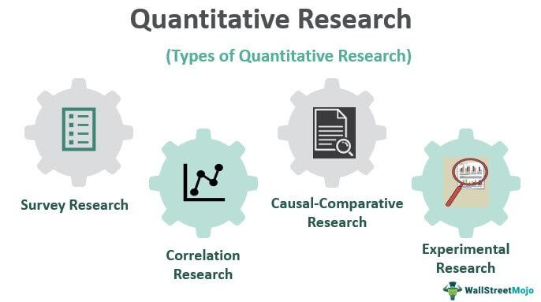

A quant developer, often termed "quant," is a professional who specializes in designing, developing, and implementing quantitative models for algorithmic trading systems. These individuals play a critical role in the financial industry, especially in the development of automated trading strategies that execute trades based on statistical and mathematical models. They work at the intersection of finance, mathematics, and computer science, harnessing each of these fields to optimize trading performance and efficiency.

The role of a quant developer involves the application of advanced mathematical techniques to identify patterns and derive predictive insights from financial data. This includes the utilization of statistical algorithms, stochastic calculus, and other quantitative methods to construct models that can predict price movements or identify arbitrage opportunities. In algorithmic trading, quant developers are responsible for creating the algorithms that automatically execute trades, taking advantage of market inefficiencies at speeds and frequencies that are beyond human capabilities. The language of choice for many quant developers is often Python, due to its extensive libraries and ease of use for data manipulation and analysis.



The demand for quant developers in the finance industry has grown significantly over the years. As the financial markets become increasingly complex and data-driven, the need for sophisticated models and algorithms to manage risk and execute profitable trades has become essential. Quant developers are highly sought after in areas such as hedge funds, investment banks, and proprietary trading firms, as they provide the technical prowess required to gain a competitive edge in the market. According to a report by the World Economic Forum, as the finance sector evolves, the adoption of machine learning and artificial intelligence in trading is expected to elevate the role of quantitative analysis, further increasing the need for skilled quant developers.

Quant developers are pivotal in bridging the gap between theoretical finance models and practical financial applications. Their expertise in programming, data analysis, and mathematical modeling not only enhances the precision and effectiveness of trading operations but also helps in making tactical and strategic financial decisions. As a result, quant developers contribute significantly to the financial infrastructure, driving innovation and maintaining the robustness of trading systems worldwide.

## Table of Contents

## Who is a Quant Developer?

A quant developer, or quantitative developer, is a specialized software engineer who develops and implements financial models used in trading. These professionals play a crucial role in the field of algorithmic trading, where they blend finance, mathematics, and computer science to optimize trading strategies and improve financial market efficiency. Quant developers are responsible for building high-performance trading systems that can predict market trends, automate transactions, and manage risk.

### Responsibilities

Quant developers design and maintain quantitative models that underpin trading strategies. These models are based on complex mathematical and statistical techniques such as stochastic calculus, differential equations, and numerical methods. By using historical data and real-time market information, quant developers create algorithms that generate trading signals and execute trades.

They handle the entire lifecycle of algorithm development, from initial concept to deployment and maintenance. This involves continuous performance assessment, optimization of algorithms, and adaptation to changing market conditions. A key part of their work is also ensuring that these models comply with regulatory standards and risk management protocols.

### Required Skills

The role demands a strong foundation in computer programming, data analysis, and mathematics. Proficiency in programming languages such as Python, C++, and Java is essential, as these languages are commonly used in developing trading platforms and financial models. Python, in particular, is favored for its powerful libraries for data manipulation (such as Pandas) and [machine learning](/wiki/machine-learning) (like TensorFlow and Scikit-Learn).

Statistical analysis and data manipulation skills are crucial for quant developers, as they need to handle large datasets to derive actionable insights. Skills in mathematical modeling, especially in areas like linear algebra and [statistics](/wiki/bayesian-statistics), are also fundamental.

Moreover, a comprehensive understanding of financial markets and instruments, such as equities, derivatives, and options, is crucial. This knowledge allows quant developers to create models that are not only mathematically sound but also practically applicable in trading environments.

### Typical Workplaces

Quant developers are predominantly employed in sectors that require complex financial modeling and [algorithmic trading](/wiki/algorithmic-trading). They work in investment banks, hedge funds, asset management firms, and proprietary trading firms. Each of these institutions has its distinct focus, from risk assessment to high-frequency trading strategies, thus providing diverse opportunities for quant developers to apply their skills.

In investment banks, quant developers may work on systems that manage the bank’s exposure to risk or develop pricing models for complex financial instruments. Hedge funds often leverage quant developers to create strategies that can generate alpha, while proprietary trading firms might focus on developing ultra-fast trading systems that can capitalize on fleeting market opportunities.

## Quant Developer vs. Algorithmic Trader

Quant developers and algorithmic traders are two critical roles in the landscape of financial markets, each contributing uniquely to the process of algorithmic trading. While their objectives align towards optimizing trading strategies, their responsibilities and skill sets are distinct.

A [quant developer](/wiki/becoming-a-quant-developer) focuses on the development and maintenance of quantitative models that are essential for algorithmic trading. They possess a deep understanding of complex mathematical theories and are adept in programming languages such as Python, C++, and Java. Their primary responsibility is to translate sophisticated mathematical models into efficient, executable code. This code is then integrated with trading systems to facilitate automated trading strategies. Given their technical expertise, quant developers also work extensively with data—extracting, transforming, and analyzing large data sets to inform and refine their models.

In contrast, an algorithmic trader is primarily responsible for designing and implementing trading strategies based on quantitative models. While they may possess programming skills, their focus is more on strategy development, risk management, and market analysis. Algorithmic traders leverage their understanding of financial markets to devise strategies that seek to exploit market inefficiencies. They are skilled in statistical analysis and often use tools like R or MATLAB to test and backtest their trading strategies, ensuring they perform as expected under various market conditions.

Together, quant developers and algorithmic traders form a synergistic partnership, with the former providing the technological backbone through robust models and systems, and the latter strategizing on how best to utilize these tools to achieve financial gains. This partnership is crucial in high-frequency trading environments where speed and efficiency are paramount.

The distinct skills required for each role reflect their respective focus areas. Quant developers must have a strong foundation in software engineering, data structures, and algorithms, alongside their quantitative acumen. This technical expertise is essential for implementing complex models that can run efficiently in real-time trading environments. Python, with its extensive libraries for data analysis and scientific computing, is a favored tool among quant developers.

Algorithmic traders, while benefiting from a technical understanding, primarily need a deep insight into financial markets. They utilize their knowledge of economics, market trends, and financial instruments to create strategies. Competence in statistical and econometric analysis is crucial, as traders must evaluate and adapt strategies based on [backtesting](/wiki/backtesting) results and real-world performance. 

In conclusion, quant developers and algorithmic traders each bring a specialized set of skills that are vital to executing successful trading strategies in the financial markets. Their collaboration leverages the strengths of both roles, combining technological prowess with strategic insight, to drive innovation and efficiency in algorithmic trading.

## Key Responsibilities of a Quantitative Developer

Quantitative developers, commonly referred to as quant developers, play a pivotal role in the financial industry by creating and maintaining complex quantitative models used for trading and risk management. Their key responsibilities can be broadly categorized into three main areas: model development and maintenance, data management, and software integration with trading systems.

**Developing and Maintaining Quantitative Models**

Quant developers are tasked with designing and implementing quantitative models that drive algorithmic trading strategies. These models are based on mathematical and statistical techniques, often incorporating advanced concepts such as stochastic calculus and machine learning. For example, a common model used is the Black-Scholes model for option pricing, which quant developers might extend or optimize for specific trading strategies.

$$
C = S_0 \cdot N(d_1) - X \cdot e^{-rT} \cdot N(d_2)
$$

Where $N$ is the cumulative distribution function of the standard normal distribution, $S_0$ is the current stock price, $X$ is the strike price, $r$ is the risk-free [interest rate](/wiki/interest-rate-trading-strategies), and $T$ is the time to maturity.

Developers ensure these models are accurate, efficient, and robust against market fluctuations. Regular maintenance involves updating models based on new market data, ensuring they remain relevant and effective in predicting market movements.

**Working with Data: Extraction, Transformation, and Analysis**

Data is the backbone of quantitative models. Quant developers are responsible for gathering large datasets from various sources, cleaning, and transforming them for model use. Efficient data processing pipelines are crucial, often requiring skills in SQL and data manipulation libraries such as Pandas in Python.

```python
import pandas as pd

# Example: Loading and cleaning market data
data = pd.read_csv('market_data.csv')
clean_data = data.dropna()  # Remove missing values
transformed_data = clean_data.assign(log_returns=lambda x: np.log(x['Close'] / x['Close'].shift(1)))
```

They also analyze this data to identify patterns and insights that inform model adjustments and trading decisions. This stage involves assessing data quality and ensuring it is free of biases or inconsistencies that could skew model results.

**Software Development and Integration with Trading Systems**

A core responsibility of quant developers is to develop software that integrates these quantitative models with trading systems. This involves building high-performance computing solutions capable of executing trades at low latencies. Proficiency in programming languages such as C++ and Python is crucial, as these are often used to optimize code efficiency and speed.

Quant developers also work closely with IT teams to ensure seamless integration with existing trading platforms and infrastructure. This integration is critical as it allows for real-time data processing, strategy backtesting, and live trading execution.

In summary, quant developers are integral to the financial sector, driving the technical and analytical aspects of [quantitative trading](/wiki/quantitative-trading) strategies. Their expertise in model development, data management, and software integration ensures that financial firms can execute sophisticated trading strategies in competitive markets.

## Educational Path and Skills Required

A career as a quant developer requires a strong educational foundation, often centered around disciplines such as finance, mathematics, computer science, or engineering. These areas provide the analytical and technical skills necessary for developing sophisticated quantitative models and software solutions in financial markets.

### Educational Background

**Finance and Economics:** A degree in finance or economics equips individuals with an understanding of market dynamics, financial instruments, and trading theories. This knowledge is crucial for modeling market behaviors and developing trading algorithms.

**Mathematics and Statistics:** A solid foundation in mathematics is indispensable for quant developers. Key areas include calculus, linear algebra, probability, and statistics. Statistical modeling is especially important, as it underpins the development of predictive algorithms and risk assessment models.

**Computer Science and Engineering:** Proficiency in computer science is vital, given the technical nature of the work. Courses in data structures, algorithms, and software engineering provide critical problem-solving skills and facilitate efficient code development. 

### Key Skills

**Programming Languages:** Quant developers must be adept in languages such as Python, C++, and Java, which are commonly used in developing algorithms and models. Python is particularly favored due to its extensive libraries for data analysis and machine learning, such as NumPy, pandas, and Scikit-learn.

```python
import numpy as np
from scipy.stats import norm

# Basic example of a Monte Carlo simulation in Python for option pricing
def monte_carlo_option_pricing(S, K, T, r, sigma, num_simulations):
    dt = T / num_simulations
    option_prices = []

    for i in range(num_simulations):
        path = [S]
        for _ in range(int(T / dt)):
            z = np.random.standard_normal()
            S_t = path[-1] * np.exp((r - 0.5 * sigma ** 2) * dt + sigma * np.sqrt(dt) * z)
            path.append(S_t)
        option_price = np.maximum(path[-1] - K, 0)  # Call option payoff
        option_prices.append(np.exp(-r * T) * option_price)  # Discounted payoff

    return np.mean(option_prices)

# Parameters
S = 100  # Initial stock price
K = 100  # Strike price
T = 1    # Time to maturity in years
r = 0.05  # Risk-free rate
sigma = 0.2  # Volatility
num_simulations = 10000

# Option pricing
price = monte_carlo_option_pricing(S, K, T, r, sigma, num_simulations)
print(f"The estimated option price is {price:.2f}")
```

**Data Analysis:** Proficiency in data extraction, transformation, and analysis is crucial. This includes familiarity with database management systems and data visualization tools to interpret and present data effectively.

**Statistical Modeling:** Understanding regression analysis, time series analysis, and stochastic calculus is essential for developing accurate predictive models. 

### Study Plan and Resources

1. **Educational Degrees and Certifications:**
   - Pursue a bachelor's or master's degree in relevant fields such as mathematics, finance, or computer science.
   - Consider certifications like Chartered Financial Analyst (CFA) or Financial Risk Manager (FRM) to enhance financial knowledge.

2. **Online Courses and Materials:**
   - Platforms like Coursera, edX, and Khan Academy offer courses on programming, statistics, and financial modeling.
   - Books such as "Options, Futures, and Other Derivatives" by John C. Hull and "Python for Finance" by Yves Hilpisch can provide deeper insights.

3. **Practical Experience:**
   - Engage in internships or projects with financial institutions to gain real-world experiences.
   - Participate in quant challenges or competitions on Kaggle to apply skills in practical scenarios.

4. **Continuous Learning:**
   - Regularly update skills by attending workshops, webinars, and conferences in finance and technology.
   - Join professional societies such as the Society of Quantitative Analysts for networking and learning opportunities. 

By pursuing this educational path and honing these critical skills, aspiring quant developers can prepare effectively for the demands of the industry, contributing to advancements in algorithmic trading and risk management strategies.

## Types of Quant Developers

Quantitative developers (quant developers) are specialized professionals in the finance sector who apply their technical expertise in programming, mathematics, and finance to develop complex models for trading and risk management. Their roles can be broadly categorized into three types based on their location within the financial institution: front office, middle office, and back office quant developers. Each of these roles carries distinct responsibilities and requires specific skill sets.

### Front Office Quant Developers

Front office quant developers work directly with traders and portfolio managers. Their primary focus is on the development and implementation of trading algorithms and strategies. They leverage mathematical models to predict market trends and price financial instruments. These quant developers need to have strong coding skills, particularly in languages like Python, C++, or Java, as they often integrate models directly into trading systems that require low latency and high reliability.

Front office quants are involved in real-time data analysis, requiring an excellent understanding of financial markets and instruments. They build and optimize trading algorithms, which could range from high-frequency trading ([HFT](/wiki/high-frequency-trading-strategies)) systems to longer-term asset management strategies. Python, with its extensive libraries such as NumPy and pandas, is commonly used for these tasks:

```python
import numpy as np
import pandas as pd

# Sample calculation of moving average for trading signals
def calculate_moving_average(prices, window_size):
    return prices.rolling(window=window_size).mean()

prices = pd.Series([100, 102, 101, 105, 108])
moving_average = calculate_moving_average(prices, window_size=3)
print(moving_average)
```

### Middle Office Quant Developers

Middle office quant developers are primarily involved in risk management and model validation. Their role is to ensure that the models used for trading and risk assessment are accurate, reliable, and compliant with regulatory standards. They work to create risk management tools that evaluate the exposure of financial instruments to various risk factors, such as market, credit, and operational risks.

A key responsibility is the validation and backtesting of models to ensure they can withstand different market conditions. Familiarity with financial regulations and risk assessment frameworks is essential for middle office quants. They typically work in collaboration with both the front and back offices to provide analytics and risk reports.

### Back Office Quant Developers

Back office quant developers focus on the development and maintenance of the infrastructure and systems that support the trading and risk functions of a financial institution. Their work includes managing data feeds, maintaining databases, and ensuring the seamless operation of the software systems used for trade settlement, accounting, and compliance.

Back office quants require robust software engineering skills and an aptitude for working with large data sets. They are tasked with automating processes and ensuring data integrity across systems. Expertise in database management systems (such as SQL) and scripting languages is crucial for these roles.

```python
import sqlite3

# Example of interacting with a database for trade data storage
connection = sqlite3.connect('trading_data.db')
cursor = connection.cursor()

# Create table
cursor.execute('''CREATE TABLE trades
                  (id INTEGER PRIMARY KEY, instrument TEXT, quantity INTEGER, price REAL)''')

# Insert a sample trade
cursor.execute("INSERT INTO trades (instrument, quantity, price) VALUES ('AAPL', 10, 150.5)")
connection.commit()

# Query the database
cursor.execute("SELECT * FROM trades")
print(cursor.fetchall())

connection.close()
```

Quant developers play a vital role in the smooth functioning and innovation within financial institutions, each contributing through their specialized roles in the front, middle, and back offices. These differentiated roles reflect the diverse nature of quantitative finance, blending deep technical skill with financial expertise to drive decision-making and operational efficiency in modern markets.

## Roadmap to Becoming a Quant Developer

A career as a quant developer often follows a structured progression through entry-level, mid-level, and senior-level roles. Each stage demands unique qualifications and expertise, contributing to the professional's ability to develop and maintain sophisticated quantitative models for financial markets.

### Entry-Level Roles

Aspiring quant developers typically begin their careers in entry-level positions, such as junior quant developer or analyst roles in financial institutions like hedge funds, investment banks, or asset management firms. These positions generally require a bachelor's degree in a quantitative discipline, such as finance, mathematics, economics, computer science, or engineering. Essential skills for entry-level roles include proficiency in programming languages like Python, R, or C++, as well as a solid understanding of statistical modeling and data analysis techniques.

Experience in internships or project-based work can be invaluable at this stage, providing practical exposure to real-world financial modeling and trading scenarios. Networking, both online and through industry conferences or workshops, can also play a vital role in securing entry-level positions.

### Mid-Level Roles

With several years of experience, professionals can advance to mid-level roles such as quant developer, quantitative analyst, or quant strategist. At this stage, a deeper understanding of algorithmic trading and financial markets is expected, along with proficiency in developing algorithms and implementing trading models. 

Many professionals may pursue further education in the form of a master's degree in financial engineering, quantitative finance, or computational finance to strengthen their expertise and analytical skills. Additionally, mid-level roles demand a greater ability to work collaboratively with other team members, including traders and IT specialists, to integrate quantitative results into trading systems efficiently.

### Senior-Level Roles

Senior-level roles, such as lead quant developer or head of quant development, require a blend of technical prowess and leadership acumen. Extensive experience in developing, testing, and deploying advanced quantitative models is crucial. Often, these positions involve overseeing the work of junior and mid-level developers, providing strategic direction, and ensuring the alignment of technology with business objectives.

Qualifications for senior-level roles may include a Ph.D. in a quantitative field, underscoring a substantial depth of knowledge and experience. Additionally, senior quant developers are expected to contribute to strategic market analysis and innovation in trading methodologies.

### Advice on Internships and Networking

Internships offer an excellent opportunity for hands-on experience in a fast-paced financial environment. Aspiring quant developers should seek internships that provide exposure to quantitative modeling, programming, and financial analysis. Universities often have partnerships with financial institutions that facilitate such opportunities.

Networking can significantly bolster career prospects in quant development. Professionals are encouraged to engage with industry peers through forums, online platforms like LinkedIn, and technical workshops. Joining professional organizations, such as the CFA Institute or CQF (Certificate in Quantitative Finance), can also provide valuable networking opportunities and resources for ongoing professional development.

Pursuing a career as a quant developer entails a commitment to continuous learning and adaptation to ever-evolving financial technologies and market trends. By following a structured career path and leveraging internships and networking opportunities, individuals can successfully navigate the challenging yet rewarding field of quantitative finance.

## Tools and Technologies Used

Quant developers leverage a sophisticated array of tools and technologies to execute their tasks efficiently. Central to their toolkit are programming languages, with Python and R standing out as particularly critical. Python is favored for its versatility and extensive library support for numerical computation, data manipulation, and machine learning. The libraries such as Pandas for data analysis, NumPy for numerical calculations, and SciPy for scientific computing make Python indispensable for quant developers. Moreover, modules like TensorFlow and PyTorch facilitate the development of sophisticated machine learning models.

R is also highly valued, especially for statistical analysis. Its comprehensive suite of packages like 'quantmod' for quantitative financial analysis and 'ggplot2' for data visualization enhance its practicality for developers. Both Python and R offer robust support for implementing quantitative models, optimizing trading strategies, and conducting exploratory data analysis.

Database management systems (DBMS) play an essential role as well. They are crucial for storing and managing the vast quantities of financial data that quant developers must access and process. SQL-based databases such as MySQL and PostgreSQL are commonly used for handling structured data. For unstructured data, NoSQL databases like MongoDB provide the flexibility needed to manage diverse data types. Effective use of these DBMS solutions ensures high availability and rapid retrieval of financial data, impacting the speed and efficiency of algorithms.

Quant developers also utilize specific trading software and APIs to integrate their models directly with trading platforms. FIX (Financial Information Exchange) protocol is a key technology used for real-time electronic communication in trading. It enables seamless and secure transmission of trade data between various financial entities. Additionally, trading platforms such as MetaTrader and Bloomberg's Terminal provide APIs that allow developers to connect their algorithms with real-world trading environments, executing strategies directly from the codebase.

High-performance computing environments and languages like C++ are crucial where execution speed and low latency are required. C++ is particularly useful in high-frequency trading where microseconds make a difference. It offers fine-grained control over system resources and memory management, enabling developers to optimize the performance of trading systems significantly.

In summary, the confluence of programming languages, database systems, trading software, and high-performance computing forms the technological backbone for quant developers. Mastery of these tools enables them to develop, deploy, and manage sophisticated quantitative models and trading strategies effectively.

## Salary and Career Prospects

Quant developers play a critical role in the financial industry, and their compensation reflects this significance. Salary ranges for quant developers can vary substantially based on geographic location, level of experience, and the specific institution they work for.

In major financial centers, such as New York City, London, and Hong Kong, quant developers are among the best-compensated professionals in the finance industry. In the United States, the average salary for an entry-level quant developer can range from $100,000 to $150,000 per year, with bonuses potentially adding 20% to 50% to the overall compensation package. Mid-level quant developers might earn between $150,000 to $250,000, while senior quant developers or team leads can command salaries upwards of $300,000 to $500,000, with performance bonuses comprising a significant portion of their total earnings. 

In the United Kingdom, quant developers in London typically see salaries ranging from £70,000 to £120,000 for entry-level positions, with opportunities for advancement increasing these figures to between £120,000 to £200,000 for mid-level roles and £200,000 to £400,000 for senior positions.

In other regions, such as Asia-Pacific or Europe outside of London, salaries might be somewhat lower but are generally competitive given the cost of living in those areas. For instance, in Hong Kong, quant developers can expect to earn between HKD 750,000 to HKD 1,200,000 annually at the entry-level, with potential increases in line with global counterparts as experience and responsibility grow.

The career prospects for quant developers are promising due to an increasing reliance on algorithmic trading and quantitative analysis in financial markets. The industry’s future job outlook is positive, driven by advancements in technology and the continuous expansion of data available for financial modeling. According to a report by Mordor Intelligence, the algorithmic trading market is expected to grow at a compound annual growth rate (CAGR) of around 10.3% between 2021 and 2026. This growth suggests an increasing demand for skilled professionals capable of developing and maintaining sophisticated trading algorithms, thereby ensuring strong career prospects for quant developers.

Given this favorable outlook, individuals pursuing careers as quant developers can expect opportunities for career advancement, encompassing roles such as team leader, project manager, or even chief technology officer within financial institutions. Continuous learning, networking, and professional development are crucial in staying competitive in this dynamic field. 

In conclusion, quant development is both a lucrative and promising career path within the finance industry, offering competitive salaries and significant opportunities for professional growth and development.

## Conclusion

Quantitative developers play a pivotal role in the financial industry by designing and implementing sophisticated algorithms and models that drive trading decisions. Their expertise lies at the intersection of finance, mathematics, and computer science, enabling innovation in trading strategies and risk management. The necessity for such precision and analytical rigor underscores the need for quant developers, emphasizing their importance in maintaining the competitive edge of financial institutions.

Choosing a career as a quant developer is both challenging and rewarding. The field demands a continuous commitment to learning and innovation. As technology and market dynamics evolve, so too must the skills and methods used by quant developers. This career path offers opportunities to work in dynamic environments such as hedge funds, investment banks, and financial technology firms, which are continuously seeking professionals who can navigate and optimize complex systems.

For those aspiring to join this domain, numerous resources exist to facilitate professional development. Engaging with online platforms such as Coursera, edX, or Khan Academy can provide foundational knowledge in programming, data science, and financial mathematics. Pursuing advanced degrees and certifications in quantitative finance or financial engineering can provide deeper insights and enhance job prospects. Professional networks, forums, and conferences also offer invaluable opportunities for growth and connection with peers in the field.

In conclusion, the role of a quant developer is indispensable in the finance industry, offering a challenging yet rewarding career path. With a robust foundation in relevant skills and a commitment to ongoing education, individuals can successfully navigate and thrive in this exciting field.

## References & Further Reading

[1]: ["Python for Finance: Mastering Data-Driven Finance"](https://books.google.com/books/about/Python_for_Finance.html?id=2qd9DwAAQBAJ) by Yves Hilpisch

[2]: ["Options, Futures, and Other Derivatives"](https://www.amazon.com/Options-Futures-Other-Derivatives-Global/dp/1292410655) by John C. Hull

[3]: ["Algorithmic Trading: Winning Strategies and Their Rationale"](https://www.wiley.com/en-us/Algorithmic+Trading%3A+Winning+Strategies+and+Their+Rationale-p-9781118460146) by Ernie Chan

[4]: ["Advances in Financial Machine Learning"](https://www.amazon.com/Advances-Financial-Machine-Learning-Marcos/dp/1119482089) by Marcos Lopez de Prado

[5]: ["Evidence-Based Technical Analysis: Applying the Scientific Method and Statistical Inference to Trading Signals"](https://www.amazon.com/Evidence-Based-Technical-Analysis-Scientific-Statistical/dp/0470008741) by David Aronson

[6]: Lopez de Prado, M. (2018). ["The 10 Reasons Most Machine Learning Funds Fail."](https://papers.ssrn.com/sol3/papers.cfm?abstract_id=3104816) Journal of Portfolio Management.