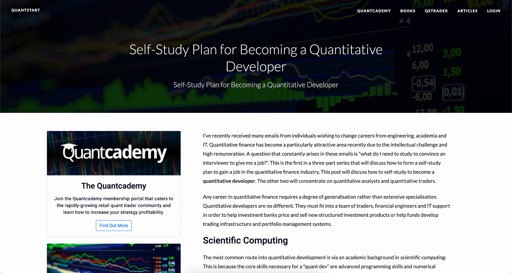

## Table of Contents

## What is a quantitative developer and what do they do?

A quantitative developer, often called a "quant dev," is a person who uses math and computer programming to help solve financial problems. They work in banks, investment firms, and other financial companies. Their main job is to create and improve computer programs that help with trading, risk management, and analyzing data. They use their skills in math, statistics, and coding to make sure these programs work well and give accurate results.

Quantitative developers spend a lot of time writing code and testing it to make sure it does what it's supposed to do. They also work with other teams, like traders and risk managers, to understand what these teams need and to make programs that meet those needs. Sometimes, they have to explain complex ideas in a simple way so everyone can understand. Their work helps financial companies make better decisions and manage money more effectively.

## What are the basic programming skills required to start as a quantitative developer?

To start as a quantitative developer, you need to know some basic programming skills. The most important one is being good at a programming language like Python or C++. Python is popular because it's easy to learn and has lots of tools for math and data analysis. C++ is used when you need programs to run very fast. You should be able to write clean code, which means your code should be easy to read and understand. Also, knowing how to use version control systems like Git is helpful because it lets you keep track of changes in your code.

Another important skill is understanding data structures and algorithms. Data structures are ways to organize data, like lists or trees, and algorithms are steps to solve problems. Knowing these helps you write programs that work well and are efficient. You should also be comfortable working with databases, as quant devs often need to pull data from them. SQL is a common language for working with databases, so knowing it can be useful.

Lastly, you should have a basic understanding of numerical computing libraries like NumPy and Pandas if you're using Python. These libraries help you do math and handle data quickly. Being able to work with these tools will make it easier to analyze data and build models. Overall, these skills will give you a strong start as a quantitative developer.

## Which programming languages are essential for a quantitative developer?

Python is a very important language for quantitative developers. It's easy to learn and has many tools that help with math and data analysis. Libraries like NumPy and Pandas are used a lot because they make it simple to work with numbers and data. Python is great for writing code quickly and for making models that help with trading and risk management.

C++ is another key language for quantitative developers. It's used when you need your programs to run very fast. This is important in finance where every second counts. C++ can be harder to learn than Python, but it's worth it for tasks that need speed. Knowing C++ helps you build programs that can handle big amounts of data and calculations quickly.

SQL is also useful for quantitative developers. It's used to work with databases, which is something quant devs do a lot. SQL helps you pull data from databases so you can use it in your models and analyses. While it's not as complex as Python or C++, knowing SQL can make your job easier and more efficient.

## How can one learn the necessary mathematics for quantitative development?

To learn the math needed for quantitative development, start with the basics like algebra, calculus, and [statistics](/wiki/bayesian-statistics). These are important because they help you understand how to solve problems and work with numbers. You can learn these subjects by taking classes at a school or online. There are also many free resources like Khan Academy and Coursera that can help you learn at your own pace. Practice is key, so make sure to do lots of math problems to get better.

Once you feel comfortable with the basics, move on to more advanced topics like linear algebra, probability theory, and numerical methods. These are used a lot in quantitative development to build models and analyze data. You can find more advanced courses at universities or through online platforms like edX or MIT OpenCourseWare. Joining study groups or online forums can also be helpful because you can ask questions and learn from others. Keep practicing and applying what you learn to real-world problems to really understand the math.

Remember, learning math for quantitative development takes time and patience. It's not just about memorizing formulas but understanding how to use them to solve problems. As you learn, try to work on projects that interest you, like building a simple trading model or analyzing some financial data. This will make learning more fun and help you see how the math applies to real situations.

## What are the key statistical concepts a beginner should master?

For beginners, understanding basic statistical concepts like mean, median, and mode is important. The mean is the average of a set of numbers, which you find by adding them up and dividing by how many there are. The median is the middle number when you line them up from smallest to largest, and the mode is the number that shows up the most. These three measures help you see the center of your data. You should also know about range, which shows how spread out your numbers are by looking at the difference between the highest and lowest values.

Another key concept is standard deviation, which tells you how much your data varies from the mean. A small standard deviation means your numbers are close to the mean, while a big one means they're spread out more. Understanding probability is also crucial, as it helps you figure out how likely something is to happen. You should learn about different types of distributions, like the normal distribution, which looks like a bell curve and is common in many situations. Lastly, knowing about correlation helps you see if two things change together, like if one goes up when the other does. These concepts will give you a good start in understanding and working with data.

## What financial knowledge is important for a quantitative developer?

A quantitative developer needs to understand basic financial concepts like stocks, bonds, and how markets work. Stocks are pieces of a company that you can buy and sell, while bonds are loans you give to a company or government. Markets are places where people trade these financial products. Knowing these basics helps a quant dev build programs that work well in the real world. They should also understand ideas like risk and return, which are about how much money you might make or lose when you invest. This knowledge helps them make better models for trading and managing risk.

Another important area is understanding financial instruments like options and futures. Options give you the right to buy or sell something at a certain price in the future, while futures are agreements to buy or sell at a set price on a specific date. Knowing how these work is key because quant devs often build models to predict their prices. They also need to know about different ways to measure risk, like Value at Risk (VaR), which tells you how much money you could lose on a bad day. Understanding these financial concepts helps quantitative developers create tools that help traders and investors make smart decisions.

## How can one practice coding for quantitative finance projects?

To practice coding for quantitative finance projects, start by working on small projects that use real financial data. You can find free datasets online from places like Yahoo Finance or Quandl. Use these datasets to practice writing code that analyzes stock prices or predicts future trends. For example, you could write a program in Python that calculates the moving average of a stock's price over time. This helps you get used to working with numbers and data, which is a big part of quantitative finance. As you get better, try making your projects more complex, like building a simple trading model that decides when to buy or sell based on certain rules.

Another way to practice is by joining coding challenges or hackathons focused on finance. Websites like Kaggle often have competitions where you can solve real financial problems using data and code. These challenges help you learn new skills and see how other people solve problems. You can also find open-source projects on GitHub related to quantitative finance. Contributing to these projects lets you work with experienced coders and learn from their code. The more you practice, the better you'll get at writing programs that help with trading, risk management, and analyzing financial data.

## What advanced topics should an intermediate quantitative developer focus on?

As an intermediate quantitative developer, you should start focusing on more complex areas like [machine learning](/wiki/machine-learning) and advanced statistical modeling. Machine learning lets you build models that can learn from data and make predictions. You can use libraries like scikit-learn in Python to practice making these models. It's important to understand different types of machine learning, like supervised learning where you train a model with examples, and unsupervised learning where you let the model find patterns on its own. Advanced statistical modeling includes things like time series analysis, which is useful for predicting stock prices over time, and regression analysis, which helps you understand how different factors affect a result. These skills will help you build better models for trading and risk management.

Another important area to focus on is high-frequency trading and [algorithmic trading](/wiki/algorithmic-trading). High-frequency trading means buying and selling stocks very quickly, often in milliseconds, to take advantage of small price changes. This requires understanding how to write fast code, often in C++, and knowing about market microstructure, which is how markets work at a detailed level. Algorithmic trading involves using computer programs to make trading decisions based on rules or models. You should learn about different trading strategies and how to backtest them, which means testing them on past data to see how well they would have worked. These advanced topics will help you create more sophisticated tools for financial firms and improve your skills as a quantitative developer.

## How important is machine learning in quantitative development and how to learn it?

Machine learning is very important for quantitative developers because it helps them build models that can learn from data and make predictions. In finance, this means creating models that can predict stock prices or detect patterns in trading data. These models can help traders make better decisions and manage risk more effectively. Machine learning also lets quant devs automate parts of their work, like finding the best times to buy or sell stocks. This can save time and make their programs more accurate.

To learn machine learning, start with the basics like understanding what machine learning is and how it works. You can find many free online courses on websites like Coursera and edX that teach you the fundamentals. These courses often use Python, which is a good language for machine learning because it has many tools like scikit-learn that make it easier to build models. Practice by working on small projects, like predicting stock prices using historical data. As you get better, try more complex projects and join coding challenges on sites like Kaggle. This will help you learn from others and keep improving your skills.

## What are the best resources for staying updated with the latest trends in quantitative development?

To stay updated with the latest trends in quantitative development, it's a good idea to read blogs and websites that focus on finance and technology. Websites like Quantopian and Towards Data Science often have articles about new methods and tools used in quantitative finance. You can also follow blogs from big financial companies like Goldman Sachs or JPMorgan, as they often share insights about what's new in the industry. Subscribing to newsletters from these sites can help you get regular updates without having to search for them.

Another great way to stay informed is by joining online communities and forums. Platforms like Reddit, Stack Overflow, and GitHub have groups where people discuss quantitative development. These communities are great for asking questions and learning from others who are working in the field. Attending webinars and conferences, either in person or online, can also keep you up-to-date. Events like the QuantCon conference bring together experts who share the latest research and trends in quantitative finance. By staying active in these resources, you can keep learning and stay ahead in your career as a quantitative developer.

## How can one build a portfolio to showcase their skills as a quantitative developer?

To build a portfolio as a quantitative developer, start by working on projects that show off your skills. You can use free data from websites like Yahoo Finance or Quandl to create projects like predicting stock prices or building a simple trading model. Write clean code and explain what your project does, how it works, and what results you got. It's good to use different programming languages like Python and C++ to show you know more than one. You can also add any school projects or work you did for a job if you have permission to share them. The key is to show you can solve real problems in finance with code.

Once you have some projects, put them in a place where people can see them easily. GitHub is a good choice because it's free and many people in the tech world use it. Make sure to write clear descriptions for each project and include any charts or graphs that help explain your work. If you can, add a short video or a blog post talking about your project to make it more interesting. Also, think about joining coding challenges on sites like Kaggle. If you do well, you can add those results to your portfolio to show you can compete with others. A good portfolio will help you show future employers what you can do as a quantitative developer.

## What steps should an expert take to transition into a senior or lead role in quantitative development?

To move into a senior or lead role in quantitative development, an expert should focus on building a strong track record of successful projects. This means working on big projects that show they can solve tough problems and make a real difference in the company. They should also share their knowledge with others, maybe by writing articles or speaking at conferences. This shows they are a leader in their field and can help others learn. Another important step is to get better at managing people and projects. This means learning how to lead a team, plan projects, and make sure everything gets done on time. By doing these things, an expert can show they are ready for a senior or lead role.

Networking is also key for moving up. An expert should talk to other people in the industry, go to events, and join groups where they can meet others in quantitative development. This helps them learn about new trends and opportunities. They should also think about getting more education, like a master's degree or special certifications, to show they are always learning. By showing they can lead, manage, and keep learning, an expert can make a strong case for why they should be in a senior or lead role in quantitative development.

## What are the key responsibilities of a quantitative developer?

Quantitative developers, commonly referred to as quant developers, play a pivotal role in the financial industry by creating and maintaining complex quantitative models used for trading and risk management. Their key responsibilities can be broadly categorized into three main areas: model development and maintenance, data management, and software integration with trading systems.

**Developing and Maintaining Quantitative Models**

Quant developers are tasked with designing and implementing quantitative models that drive algorithmic trading strategies. These models are based on mathematical and statistical techniques, often incorporating advanced concepts such as stochastic calculus and machine learning. For example, a common model used is the Black-Scholes model for option pricing, which quant developers might extend or optimize for specific trading strategies.

$$
C = S_0 \cdot N(d_1) - X \cdot e^{-rT} \cdot N(d_2)
$$

Where $N$ is the cumulative distribution function of the standard normal distribution, $S_0$ is the current stock price, $X$ is the strike price, $r$ is the risk-free [interest rate](/wiki/interest-rate-trading-strategies), and $T$ is the time to maturity.

Developers ensure these models are accurate, efficient, and robust against market fluctuations. Regular maintenance involves updating models based on new market data, ensuring they remain relevant and effective in predicting market movements.

**Working with Data: Extraction, Transformation, and Analysis**

Data is the backbone of quantitative models. Quant developers are responsible for gathering large datasets from various sources, cleaning, and transforming them for model use. Efficient data processing pipelines are crucial, often requiring skills in SQL and data manipulation libraries such as Pandas in Python.

```python
import pandas as pd

# Example: Loading and cleaning market data
data = pd.read_csv('market_data.csv')
clean_data = data.dropna()  # Remove missing values
transformed_data = clean_data.assign(log_returns=lambda x: np.log(x['Close'] / x['Close'].shift(1)))
```

They also analyze this data to identify patterns and insights that inform model adjustments and trading decisions. This stage involves assessing data quality and ensuring it is free of biases or inconsistencies that could skew model results.

**Software Development and Integration with Trading Systems**

A core responsibility of quant developers is to develop software that integrates these quantitative models with trading systems. This involves building high-performance computing solutions capable of executing trades at low latencies. Proficiency in programming languages such as C++ and Python is crucial, as these are often used to optimize code efficiency and speed.

Quant developers also work closely with IT teams to ensure seamless integration with existing trading platforms and infrastructure. This integration is critical as it allows for real-time data processing, strategy [backtesting](/wiki/backtesting), and live trading execution.

In summary, quant developers are integral to the financial sector, driving the technical and analytical aspects of [quantitative trading](/wiki/quantitative-trading) strategies. Their expertise in model development, data management, and software integration ensures that financial firms can execute sophisticated trading strategies in competitive markets.

## References & Further Reading

[1]: ["Python for Finance: Mastering Data-Driven Finance"](https://books.google.com/books/about/Python_for_Finance.html?id=2qd9DwAAQBAJ) by Yves Hilpisch

[2]: ["Options, Futures, and Other Derivatives"](https://www.amazon.com/Options-Futures-Other-Derivatives-Global/dp/1292410655) by John C. Hull

[3]: ["Algorithmic Trading: Winning Strategies and Their Rationale"](https://www.wiley.com/en-us/Algorithmic+Trading%3A+Winning+Strategies+and+Their+Rationale-p-9781118460146) by Ernie Chan

[4]: ["Advances in Financial Machine Learning"](https://www.amazon.com/Advances-Financial-Machine-Learning-Marcos/dp/1119482089) by Marcos Lopez de Prado

[5]: ["Evidence-Based Technical Analysis: Applying the Scientific Method and Statistical Inference to Trading Signals"](https://www.amazon.com/Evidence-Based-Technical-Analysis-Scientific-Statistical/dp/0470008741) by David Aronson

[6]: Lopez de Prado, M. (2018). ["The 10 Reasons Most Machine Learning Funds Fail."](https://papers.ssrn.com/sol3/papers.cfm?abstract_id=3104816) Journal of Portfolio Management.