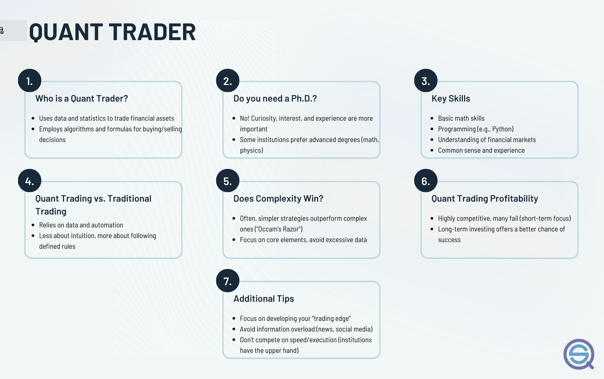

Quantitative trading is an approach to trading that relies on mathematical models and statistical analyses to identify profitable trading opportunities. In modern financial markets, quantitative trading plays a pivotal role as it provides a systematic and disciplined process to decision-making, reducing the influence of human emotions and cognitive biases. By leveraging quantitative strategies, traders can effectively handle vast amounts of data and execute trades at a speed and frequency impossible for human traders alone.

Algorithmic trading serves as a broader framework within which quantitative trading operates. It involves using algorithms, or sets of predefined instructions, to automate trading decisions and execution. Quantitative trading strategies are frequently deployed in algorithmic trading to analyze market data, predict price movements, and automate the buying and selling processes. The integration of quantitative strategies into algorithmic trading has transformed financial markets, leading to increased liquidity, tighter spreads, and improved market efficiency.



This article aims to provide a comprehensive overview of quantitative trading, focusing on its role and significance within algorithmic trading. Readers can expect to learn about the functions and responsibilities of a quantitative trader, the tools they use, and the process of developing a quantitative trading strategy. The article will also explore the challenges and risks faced by quantitative traders, as well as future trends and innovations in the field. By the end of this article, readers will have a deeper understanding of how quantitative trading shapes modern financial markets and the potential developments that may impact the industry in the future.

## Table of Contents

## What is a Quantitative Trader?

A quantitative trader is a financial professional who specializes in designing and implementing trading strategies based on quantitative analysis. Unlike traditional traders who may rely on intuition and experience, quantitative traders leverage mathematical models and statistical tools to make informed trading decisions. These traders are integral to the finance industry, where they utilize data-driven approaches to generate profits and manage risks.

Quantitative traders employ a variety of mathematical models to analyze financial markets. By using models that predict price movements, identify discrepancies, and assess risk, they can develop strategies that capitalize on small market inefficiencies or trends. These models often involve complex algorithms and can be based on theories from [statistics](/wiki/bayesian-statistics), econometrics, and financial mathematics. For example, a quantitative trader might use regression analysis to find relationships between financial variables or employ stochastic calculus to model the dynamic behavior of asset prices.

Skills and educational background play a crucial role in a successful career as a quantitative trader. A strong foundation in mathematics, statistics, and computer programming is essential. Most quantitative traders hold advanced degrees in fields such as mathematics, physics, engineering, computer science, or finance. Proficiency in programming languages like Python, R, C++, or MATLAB is often required, as these are used for building and testing trading models. Additionally, familiarity with financial markets and instruments is important, as this knowledge helps in applying models effectively in real-world contexts.

Quantitative traders are employed across various sectors within the finance industry. Investment banks, hedge funds, asset management firms, and proprietary trading firms are among the primary employers. Each of these institutions values the unique ability of quantitative traders to develop systematic and potentially high-frequency trading strategies. Quantitative traders may also be involved in portfolio management, where they use optimization techniques to allocate assets efficiently, or in risk management, where they focus on assessing and mitigating financial risks.

In summary, quantitative traders are vital to modern financial institutions, using their expertise in mathematics and programming to craft and execute data-driven trading strategies. Their skills and backgrounds enable them to operate in diverse financial sectors, contributing significantly to the profitability and risk management efforts of these organizations.

## Quantitative Trading vs Algorithmic Trading

Quantitative trading and [algorithmic trading](/wiki/algorithmic-trading) are two integral components of modern financial markets, often used interchangeably, yet they encompass distinct frameworks and methodologies. Understanding their differences and overlaps is crucial for comprehending their roles within the finance industry.

Quantitative trading involves the use of mathematical models and statistical techniques to identify and exploit trading opportunities. This approach is deeply rooted in data analysis, where large datasets are scrutinized to discern patterns and anomalies that can predict future market behavior. Quantitative traders focus on creating models that can forecast price movements, estimate risks, and optimize portfolios through mathematical tools.

On the other hand, algorithmic trading refers to the automation of trading decisions through pre-programmed instructions or algorithms. These algorithms can execute trades at speeds and frequencies that a human trader cannot achieve, providing an edge in markets where speed is crucial. While algorithmic trading can incorporate quantitative models in its processes, its scope extends to purely rule-based or workflow automation strategies that may not necessarily rely on quantitative analysis.

The overlap between these two approaches is evident when quantitative models are implemented within algorithmic systems. For instance, a quantitative model may identify a statistical [arbitrage](/wiki/arbitrage) opportunity between correlated assets. This model is then transformed into an algorithm that automatically executes trades when specific conditions, derived from the model, are met. Here, the quantitative analysis informs the trading strategy, while algorithmic execution optimizes the trading process in terms of speed and efficiency.

Quantitative trading provides the advantage of being highly data-driven, offering insights that are often less susceptible to emotional biases prevalent in human traders. One key benefit is the potential for discovering innovative strategies by analyzing extensive historical data and employing complex statistical methods. A potential downside, however, is the challenge of model overfitting where a model may perform well on historical data but fail in live markets due to its complexity or inherent market changes.

Algorithmic trading, conversely, excels in execution, minimizing manual errors, and allowing for high-frequency trading strategies that capitalize on minute price differences at extremely fast speeds. However, its disadvantages include the risk of technological malfunctions, such as system failures or erroneous trades, and substantial initial costs in terms of development and infrastructure.

In summary, although [quantitative trading](/wiki/quantitative-trading) and algorithmic trading serve different aspects of trading strategies, their integration provides powerful tools that significantly enhance decision-making and execution in financial markets. Understanding the nuances of both approaches is essential for traders and institutions seeking to maximize their market efficiencies.

## The Tools of a Quantitative Trader

Quantitative traders employ a range of analytical and programming tools to develop and execute trading strategies, utilizing complex algorithms and data analysis techniques. Central to their toolkit is the use of programming languages like Python and R, which are widely recognized for their capabilities in statistical analysis, data manipulation, and visualization.

**Programming Languages:**
Python is extensively used in quantitative trading due to its simplicity and the vast ecosystem of libraries that support large-scale data analysis and financial modeling. Libraries such as NumPy and pandas aid in managing and manipulating large datasets, while SciPy and statsmodels offer robust statistical and mathematical tools essential for creating predictive models. Matplotlib and Seaborn are often used for data visualization, crucial for interpreting complex trading signals and market trends.

R is another popular language among quantitative traders, particularly for its statistical computing and graphical features. It excels in transforming data into actionable insights essential for strategic decision-making. R's collection of statistical packages enables traders to perform complex analyses with minimal code, making it a favored tool for those focused on statistical accuracy and reporting.

**Data Analysis and Modeling:**
Data analysis is at the heart of quantitative trading. Traders rely on historical market data to identify patterns and build predictive models that inform trading decisions. Techniques such as time series analysis, [machine learning](/wiki/machine-learning), and econometrics are commonly applied to forecast future price movements and optimize trading strategies. Statistical measures like moving averages, [volatility](/wiki/volatility-trading-strategies) indices, and correlation coefficients are frequently used indicators in these analyses.

Modeling requires precision and rigor, where [backtesting](/wiki/backtesting) plays a crucial role in assessing the viability of a trading strategy by simulating how it would have performed using historical data. This process helps traders refine their strategies to avoid potential overfitting and other biases that could distort results.

**Software Platforms and Libraries:**
Quantitative traders often leverage sophisticated software platforms and libraries to streamline the strategy development process. Platforms like QuantConnect and Quantopian (though discontinued as of late 2020) provide cloud-based environments where traders can code, test, and deploy strategies seamlessly. These platforms offer integrated development environments (IDEs) with access to extensive datasets and high-performance computation for backtesting algorithms.

Libraries like TA-Lib (Technical Analysis Library in Python) are essential for implementing and analyzing technical indicators used in developing trading strategies. Machine learning libraries like TensorFlow and scikit-learn are increasingly utilized to incorporate [artificial intelligence](/wiki/ai-artificial-intelligence) into trading models, enabling more adaptive and self-correcting strategies.

The integration of these tools allows quantitative traders to manage vast amounts of financial data efficiently and make informed trading decisions. By automating tasks and analyzing market conditions with precision, these tools help in gaining a competitive edge in fast-paced financial markets.

## Developing a Quantitative Trading Strategy

Developing a quantitative trading strategy involves several methodical steps, each critical to building a robust and effective trading model. This process typically starts with the formulation of a hypothesis, which serves as the strategic premise for identifying market inefficiencies or opportunities. A hypothesis might involve correlations between asset prices, mean-reversion tendencies, or [momentum](/wiki/momentum) patterns, among others. Quantitative traders use historical data and mathematical models to test these hypotheses rigorously.

Once a hypothesis is established, the next step is backtesting, which is vital for assessing the potential success of the strategy before deploying it in live markets. Backtesting involves simulating the strategy using historical data to evaluate its performance. This practice allows traders to analyze key metrics such as return on investment, volatility, maximum drawdown, and Sharpe ratio. The backtesting process is facilitated by programming tools and software platforms that can process large datasets efficiently. For instance, Python, with libraries such as pandas and NumPy, is widely used for data manipulation and analysis in backtesting.

```python
import pandas as pd
import numpy as np

# Example: Simple Moving Average Crossover Strategy
def moving_average_strategy(data, short_window=40, long_window=100):
    signals = pd.DataFrame(index=data.index)
    signals['price'] = data['Close']
    signals['short_m_avg'] = data['Close'].rolling(window=short_window, min_periods=1).mean()
    signals['long_m_avg'] = data['Close'].rolling(window=long_window, min_periods=1).mean()
    signals['signal'] = 0.0
    signals['signal'][short_window:] = np.where(signals['short_m_avg'][short_window:] 
                                                > signals['long_m_avg'][short_window:], 1.0, 0.0)
    signals['positions'] = signals['signal'].diff()
    return signals
```

Statistical analysis plays a crucial role in refining strategies. Quantitative traders employ various statistical techniques to verify the robustness of their models and to identify any overfitting to the historical data, which can lead to false assumptions about future performance. Techniques might include regression analysis, hypothesis testing, and variance analysis. The aim is to ensure that the strategy is not just a product of random chance but has a sound basis that can translate into real market conditions.

After backtesting and refining a strategy, continuous evaluation and adjustment are essential. Financial markets are dynamic, and what works today might not be profitable tomorrow. Traders often deploy strategies with mechanisms for continuous learning and adaptation, which might involve recalibrating the model parameters periodically or incorporating more sophisticated techniques like machine learning to predict market movements. This ongoing process mitigates the risk of degradation in strategy performance due to changing market conditions or unforeseen external factors.

In conclusion, the development of a quantitative trading strategy is an iterative process that demands meticulous planning, rigorous testing, and constant refinement to remain effective in the fluctuating landscape of financial markets.

## Challenges and Risks in Quantitative Trading

Quantitative trading involves significant challenges and risks due to its reliance on mathematical models and large datasets. One major challenge is data quality. Accurate, high-frequency data is crucial for model development and decision-making. Poor data quality, including gaps, outliers, or misreported figures, can lead to erroneous predictions and suboptimal trading decisions. Quantitative traders must implement rigorous data validation and cleaning processes to ensure data reliability.

Model overfitting is another common issue. When a model becomes too complex, it may fit the training data perfectly but perform poorly on unseen data. Overfitting occurs when a model captures noise instead of the underlying pattern. This can be mitigated by employing techniques such as cross-validation, regularization, and limiting the number of parameters. By doing so, traders aim to achieve a balance between model complexity and generalization ability.

Risk management is crucial in quantitative trading. Market risk arises from adverse price movements affecting a portfolio's value. Quantitative traders use various risk management strategies, such as diversification, stop-loss orders, and portfolio rebalancing, to mitigate market risk. Model risk, the risk that a quantitative model may fail in real trading, is tackled by continuous model monitoring, performance evaluation, and stress testing under different market scenarios.

Regulatory and ethical considerations play a crucial role in quantitative trading. Traders must comply with regulations regarding market manipulation, insider trading, and data privacy. Ethical considerations also include ensuring that the algorithms and strategies employed do not exploit market inefficiencies to the detriment of market stability or fairness.

To mitigate risks and challenges in quantitative trading, traders can deploy several strategies:

1. **Robust Data Management**: Implementing stringent data verification and cleaning processes ensures high-quality data input for model training.

2. **Model Validation Techniques**: Techniques such as cross-validation, regularization, and backtesting on multiple datasets reduce overfitting risks and validate model robustness.

3. **Continuous Monitoring and Evaluation**: Ongoing monitoring of model performance and recalibration based on new data helps identify and correct model drift and inefficiencies.

4. **Risk Management Frameworks**: Employing diverse strategies like diversification, hedging, and robust stop-loss mechanisms aids in managing market risk effectively.

5. **Adherence to Regulatory Standards**: Staying informed about regulatory changes and ensuring compliance prevents legal risks and promotes ethical trading practices.

Through careful attention to these challenges and risks, quantitative traders can maximize their trading effectiveness while minimizing potential downsides.

## The Future of Quantitative Trading

Quantitative trading continues to evolve with advances in technology, notably through the integration of machine learning and artificial intelligence (AI). These technologies are reshaping trading paradigms, influencing market dynamics, and altering career landscapes within the finance industry.

Machine learning and AI facilitate more sophisticated data analysis and pattern recognition than traditional quantitative methods. Unlike classical statistical models, which rely on predefined equations and assumptions, machine learning algorithms can automatically identify complex patterns and relationships in vast datasets. This adaptability allows quantitative traders to develop more dynamic and adaptive trading strategies. For instance, [reinforcement learning](/wiki/reinforcement-learning), a subset of machine learning, can be used to optimize trading strategies by simulating various market conditions and learning from them, thereby continuously improving decision-making processes.

The potential impact of these technologies on the finance industry is profound. Algorithmic trading systems empowered by machine learning can execute trades at high speed and [volume](/wiki/volume-trading-strategy), decision-making processes become increasingly automated, reducing human intervention and potentially leading to more efficient markets. Additionally, AI-driven analytics enable traders to process and interpret real-time data from numerous sources, including social media and news outlets, providing a more holistic view of market sentiments.

However, this technological evolution also presents challenges. The job market within finance may shift, with increased demand for professionals who possess a hybrid skill set encompassing finance, computer science, and data analysis. The traditional skill set of a quantitative trader must now include competencies in machine learning algorithms, data engineering, and programming languages such as Python and C++. Below is a simple Python example to illustrate how a basic machine learning model might be implemented to predict stock prices:

```python
from sklearn.model_selection import train_test_split
from sklearn.ensemble import RandomForestRegressor
from sklearn.metrics import mean_squared_error
import pandas as pd

# Assume `data` is a DataFrame containing stock prices and features
data = pd.read_csv('stock_prices.csv')
features = data.drop('Price', axis=1)
target = data['Price']

# Split the data into training and testing sets
X_train, X_test, y_train, y_test = train_test_split(features, target, test_size=0.2, random_state=42)

# Initialize a random forest regressor
model = RandomForestRegressor(n_estimators=100, random_state=42)

# Train the model
model.fit(X_train, y_train)

# Predict and evaluate the model
predictions = model.predict(X_test)
mse = mean_squared_error(y_test, predictions)
print(f'Mean Squared Error: {mse}')
```

As the demand for data-driven decision-making grows, opportunities for quantitative traders are likely to expand into innovative sectors. The increasing relevance of environmental, social, and governance ([ESG](/wiki/esg-investing)) criteria and the rise of decentralized finance (DeFi) offer new frontiers for quantitative exploration and strategy development. Consequently, professionals with adeptness in leveraging AI for quantitative analysis are well-positioned to capitalize on emerging market opportunities. 

Embracing continuous learning and staying abreast of technological advancements will be crucial for those seeking to thrive in this dynamic landscape. The future of quantitative trading promises exciting possibilities, with AI and machine learning at its core, heralding a new era of financial innovation and opportunity.

## Conclusion

Quantitative trading has emerged as a pivotal component within modern financial markets, offering a more systematic approach to trading through the use of mathematical models and data-driven analyses. This article explored various aspects of quantitative trading, including the role and tools of a quantitative trader, the distinction and intersection between quantitative and algorithmic trading, and how quantitative strategies are developed and tested. Through utilizing advanced statistical methods and programming languages, such as Python and R, quantitative traders have been able to harness the power of big data to make informed trading decisions.

The impact of quantitative trading extends beyond individual gain; it enhances market efficiency and [liquidity](/wiki/liquidity-risk-premium), thus playing a crucial role in the global financial ecosystem. However, the field is not without its challenges. Factors such as data quality, model overfitting, regulatory limitations, and various risks demand rigorous risk management and ethical considerations.

Looking forward, the future of quantitative trading appears promising, particularly with ongoing advancements in machine learning and artificial intelligence. These technologies are poised to refine trading strategies further, offering innovative solutions to complex financial problems. As the industry evolves, so will the demand for skilled quantitative traders who can adapt to new technologies and market conditions.

To those interested in engaging with this domain, the potential is vast and varied. From developing sophisticated algorithms to conducting in-depth statistical research, quantitative trading offers a dynamic career path. Continued education and exploration are encouraged, as the landscape of quantitative trading is ever-changing, with numerous opportunities for significant contributions to financial markets.

## References & Further Reading

[1]: ["Quantitative Trading: How to Build Your Own Algorithmic Trading Business"](https://www.amazon.com/Quantitative-Trading-Build-Algorithmic-Business/dp/0470284889) by Ernest P. Chan

[2]: ["Advances in Financial Machine Learning"](https://www.amazon.com/Advances-Financial-Machine-Learning-Marcos/dp/1119482089) by Marcos Lopez de Prado

[3]: ["Machine Learning for Algorithmic Trading"](https://github.com/stefan-jansen/machine-learning-for-trading) by Stefan Jansen

[4]: ["Evidence-Based Technical Analysis: Applying the Scientific Method and Statistical Inference to Trading Signals"](https://www.amazon.com/Evidence-Based-Technical-Analysis-Scientific-Statistical/dp/0470008741) by David Aronson

[5]: Bergstra, J., Bardenet, R., Bengio, Y., & Kégl, B. (2011). ["Algorithms for Hyper-Parameter Optimization."](https://proceedings.neurips.cc/paper/2011/file/86e8f7ab32cfd12577bc2619bc635690-Paper.pdf) Advances in Neural Information Processing Systems 24.