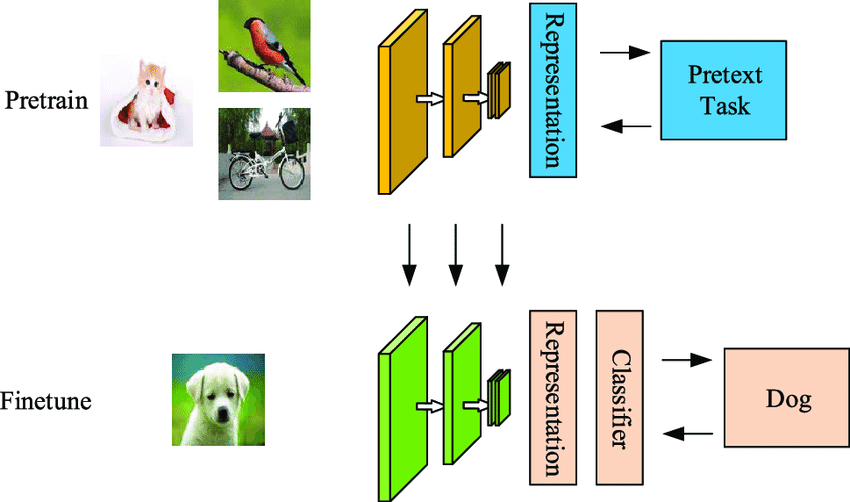

## Table of Contents

## What is Self-Supervised Learning (SSL) in machine learning?

Self-Supervised Learning (SSL) is a type of machine learning where the model learns to predict parts of its input from other parts of its input, without needing labeled data. Imagine you have a big puzzle, and instead of someone telling you where each piece goes, you figure it out by looking at the patterns and shapes of the pieces themselves. In SSL, the model creates its own labels from the data it is given, making it a powerful tool for learning from vast amounts of unlabeled data.

For example, if you're trying to teach a computer to recognize objects in pictures, you could use SSL by having the model predict what part of an image is missing when you cover up a section. The model learns by trying to fill in the blank, using the rest of the image as a guide. This approach can be very useful because it doesn't rely on expensive and time-consuming human labeling, making it easier to train models on large datasets.

## How does Self-Supervised Learning differ from supervised and unsupervised learning?

Self-Supervised Learning (SSL) is different from supervised learning because it doesn't need labeled data. In supervised learning, you need to tell the computer exactly what each piece of data means, like showing it many pictures of cats and telling it "this is a cat." With SSL, the computer figures out the labels on its own by looking at patterns in the data. For example, it might learn to recognize objects in a picture by trying to predict what's hidden behind a mask on the image. This makes SSL a lot more flexible because you can use it with huge amounts of data that don't have labels.

SSL also differs from unsupervised learning. Unsupervised learning tries to find patterns or groups in the data without any labels, but it doesn't create its own labels like SSL does. Think of unsupervised learning like sorting a pile of mixed-up toys into groups without knowing what each toy is called. SSL, on the other hand, not only sorts the toys but also tries to guess what each toy might be called by looking at clues from the other toys. This makes SSL a bridge between supervised and unsupervised learning, using the best of both worlds to learn from data in a smart way.

## What are some common tasks used to train models in Self-Supervised Learning?

One common task in Self-Supervised Learning is called "masked prediction." Imagine you're trying to solve a jigsaw puzzle, but some pieces are missing. In this task, the computer looks at an image with parts covered up and tries to guess what's behind the mask. For example, if you cover up a dog's face in a picture, the computer tries to predict what the dog's face looks like based on the rest of the image. This helps the computer learn about the different parts of objects and how they fit together.

Another popular task is "contrastive learning." This is like playing a memory game where you have to match pairs of cards. The computer is shown many different images and tries to figure out which ones are similar and which ones are different. It learns by pulling similar images closer together in its understanding and pushing different images further apart. This helps the computer understand what makes things the same or different, which is useful for tasks like recognizing different objects or people.

A third task is "autoencoding," where the computer tries to recreate the input data after compressing it into a simpler form. Think of it like trying to draw a picture from memory after only seeing it for a few seconds. The computer learns to capture the most important features of the data so it can reconstruct it accurately. This helps the computer understand the essential parts of the data, which can be useful for tasks like denoising images or filling in missing parts of data.

## Can you explain the concept of pretext tasks in Self-Supervised Learning?

In Self-Supervised Learning, pretext tasks are like little games or puzzles that the computer plays to learn about the data without needing labels. These tasks help the computer figure out the important parts of the data by itself. For example, a pretext task might involve showing the computer a picture with some parts covered up and asking it to guess what's hidden. By doing this over and over, the computer learns to recognize patterns and features in the images, which helps it understand the data better.

Another example of a pretext task is when the computer is shown two images and asked to decide if they are the same or different. This helps the computer learn what makes images similar or different, which is useful for tasks like recognizing objects. Pretext tasks are important because they let the computer learn from huge amounts of data without needing someone to tell it what everything means. This makes Self-Supervised Learning a powerful tool for training models on large, unlabeled datasets.

## What are some popular Self-Supervised Learning algorithms?

One popular Self-Supervised Learning algorithm is called BERT, which stands for Bidirectional Encoder Representations from Transformers. BERT is used a lot in understanding language. It works by hiding some words in a sentence and then trying to guess what those words are. By doing this over and over with lots of text, BERT learns about the way words and sentences are put together. This makes it really good at tasks like answering questions or filling in missing words.

Another well-known algorithm is SimCLR, which stands for Simple Framework for Contrastive Learning of Visual Representations. SimCLR is used for understanding pictures. It shows the computer two pictures at a time and asks if they are the same or different. By playing this game with many images, SimCLR learns to recognize what makes pictures similar or different. This helps it do things like sorting pictures into groups or recognizing objects in new pictures.

A third algorithm is called BYOL, which stands for Bootstrap Your Own Latent. BYOL is also used for pictures and works by having the computer try to match two different views of the same image. It's like playing a game where you have to find the same thing in two slightly different pictures. By doing this, BYOL learns to understand the important parts of images, which helps it with tasks like recognizing objects even when they look a bit different.

## How does Self-Supervised Learning help in reducing the need for labeled data?

Self-Supervised Learning (SSL) helps reduce the need for labeled data by letting the computer learn from the data itself, without needing someone to tell it what everything means. Imagine you're trying to learn a new language. Instead of using a dictionary, you listen to people talking and start to understand words and sentences by the context. In SSL, the computer does something similar. It looks at patterns in the data and figures out what's important on its own. This means you can use huge amounts of data that don't have labels, which saves time and money because labeling data can be very expensive and slow.

For example, if you want to teach a computer to recognize cats in pictures, you don't need to show it thousands of labeled cat pictures. Instead, you can use SSL to have the computer play games like guessing what's hidden in a picture or deciding if two pictures are the same. By doing this, the computer learns to recognize cats without needing labels. This makes SSL a powerful tool for training models on large datasets, making it easier and cheaper to develop smart systems that can understand and work with data.

## What are the benefits of using Self-Supervised Learning in real-world applications?

Self-Supervised Learning (SSL) helps a lot in real-world applications because it can use tons of data without needing labels. Imagine you want a computer to understand pictures or text. Usually, you'd need to label each picture or text to teach the computer, which can take a lot of time and money. But with SSL, the computer learns by itself from the data. It's like the computer playing games with the data to figure out what's important. This makes it easier and cheaper to build smart systems that can work with big amounts of information, like recognizing objects in pictures or understanding what people are saying in videos.

Another big benefit of SSL is that it can make models better at understanding things. When a computer learns from labeled data, it might only learn what the labels tell it. But with SSL, the computer learns more about the patterns in the data itself. This can help the computer do better at tasks like sorting pictures into groups or figuring out what someone is saying in a noisy room. Because SSL lets the computer learn in a more natural way, the models can be more flexible and work well in many different situations.

## How can Self-Supervised Learning be applied to natural language processing?

Self-Supervised Learning (SSL) in natural language processing (NLP) helps computers understand and work with text without needing labeled data. One popular way to do this is by using an algorithm called BERT. BERT works by hiding some words in a sentence and then trying to guess what those words are. By doing this over and over with lots of text, BERT learns about the way words and sentences are put together. This makes it really good at tasks like answering questions or filling in missing words. For example, if you show BERT a sentence like "The cat sat on the ___," it can guess that the missing word might be "mat" because it has learned from lots of other sentences how words fit together.

Another way SSL is used in NLP is through an algorithm called Word2Vec. Word2Vec learns to predict a word based on the words around it. Imagine you're reading a book and you can guess what the next word will be based on the words you've just read. Word2Vec does the same thing with text data. By learning these patterns, it can understand the relationships between words, like knowing that "king" and "queen" are related because they often appear in similar contexts. This helps in tasks like finding similar words or understanding the meaning of sentences. Both BERT and Word2Vec show how SSL can make computers better at understanding language without needing someone to label everything for them.

## What challenges are associated with implementing Self-Supervised Learning?

One challenge with Self-Supervised Learning (SSL) is that it can be hard to make sure the computer is learning the right things. Since SSL doesn't use labeled data, the computer might pick up on patterns that aren't important for the task you want it to do. For example, if you're trying to teach a computer to recognize dogs in pictures, it might start focusing on the background instead of the dogs themselves. This can make the model less accurate and harder to use for real-world tasks. To fix this, you need to design the right kind of games or puzzles for the computer to play, which can take a lot of time and expertise.

Another challenge is that SSL can take a lot of computing power. Because the computer needs to look at huge amounts of data to learn by itself, it can be slow and expensive to train these models. For example, training a model like BERT can take days or even weeks on powerful computers. This means you need to have access to a lot of computing resources, which can be a problem for smaller teams or organizations. Despite these challenges, SSL is still very useful because it can help computers learn from big amounts of data without needing labels, which saves time and money in the long run.

## How do contrastive learning methods work within the framework of Self-Supervised Learning?

Contrastive learning is a type of Self-Supervised Learning where the computer learns by comparing different pieces of data. Imagine you're playing a game where you have to match pairs of cards. In contrastive learning, the computer is shown many different images or pieces of text and tries to figure out which ones are similar and which ones are different. It does this by pulling similar items closer together in its understanding and pushing different items further apart. This helps the computer understand what makes things the same or different, which is useful for tasks like recognizing different objects or understanding the meaning of sentences.

A popular algorithm for contrastive learning is SimCLR, which stands for Simple Framework for Contrastive Learning of Visual Representations. SimCLR works by showing the computer two images at a time and asking if they are the same or different. By playing this game with many images, SimCLR learns to recognize what makes pictures similar or different. This helps it do things like sorting pictures into groups or recognizing objects in new pictures. The key idea is that the computer learns to create its own labels by understanding the relationships between the data points, making it a powerful tool for learning from large, unlabeled datasets.

## Can you discuss some state-of-the-art advancements in Self-Supervised Learning?

One of the latest advancements in Self-Supervised Learning is the development of algorithms like BYOL (Bootstrap Your Own Latent). BYOL helps computers learn from images by playing a game where it tries to match two different views of the same image. It's like playing a game where you have to find the same thing in two slightly different pictures. By doing this, BYOL learns to understand the important parts of images, which helps it with tasks like recognizing objects even when they look a bit different. This method is powerful because it doesn't need negative examples, which makes it simpler and more efficient than some other methods.

Another exciting advancement is the use of Self-Supervised Learning in natural language processing with models like RoBERTa, which is an improved version of BERT. RoBERTa works by training on much larger amounts of text data and for longer periods of time than BERT. This helps it understand language even better. For example, if you show RoBERTa a sentence like "The cat sat on the ___," it can guess that the missing word might be "mat" because it has learned from lots of other sentences how words fit together. These advancements show how Self-Supervised Learning can keep getting better at understanding both images and text without needing labeled data.

## What future developments are expected in the field of Self-Supervised Learning?

In the future, Self-Supervised Learning (SSL) is expected to become even more powerful and widely used. One big area of development is making SSL algorithms better at understanding different types of data, like videos and sounds, not just pictures and text. Imagine if a computer could learn to understand a video by watching it over and over, figuring out what's happening without anyone telling it. This would help in tasks like recognizing actions in videos or understanding what people are saying in noisy environments. Researchers are working on new ways to create games or puzzles for the computer to play with these types of data, making SSL even more useful in real-world applications.

Another expected development is improving the efficiency of SSL. Right now, training these models can take a lot of time and computing power. In the future, scientists hope to find ways to train SSL models faster and with less energy. This could mean using smarter ways to design the games the computer plays or using new kinds of computer chips that are better at running these algorithms. If SSL can be made more efficient, it will be easier for more people to use it, even if they don't have access to big computers. This would open up new possibilities for using SSL in areas like healthcare, where it could help analyze medical images, or in education, where it could help understand and summarize large amounts of text.