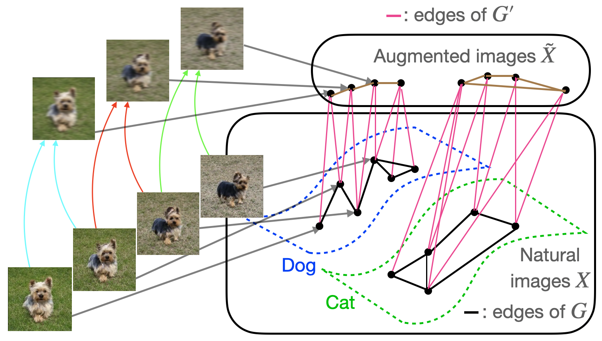

## Table of Contents

## What is self-training in machine learning?

Self-training is a way to improve machine learning models when you don't have a lot of labeled data. It works by using the model to predict labels for unlabeled data, and then adding those predictions back into the training set. This process helps the model learn from more data, which can make it more accurate over time. For example, if you have a model that recognizes pictures of cats and dogs, but you only have a few labeled pictures, self-training can use the model's guesses on a larger set of unlabeled pictures to improve its performance.

The process of self-training starts with training a model on a small set of labeled data. After that, the model is used to make predictions on a larger set of unlabeled data. The most confident predictions are then added to the training set as if they were labeled data. This cycle can be repeated several times, with the model getting better each time as it learns from its own predictions. Self-training is useful because it can make the most out of limited labeled data, but it's important to be careful because if the model makes a lot of mistakes, those errors can be added back into the training set and make the model worse.

## How does self-training differ from other semi-supervised learning methods?

Self-training is different from other semi-supervised learning methods because it focuses on using the model's own predictions to improve itself. In self-training, the model starts with a small set of labeled data and then uses its predictions on a larger set of unlabeled data to expand its training set. The most confident predictions are treated as if they were labeled data and added back into the training set. This process can be repeated multiple times, allowing the model to learn from its own guesses and improve over time. Self-training is simple and can work well with limited labeled data, but it can also lead to errors if the model's predictions are not accurate.

Other semi-supervised learning methods, like co-training and multi-view learning, use different approaches. Co-training, for example, uses two or more different views or sets of features of the data. Each view trains a separate model, and the models can then teach each other by sharing their most confident predictions. This method assumes that the different views are complementary and that each view can provide useful information to the other. Multi-view learning is similar but can involve more than two views and often uses more complex algorithms to combine the information from different sources. These methods can be more powerful than self-training because they use multiple sources of information, but they also require more data and can be more complex to implement.

In summary, self-training is a straightforward method that relies on a single model's predictions to improve itself, while other semi-supervised methods like co-training and multi-view learning use multiple models or views of the data to enhance learning. Each method has its strengths and weaknesses, and the choice between them depends on the specific problem and the available data.

## What are the basic steps involved in a self-training algorithm?

Self-training in [machine learning](/wiki/machine-learning) is a way to make a model better when you don't have a lot of labeled data. You start by training a model on the small amount of labeled data you have. Once the model is trained, you use it to make predictions on a larger set of data that doesn't have labels. The model looks at this new data and guesses what the labels should be. If the model is very sure about its guesses, those guesses are added to the original set of labeled data. This makes the training set bigger, and you can use this bigger set to train the model again. You can repeat this process many times, and each time, the model can get a little better because it has more data to learn from.

The key part of self-training is deciding which guesses to add to the training set. You usually pick the guesses where the model is very confident. If the model thinks a picture is definitely a cat, you might add that picture to the training set with the label "cat." But if the model is not sure, you might not use that guess. This helps keep the training set clean and stops the model from learning from its mistakes. Self-training can be a good way to improve a model when you don't have a lot of labeled data, but you have to be careful. If the model makes a lot of wrong guesses, those wrong guesses can make the model worse instead of better.

## Can you explain the concept of STraTA in self-training?

STraTA, which stands for Self-Training with Teacher Assistant, is a special way to make self-training work better. In regular self-training, a model learns from its own guesses on data without labels. But in STraTA, there's an extra step. First, you train a main model, called the student, on the labeled data you have. Then, you train another model, called the teacher assistant, on the same labeled data. The teacher assistant helps the student by giving it better guesses on the unlabeled data. This way, the student can learn from more accurate information and improve faster.

The key idea in STraTA is that the teacher assistant acts like a middleman. It takes the student's guesses on the unlabeled data and makes them more reliable before adding them to the training set. This helps the student learn from better examples and reduces the chance of learning from mistakes. By using a teacher assistant, STraTA can make self-training more effective, especially when you don't have a lot of labeled data to start with.

## How does self-mem enhance the self-training process?

Self-mem, or self-memory, is a way to make self-training better by keeping track of what the model has learned over time. In regular self-training, the model uses its own guesses on data without labels to improve itself. But with self-mem, the model also remembers its past guesses and how well it did. This helps the model learn from its mistakes and successes, making it smarter as it goes along. By using self-mem, the model can avoid repeating the same errors and focus on getting better at the things it's not so good at yet.

In self-mem, the model keeps a record of its predictions and how confident it was about them. If the model made a wrong guess before, it can use that information to be more careful next time. This memory helps the model to be more accurate because it can learn from its past experiences. For example, if the model guessed that a picture was a cat but it was actually a dog, it can remember that mistake and be more careful the next time it sees a similar picture. By keeping track of its learning journey, self-mem helps the model to improve faster and more reliably than regular self-training.

## What role does new data play in self-training methods?

In self-training methods, new data without labels is very important. When you start, you have a small amount of data that has labels, and you use this to train a model. After that, you use the model to guess the labels of the new data that doesn't have labels. If the model is very sure about its guesses, you can add those guesses to the original set of labeled data. This makes the training set bigger, and you can use this bigger set to train the model again. By doing this over and over, the model can learn from more and more data, which can make it better at its job.

The key to using new data well in self-training is to be careful about which guesses you add to the training set. You want to pick the guesses where the model is very confident because those are more likely to be right. If you add too many wrong guesses, the model can start to learn from its mistakes, which can make it worse instead of better. So, new data helps the model learn and improve, but you have to use it wisely to make sure the model keeps getting better.

## What are the advantages of using self-training methods in machine learning?

Self-training methods in machine learning are great because they help you make the most out of the data you have. When you don't have a lot of labeled data, self-training can use the model's own guesses to learn from more data. This means you can improve your model even if you only have a small set of labeled data to start with. By using the model's predictions on new, unlabeled data, you can slowly grow your training set and make the model better over time. This is really useful in situations where getting more labeled data is hard or expensive.

Another advantage of self-training is that it's simple to use. You don't need a lot of fancy math or complex algorithms to get started. You just train a model on the labeled data you have, use it to guess the labels of new data, and then add the most confident guesses back into the training set. This process can be repeated many times, and each time, the model can get a little better. Self-training is also flexible because it can work with many different kinds of data and models. So, whether you're trying to recognize pictures, understand text, or do something else, self-training can help you improve your model without needing a lot of extra work.

## What are the potential challenges and limitations of self-training?

Self-training can be tricky because it relies on the model's own guesses to improve itself. If the model makes a lot of wrong guesses, those mistakes can end up in the training set, making the model worse instead of better. This is called error propagation, and it can be a big problem. Another challenge is deciding which guesses to add to the training set. If you're not careful, you might add too many wrong guesses, which can mess up the model's learning. So, it's important to have a good way to check how sure the model is about its guesses before adding them to the training set.

Another limitation of self-training is that it might not work as well if the data you're using is very different from the data you started with. If the new data has different kinds of pictures or texts, the model might not know how to handle them well. This can make the model's guesses less accurate, which can slow down its learning or even make it worse. Also, self-training might not be the best choice if you have enough labeled data to begin with. In that case, you might be better off using other methods that don't rely on the model's own guesses.

## How can one evaluate the performance of a self-training model?

To evaluate the performance of a self-training model, you can use the same methods you would use for any other machine learning model. Start by splitting your data into a training set and a test set. Use the training set for self-training, and then see how well the model does on the test set. This helps you check if the model is learning the right things or if it's just memorizing the training data. You can use metrics like accuracy, precision, recall, and F1 score to see how well the model is doing. For example, if you're trying to recognize pictures of cats and dogs, accuracy tells you how often the model gets the right answer.

Another important thing to look at is how the model's performance changes over time. Since self-training involves adding new data to the training set, you want to make sure the model keeps getting better. You can do this by keeping track of the model's performance after each round of self-training. If the model's accuracy or other metrics keep going up, that's a good sign. But if the performance starts to go down, it might mean the model is learning from its mistakes, and you might need to be more careful about which guesses you add to the training set. By watching the model's performance closely, you can make sure self-training is helping it learn the right things.

## What advanced techniques can be applied to improve self-training outcomes?

One advanced technique to improve self-training outcomes is using a confidence threshold to decide which predictions to add to the training set. By setting a high confidence threshold, you can make sure only the most reliable predictions are used, reducing the risk of adding incorrect labels. For example, if the model's confidence in a prediction is above 90%, you might add it to the training set. This helps prevent error propagation, where wrong predictions can lead to further mistakes. Another technique is to use ensemble methods, where multiple models are trained and their predictions are combined. This can make the overall predictions more accurate and reliable, improving the quality of the data added back into the training set.

Another way to enhance self-training is by incorporating active learning. In active learning, the model can ask for human input on the most uncertain predictions, helping to correct errors and improve the training data. This can be especially useful when the model is unsure about certain examples, allowing it to learn from expert feedback. Additionally, using techniques like pseudo-labeling, where the model's predictions on unlabeled data are treated as true labels, can be refined by using iterative refinement. In this approach, the model is trained multiple times, with each iteration using the improved predictions from the previous round. By combining these advanced techniques, self-training can become more effective and lead to better model performance.

## How does self-training integrate with other machine learning techniques?

Self-training can work well with other machine learning techniques to make models even better. For example, it can be used with active learning, where the model picks the examples it's not sure about and asks a human to label them. This helps the model learn from its mistakes and improve faster. Self-training can also be used with ensemble methods, where you train lots of models and combine their predictions. This can make the guesses more accurate, which means the data added back into the training set is better. By using self-training with these other techniques, you can make the most out of the data you have and help the model learn more effectively.

Another way self-training can be combined with other methods is by using techniques like transfer learning. In transfer learning, you start with a model that's already good at one task and use it to help with a new task. Self-training can be used to fine-tune this model on the new task by adding its own predictions to the training set. This can be especially helpful when you don't have a lot of labeled data for the new task. By combining self-training with transfer learning, you can use what the model already knows to learn the new task faster and more accurately.

## What are some real-world applications of self-training methods?

Self-training methods are used in many real-world situations where there isn't a lot of labeled data to start with. For example, in the field of natural language processing, self-training can help improve models that understand and translate languages. If you want to make a model that can translate from English to Spanish, you might not have a lot of sentences that are already translated. Self-training can help by using the model's own guesses to learn from more sentences, making it better at translating over time. This is really useful because getting more translated sentences can be hard and expensive.

Another area where self-training is helpful is in image recognition. Imagine you want to build a model that can tell the difference between pictures of cats and dogs. You might only have a few pictures that are already labeled, but you have a lot more pictures without labels. Self-training can use the model's guesses on these unlabeled pictures to improve itself. If the model is very sure that a picture is a cat, it can add that guess to the training set and learn from it. This way, the model can get better at recognizing cats and dogs even if you don't have a lot of labeled pictures to start with.

## References & Further Reading

[1]: Yarowsky, D. (1995). ["Unsupervised Word Sense Disambiguation Rivaling Supervised Methods."](https://aclanthology.org/P95-1026/) Proceedings of the 33rd Annual Meeting on Association for Computational Linguistics.

[2]: Nigam, K., McCallum, A. K., Thrun, S., & Mitchell, T. (2000). ["Text Classification from Labeled and Unlabeled Documents using EM."](https://link.springer.com/article/10.1023/A:1007692713085) Machine Learning, 39(2-3), 103-134.

[3]: Chapelle, O., Scholkopf, B., & Zien, A. (2006). ["Semi-Supervised Learning."](https://ieeexplore.ieee.org/abstract/document/4787647) MIT Press.

[4]: Zhu, X., & Goldberg, A. B. (2009). ["Introduction to Semi-Supervised Learning."](https://link.springer.com/book/10.1007/978-3-031-01548-9) Morgan & Claypool Publishers.

[5]: Blum, A., & Mitchell, T. (1998). ["Combining labeled and unlabeled data with co-training."](https://dl.acm.org/doi/10.1145/279943.279962) Proceedings of the 11th Annual Conference on Computational Learning Theory.

[6]: Ruder, S. (2019). ["Neural Transfer Learning for Natural Language Processing."](https://researchrepository.universityofgalway.ie/bitstream/handle/10379/15463/neural_transfer_learning_for_nlp.pdf) Doctoral dissertation. National University of Ireland, Galway.