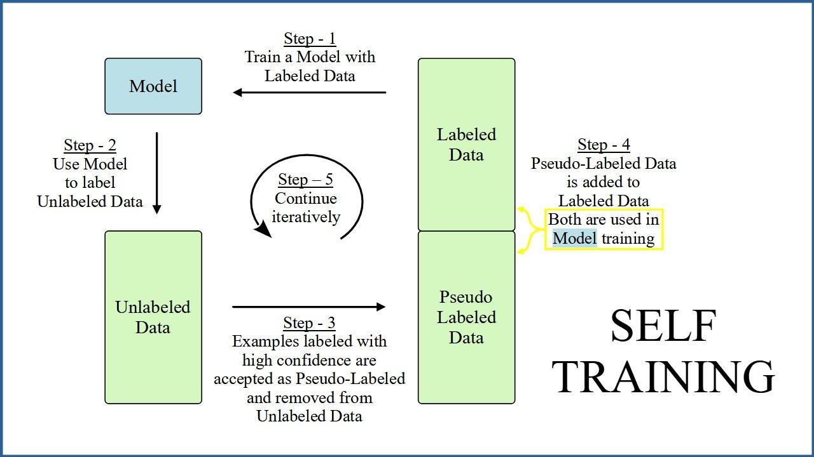

## Table of Contents

## What is self-training in machine learning?

Self-training is a way to improve machine learning models without needing more labeled data. Imagine you have a model that can already do some tasks, but you want it to get better. With self-training, the model uses its own predictions on new, unlabeled data to teach itself. It works like this: the model first predicts labels for the new data. Then, it takes the predictions it's most sure about and adds them to its training set as if they were real labels. This way, the model can learn from more data, even if that data wasn't labeled by humans.

This method can be really helpful when getting more labeled data is hard or expensive. By using self-training, the model can keep improving on its own. However, there's a risk: if the model starts making wrong predictions and adds those wrong labels to its training set, it might start to learn the wrong things. This is called "error propagation." To avoid this, it's important to carefully choose which predictions to trust and add to the training set. Self-training is a smart way to make the most out of the data you have, but it needs to be done carefully to work well.

## How does self-training differ from supervised learning?

Self-training and supervised learning are two different ways to train machine learning models. In supervised learning, you need a lot of data that's already labeled. This means someone has gone through the data and marked what each piece of data represents. For example, if you're training a model to recognize dogs and cats, you need pictures that are already labeled as "dog" or "cat." The model learns from these labeled examples to make predictions on new data. Supervised learning relies on having enough labeled data to train the model accurately.

Self-training, on the other hand, is a way to improve a model without needing more labeled data. You start with a model that's already been trained using supervised learning. Then, you let this model predict labels for new, unlabeled data. If the model is very sure about some of its predictions, you can add those predictions to the training set as if they were real labels. This way, the model can learn from more data, even if it wasn't labeled by humans. Self-training can help when getting more labeled data is hard or expensive, but it needs to be done carefully to avoid the model learning the wrong things from its own mistakes.

## What are the main components of a self-training algorithm?

The main components of a self-training algorithm include an initial model, a set of unlabeled data, and a method to select confident predictions. The initial model is usually trained using supervised learning on a smaller set of labeled data. This model is then used to make predictions on the larger set of unlabeled data. The key part of self-training is deciding which of these predictions to trust and add back into the training set. This is done by setting a confidence threshold. If the model's prediction for a piece of data is above this threshold, it's considered reliable enough to be used as a new label.

Once the confident predictions are selected, they are added to the original training set, creating an expanded set of labeled data. The model is then retrained on this new, larger set of data. This process can be repeated multiple times, with the model improving its performance each time it goes through the cycle of predicting, selecting, and retraining. The goal is to leverage the model's own predictions to improve its accuracy without needing more human-labeled data. However, care must be taken to avoid error propagation, where the model starts learning from its own mistakes, which can degrade performance over time.

## Can you explain the process of self-training with a simple example?

Imagine you have a model that can tell if a picture shows a dog or a cat. You trained it with 100 pictures that were already labeled as "dog" or "cat." Now, you have 1,000 new pictures, but they don't have labels. You want your model to get better at telling dogs from cats, but you don't want to label all those new pictures by hand. So, you use self-training. You let your model guess what's in each of the 1,000 new pictures. If the model is very sure that a picture shows a dog, you add that picture to your training set and label it as "dog." If it's very sure it's a cat, you do the same but label it as "cat." Now, you have more pictures to train your model with, even though you didn't label them yourself.

You keep doing this, letting the model guess on the rest of the pictures and adding the ones it's sure about to the training set. Each time, you retrain the model with the new, bigger set of pictures. This way, the model gets better and better at telling dogs from cats without needing more pictures labeled by humans. But you have to be careful. If the model starts guessing wrong and you add those wrong guesses to the training set, it might start learning the wrong things. So, you only add the guesses the model is very sure about. This helps the model improve without making too many mistakes.

## What are the advantages of using self-training in machine learning?

Self-training in [machine learning](/wiki/machine-learning) is a smart way to make your model better without needing more labeled data. Imagine you have a model that can already do some tasks, but you want it to get even better. With self-training, you can let the model use its own guesses on new, unlabeled data to teach itself. This means you don't have to spend time and money getting more data labeled by people. It's like letting the model learn on its own, which can be really helpful when getting more labeled data is hard or expensive.

However, you have to be careful with self-training. If the model starts making wrong guesses and you use those guesses to train it more, it might start learning the wrong things. This is called "error propagation." To avoid this, you only use the guesses the model is very sure about. By doing this carefully, self-training can help your model improve without making too many mistakes. It's a great way to make the most out of the data you already have.

## What are the potential challenges and limitations of self-training?

Self-training can be tricky because it depends on the model making good guesses on new data. If the model starts making wrong guesses and you use those guesses to train it more, it might start learning the wrong things. This is called error propagation. To avoid this, you only use the guesses the model is very sure about. But deciding what counts as "very sure" can be hard. If you set the confidence threshold too low, you might include wrong guesses. If you set it too high, you might not use enough new data to help the model improve.

Another challenge is that self-training might not work well if the new, unlabeled data is very different from the data the model was first trained on. If the new data is too different, the model's guesses might not be reliable, and using them to train the model more could make it worse instead of better. This means you have to be careful about what kind of new data you use for self-training. Also, self-training can take a long time because you have to keep retraining the model with new guesses. This can be slow and might need a lot of computer power.

## How can self-training be applied to improve model performance on small datasets?

Self-training can be a great way to make a model better when you only have a small dataset. Imagine you have a model that can tell if a picture shows a dog or a cat, but you only have 50 pictures to train it with. With self-training, you can use this model to guess what's in a bunch of new pictures that don't have labels. If the model is very sure about its guesses, you can add those pictures to your training set with the guesses as labels. This way, you can make your training set bigger without needing more pictures labeled by people. The model can then learn from more data and get better at telling dogs from cats.

However, you have to be careful with self-training. If the model starts making wrong guesses and you use those guesses to train it more, it might start learning the wrong things. This is called error propagation. To avoid this, you only use the guesses the model is very sure about. Also, if the new pictures are very different from the ones you started with, the model's guesses might not be reliable. So, you need to make sure the new pictures are similar enough to the ones you already have. By being careful and using self-training the right way, you can help your model get better even when you only have a small dataset to start with.

## What role does pseudo-labeling play in self-training?

Pseudo-labeling is a key part of self-training. It's when you let a model guess the labels for new, unlabeled data. If the model is very sure about its guesses, you treat those guesses like real labels and add them to your training set. This way, you can use more data to train your model, even if you don't have real labels for it. It's like letting the model learn from its own smart guesses.

The tricky part about pseudo-labeling is making sure the model's guesses are good enough to use. If the model starts guessing wrong and you use those wrong guesses to train it more, it might start learning the wrong things. This is called error propagation. To avoid this, you only use the guesses the model is very sure about. By doing this carefully, you can help your model get better without making too many mistakes.

## How can one evaluate the effectiveness of a self-training model?

To evaluate how well a self-training model is doing, you can use a separate set of data that has real labels, called a validation set. You run the model on this validation set and see how many times it guesses right. If the model's performance on the validation set gets better as you keep self-training, that's a good sign that self-training is helping. You can also compare the model's performance before and after self-training to see if it's getting better. If the model's accuracy or other performance measures improve, self-training is working well.

Another way to check if self-training is effective is to keep an eye on the model's confidence in its own guesses. If the model is getting more confident and its confident guesses are usually right, that's a good sign. But if the model's confidence goes up but its guesses start to be wrong more often, it might be learning the wrong things. It's important to balance the model's confidence with how often it's right. By carefully watching these things, you can tell if self-training is making your model better or if it's time to stop and try something else.

## What are some advanced techniques to enhance self-training?

To make self-training even better, you can use a technique called co-training. Imagine you have two different models that can each tell you something about the data, but they look at different parts of it. For example, one model might look at the colors in a picture, while the other looks at the shapes. You let both models guess labels for new, unlabeled data. If both models agree on a guess and are very sure about it, you can add that guess to your training set. This way, you're using two models to check each other's work, which can help make the guesses more reliable.

Another advanced trick is called tri-training. This is like co-training, but with three models instead of two. You train three models on your labeled data, and then let them guess labels for new data. If two out of the three models agree on a guess and are confident about it, you add that guess to your training set. This can help even more because you're using the power of three models to make sure the guesses are good. Both co-training and tri-training can help make self-training more effective by using multiple models to make better guesses.

## Can self-training be combined with other semi-supervised learning methods?

Yes, self-training can be combined with other semi-supervised learning methods to make models even better. One way to do this is by using a method called co-training. Imagine you have two models that look at different parts of the data, like one model looking at colors and another looking at shapes. You let both models guess labels for new, unlabeled data. If both models agree on a guess and are very sure about it, you can add that guess to your training set. This way, you're using two models to check each other's work, which can help make the guesses more reliable.

Another way to combine self-training with other methods is by using tri-training. This is like co-training, but with three models instead of two. You train three models on your labeled data, and then let them guess labels for new data. If two out of the three models agree on a guess and are confident about it, you add that guess to your training set. This can help even more because you're using the power of three models to make sure the guesses are good. Both co-training and tri-training can help make self-training more effective by using multiple models to make better guesses.

## What are the latest research developments in self-training for machine learning?

Recent research in self-training has focused on making the process more reliable and effective. One key area of development is improving how models choose which of their own predictions to trust. Researchers have been working on better ways to set confidence thresholds so that only the most reliable predictions are used for retraining. For example, some studies have explored using uncertainty estimation techniques to help models understand how sure they are about their guesses. This can help avoid error propagation, where the model starts learning from its own mistakes. Another exciting development is the use of ensemble methods, where multiple models work together to make better predictions. By combining the strengths of different models, researchers hope to make self-training even more powerful.

Another area of focus has been on applying self-training to more complex tasks, like natural language processing and image recognition. For instance, researchers have been experimenting with self-training in large language models to improve their understanding of text without needing more labeled data. In image recognition, self-training has been used to help models learn from vast amounts of unlabeled images, making them better at identifying objects in new pictures. These advancements show that self-training is becoming a versatile tool in machine learning, helping models improve in various fields. By refining the techniques and applying them to new areas, researchers are pushing the boundaries of what self-training can achieve.

## References & Further Reading

[1]: Yarowsky, D. (1995). ["Unsupervised Word Sense Disambiguation Rivaling Supervised Methods"](https://aclanthology.org/P95-1026/). In Proceedings of the 33rd Annual Meeting on Association for Computational Linguistics.

[2]: Zhu, X. & Goldberg, A. B. (2009). ["Semi-Supervised Learning Literature Survey"](https://link.springer.com/book/10.1007/978-3-031-01548-9). University of Wisconsin-Madison.

[3]: Chapelle, O., Schölkopf, B., & Zien, A. (2006). ["Semi-Supervised Learning"](https://ieeexplore.ieee.org/abstract/document/4787647). The MIT Press.

[4]: Wang, J., Jebara, T., & Chang, S.-F. (2008). ["Graph Transduction via Alternating Minimization"](https://dl.acm.org/doi/abs/10.1145/1390156.1390300). Proceedings of the 25th International Conference on Machine Learning.

[5]: Ruder, S. (2016). ["An Overview of Gradient Descent Optimization Algorithms"](https://arxiv.org/abs/1609.04747). arXiv preprint arXiv:1609.04747.