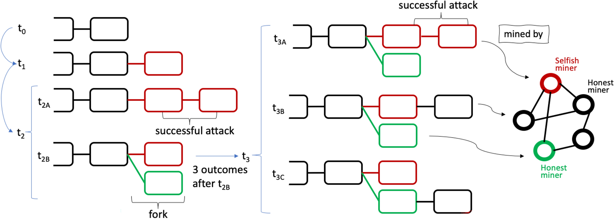

## Table of Contents

## What is selfish mining in the context of blockchain technology?

Selfish mining is a strategy in blockchain technology where a miner or a group of miners keep their mined blocks secret instead of sharing them with the network right away. Normally, when miners find a new block, they broadcast it to the network so everyone can see it and add it to the blockchain. But in selfish mining, the miners hold onto their blocks and keep mining more blocks in secret. They only reveal their blocks when it benefits them, like when they have a longer chain than the public one. This can give them an unfair advantage and disrupt the fairness of the blockchain system.

The goal of selfish mining is to get more rewards than they would normally get. By keeping their blocks secret, selfish miners can sometimes make the rest of the network waste their efforts on a shorter chain. When the selfish miners finally reveal their longer chain, the network has to switch to it, and the selfish miners get the rewards for all the blocks in their chain. This can lead to centralization, where a few miners control most of the mining power, which goes against the decentralized nature of blockchain technology.

## How does selfish mining differ from regular mining?

In regular mining, when a miner finds a new block, they share it with everyone on the network right away. This helps keep the blockchain fair and open for everyone. All miners work together to add new blocks to the chain, and whoever finds a block first gets the reward. It's like a team effort where everyone can see what's happening.

Selfish mining is different because miners keep their new blocks a secret instead of sharing them. They keep mining more blocks in private and only show their blocks when it helps them get more rewards. This can trick other miners into wasting their work on a shorter chain. When the selfish miners reveal their longer chain, everyone has to switch to it, and the selfish miners get more rewards. This can make the blockchain less fair and more controlled by a few miners.

## What are the basic steps involved in a selfish mining attack?

In a selfish mining attack, miners first find a new block but instead of sharing it with everyone on the network, they keep it secret. They continue mining more blocks on top of their secret block, building their own private chain. This is different from regular mining where miners share their blocks as soon as they find them.

While the selfish miners are working on their private chain, the rest of the network is still mining on the public chain. If the selfish miners find another block before the public chain catches up, they keep adding to their private chain. But if the public chain starts to get close to the length of the private chain, the selfish miners will reveal their private chain. When they do this, everyone on the network has to switch to the longer chain, and the selfish miners get the rewards for all the blocks in their chain. This can give them more rewards than they would get with regular mining.

## What incentives do miners have to engage in selfish mining?

Miners have incentives to engage in selfish mining because it can help them earn more rewards than regular mining. In regular mining, miners share their blocks with the network right away and get a reward for each block they find. But with selfish mining, miners keep their blocks secret and only share them when they have a longer chain than the public one. This means they can get rewards for more blocks at once, which can be more than what they would get from sharing each block as they find it.

Another incentive is that selfish mining can give miners more control over the blockchain. When miners keep their blocks secret and then reveal a longer chain, it can make other miners waste their efforts on a shorter chain. This can help selfish miners gain a bigger share of the mining power and influence the blockchain more than they would with regular mining. This control can be appealing to miners who want to have more say in how the blockchain works.

## How does selfish mining affect the security of a blockchain?

Selfish mining can make a blockchain less secure. When miners keep their blocks secret and then show a longer chain, it can trick the rest of the network. Other miners might waste their time and energy working on a shorter chain that gets thrown away when the selfish miners reveal their longer chain. This can slow down the blockchain and make it easier for bad actors to take control.

If too many miners start doing selfish mining, it can also hurt the trust in the blockchain. People use blockchains because they are supposed to be fair and open for everyone. But selfish mining goes against this by letting some miners get more rewards and control. This can make people worried about using the blockchain and could lead to less security overall.

## What are the potential impacts of selfish mining on network consensus?

Selfish mining can mess up the way a blockchain agrees on things. Normally, everyone on the network works together to add new blocks to the chain. They all see the same blocks and agree on which ones to keep. But with selfish mining, some miners keep their blocks secret. This means the rest of the network might be working on a different chain. When the selfish miners show their longer chain, everyone has to switch to it. This can make it hard for the network to agree on what the real chain is.

If selfish mining happens a lot, it can make the blockchain less fair and less secure. People might start to trust the blockchain less because it's not working the way it should. If miners can get more rewards by keeping their blocks secret, it can make the whole system less stable. This can lead to more disagreements and fights over which chain is the right one. In the end, selfish mining can make it harder for the blockchain to keep everyone on the same page.

## Can you explain the mathematical model used to describe selfish mining?

The mathematical model for selfish mining was first explained by a group of researchers called Eyal and Sirer in 2014. They used a model to show how selfish mining can affect a blockchain. In their model, they looked at what happens when some miners keep their blocks secret instead of sharing them right away. They used math to figure out how often selfish miners can get more rewards than honest miners. The model showed that if selfish miners have more than a certain amount of the total mining power, they can earn more rewards than they would by mining honestly. This amount is usually around 33% of the total mining power, but it can change based on things like how fast blocks are found and how the network works.

This model helps us understand how selfish mining can mess up the fairness of a blockchain. It shows that selfish miners can get more rewards by keeping their blocks secret and then showing a longer chain. This can make other miners waste their time and energy on a shorter chain. The model also shows that selfish mining can lead to more centralization, where a few miners control most of the mining power. This goes against the idea of a decentralized blockchain where everyone has an equal chance to mine and earn rewards. By using this model, we can see how selfish mining can hurt the security and trust in a blockchain.

## What are some real-world examples or case studies of selfish mining?

One real-world example of selfish mining happened with the [cryptocurrency](/wiki/cryptocurrency) Bitcoin Gold in 2018. Some miners started using selfish mining to get more rewards. They kept their blocks secret and only showed them when they had a longer chain. This made other miners waste their time on a shorter chain. As a result, the selfish miners got more rewards than they should have. This caused a lot of problems for Bitcoin Gold, and people started to trust it less.

Another case study is from the Ethereum Classic network in 2019. A group of miners used selfish mining to try to control the network. They kept their blocks secret and then showed a longer chain to get more rewards. This made the network less fair and less secure. It also showed how selfish mining can lead to more centralization, where a few miners have more power. This case study helped people see the dangers of selfish mining and how it can hurt a blockchain.

## How can blockchain networks detect and prevent selfish mining?

Blockchain networks can detect selfish mining by watching for strange patterns in how blocks are made and shared. If some miners are keeping their blocks secret and then showing a longer chain, it can make the network work slower and less fair. By looking at things like how often blocks are found and how long they take to be shared, the network can spot selfish mining. Special tools and software can help with this by keeping an eye on the network and warning people if something doesn't look right.

To prevent selfish mining, blockchain networks can change their rules to make it harder for selfish miners to get more rewards. One way is to make it so that miners who share their blocks quickly get extra rewards. This can make selfish mining less appealing because honest miners get more for being fair. Another way is to use special algorithms that can tell when selfish mining is happening and stop it before it causes too much harm. By making these changes, blockchain networks can stay fair and secure, and keep everyone working together the right way.

## What are the latest research findings on the effectiveness of selfish mining strategies?

Recent research has shown that selfish mining can still be a problem for blockchains, but it's getting harder to pull off. Scientists have been looking at new ways to stop selfish mining and make blockchains safer. They found that if a blockchain uses special rules to reward miners who share their blocks quickly, it can make selfish mining less effective. Also, new tools and software can help spot selfish mining faster, so the network can take action before it causes too much harm.

Another important finding is that selfish mining can lead to more centralization, where a few miners control most of the power. This goes against the idea of a fair and open blockchain. Researchers are working on ways to keep the network decentralized and make sure everyone has an equal chance to mine and earn rewards. By understanding how selfish mining works and finding ways to stop it, scientists are helping to keep blockchains secure and trustworthy for everyone.

## How do different blockchain protocols (e.g., Bitcoin, Ethereum) handle the risk of selfish mining differently?

Different blockchain protocols like Bitcoin and Ethereum have their own ways to deal with the risk of selfish mining. Bitcoin uses a system called Proof of Work, where miners solve hard math problems to add new blocks. If a selfish miner tries to keep their blocks secret, it can take a lot of time and energy. Bitcoin also has a rule that says if two miners find a block at the same time, the network will choose the one that most miners agree on. This makes it harder for selfish miners to trick the network and get more rewards.

Ethereum, on the other hand, is moving from Proof of Work to a new system called Proof of Stake. In Proof of Stake, miners are chosen to add new blocks based on how many coins they have, not how much energy they use. This makes selfish mining less of a problem because it's harder for miners to control the network just by keeping their blocks secret. Ethereum also has special rules to reward miners who share their blocks quickly, which can help stop selfish mining before it starts. Both Bitcoin and Ethereum are always working to make their networks safer and fairer for everyone.

## What future developments in blockchain technology might mitigate the risks associated with selfish mining?

Future developments in blockchain technology could help stop selfish mining by making new rules that reward miners for being honest. One idea is to give extra rewards to miners who share their blocks quickly with everyone. This would make selfish mining less appealing because honest miners would get more for playing fair. Another idea is to use special computer programs that can spot selfish mining faster. These programs could warn the network when something doesn't look right, so everyone can take action before selfish miners cause too much harm.

Another way to fight selfish mining is by making blockchains more decentralized. This means making sure that no single group of miners can control the network. New technology could help spread the mining power more evenly among everyone, so it's harder for selfish miners to take over. By working on these ideas, blockchain networks can stay fair and secure, and keep everyone working together the right way.

## References & Further Reading

[1]: Eyal, I., & Sirer, E. G. (2014). ["Majority is not Enough: Bitcoin Mining is Vulnerable."](https://dl.acm.org/doi/10.1145/3212998) Financial Cryptography and Data Security.

[2]: Rosenfeld, M. (2011). ["Analysis of Bitcoin Pooled Mining Reward Systems."](https://arxiv.org/abs/1112.4980) arXiv preprint arXiv:1112.4980.

[3]: Courtois, N. F., Bahack, L. (2014). ["On Subversive Miner Strategies and Block Withholding Attack in Bitcoin Digital Currency."](https://arxiv.org/abs/1402.1718) IACR Cryptology ePrint Archive.

[4]: Bonneau, J., Miller, A., Clark, J., Narayanan, A., Kroll, J. A., & Felten, E. W. (2015). ["SoK: Research Perspectives and Challenges for Bitcoin and Cryptocurrencies."](https://ieeexplore.ieee.org/document/7163021) 2015 IEEE Symposium on Security and Privacy.

[5]: Narayanan, A., Bonneau, J., Felten, E., Miller, A., & Goldfeder, S. (2016). ["Bitcoin and Cryptocurrency Technologies."](https://press.princeton.edu/books/hardcover/9780691171692/bitcoin-and-cryptocurrency-technologies) Princeton University Press.