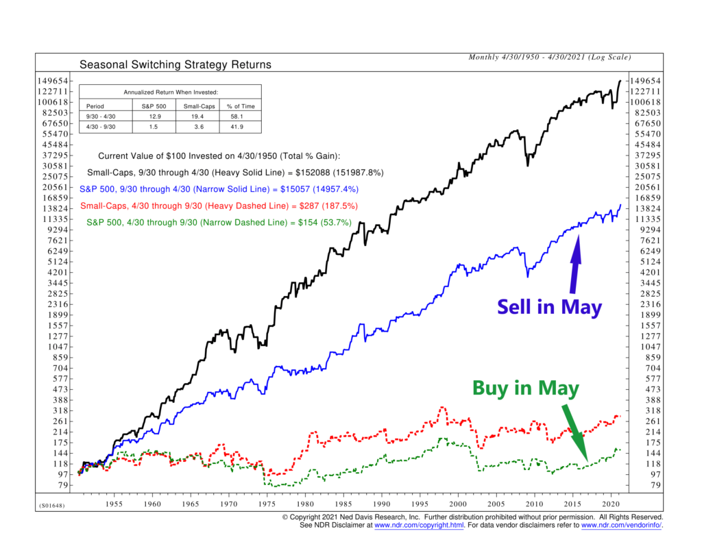

## Table of Contents

## What does the phrase 'Sell in May and Go Away' mean?

The phrase 'Sell in May and Go Away' is a well-known saying in the world of investing. It suggests that investors should sell their stocks in May and not buy again until after the summer. The idea behind this advice is that the stock market tends to perform worse during the summer months, from May to October, compared to the winter months.

This saying is based on historical data that shows the stock market often has lower returns during the summer. However, it's important to remember that this is just a general pattern and not a rule that always holds true. Many experts advise against following this strategy blindly because the stock market can be unpredictable, and there can be good opportunities to make money even during the summer months.

## Where did the 'Sell in May and Go Away' saying originate?

The saying 'Sell in May and Go Away' comes from an old English saying that goes, "Sell in May and go away, come back on St. Leger's Day." St. Leger's Day is a horse racing event that happens in September. The original saying was about wealthy people in England who would leave the city during the hot summer months to enjoy the countryside. They would sell their stocks before leaving and then buy them back when they returned in the fall.

Over time, people started using this saying in the world of investing. They noticed that the stock market often did not do as well during the summer months. So, the saying became a way to remind investors that it might be a good idea to sell their stocks in May and wait until later in the year to buy them again. However, it's important to remember that this is just a general pattern and not something that always happens.

## Is there historical data to support the 'Sell in May and Go Away' strategy?

Yes, there is some historical data that supports the 'Sell in May and Go Away' strategy. Studies have looked at stock market performance over many years and found that, on average, the market does better from November to April than from May to October. For example, research on the U.S. stock market shows that stocks often go up more during the winter months than during the summer months.

However, this pattern does not happen every year. Some summers, the stock market can do very well, and some winters, it can do poorly. So, while the data shows a general trend, it is not a sure thing. Investors need to think about many other things, like the overall economy and what is happening in the world, before deciding to follow this strategy.

## How does the 'Sell in May and Go Away' strategy apply to different markets?

The 'Sell in May and Go Away' strategy is mostly talked about when it comes to the U.S. stock market, but people have looked at it in other markets too. In the UK, where the saying first came from, studies have found that the stock market often does better from November to April than from May to October. This is similar to what happens in the U.S. In other countries, like Australia and Canada, some research has also shown that the stock market can have weaker performance during the summer months.

However, the strategy does not work the same way in every market. For example, in some emerging markets, the pattern might not be as clear or might even be the opposite. Also, different types of investments, like bonds or commodities, might not follow the same seasonal patterns as stocks. So, while the 'Sell in May and Go Away' idea can be useful to think about, it's important for investors to look at the specific market and type of investment they are dealing with before deciding to follow this strategy.

## What are the potential benefits of following the 'Sell in May and Go Away' advice?

Following the 'Sell in May and Go Away' advice can help investors avoid some of the ups and downs that often happen in the stock market during the summer. By selling stocks in May and waiting until later in the year to buy them back, investors might miss out on times when the market goes down. This can help protect their money and make them feel more secure about their investments.

Another benefit is that it can give investors a chance to take a break from watching the stock market all the time. During the summer, people often have other things they want to do, like going on vacation or spending time with family. By selling their stocks in May, investors can enjoy their summer without worrying about what the market is doing every day.

## What are the risks and drawbacks of adhering to the 'Sell in May and Go Away' strategy?

One big risk of following the 'Sell in May and Go Away' strategy is that you might miss out on big gains in the stock market during the summer. Even though the market can be slower in the summer, there are times when it goes up a lot. If you sell your stocks in May and the market does well in June, July, or August, you won't make any money from those gains. This can be frustrating and might make you lose out on good opportunities.

Another drawback is that this strategy is based on a general pattern that doesn't always happen. The stock market can be unpredictable, and just because it has done something in the past doesn't mean it will do the same thing every year. If you always sell your stocks in May without thinking about what's happening in the economy or the world, you might make a bad decision. It's important to look at all the information and not just follow a saying without thinking about it.

## How can an investor implement the 'Sell in May and Go Away' strategy in their portfolio?

To use the 'Sell in May and Go Away' strategy, an investor would sell all their stocks in May. They would then wait until the end of October or the beginning of November to buy stocks again. This means they would not be in the stock market during the summer months, from May to October. By doing this, they hope to avoid any big drops in the stock market that sometimes happen during the summer.

However, before selling all their stocks, an investor should think about their overall investment plan. They should consider if they can afford to be out of the market for several months. They should also look at what is happening in the economy and the world to see if it makes sense to sell their stocks right now. Just because the saying suggests selling in May does not mean it is always the best thing to do. An investor needs to think about all these things and make a smart decision based on their own situation.

## Are there specific sectors or stocks that are more affected by the 'Sell in May and Go Away' phenomenon?

Some sectors and stocks can be more affected by the 'Sell in May and Go Away' phenomenon than others. Sectors that are more sensitive to economic changes, like consumer discretionary and technology, might see bigger ups and downs during the summer months. These sectors often do well when the economy is growing but can struggle if there are worries about a slowdown. So, if an investor is thinking about selling in May, they might want to look closely at stocks in these sectors.

On the other hand, sectors like utilities and consumer staples, which are more stable and less affected by economic changes, might not see as much of a difference during the summer. These sectors often provide things that people need no matter what the economy is doing, like electricity or food. So, stocks in these sectors might not drop as much in the summer and could be a safer bet for investors who want to stay in the market.

## How does the 'Sell in May and Go Away' strategy perform during different economic cycles?

The 'Sell in May and Go Away' strategy can work differently depending on what is happening in the economy. During good times, when the economy is growing and people are spending money, the stock market might still go up even in the summer. If an investor sells all their stocks in May during a strong economy, they might miss out on some good gains. So, in a growing economy, this strategy might not be the best choice because the market can keep doing well all year.

On the other hand, during tough economic times, like when there is a recession or people are worried about money, the stock market can be more likely to go down in the summer. In these situations, selling stocks in May and waiting until later in the year to buy them back might help an investor avoid some big losses. However, even during bad economic times, the market can have good days, so it's still important to think carefully before deciding to follow this strategy.

## What alternative strategies can investors use if they choose not to follow 'Sell in May and Go Away'?

If an investor decides not to follow the 'Sell in May and Go Away' strategy, they can look at other ways to manage their money. One option is to keep their money spread out in different types of investments all year. This can help them avoid big losses if the stock market goes down in the summer. They can have some money in stocks, some in bonds, and maybe some in other things like real estate or gold. By doing this, they can still make money even if the stock market does not do well during the summer months.

Another way is to keep a close eye on the market and make changes to their investments based on what is happening. If they see that the market is starting to go down in the summer, they can sell some of their stocks and buy safer investments. If the market starts to go up, they can buy more stocks. This takes more work and means they need to watch the market all the time, but it can help them make the most of their money no matter what time of year it is.

## How has the effectiveness of 'Sell in May and Go Away' changed over time, and why?

The effectiveness of the 'Sell in May and Go Away' strategy has changed over time because the stock market and the world have changed. In the past, the saying seemed to work pretty well. People noticed that the stock market often did not do as well during the summer months, so selling stocks in May and buying them back in the fall could help them avoid some losses. But as more people learned about this strategy and started using it, the pattern started to change. When lots of people sell their stocks at the same time, it can affect the market in ways that make the old pattern less clear.

Also, the world economy is more connected now than it used to be. Things that happen in one country can quickly affect the stock market in another country. This means that the summer months might not be as slow for the stock market as they used to be. There can be big events or news that make the market go up or down at any time of the year. So, while the 'Sell in May and Go Away' strategy might still work sometimes, it's not as reliable as it used to be. Investors need to think about what is happening in the world and the economy, not just follow an old saying.

## Can advanced statistical models or machine learning improve the timing and effectiveness of the 'Sell in May and Go Away' strategy?

Advanced statistical models and [machine learning](/wiki/machine-learning) can help make the 'Sell in May and Go Away' strategy work better. These tools can look at a lot of data from the past and find patterns that people might not see. They can also look at what is happening in the economy and the world right now to help decide if it's a good time to sell stocks in May. By using these tools, an investor might be able to time their selling and buying better, so they miss out on fewer good days in the market and avoid more of the bad days.

However, even with these smart tools, there are no guarantees. The stock market can be hard to predict, and things can change quickly. Machine learning can help make better guesses about what might happen, but it can't know for sure. So, while these tools can improve the strategy, investors still need to be careful and think about other things too. They should not just rely on a computer to make all their decisions for them.

## References & Further Reading

[1]: ["Seasonality in U.S. Stock Returns Over the Period 1926–2002"](https://link.springer.com/chapter/10.1007/978-3-030-98012-2_20) by Mark J. Haug and Mark Hirschey, Financial Analysts Journal.

[2]: ["Advances in Financial Machine Learning"](https://www.amazon.com/Advances-Financial-Machine-Learning-Marcos/dp/1119482089) by Marcos Lopez de Prado.

[3]: Bouman, S., & Jacobsen, B. (2002). ["The Halloween Indicator, 'Sell in May and Go Away': Another Puzzle."](https://papers.ssrn.com/sol3/papers.cfm?abstract_id=300700) American Economic Review.

[4]: ["Quantitative Trading: How to Build Your Own Algorithmic Trading Business"](https://github.com/LucindaYa/quant-resources/blob/master/Quantitative%20Trading%20How%20to%20Build%20Your%20Own%20Algorithmic%20Trading%20Business.pdf) by Ernest P. Chan.

[5]: ["Machine Learning for Algorithmic Trading"](https://github.com/PacktPublishing/Machine-Learning-for-Algorithmic-Trading-Second-Edition) by Stefan Jansen.