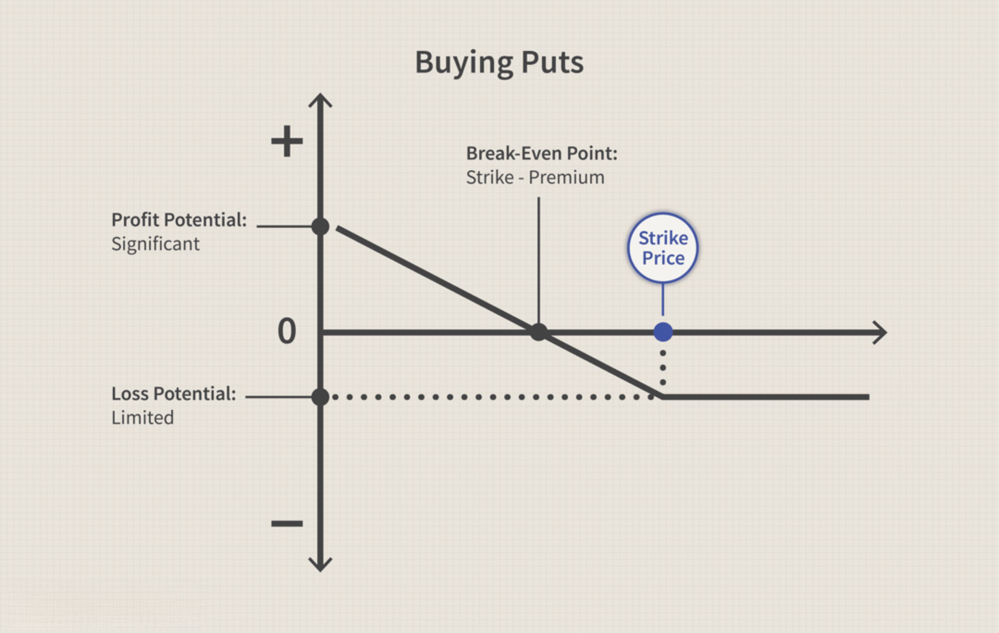

## Table of Contents

## What is a sell-off in financial markets?

A sell-off in financial markets happens when a lot of people start selling their investments like stocks, bonds, or other assets at the same time. This usually causes the prices of these investments to go down quickly. People might start selling because they're worried about the economy, or because they think the value of their investments will drop soon.

When a sell-off happens, it can create a cycle where more people get scared and start selling too. This can lead to big drops in the market, sometimes called a market crash. But sell-offs don't always mean the market will keep going down. Sometimes, after a sell-off, the market can recover and prices can go back up if people start buying again.

## How does a sell-off differ from a market correction?

A sell-off and a market correction are both times when the prices of investments go down, but they happen for different reasons and in different ways. A sell-off is when a lot of people suddenly start selling their investments all at once. This can happen because of something that makes people worried, like bad news about the economy or a company. The quick selling makes the prices drop fast, and it can feel like a rush where everyone wants to sell before the prices go down even more.

A market correction, on the other hand, is when the prices of investments go down by a certain amount, usually around 10% or more, over a longer period of time. It's seen as the market fixing itself after prices have gone up too high. Corrections are more about the market getting back to what's considered a normal or fair price, and they happen more slowly than a sell-off. While a sell-off can be part of what leads to a market correction, a correction is more about the overall trend of the market adjusting over time.

## What are the common mechanisms that trigger a sell-off?

A sell-off can start because of many reasons. One big reason is bad news about the economy, like when people hear that a country might go into a recession or when important economic numbers are not as good as expected. Another reason is when there's bad news about a company, like if it doesn't make as much money as people thought it would or if something goes wrong with its business. Sometimes, even rumors or uncertainty can make people worried and start selling.

Another way a sell-off can happen is because of what other investors are doing. If big investors, like hedge funds or big banks, start selling their investments, smaller investors might get scared and start selling too. This can create a chain reaction where more and more people sell, making prices drop even faster. Also, if the market has been going up a lot for a long time, some investors might decide it's time to take their profits and sell, which can also trigger a sell-off.

Sometimes, things outside of the economy can cause a sell-off too. For example, big events like natural disasters, political changes, or global conflicts can make people worried about the future and start selling their investments. These events can shake people's confidence in the market and lead to quick selling.

## Can you explain the role of market sentiment in causing a sell-off?

Market sentiment is all about how people feel about the market. If people feel good and think the market will go up, they might buy more investments. But if they feel bad and think the market will go down, they might start selling their investments. This feeling can spread quickly from one person to another, and it can cause a sell-off. When a lot of people start feeling worried or scared at the same time, they might all decide to sell their investments, which makes the prices drop fast.

This can happen because of news or rumors that make people feel unsure about the future. For example, if there's news that a big company is not doing well, people might think other companies will have problems too. This worry can make them want to sell their investments to avoid losing money. When everyone starts selling because they're worried, it can turn into a big sell-off, where the prices of investments go down a lot in a short time.

## What economic indicators might signal an upcoming sell-off?

Some economic indicators can give clues that a sell-off might be coming. One big indicator is when the unemployment rate goes up suddenly. If more people are out of work, it can mean the economy is slowing down, and this can make investors worried. Another important sign is if the GDP growth rate drops a lot. GDP is like a report card for the whole economy, so if it's not growing as much as expected, people might start thinking the market will go down too.

Also, if inflation starts going up really fast, it can be a warning sign. High inflation can make things more expensive and can make people think their money won't be worth as much in the future. This can lead them to sell their investments. Another thing to watch is the yield curve. If it starts to invert, which means short-term interest rates are higher than long-term rates, it can be a big red flag that a sell-off might be on the way. These indicators can help people get ready for possible big changes in the market.

## How do institutional investors influence the start and spread of a sell-off?

Institutional investors, like big banks and hedge funds, have a lot of money and can move the market a lot. When they start selling their investments, it can make the prices go down. Other people who are watching the market might see these big investors selling and get scared. They might think something bad is going to happen and start selling their own investments too. This can make the sell-off spread quickly because everyone is reacting to what the big investors are doing.

Sometimes, these big investors use special strategies to try to make money from a sell-off. They might sell a lot of investments on purpose to make the prices go down even more. This can make the sell-off worse and last longer. When smaller investors see the prices dropping fast, they might panic and sell their investments too, which helps the sell-off spread even more. So, what the big investors do can really affect how a sell-off starts and grows.

## What are some historical examples of significant sell-offs and their impacts?

One big sell-off happened in October 1987, known as Black Monday. On that day, the stock market in the United States dropped a lot, losing about 22% of its value in just one day. People were worried because of rising interest rates and other economic problems. This sell-off spread to other countries too, and it made people all over the world scared about their money. After Black Monday, governments and financial groups made new rules to try to stop such big sell-offs from happening again.

Another big sell-off happened in 2008, during the financial crisis. It started with problems in the housing market and spread to the whole economy. Banks and big financial companies were in trouble, and this made people very worried. The stock market lost a lot of value, and many people lost their jobs and their savings. Governments had to step in with big plans to help fix the economy. This sell-off showed how connected everything is and how one problem can lead to a big mess.

In March 2020, there was another big sell-off because of the COVID-19 pandemic. As the virus spread, people got scared about what it would do to the economy. Many businesses had to close, and people couldn't go to work. The stock market dropped a lot in a short time, and it made a lot of people worried about their money. But after a few months, the market started to recover as governments and businesses found ways to deal with the crisis. This sell-off showed how quickly things can change and how important it is to be ready for unexpected events.

## How can investors prepare for and mitigate the risks associated with a sell-off?

Investors can get ready for a sell-off by keeping an eye on the market and watching for signs that something might happen. They should pay attention to economic indicators like unemployment rates, GDP growth, and inflation. It's also a good idea to look at what big investors are doing, because they can start a sell-off. By staying informed, investors can see a sell-off coming and make plans to protect their money. One way to do this is by having a mix of different kinds of investments, like stocks, bonds, and maybe even some cash. This way, if the stock market goes down a lot, the other investments might not go down as much.

Another way to handle the risks of a sell-off is to have a plan and stick to it. This means deciding ahead of time what to do if the market starts to drop. Some investors might choose to sell some of their investments to avoid losing too much money. Others might decide to keep their investments and wait for the market to go back up. It's important not to panic and sell everything just because the market is going down. Sometimes, waiting it out can be the best choice. By having a clear plan and not making quick decisions based on fear, investors can better handle the ups and downs of the market.

## What technical analysis tools can be used to predict a sell-off?

Technical analysis tools can help investors see signs of a coming sell-off by looking at charts and patterns. One popular tool is the moving average, which shows the average price of a stock over a certain time. If the price of a stock goes below its moving average, it might mean the stock is starting to go down. Another tool is the Relative Strength Index (RSI), which measures how fast prices are going up or down. If the RSI is above 70, it might mean the stock is overbought and could soon go down. And if it's below 30, it might mean the stock is oversold and could go up.

Another helpful tool is the Bollinger Bands, which show lines above and below the price of a stock. If the price moves outside the upper band, it might be a sign that the stock is going to go down soon. And if it moves outside the lower band, it might be a sign that the stock is going to go up. Chart patterns like head and shoulders or double tops can also give clues about a sell-off. If these patterns show up on a chart, it might mean the price of the stock is going to drop. By using these tools, investors can try to see a sell-off coming and make plans to protect their money.

## How do regulatory changes or policy announcements contribute to sell-offs?

Regulatory changes or policy announcements can cause sell-offs because they can make people worried about the future. When the government or a big organization says they are going to change the rules, it can make investors think that their investments might not be worth as much. For example, if the government says they are going to raise taxes on companies, people might think those companies will make less money and sell their stocks. Or if a new rule makes it harder for banks to lend money, investors might worry about the whole economy and start selling their investments.

Sometimes, these changes can also make people unsure about what will happen next. If a new policy is announced but it's not clear how it will work, investors might get scared and decide to sell their investments just to be safe. This uncertainty can spread quickly and cause a lot of people to sell at the same time, leading to a big drop in prices. So, even though regulatory changes and policy announcements are meant to help the economy, they can sometimes cause big sell-offs if they make people worried or unsure.

## What are the psychological factors that can exacerbate a sell-off?

When people get scared or worried, it can make a sell-off worse. If someone hears bad news about the economy or a company, they might start to panic. This fear can spread quickly to other people, making more and more investors want to sell their investments. It's like a chain reaction where everyone is trying to get out before the prices drop even more. This fear can make the sell-off bigger and last longer because everyone is reacting to what other people are doing.

Another thing that can make a sell-off worse is when people feel like they don't know what's going to happen next. If there's a lot of uncertainty or if people can't predict what the market will do, they might decide to sell their investments just to be safe. This uncertainty can come from things like rumors, big events, or even just not understanding what new rules or policies mean. When people don't feel confident about the future, they might make quick decisions based on fear, which can make the sell-off spread even more.

## How do global events and geopolitical tensions lead to sell-offs in specific sectors or markets?

Global events and geopolitical tensions can make investors worried and start selling their investments in certain sectors or markets. For example, if there's a war or a big political change in a country, it can make people think that businesses in that country will have a hard time. This can lead to a sell-off in stocks from that country or in industries that depend on it, like oil and gas if the country is a big producer. When people are scared about what might happen, they might decide to sell their investments in those areas to avoid losing money.

These events can also affect specific sectors more than others. If there's a trade war between two big countries, it can make things like cars or electronics more expensive because of new taxes. Investors might then sell stocks in those industries because they think the companies will make less money. Even news about possible changes in international rules or agreements can make investors nervous and start selling, which can lead to big drops in prices in those sectors. So, global events and geopolitical tensions can really shake up certain parts of the market and cause sell-offs.

## How can algo trading strategies be used to manage sell-offs?

Algorithmic trading, a critical component in today's financial markets, offers several strategies to manage sell-offs effectively. These strategies are designed to navigate volatility and capitalize on both downward trends and sudden market declines.

### Algorithmic Trading Strategies During Market Declines

#### Role of Market Makers and High-Frequency Trading

Market makers play a crucial role in providing liquidity during sell-offs. These market participants use algorithmic strategies to offer continuous buy and sell quotes, cushioning the impact of sudden sell-offs and maintaining orderly markets. High-frequency trading (HFT), a subset of algorithmic trading, involves executing a large number of orders at extremely fast speeds. During market declines, HFT algorithms quickly react to price changes, often exacerbating price swings due to their sheer volume of trades and speed. However, these strategies can also fill the liquidity gap, stabilizing prices temporarily.

#### Hedging Strategies for Portfolio Protection

Algorithmic trading strategies frequently incorporate hedging to mitigate risk during sell-offs. One common approach is delta hedging, which involves buying or selling options to offset changes in an asset's price. The aim is to keep the portfolio's delta—the sensitivity to price changes—as close to zero as possible. Traders might use a combination of options contracts with the formula:

$$
\Delta_{\text{portfolio}} = \sum (\Delta_{\text{individual\ option}} \times \text{Number of options})
$$

Automated algorithms continuously adjust these positions to maintain a delta-neutral strategy, thereby protecting against rapid price movements.

### Risk Management Techniques

Algorithmic traders implement various risk management techniques to handle market volatility. Stop-loss orders are a basic method, allowing traders to automatically sell an asset when it reaches a predetermined price, thereby limiting losses. More sophisticated algorithms use real-time data analytics to assess market conditions and dynamically adjust trading parameters. These may involve [machine learning](/wiki/machine-learning) models that predict price trends and volatility shifts, enabling rapid recalibration of strategies to minimize downside risk.

### Practical Tips for Employing Algorithmic Strategies During Sell-Offs

For traders looking to leverage algorithmic strategies during sell-offs, the following tips are essential:

1. **Diversification of Algorithms**: Use a variety of algorithmic strategies to spread risk and capture different market opportunities. For example, combining momentum-based and mean-reversion strategies can help balance potential losses.

2. **Backtesting and Simulation**: Ensure thorough backtesting and simulation of trading algorithms under different market conditions. This process helps identify potential weak points in the strategy, providing insights to enhance performance during real sell-offs.

3. **Real-Time Monitoring and Adjustments**: Set up systems for real-time monitoring of trade executions and strategy performance. Automated alerts can prompt traders to adjust parameters swiftly in response to developing market scenarios.

4. **Leverage Technology and Infrastructure**: Invest in robust technological infrastructure to reduce latency and improve execution speed. This is crucial for algorithms that capitalize on the brief opportunities during rapid market declines.

By employing these strategies and continuously refining algorithms, traders can better manage the challenges of market sell-offs while positioning themselves to exploit potential opportunities. Algorithmic trading provides a flexible and dynamic toolset in the quest for stability and profitability amid market volatility.

## References & Further Reading

[1]: Harris, L. (2003). ["Trading and Exchanges: Market Microstructure for Practitioners."](https://www.amazon.com/Trading-Exchanges-Market-Microstructure-Practitioners/dp/0195144708) Oxford University Press.

[2]: Johnson, H., & So, E. (2012). ["Market Reactions to Unexpected Earnings Announcements: Evidence and Influence of Algorithmic Trading."](https://en.wikipedia.org/wiki/2012_Republican_Party_presidential_debates_and_forums) Journal of Finance, 67(4), 1573-1604.

[3]: Kirilenko, A. A., Kyle, A. S., Samadi, M., & Tuzun, T. (2017). ["The Flash Crash: High Frequency Trading in an Electronic Market."](https://onlinelibrary.wiley.com/doi/abs/10.1111/jofi.12498) Journal of Finance, 72(3), 967-998.

[4]: Chan, E. P. (2009). ["Algorithmic Trading: Winning Strategies and Their Rationale."](https://github.com/ftvision/quant_trading_echan_book) Wiley.

[5]: Aldridge, I. (2013). ["High-Frequency Trading: A Practical Guide to Algorithmic Strategies and Trading Systems."](https://www.amazon.com/High-Frequency-Trading-Practical-Algorithmic-Strategies/dp/1118343506) Wiley.