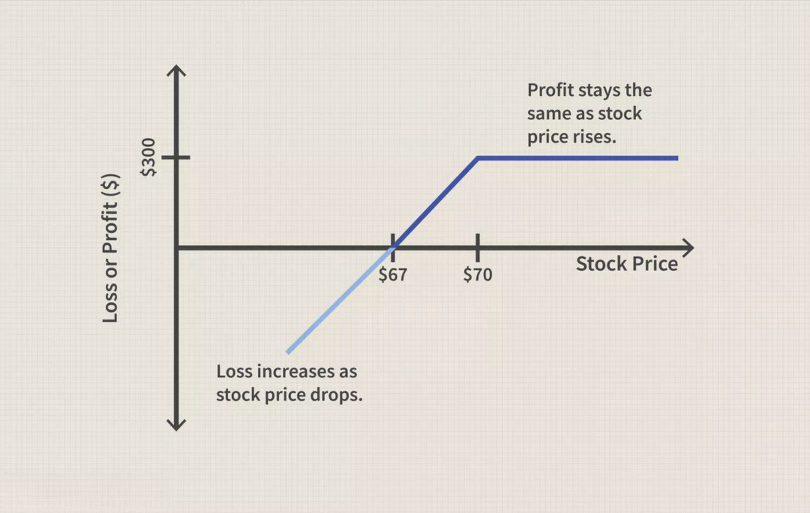

In today's fast-paced business environment, companies are continuously seeking methods to improve their sales strategies and achieve better results. The introduction of digital marketing tools and algorithmic trading has revolutionized how businesses operate, providing innovative ways to enhance sales and strategy implementation. These advancements allow businesses to target their audience more precisely and automate complex processes, leading to increased efficiency and effectiveness.

Digital marketing tools offer a suite of technologies that enable businesses to target specific demographics with unprecedented precision. Customer relationship management (CRM) systems, social media marketing platforms, and automated email campaigns have transformed the way companies interact with their customers. By using these tools, businesses can streamline their marketing efforts, improve customer engagement, and collect valuable data on consumer behavior.



Algorithmic trading, on the other hand, represents a significant leap in the financial aspects of business operations. It uses automated systems to execute trades based on pre-programmed strategies, minimizing human error and maximizing transaction speed and accuracy. This evolution has profoundly impacted industries reliant on timely and precise financial decisions, providing a competitive edge and optimizing resource management.

This article explores how the integration of marketing tools, business improvement strategies, sales techniques, and algorithmic trading can optimize overall business performance. By effectively leveraging these resources, businesses have the opportunity to achieve tangible advancements and maintain a competitive position in their respective markets. Through this exploration, we will provide insights into their practical applications, fostering a clearer understanding of their potential to drive business success.

## Table of Contents

## The Role of Marketing Tools in Business Enhancement

Marketing tools have undergone a substantial transformation, largely driven by technological advancements that now enable precise targeting and sophisticated analytics. This evolution facilitates a more strategic approach to marketing, allowing businesses to optimize their outreach and engagement efforts.

CRM (Customer Relationship Management) systems, social media platforms, and automated email software are at the forefront of this transformation. CRM systems, for example, provide a structured way to manage and analyze customer interactions and data throughout the customer lifecycle. By implementing CRM solutions, businesses can enhance customer retention and drive sales growth. These systems capture valuable customer data, enabling companies to segment their audience more accurately and tailor their marketing strategies to meet specific needs.

Social media platforms are another vital component, offering a direct channel to engage with customers in real-time. Platforms like Facebook, Instagram, and LinkedIn allow businesses to reach a broad audience and utilize advanced targeting options to engage specific demographics. This level of targeting is made possible by the extensive data these platforms collect, which sheds light on customer preferences and behaviors.

Automated email software further enhances marketing efforts by streamlining the communication process. Such software enables businesses to send personalized messages at scale, which can significantly boost engagement rates and conversion potential. Automation ensures that communication is timely and relevant, aligning with the customer’s journey. A well-timed email can nurture leads and encourage repeat business, adding value to the overall marketing strategy.

The integration of data-driven marketing tools allows businesses to make informed decisions that can positively influence their growth strategies. Analytics from these tools offer insights into what works and what doesn't, thus guiding strategic pivots and adjustments. For instance, leveraging data analytics enables the assessment of marketing campaign performance in real-time, leading to proactive adjustments that enhance ROI.

By utilizing these advanced tools, businesses are equipped to deliver more personalized customer engagements. A personalized approach not only caters to the individual needs of customers but also establishes a deeper connection, fostering customer loyalty and increasing the likelihood of conversions. Higher conversion rates can be achieved through targeted marketing efforts that resonate with the audience, driven by the insights gathered from CRM systems, social platforms, and email software.

In summary, the integration and utilization of sophisticated marketing tools can significantly enhance business outreach and efficiency. Through precise targeting, data-driven insights, and personalized engagement, businesses are better positioned to make decisions that foster growth and improvement. This improved strategy ultimately leads to higher conversion rates, reinforced customer relationships, and enhanced business performance.

## Developing a Robust Sales Strategy

An effective sales strategy forms the backbone of any successful business operation, systematically addressing all stages from lead generation to the final closing of deals. Central to this is the implementation of techniques such as value-based selling and consultative selling, which focus on meeting customer needs with precision and improving sales outcomes.

Value-based selling centers around highlighting the value of a product or service to the customer, rather than merely its features or price. This approach requires a deep understanding of the customer's specific challenges and how your offering presents a solution, thereby justifying its price based on delivered value. Consultative selling, on the other hand, involves a more interactive relationship with customers, where the salesperson acts as an advisor, guiding prospects in identifying their needs and aligning products accordingly.

The integration of data analytics and sales automation tools further refines these sales approaches. Through data analytics, businesses can glean insights from customer data, identifying trends and preferences that can shape personalized sales tactics. For example, predictive analytics can forecast customer behavior and preferences, allowing sales teams to tailor offers and communication strategies effectively. Sales automation tools streamline repetitive tasks, such as follow-ups and reporting, allowing teams to focus on strategy and client interaction, ultimately enhancing productivity and closing rates.

Aligning sales strategies with marketing efforts can significantly elevate the customer experience and foster business growth. Ensuring that sales and marketing teams share goals and insights leads to a cohesive strategy where leads are managed efficiently from first contact through to closing. This collaboration helps in crafting targeted campaigns that attract the right prospects and nurture them through carefully curated experiences, which are more likely to result in successful sales outcomes.

Case studies of companies effectively revamping their sales strategies through digital tools underscore the transformative impact of these techniques. For instance, Salesforce has demonstrated how businesses can effectively utilize CRM systems to streamline sales processes and improve customer relationships. By tracking customer interactions and automating sales tasks, companies like Salesforce have shown a notable increase in conversion rates and customer satisfaction.

In conclusion, developing a robust sales strategy is paramount for any company aiming to thrive in today's competitive market. By employing value-based and consultative selling techniques, bolstered by data-driven insights and automation tools, businesses can secure a competitive advantage that not only improves efficiency but also enhances customer engagement and satisfaction.

## Algorithmic Trading and Its Business Impact

Algorithmic trading, commonly referred to as algo trading, has revolutionized the way financial transactions are executed by leveraging computerized systems to [carry](/wiki/carry-trading) out complex and pre-programmed sets of instructions. This technological advancement enables the execution of trades at speeds and frequencies that surpass human capabilities, offering significant advantages in terms of efficiency and precision. Algo trading significantly minimizes human errors and emotional biases, which are often detrimental in trading activities, thereby enhancing decision-making processes through the analysis of extensive datasets.

One of the primary benefits of [algorithmic trading](/wiki/algorithmic-trading) is its ability to optimize investment strategies and risk management for businesses, particularly in the financial sector. The integration of automated systems allows for continuous monitoring and real-time adjustments to trading strategies, facilitating more informed and systematic decisions that align with predefined risk parameters and investment goals.

The efficacy of algorithmic trading lies in its capacity to process large volumes of data and identify patterns or trends that might not be apparent to human traders. By utilizing algorithms, businesses can achieve improved execution speed and accuracy, crucial in scenarios where market conditions are rapidly changing. According to empirical studies, these attributes contribute to a more efficient allocation of resources and can lead to a competitive edge in trading operations.

To successfully integrate algorithmic trading with existing business practices, organizations can adopt a hybrid approach that combines human oversight with automated processes. This can involve setting up algorithmic systems to handle routine transactions while reserving human expertise for more nuanced decision-making or strategic planning. Moreover, businesses can enhance their operational performance by developing proprietary algorithms that are fine-tuned to meet specific trading objectives or market conditions.

Python has emerged as a popular programming language for developing algorithms due to its extensive libraries and frameworks, such as NumPy, pandas, and scikit-learn, which facilitate data manipulation, analysis, and [machine learning](/wiki/machine-learning). An example of a simple moving average crossover strategy, which is a common algorithmic trading technique, can be implemented as follows:

```python
import pandas as pd

# Sample data of stock prices
data = {'Date': ['2023-01-01', '2023-01-02', '2023-01-03', '2023-01-04'],
        'Close': [100, 102, 101, 105]}

df = pd.DataFrame(data)
df['Date'] = pd.to_datetime(df['Date'])
df.set_index('Date', inplace=True)

# Calculate short-term and long-term moving averages
df['Short_MA'] = df['Close'].rolling(window=2).mean()
df['Long_MA'] = df['Close'].rolling(window=3).mean()

# Implement trading signals
df['Signal'] = 0
df.loc[df['Short_MA'] > df['Long_MA'], 'Signal'] = 1
df.loc[df['Short_MA'] < df['Long_MA'], 'Signal'] = -1

print(df)
```

This code generates buy, sell, or hold signals based on the crossover of short-term and long-term moving averages. Such strategies can be refined and scaled by incorporating advanced techniques and real-time data, further illustrating the strategic impact of algorithmic trading.

Through the strategic use of algorithmic trading, businesses not only streamline their trading operations but also enhance overall performance. As technology continues to advance, the potential for algo trading to contribute to business success and innovation remains substantial, driving competitive advantage in a dynamic marketplace.

## Integrating Marketing Tools and Algo Trading for Business Growth

Integrating marketing tools with algorithmic trading techniques can offer businesses innovative pathways for garnering insights into market trends and consumer behavior patterns. This combination allows companies to harness the full power of data synergy, leading to predictive and highly customized marketing strategies that enhance sales efficacy comprehensively.

The integration of these technologies facilitates a comprehensive understanding of both the market environment and individual customer propensities. Marketing tools such as Customer Relationship Management (CRM) systems, social media analytics, and predictive analytics platforms generate vast amounts of consumer data. When combined with algorithmic trading, which uses sophisticated mathematical models and computer programs to make high-speed trading decisions, this data can guide strategic marketing decisions by highlighting emerging market trends and consumer needs.

For instance, a business integrating these tools might notice through algorithmic analysis that a particular product feature is gaining traction in a specific demographic or geographical region. This insight allows the company to tailor its marketing campaigns to emphasize that feature, thereby increasing customer satisfaction and market presence.

Real-world examples demonstrate the successful integration of these technologies, illustrating their potential to transform business operations. Financial institutions, for instance, often employ algo trading combined with consumer data analytics to predict which investment products appeal to specific customer segments, thus optimizing both marketing strategies and revenue opportunities.

Ensuring seamless integration between marketing and trading technologies involves several strategic considerations. Businesses should focus on creating unified data processing frameworks that facilitate the exchange of insights between marketing and trading departments. This approach can lead to more effective decision-making processes and improved business outcomes. Establishing cross-functional teams that combine expertise from both marketing and trading domains can further enhance the integration effectiveness.

Moreover, these technologies play an essential role in sustaining a competitive advantage in today's dynamic market environments. By leveraging the predictive capabilities of algorithmic trading alongside advanced marketing analytics, companies can better anticipate market shifts and adapt their strategies accordingly. This foresight not only boosts operational efficiency but also enhances the customer experience, thereby fostering long-term loyalty and growth.

Overall, the fusion of marketing tools with algorithmic trading systems is a progressive step towards achieving superior business performance. By embracing these technological advancements, companies position themselves to harness the full potential of their data, creating a strategic advantage that is difficult for competitors to replicate.

## Conclusion

As digitalization continues to transform business landscapes, effectively leveraging technological advancements is crucial for achieving and maintaining success. Marketing tools, sales strategies, and algorithmic trading have each become instrumental in redefining how modern businesses operate and interact with their markets. 

Marketing tools, such as Customer Relationship Management (CRM) systems, automated email software, and social media analytics, empower businesses by providing deep insights into customer behavior and facilitating more targeted outreach. These tools enable more personalized customer engagements, which can significantly enhance conversion rates and customer retention.

Sales strategies have evolved with the integration of data analytics and automation, allowing businesses to refine their approaches and better address customer needs. Techniques like value-based and consultative selling have increasingly gained traction, offering a more nuanced way to engage with clients and secure sales. Aligning these strategies with marketing efforts not only enhances the customer experience but also fosters business growth by creating a cohesive customer journey from lead generation to closing deals.

Algorithmic trading offers businesses, especially in the financial sector, the ability to optimize investment strategies with remarkable efficiency and precision. By utilizing pre-programmed trading instructions, companies can execute trades swiftly, minimizing human error and emotional bias while handling vast datasets to make informed trading decisions.

The future of business growth lies in finding the right balance and integration of these powerful tools. By merging marketing insights with algorithmic efficiencies, businesses can gain a comprehensive view of market trends and customer behaviors, setting the stage for improved strategic decision-making. Companies that adapt and integrate these technologies into their operations are poised to achieve significant improvements in efficiency, customer engagement, and financial performance.

Further exploration and adaptation of these strategies are encouraged, setting businesses on the path toward sustainable success. As technology continues to evolve, so too will the opportunities for businesses to innovate and maintain a competitive edge in increasingly dynamic market environments.

## References & Further Reading

[1]: Bergstra, J., Bardenet, R., Bengio, Y., & Kégl, B. (2011). ["Algorithms for Hyper-Parameter Optimization."](https://dl.acm.org/doi/10.5555/2986459.2986743) Advances in Neural Information Processing Systems 24.

[2]: ["Advances in Financial Machine Learning"](https://www.amazon.com/Advances-Financial-Machine-Learning-Marcos/dp/1119482089) by Marcos Lopez de Prado

[3]: ["Evidence-Based Technical Analysis: Applying the Scientific Method and Statistical Inference to Trading Signals"](https://www.amazon.com/Evidence-Based-Technical-Analysis-Scientific-Statistical/dp/0470008741) by David Aronson

[4]: ["Machine Learning for Algorithmic Trading"](https://github.com/stefan-jansen/machine-learning-for-trading) by Stefan Jansen

[5]: ["Quantitative Trading: How to Build Your Own Algorithmic Trading Business"](https://www.amazon.com/Quantitative-Trading-Build-Algorithmic-Business/dp/1119800064) by Ernest P. Chan