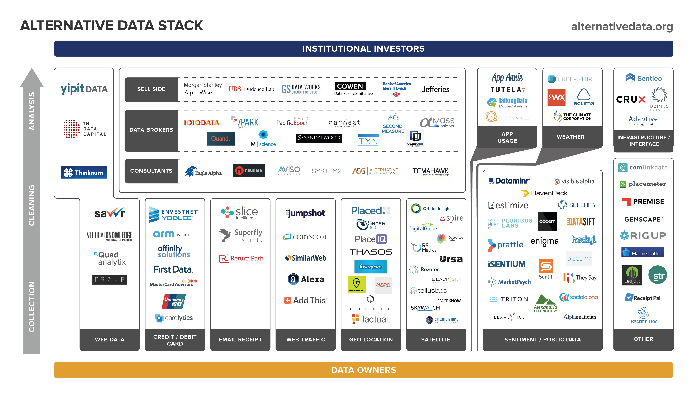

## Table of Contents

## What is sell-side alternative data?

Sell-side alternative data refers to the information that investment banks and financial institutions gather and sell to their clients, like hedge funds and asset managers. This data comes from sources outside of traditional financial statements and market data. It can include things like satellite images of parking lots to estimate store traffic, credit card transaction data, or even social media sentiment analysis. By using this data, investors hope to get an edge in understanding market trends and making better investment decisions.

The idea behind sell-side alternative data is to provide investors with insights that are not available through regular financial reports. For example, if a company's sales data is not yet public, alternative data might show increased activity at their stores, hinting at strong sales. Investment banks collect this data, analyze it, and then sell it to their clients. This can be very valuable, but it also comes with challenges, like making sure the data is accurate and keeping it confidential.

## How does sell-side alternative data differ from traditional financial data?

Sell-side alternative data is different from traditional financial data because it comes from unusual places, not just from a company's financial reports. Traditional financial data includes things like a company's earnings, balance sheets, and stock prices. This data is easy to find and everyone can see it. But alternative data might come from satellite pictures, credit card spending, or what people say on social media. This kind of data can give investors clues about what's happening with a company before it shows up in the regular financial reports.

The main difference is that alternative data can help investors see trends and changes faster than traditional data. For example, if more cars are seen in a store's parking lot from satellite images, it might mean the store is doing well, even if the official sales numbers aren't out yet. Investment banks gather this alternative data and sell it to their clients, like hedge funds. This can give those clients an advantage in making investment decisions. But, it's also harder to make sure alternative data is correct and to keep it secret, which can be a challenge.

## What are the common sources of sell-side alternative data?

Sell-side alternative data comes from many different places that are not the usual financial reports. One common source is satellite images. These can show how busy a store's parking lot is, which might tell investors if the store is doing well. Another source is credit card data, which can show how much people are spending at different stores or companies. This can give clues about how a business is doing before the official numbers come out.

Social media is another big source of alternative data. By looking at what people say online, investors can figure out how people feel about a company or its products. This is called sentiment analysis. Web traffic data is also used, showing how many people visit a company's website, which can hint at how interested people are in what the company is selling. All these sources give investors extra information that they can use to make better decisions.

Putting all these different pieces of data together can be tricky. It's important to make sure the data is correct and to keep it secret so other investors don't get the same information. But when done right, alternative data can give investors a big advantage in understanding what's happening in the market before everyone else knows.

## How can sell-side alternative data be used to gain a competitive edge in financial markets?

Sell-side alternative data can give investors a big advantage in financial markets by letting them see what's happening with companies before everyone else knows. For example, if satellite images show more cars in a store's parking lot, it might mean the store is doing well even before the official sales numbers come out. By knowing this early, investors can buy the company's stock before the price goes up because of good sales news. This kind of information can help investors make smarter choices and possibly make more money.

Another way alternative data helps is by giving a fuller picture of what's going on. Traditional financial reports only tell part of the story, but alternative data like credit card spending or social media sentiment can show what people are really doing and thinking. If lots of people are talking positively about a new product on social media, it might mean the product will do well, and investors can buy the company's stock before it becomes popular. But, it's important to make sure the data is correct and keep it secret so other investors don't get the same advantage.

## What are the challenges associated with collecting and analyzing sell-side alternative data?

Collecting and analyzing sell-side alternative data can be tricky. One big challenge is making sure the data is right. Since this data comes from unusual places like satellite images or social media, it can be hard to check if it's true. If the data is wrong, it can lead investors to make bad choices. Also, getting the data can be hard. For example, to use credit card data, you need to get permission from the companies that have it, and they might not want to share it.

Another challenge is keeping the data secret. If lots of people know the same information, it won't give anyone an advantage. So, it's important to keep alternative data private. This can be tough because the data often comes from many different sources, and each source needs to be protected. Plus, the people who collect the data need to be careful not to break any laws about privacy or data use.

Finally, analyzing the data can be complicated. It's not easy to turn things like satellite images or social media posts into clear information that investors can use. It takes special skills and tools to make sense of it all. And even when you do figure it out, the data might not always be useful for making decisions. Sometimes, it can be hard to tell if the patterns you see in the data really mean something important for the market.

## Can you explain the legal and ethical considerations of using sell-side alternative data?

Using sell-side alternative data comes with some legal and ethical issues that need to be thought about carefully. On the legal side, it's important to make sure that collecting and using this data doesn't break any laws. For example, if you're using credit card data, you need to have the right to use it. There are also rules about privacy that need to be followed. If the data comes from people's personal information, like what they post on social media, you have to be careful not to use it in a way that could hurt them or break privacy laws. Breaking these laws can lead to big problems, like fines or legal action.

On the ethical side, it's about doing the right thing. Even if something is legal, it might not be fair or right. For example, using data in a way that gives one group of investors a big advantage over others can seem unfair. It's also important to think about how collecting and using this data might affect the people it comes from. If people feel like their information is being used without their permission, they might not trust companies or the financial markets. So, it's good to be open about how the data is being used and to make sure it's used in a way that respects people's rights and feelings.

## How do financial institutions typically integrate sell-side alternative data into their investment strategies?

Financial institutions use sell-side alternative data to get a better understanding of what's happening in the market before everyone else knows. They might look at satellite images to see how busy a store's parking lot is, which can tell them if the store is doing well. Or they might check credit card data to see how much people are spending at different places. By using this kind of information, they can make smarter choices about which stocks to buy or sell. For example, if they see more cars at a store, they might buy the company's stock before the good sales news comes out and the price goes up.

To use this data well, financial institutions need to be careful. They have to make sure the data is correct because if it's wrong, it can lead to bad investment choices. They also need to keep the data secret so other investors don't get the same information. This can be hard because the data comes from many different places. Once they have the data, they use special tools and skills to turn it into useful information. This helps them see patterns and trends that they can use to make better investment decisions. But it's not always easy, and they have to think about the legal and ethical rules to make sure they're doing things the right way.

## What are some case studies where sell-side alternative data significantly impacted investment decisions?

One famous case where sell-side alternative data made a big difference was with a hedge fund that used satellite images to look at the parking lots of auto dealerships. They noticed that more cars were coming to the lots of a certain car company. This made them think that the company was selling more cars than people expected. So, they bought a lot of the company's stock before the official sales numbers came out. When the good sales news was released, the stock price went up a lot, and the hedge fund made a big profit.

Another example is when investors used credit card data to see how much people were spending at different stores. They found out that spending at a big retail company was going up a lot, even though the company's official reports didn't show it yet. This made them think the company was doing better than people thought. So, they bought the company's stock before everyone else knew about the good news. When the company finally shared its good sales numbers, the stock price went up, and the investors made money from their early investment.

These examples show how using different kinds of data can help investors see what's happening before everyone else knows. But it's important to make sure the data is right and to keep it secret so other investors don't get the same information. Also, investors need to follow the rules and make sure they're not doing anything wrong when they use this data.

## What technologies are most effective for processing and analyzing large volumes of sell-side alternative data?

To handle and make sense of big amounts of sell-side alternative data, financial institutions often use special computer programs and tools. One of the most helpful technologies is machine learning. This is a kind of artificial intelligence that can find patterns in data all by itself. For example, machine learning can look at lots of satellite images to see if there are more cars in store parking lots over time. It can also read through millions of social media posts to see what people think about a company or its products. This helps investors understand what's happening faster and make better decisions.

Another important technology is big data analytics. This is about using powerful computers to sort through huge amounts of information quickly. Big data tools can take in data from many different places, like credit card spending or website visits, and put it all together in a way that's easy to understand. This can show investors new trends or changes in how people are behaving. By using these technologies, financial institutions can turn raw data into useful insights that help them stay ahead in the market.

## How can the quality and reliability of sell-side alternative data be assessed and ensured?

To make sure sell-side alternative data is good and can be trusted, it's important to check where the data comes from. The sources should be reliable and the data should be collected in a way that follows the rules. For example, if you're using satellite images, you need to make sure the company providing the images is known for being accurate. Also, it's a good idea to compare the alternative data with regular financial data to see if it makes sense. If the alternative data shows something very different from the official numbers, it might be a sign that something is wrong.

Another way to check the quality of alternative data is by using technology to look at it closely. Tools like machine learning can help find mistakes or strange patterns in the data. It's also helpful to have experts who know a lot about the data look at it and make sure it's right. Keeping the data secret is important too, so only the people who need to see it can. By doing all these things, financial institutions can feel more sure that the alternative data they're using is good and can help them make smart investment choices.

## What future trends are expected to influence the use of sell-side alternative data in the financial sector?

In the future, more and more financial institutions will likely use sell-side alternative data because technology is getting better at handling big amounts of information. Tools like artificial intelligence and machine learning will become even more important. They can look at lots of different kinds of data, like satellite images or social media posts, and find patterns that people might miss. This will help investors see what's happening in the market faster and make better choices. Also, as more data becomes available, new kinds of alternative data will be used, like data from smart devices or even from space.

Another trend is that rules about using alternative data will probably get stricter. Governments and other groups might make new laws to make sure the data is used in a fair and right way. This means financial institutions will need to be very careful about where they get their data and how they use it. They'll need to make sure they're not breaking any privacy rules or using the data in a way that could hurt people. Even with these challenges, the use of alternative data is expected to grow because it can give investors a big advantage in understanding the market.

## How does sell-side alternative data contribute to the development of algorithmic trading and quantitative models?

Sell-side alternative data helps make algorithmic trading and quantitative models better by giving them more information to work with. These models use math and computer programs to decide when to buy or sell stocks. By adding alternative data, like satellite images of store parking lots or credit card spending, the models can see things that regular financial data might miss. For example, if more cars are seen at a store, the model might guess that the store is doing well and suggest buying the company's stock before the good sales news comes out. This extra information can make the models more accurate and help them find good investment chances faster.

Using alternative data in algorithmic trading and quantitative models also means that the models need to be updated and improved. The data can be messy and hard to understand, so the models need to use special tools like machine learning to make sense of it. This can be tricky, but it also means the models can keep getting better over time. As more kinds of alternative data become available, like data from smart devices or space, the models will be able to use even more information to make smart choices. This can help investors stay ahead in the fast-changing world of financial markets.

## References & Further Reading

[1]: ["Advances in Financial Machine Learning"](https://www.amazon.com/Advances-Financial-Machine-Learning-Marcos/dp/1119482089) by Marcos Lopez de Prado

[2]: ["Machine Learning for Algorithmic Trading"](https://github.com/PacktPublishing/Machine-Learning-for-Algorithmic-Trading-Second-Edition) by Stefan Jansen

[3]: ["Quantitative Trading: How to Build Your Own Algorithmic Trading Business"](https://books.google.com/books/about/Quantitative_Trading.html?id=j70yEAAAQBAJ) by Ernest P. Chan

[4]: ["Alternative Data in Portfolio Management"](https://www2.deloitte.com/us/en/insights/industry/financial-services/financial-services-industry-predictions/2023/embracing-alternative-data-for-investment-decisions.html) by the CFA Institute

[5]: Kearney, C., & Liu, S. (2014). ["Textual sentiment in finance: A survey of methods and models"](https://www.sciencedirect.com/science/article/pii/S1057521914000295). International Review of Financial Analysis, 33, 171-185.