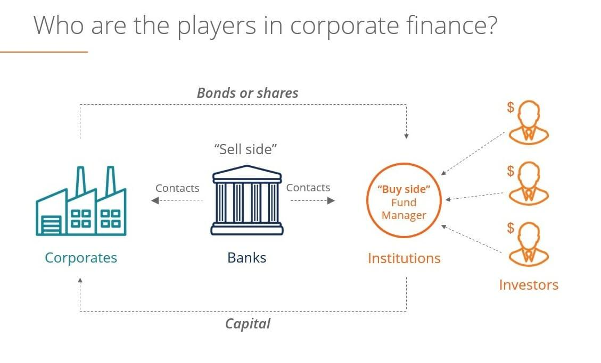

Financial markets function as platforms for buying and selling financial instruments, such as stocks, bonds, derivatives, and currencies. They are essential for channeling funds from savers to entities requiring capital, thus driving economic growth and innovation. The sell-side of these markets plays a pivotal role by facilitating transactions, providing liquidity, and ensuring market efficiency. This segment includes investment banks, market makers, and broker-dealers, who create and distribute financial products, offer market insights, and guide pricing mechanisms. Their operations help maintain the fluidity and stability of financial exchanges, which is crucial for investor confidence and market vitality.

Sell-side investment banking comprises a subset of the financial services industry that focuses on aiding issuers, such as corporations and governments, in raising capital and managing securities offerings. These banks serve as intermediaries, bridging the gap between issuers and investors. They underwrite initial public offerings (IPOs), offer advice on mergers and acquisitions (M&A), and develop innovative financial products to meet market demands. The sell-side plays a critical role in shaping the structure and dynamics of financial markets, influencing capital allocation, and impacting the flux of monetary resources.



Algorithmic trading is a transformative force within sell-side operations, leveraging mathematical models and advanced computing technology to execute trades with speed and precision. Algorithms are designed to optimize trade execution, manage risk, and capitalize on market opportunities, thus enhancing profitability and market position for sell-side firms. These automated systems enable traders to process vast amounts of market data in real-time, adapt to rapid market changes, and execute trades with minimal human intervention. The rise of algorithmic trading has significantly altered the landscape of sell-side investment banking, yielding greater efficiency, reduced transaction costs, and improved accuracy in trade execution.

As financial markets evolve, the integration of sophisticated algorithms continues to redefine sell-side strategies, presenting both opportunities and challenges. Through the application of cutting-edge technology, the sell-side is better equipped to navigate the complexities of modern finance and contribute to the seamless operation of global markets. The ongoing advancements in algorithmic trading represent a crucial frontier for sell-side firms, driving innovation and maintaining their pivotal role in the financial ecosystem.

## Table of Contents

## What is Sell-Side in Financial Markets?

The sell-side in financial markets is a segment of the financial industry that involves firms and individuals facilitating the trading and issuance of financial instruments and securities. These entities primarily engage in activities that support the buying and selling processes on behalf of institutional and retail investors. The sell-side includes various key players, such as investment banks, market makers, brokers, and dealers, each playing essential roles in maintaining market liquidity and efficiency.

Investment banks are prominent participants on the sell-side, providing a range of services including underwriting, advisory, and trading services. They assist companies in raising capital by issuing stocks and bonds, and they also facilitate mergers and acquisitions. Market makers, on the other hand, play a critical role in ensuring that securities can be bought and sold with ease by continuously offering buy and sell prices, thereby providing liquidity to the markets.

The relationship between sell-side and buy-side participants is symbiotic, with each depending on the other for successful market functioning. The buy-side comprises entities such as mutual funds, pension funds, hedge funds, and investment managers that invest in securities to achieve specific portfolio objectives. Sell-side firms provide these buy-side participants with research, advisory, and trading services, aiding them in optimizing their investment strategies. In return, buy-side firms provide [liquidity](/wiki/liquidity-risk-premium) and trading [volume](/wiki/volume-trading-strategy), which are essential for the sell-side's operations and revenue generation.

This interdependence ensures an efficient flow of information and capital within the financial markets, driving price discovery and market efficiency. By collaborating, the sell-side and buy-side help create a dynamic environment where assets are accurately priced based on available information, facilitating informed investment decisions and contributing to overall economic growth.

## Role of Investment Banking on the Sell-Side

Investment banking on the sell-side encompasses a range of functions critical to the structuring, issuance, promotion, and distribution of financial instruments. Sell-side investment banks primarily operate as intermediaries between securities issuers and the investing public, facilitating [capital raising](/wiki/hedge-fund-capital-raising) while ensuring the smooth functioning of capital markets.

A principal role of sell-side investment banks is to assist corporations, governments, and other entities in issuing financial instruments. This involves underwriting services, where banks purchase newly issued securities from the issuer and resell them to the public, either directly or through financial markets. Through this underwriting process, investment banks assume the risk of selling the securities at a profit, thus assuring issuers of timely access to capital. Moreover, investment banks offer advisory services on the structuring and pricing of financial instruments, tailoring offerings to meet market demand and regulatory considerations.

In addition to issuance, sell-side investment banks are pivotal in promoting and distributing securities. They leverage their extensive networks and market expertise to effectively market these financial instruments. Investment banks engage in roadshows and financial media to generate investor interest and create a robust market for new issues. Additionally, they provide research services that offer insights and analysis, guiding potential investors in making informed decisions about new securities.

Beyond these primary functions, investment banks enhance market efficiency and liquidity. Liquidity, the ability to buy or sell an asset without significantly affecting its price, is crucial for the functioning of financial markets. Through active trading and market-making activities, sell-side investment banks contribute to price discovery and the provision of liquidity. Market-making involves quoting both a buy and a sell price in a financial instrument, thereby ensuring that the market remains active and prices reflect current economic realities.

The impact of sell-side activities on market efficiency is profound. By offering insight and analysis, ensuring the availability of buyers and sellers, and reducing information asymmetries, investment banks enhance the efficiency with which markets allocate capital. This efficiency is paramount for the optimal functioning of financial markets, as it ensures that capital is deployed to its most productive uses, promoting economic growth and stability.

In summary, investment banks on the sell-side play an essential role in the financial market ecosystem. Their activities underpin the processes of capital raising, enhance market liquidity, and facilitate efficient market functioning. Through underwriting, promotion, and market-making, these institutions not only connect issuers with investors but also contribute significantly to the overall health and resilience of financial markets.

 to Algorithmic Trading

Algorithmic trading refers to the use of computer algorithms to automate the process of executing trading orders. By leveraging pre-programmed instructions, these algorithms can decide aspects of a trade such as timing, price, and quantity, usually with minimal human intervention. The concept of [algorithmic trading](/wiki/algorithmic-trading) emerged in the 1970s with the advent of electronic exchanges and has evolved significantly with technological advancements. Today, it accounts for a substantial portion of trades in major financial markets worldwide.

The benefits of algorithmic trading for the sell-side—comprising investment banks, brokers, and market makers—are manifold. First, it enhances the execution speed of transactions, which is crucial in volatile markets where price changes occur rapidly. This speed reduces slippage, the difference between the expected and actual execution prices of a trade. Second, algorithmic trading improves accuracy by executing trades according to pre-set parameters. It also minimizes human error, which can result from fatigue or emotional decision-making.

Furthermore, algorithmic trading allows sell-side firms to optimize transaction costs and manage large orders by breaking them into smaller trades across different times or markets, thereby reducing market impact. It aids in maintaining liquidity, as algorithms often provide continuous buy and sell orders for securities, ensuring more consistent market movements.

Several types of algorithmic trading strategies are employed by the sell-side to achieve these benefits:

1. **Market Making**: This strategy involves placing both buy and sell orders to profit from the bid-ask spread. Algorithms continually provide liquidity to the market, benefiting from small but consistent margins.

2. **Statistical Arbitrage**: This involves the simultaneous purchase and sale of an asset to profit from a difference in the price, often using models that identify short-term pricing inefficiencies.

3. **Execution-Based Strategies**: These include Volume-Weighted Average Price (VWAP) and Time-Weighted Average Price (TWAP), which are designed to minimize market impact. VWAP aims to execute orders close to the average price of a stock over a specified time horizon, weighted by volume. TWAP, on the other hand, spreads out orders evenly over a trading period.

4. **Trend Following**: These algorithms capitalize on perceived market movements by buying and selling based on directions indicated by technical analysis or trend data.

5. **Mean Reversion**: This strategy is based on the assumption that the price of a security will revert to its historical mean or average, providing opportunities for trading when prices deviate significantly from this mean.

The integration of advanced technologies, including [machine learning](/wiki/machine-learning) and [artificial intelligence](/wiki/ai-artificial-intelligence), continues to refine and expand these strategies, enhancing their effectiveness and adaptability in the ever-evolving landscape of financial markets.

## Leveraging Algorithms in Sell-Side Trading

Sell-side firms leverage algorithms to optimize trade execution, a critical component of modern financial markets. The primary objectives of using these algorithms include enhancing the efficiency of trade execution, minimizing transaction costs, and mitigating market impact. Algorithms enable sell-side firms to execute trades at optimal times and prices by analyzing real-time market data and considering various execution parameters.

Algorithms play a crucial role in reducing transaction costs and market impact. Transaction costs, comprising explicit costs like commissions and implicit costs like price slippage, are minimized by algorithms that determine the most cost-effective execution strategy. Market impact, the adverse effect of large trades on security prices, is mitigated by spreading trades over time or implementing stealth orders that are less noticeable. By employing advanced statistical and machine learning models, algorithms can predict market movements, identify liquidity hotspots, and adjust strategies in real-time.

Sell-side firms utilize a range of specific trading algorithms tailored to different execution needs. Volume-Weighted Average Price (VWAP) algorithms aim to execute orders in line with the average price of the security over a specific period, minimizing price deviations. VWAP is typically used when the goal is to minimize market impact rather than focusing solely on speed. Alternatively, Time-Weighted Average Price (TWAP) algorithms spread orders evenly throughout a set duration, maintaining a consistent order flow that aligns with the temporal distribution of market volume, thereby reducing the risk of significant price fluctuations due to large orders.

Here is a simple Python example illustrating how a TWAP algorithm might be implemented:

```python
def twap_order(total_quantity, interval, market_data):
    """
    TWAP (Time-Weighted Average Price) execution strategy.

    :param total_quantity: Total number of shares to buy/sell.
    :param interval: Time interval over which to execute the total order.
    :param market_data: List of tuples with (timestamp, price).
    :return: List of executed trades.
    """
    trades = []
    quantity_per_trade = total_quantity // len(market_data)

    for timestamp, price in market_data:
        trades.append({
            'timestamp': timestamp,
            'quantity': quantity_per_trade,
            'price': price
        })

    return trades

# Example market data with timestamps and prices
market_data_example = [
    ('09:00', 100.5),
    ('09:01', 100.7),
    ('09:02', 100.4),
    ('09:03', 100.6),
    ('09:04', 100.8),
]

# Executing a TWAP order
executed_trades = twap_order(total_quantity=1000, interval=4, market_data=market_data_example)
print(executed_trades)
```

This example demonstrates a simplified TWAP implementation, where a predetermined quantity of shares is executed over a specified period. While real-world implementations are more complex, incorporating factors such as market [volatility](/wiki/volatility-trading-strategies) and [order book](/wiki/order-book-trading-strategies) depth, this code snippet highlights the fundamental mechanics of how TWAP executes trades to align with average market conditions over time. Through such algorithmic strategies, sell-side firms can maintain competitiveness in an increasingly automated trading environment.

## Machine Learning in Sell-Side Algorithms

Machine learning significantly enhances sell-side algorithms by improving their accuracy and efficiency. These improvements are achieved through predictive analytics, which involves using historical data to forecast future market movements, thus enabling better trading decisions. Machine learning models, such as supervised and unsupervised learning algorithms, are commonly employed to identify patterns and trends in vast amounts of market data.

Predictive analytics in trading leverages machine learning to anticipate price movements by analyzing past data trends. One popular method is the implementation of time series forecasting models. These models, such as ARIMA (AutoRegressive Integrated Moving Average) and LSTM (Long Short-Term Memory networks), are particularly effective in recognizing temporal dependencies within financial data, making them suitable for predicting asset prices.

Supervised learning techniques like regression analysis and classification are extensively used to identify relationships between different market variables. For instance, linear regression models can predict continuous outcomes such as stock prices, while classification models, such as decision trees and support vector machines (SVM), are used to categorize market conditions into various states, aiding in decision-making processes.

Unsupervised learning, including clustering and dimensionality reduction, helps in organizing and interpreting large datasets without predefined labels. Techniques like K-means clustering can group similar trade signals or market conditions, enabling analysts to identify unusual patterns or anomalies that might indicate trading opportunities or risks.

Reinforcement learning, a branch of machine learning where [agents](/wiki/agents) learn optimal strategies through interactions with their environment, is also gaining traction in algorithmic trading. Techniques like Q-learning and deep [reinforcement learning](/wiki/reinforcement-learning) allow algorithms to adaptively learn trading policies that maximize returns or minimize risks in varying market conditions.

In practice, machine learning algorithms are integrated into trading platforms to refine the accuracy of sell-side algorithms. For example, a Python implementation might involve using the Scikit-learn library for regression or classification tasks, while TensorFlow or PyTorch can be utilized for building and training complex neural networks for deeper insights.

```python
from sklearn.linear_model import LinearRegression
from sklearn.model_selection import train_test_split
from sklearn.metrics import mean_squared_error
import numpy as np

# Sample code for Linear Regression in Python
# Generate some example data
X = np.random.rand(100, 1) * 10  # Feature: represents market indicators
y = 2.5 * X + np.random.randn(100, 1)  # Target: represents stock prices

# Split data into train and test sets
X_train, X_test, y_train, y_test = train_test_split(X, y, test_size=0.2, random_state=42)

# Create and train the model
model = LinearRegression()
model.fit(X_train, y_train)

# Predict and evaluate
predictions = model.predict(X_test)
print("Mean Squared Error:", mean_squared_error(y_test, predictions))
```

This example demonstrates how a basic linear regression model can be used to predict stock prices based on market indicators. More sophisticated models can incorporate additional features and complex network architectures to handle non-linear relationships and derive more precise trading strategies.

Machine learning not only automates the trading process but also enhances decision-making by providing data-driven insights, thus helping sell-side firms maintain a competitive edge in financial markets.

## Risks and Limitations of Sell-Side Trading Algorithms

Algorithmic trading has revolutionized the sell-side of investment banking by enabling efficient and high-speed trade execution. However, it comes with a set of risks and limitations that must be recognized and managed effectively.

One significant risk is associated with the over-reliance on algorithms for trading decisions. Algorithms, though sophisticated, can fall short in handling unpredictable market events termed as "black swan" events. These are rare occurrences that can trigger extreme market volatility, leading to substantial financial losses. Algorithms typically function based on historical data and pre-set parameters; hence, they might be ill-equipped to respond to anomalies that deviate significantly from past patterns. This highlights the limitations of purely algorithmic trading and underscores the necessity for human oversight to intervene when markets behave unexpectedly.

Compliance and regulatory challenges also pose significant hurdles for sell-side trading algorithms. Regulations such as the European Union's Markets in Financial Instruments Directive II (MiFID II) and the U.S. Securities and Exchange Commission (SEC) rules demand transparency and require algorithmic trades to comply with fair trading standards. These regulations aim to ensure that algorithms do not manipulate markets or execute trades in a way that disadvantages other market participants. Consequently, sell-side firms must ensure their algorithms are designed to meet regulatory standards, which can be a complex and resource-intensive task.

Additionally, there is the risk of "algorithmic biases". Machine learning models used in trading algorithms can inadvertently inherit biases present in historical data. Such biases can skew trading strategies, leading to suboptimal decision-making and increased exposure to market risks. Continuous testing and evaluation of algorithms are required to mitigate these biases and optimize trading strategies.

Finally, the "flash crash" phenomenon, wherein markets dive precipitously and recover within minutes, showcases another limitation. These events can be partly attributed to poorly designed algorithms executing a high volume of trades rapidly, thus exacerbating market volatility. 

Therefore, while algorithmic trading is essential for enhancing the efficiency of sell-side operations, firms must navigate its risks through robust risk management frameworks. This involves integrating human intelligence to complement algorithmic decision-making, adhering strictly to compliance requirements, and continuously updating algorithms to adapt to the dynamic nature of financial markets.

## Future Trends in Sell-Side Algorithmic Trading

The future of algorithmic trading within the sell-side domain is undergoing significant transformation driven by rapid technological advancements. These innovations are shaping new strategies and methodologies that enhance the efficiency and effectiveness of trading operations.

One of the most impactful trends is the integration of blockchain technology. Blockchain offers a decentralized and transparent ledger system which can increase the security and traceability of trades. For sell-side firms, this means that settlements can become faster and less prone to error and fraud. Blockchain’s ability to automate the reconciliation process through smart contracts can further streamline operations, reducing operational risks and costs.

Automation is another key trend reshaping the landscape. Emerging technologies such as artificial intelligence (AI) and machine learning (ML) provide substantial opportunities for sell-side firms to automate trading decisions and processes. Automated systems can analyze vast amounts of market data in real-time to make informed trading decisions with minimal human intervention. This not only improves the speed of transaction execution but also enhances the precision of trade strategies.

Algorithmic trading strategies are also becoming increasingly sophisticated thanks to advances in computational power. High-performance computing allows for the use of complex algorithms that can process large datasets quickly to identify trading opportunities. Machine learning models can adapt to changing market conditions by learning from historical and real-time data, thereby improving predictive accuracy in financial markets.

Integration with blockchain and advanced analytics is likely to become a standard feature of sell-side operations, suggesting a future where trades are executed rapidly, securely, and efficiently. As these technologies continue to evolve, sell-side firms will need to embrace innovation to maintain competitive advantage and respond to increasingly complex market dynamics.

The ongoing developments in technology underscore a fundamental shift towards greater efficiency and precision in sell-side trading. As algorithms become more integrated with emerging technologies, we can anticipate an era where trading strategies are not only faster and more cost-effective but also far more reliable and secure.

## Conclusion

Algorithmic trading has profoundly impacted sell-side functions by enhancing efficiency and accuracy in trade execution. The deployment of sophisticated algorithms allows sell-side firms to process vast amounts of market data rapidly, leading to improved decision-making and resource allocation. This technological evolution facilitates better liquidity provision and contributes to overall market efficiency by narrowing spreads and reducing trading costs for clients.

As algorithms continue to evolve, their strategic importance within sell-side operations becomes increasingly evident. The ongoing development in artificial intelligence and machine learning offers unprecedented opportunities for innovation. Algorithms equipped with predictive analytics can analyze market trends and investor behavior, enabling sell-side firms to tailor their strategies dynamically and remain competitive in an ever-changing market landscape.

Moreover, the integration of technology is shaping the future outlook of sell-side investment banking and trading. Advances in blockchain and automation promise to further disrupt traditional trading practices by offering enhanced transparency, security, and operational efficiency. As a result, sell-side institutions are investing in technology infrastructure and talent development to harness these advancements fully.

Looking forward, the role of sell-side algorithms is set to grow, transforming traditional investment banking and trading strategies. The ability to adapt and integrate cutting-edge technologies will be crucial for sell-side firms aiming to sustain a competitive edge while navigating the challenges of regulatory compliance and market volatility. The future of sell-side investment banking and trading lies in the continuous refinement of algorithmic approaches, ensuring they align with market needs and client expectations.

## References & Further Reading

[1]: Brogaard, J., Hendershott, T., & Riordan, R. (2014). ["High-Frequency Trading and Price Discovery."](https://academic.oup.com/rfs/article-abstract/27/8/2267/1582754) The Review of Financial Studies, 27(8), 2267-2306.

[2]: Farmer, J. D., & Skouras, S. (2013). ["An Empirical Study of Price Dynamics in the Oil Futures Market."](https://www.inet.ox.ac.uk/publications/an-ecological-perspective-on-the-future-of-computer-trading) arXiv preprint arXiv:1204.3667.

[3]: Aldridge, I. (2013). ["High-Frequency Trading: A Practical Guide to Algorithmic Strategies and Trading Systems."](https://www.amazon.com/High-Frequency-Trading-Practical-Algorithmic-Strategies/dp/1118343506) Wiley.

[4]: Kearns, M., Nevmyvaka, Y. (2013). ["Machine Learning for Market Microstructure and High-Frequency Trading."](https://www.cis.upenn.edu/~mkearns/papers/KearnsNevmyvakaHFTRiskBooks.pdf) Paper presented at the IEEE Conference on Neural and Evolutionary Computing.

[5]: Narang, A. (2013). ["Inside the Black Box: A Simple Guide to Quantitative and High Frequency Trading."](https://onlinelibrary.wiley.com/doi/book/10.1002/9781118662717) Wiley.