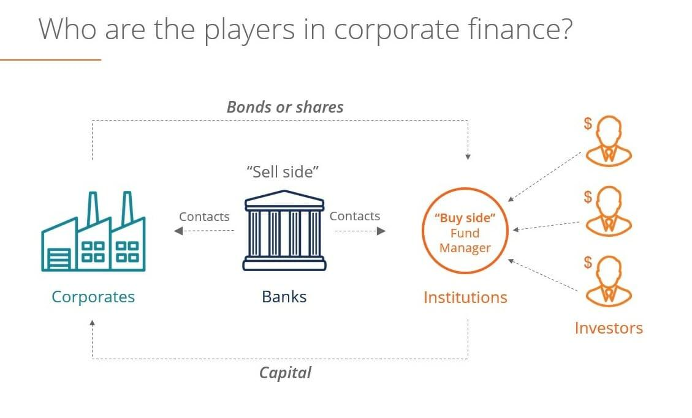

The landscape of financial brokerage has significantly transformed with the introduction of sell-side algorithmic trading to financial markets. Sell-side entities, encompassing investment banks, brokers, and dealers, manage transactions on behalf of clients, providing essential services such as research, trading strategies, and liquidity. The execution of these services has become more sophisticated with the use of algorithmic trading, which employs complex algorithms to automate and optimize the process of executing trades with precision and efficiency.

Algorithmic trading revolutionizes traditional practices by leveraging technology to handle vast amounts of data and execute trades at unprecedented speeds. This innovation enhances market efficiency, as trades are executed quickly and at optimal prices, reducing the costs associated with manual trading methods. Furthermore, algorithms help in removing the emotional biases inherent in human decision-making, thus fostering more consistent and objective trading strategies.



This article explores the critical aspects of sell-side trading algorithms, examining their strategic implications within the financial industry. As these technologies continue to evolve, they not only increase the effectiveness and profitability of sell-side operations but also influence the broader dynamics of financial markets.

## Table of Contents

## Understanding Sell-Side in Financial Markets

Sell-side firms hold a crucial position in financial markets by facilitating market transactions and ensuring liquidity. These entities consist of investment banks, brokers, and dealers, which are fundamental to the seamless operation of markets. Their primary role is to manage transactions on behalf of clients, which encompasses a wide array of services, including executing trades, underwriting new securities, and providing bespoke advisory services. 

Investment banks on the sell-side are known for their ability to create financial products. This involves structuring and distributing securities such as stocks, bonds, and derivatives, which are then sold to investors. For instance, during an initial public offering (IPO), investment banks underwrite the issuance by purchasing all the new shares and subsequently selling them to the public. This process not only aids in raising capital for companies but also injects liquidity into the financial system.

Moreover, sell-side firms offer vital market insights and pricing strategies that help clients make informed decisions. By conducting thorough research and analysis, they provide forecasts and recommendations regarding security valuations, market trends, and economic predictions. These insights are pivotal for clients seeking to optimize their investment strategies and for the broader market to function efficiently with accurate price discovery.

Brokers and dealers also play significant roles by acting as intermediaries between buyers and sellers. Brokers facilitate trades on behalf of their clients, charging a commission for their services, while dealers trade securities for their own accounts, profiting from the spread between buying and selling prices. By performing these roles, they contribute significantly to market [liquidity](/wiki/liquidity-risk-premium), which is essential for efficient trading environments where assets can be bought and sold promptly without causing drastic price changes.

In summary, sell-side entities are indispensable to the functionality and efficiency of financial markets. Their activities ensure that liquidity is maintained, price discovery is accurate, and markets operate smoothly and effectively.

## The Role of Algorithmic Trading in Sell-Side Operations

Algorithmic trading utilizes sophisticated computer algorithms to execute trades by adhering to pre-established criteria, thereby optimizing the trading process. The automation of trade execution is a fundamental benefit, significantly accelerating the speed at which trades are completed. Human intervention, often slower and more prone to error, is minimized. This not only facilitates increased trading [volume](/wiki/volume-trading-strategy) but also enhances the precision of transactions.

Cost reduction is another major advantage of [algorithmic trading](/wiki/algorithmic-trading). By automating routine tasks, sell-side firms can minimize the operational costs associated with manual trade execution. Algorithms are designed to identify the most cost-effective strategies by considering factors such as timing, pricing, and volume. This leads to reduced bid-ask spreads and transaction costs, which are vital for maintaining competitive advantage and profitability.

Market accuracy is improved through the use of algorithmic trading as well. Advanced trading algorithms can analyze vast amounts of market data in real-time, allowing sell-side firms to make informed trading decisions quickly. The algorithms are typically programmed to respond to intricate market signals and execute trades at opportune moments based on predefined conditions. This enhances the ability of sell-side firms to provide liquidity and maintain market stability, especially during periods of high [volatility](/wiki/volatility-trading-strategies).

The transformation brought about by algorithmic trading extends to the overall efficiency and profitability of sell-side operations. By automating labor-intensive processes, firms can allocate resources to more strategic activities, such as developing sophisticated trading strategies and conducting in-depth market research. The improved efficiency not only increases trading volumes but also enables firms to react swiftly to market changes, thereby exploiting short-term market inefficiencies for profit.

In summary, algorithmic trading is a critical component of modern sell-side operations, offering enhanced execution speed, reduced costs, and improved market accuracy. These advancements have resulted in a substantial transformation of sell-side practices, driving both increased efficiency and profitability in financial markets.

## Machine Learning in Sell-Side Algorithmic Trading

Machine learning has revolutionized the capabilities of sell-side algorithmic trading, notably enhancing the predictive accuracy of trading algorithms. Through the application of sophisticated algorithms, [machine learning](/wiki/machine-learning) enables the detailed analysis of extensive datasets, promoting the identification of patterns and trends within financial markets. This advancement empowers sell-side firms to better forecast market dynamics and optimize trading decisions.

One of the key contributions of machine learning to trading is its ability to process and learn from vast amounts of historical and real-time market data. Techniques such as supervised learning, unsupervised learning, and [reinforcement learning](/wiki/reinforcement-learning) are implemented to extract meaningful insights and generate predictive models. For example, supervised learning algorithms can be trained on historical price data and associated features to predict future price movements, while unsupervised learning can identify hidden structures in data without predefined labels.

Consider the use of a linear regression model, a common supervised learning technique, where the relationship between a dependent variable $Y$ (such as stock prices) and one or more independent variables $X_1, X_2, \ldots, X_n$ (such as trading volume, historical prices, etc.) is modeled as:

$$
Y = \beta_0 + \beta_1X_1 + \beta_2X_2 + \cdots + \beta_nX_n + \epsilon
$$

Here, $\beta_0, \beta_1, \ldots, \beta_n$ are the coefficients determined during the training, and $\epsilon$ represents the error term. By minimizing this error, the model 'learns' to predict the dependent variable accurately based on the independent variables.

Moreover, real-time data integration further augments the effectiveness of these models. By continuously updating the input data, machine learning systems can dynamically adapt to the latest market conditions, offering timely insights that are crucial for decision-making and risk management. This capability is especially valuable in the fast-paced financial markets where information is often rapidly changing and time-sensitive.

Additionally, the deployment of [deep learning](/wiki/deep-learning), a subset of machine learning, has made significant strides in processing unstructured data such as text from news articles or social media, which can provide sentiment analysis and enhance traditional quantitative datasets. The adaptability and comprehensive analysis provided by machine learning models support the sell-side in mitigating risks and exploiting opportunities through informed trading strategies. 

Overall, the integration of machine learning within sell-side algorithmic trading represents a significant advancement, offering enhanced predictability, reduced transaction costs, and improved decision-making processes, enabling firms to navigate and capitalize on the complexities of modern financial markets.

## Risks and Limitations of Sell-Side Trading Algorithms

Sell-side trading algorithms have become integral tools for financial institutions, streamlining operations and enhancing the efficiency of trade executions. However, they pose a suite of risks and limitations that must be addressed to ensure their optimal performance and contribution to fair trading practices.

A primary concern is the over-reliance on algorithms, which can leave firms exposed during unpredictable market events. Such events can cause substantial deviations from anticipated market behavior, resulting in significant financial losses. For example, algorithmic trading can accelerate market disruptions, as seen in the 2010 Flash Crash, where rapid selling by algorithm-based systems contributed to a swift market downturn [1].

Navigating compliance and regulatory challenges is critical for firms utilizing these algorithms. Regulations, such as the European Union's Markets in Financial Instruments Directive II (MiFID II) and the U.S. Securities and Exchange Commission's rules, impose stringent requirements on algorithmic trading. These include maintaining comprehensive audit trails and ensuring algorithms are tested to prevent market abuse and ensure fair trading practices. Non-compliance can result in penalties and restrictions that can impact a firm's operations and reputation.

Algorithmic biases and technology failures introduce additional risks. Biases often stem from the data used to train machine learning models within these algorithms, leading to skewed predictions and trading decisions that may not reflect the true market conditions. Furthermore, operational risks associated with hardware and software failures can lead to costly trading errors and potential violations of compliance rules. An instance of this was the Knight Capital incident in 2012, where a software glitch caused a $440 million loss in just 45 minutes [2].

In conclusion, while sell-side trading algorithms provide significant benefits in terms of speed and efficiency, they are not without their challenges. Successfully managing these risks requires a robust framework for continuous monitoring, regular testing, and adherence to regulatory standards. As the reliance on technology increases, addressing these aspects becomes increasingly crucial for financial stability.

**References:**
1. Kirilenko, A., Kyle, A. S., Samadi, M., & Tuzun, T. (2017). The Flash Crash: High-frequency Trading in an Electronic Market. *Journal of Finance*, 72(3), 967-998.
2. U.S. Securities and Exchange Commission. (2012). Findings Regarding the Market Events of May 6, 2010: Report of the Staffs of the CFTC and SEC to the Joint Advisory Committee on Emerging Regulatory Issues.

## Future Trends in Sell-Side Algorithmic Trading

The future of sell-side algorithmic trading is being profoundly influenced by several emerging technologies, promising to enhance security, efficiency, and sophistication. One of the most transformative technologies is blockchain, which offers enhanced transactional security and transparency. Blockchain's decentralized nature ensures that trades are not only secure but also traceable and immutable, reducing the risk of fraud and errors. Smart contracts, a key feature of blockchain, automate the execution of contract terms without intermediaries, improving operational efficiency in trading processes.

Advancements in Artificial Intelligence (AI) are shaping increasingly sophisticated trading algorithms. AI enables algorithms to analyze vast amounts of market data and identify patterns that would be impossible for human traders to detect. Machine learning, a subset of AI, continuously improves trading strategy performance by learning from historical data patterns and adapting to new market conditions. This capability allows sell-side firms to forecast market trends more accurately, optimizing trade execution and portfolio management.

High-performance computing (HPC) is another technological advancement pushing the boundaries of algorithmic trading. HPC allows for the processing of complex computations at unprecedented speeds, enabling real-time data analysis and quicker decision-making. This is crucial for executing trades in milliseconds, often the difference between profit and loss in high-frequency trading scenarios.

There is also a continuous drive toward automation in sell-side trading operations. Automation streamlines processes, reduces operational costs, and minimizes human error. Innovative tech solutions are being integrated to create fully automated trading systems that can operate 24/7, providing liquidity and maintaining market efficiency.

Python continues to be a favored programming language in the development of these algorithms due to its extensive libraries for data analysis and machine learning, such as NumPy, pandas, and scikit-learn. Here is a simple example of how machine learning can be used to predict stock prices with Python:

```python
import pandas as pd
from sklearn.model_selection import train_test_split
from sklearn.linear_model import LinearRegression
from sklearn.metrics import mean_squared_error

# Load data
data = pd.read_csv('stock_prices.csv')

# Prepare features and target
X = data[['historical_price', 'trading_volume', 'market_sentiment']]
y = data['future_price']

# Split data into training and testing sets
X_train, X_test, y_train, y_test = train_test_split(X, y, test_size=0.2, random_state=42)

# Initialize and train the model
model = LinearRegression()
model.fit(X_train, y_train)

# Predict and evaluate
y_pred = model.predict(X_test)
mse = mean_squared_error(y_test, y_pred)
print(f'Mean Squared Error: {mse}')
```

This code demonstrates a simple linear regression model predicting future stock prices based on historical data, a basic approach that can be expanded with more sophisticated machine learning models to achieve greater predictive power.

The integration of these technologies aims to create a more dynamic, responsive, and secure trading environment. As technology continues to evolve, sell-side firms will be able to leverage these tools to improve their market strategies and maintain a competitive edge.

## Conclusion

Sell-side algorithmic trading has fundamentally redefined the landscape of financial market operations. The deployment of complex algorithms in trade execution has not only accelerated transaction processes but has also enhanced accuracy and reduced costs, thereby playing a strategic role in the overall market dynamics. These algorithms enable sell-side firms—such as investment banks and brokers—to efficiently manage high volumes of trades while providing valuable liquidity to the markets.

The integration of emerging technologies with algorithmic trading strategies is becoming increasingly vital. For instance, machine learning and [artificial intelligence](/wiki/ai-artificial-intelligence) facilitate the analysis of vast datasets, allowing for more accurate predictions and improved decision-making processes. Such technologies help in identifying trading signals and market trends, fostering a proactive trading environment that can adapt to the ever-changing market conditions.

Furthermore, as financial markets become more interconnected and data-driven, the role of algorithmic trading on the sell side is poised for continuous innovation. Blockchain technology, with its promise of enhanced security and efficiency, is anticipated to revolutionize trade settlements, while advancements in high-performance computing are enabling more sophisticated and faster algorithms. This ongoing evolution in technology ensures that sell-side practices remain on the cutting edge, thereby continuously impacting global financial ecosystems.

The future of sell-side algorithmic trading lies in the seamless integration of these innovative technologies, fostering a trend towards greater automation and efficiency. There is a continuous drive within the industry to push the boundaries of what is possible, ensuring that algorithmic trading remains at the forefront of market operations, significantly influencing the financial landscapes across the globe.

Ultimately, the strategic importance of algorithmic trading in sell-side operations cannot be overstated, as it continues to mold the efficiency, transparency, and functionality of modern financial markets. As we anticipate further advancements, the significance of algorithmic trading in shaping market practices and dynamics will undeniably persist.

## References & Further Reading

[1]: Kirilenko, A., Kyle, A. S., Samadi, M., & Tuzun, T. (2017). ["The Flash Crash: High-frequency Trading in an Electronic Market."](https://www.jstor.org/stable/26652722) Journal of Finance, 72(3), 967-998.

[2]: U.S. Securities and Exchange Commission. (2010). ["Findings Regarding the Market Events of May 6, 2010: Report of the Staffs of the CFTC and SEC to the Joint Advisory Committee on Emerging Regulatory Issues."](https://www.sec.gov/news/studies/2010/marketevents-report.pdf)

[3]: ["Advances in Financial Machine Learning"](https://www.amazon.com/Advances-Financial-Machine-Learning-Marcos/dp/1119482089) by Marcos Lopez de Prado.

[4]: ["Machine Learning for Algorithmic Trading"](https://github.com/stefan-jansen/machine-learning-for-trading) by Stefan Jansen.

[5]: ["Quantitative Trading: How to Build Your Own Algorithmic Trading Business"](https://www.amazon.com/Quantitative-Trading-Build-Algorithmic-Business/dp/1119800064) by Ernest P. Chan.