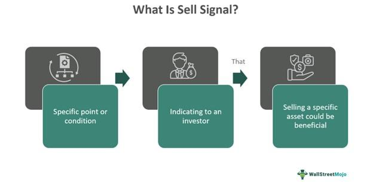

## Table of Contents

## What is a sell signal in trading?

A sell signal in trading is a sign that tells a trader it might be a good time to sell their investment. This signal can come from different things like charts, numbers, or even news. Traders use these signals to help them decide when to get out of a trade to make a profit or to avoid losing more money.

These signals are important because they help traders make choices based on information instead of just guessing. For example, if a stock's price starts to go down a lot, that could be a sell signal. Or, if a company reports bad news, that might also be a signal to sell. By paying attention to these signals, traders can try to sell at the best time.

## How can a beginner identify a sell signal in the stock market?

For a beginner, identifying a sell signal in the stock market can start with looking at the price of the stock. If the price starts to go down and keeps going down, that might be a sell signal. You can use charts to see this. Charts show the price of the stock over time, and if you see the line going down, it could mean it's time to sell. Another thing to watch is if the stock price goes below a certain level that it has not gone below before. This is called breaking support, and it can be a strong sell signal.

Another way to spot a sell signal is by paying attention to news about the company. If the company reports bad news, like lower profits or problems with their products, the stock price might go down. This bad news can be a signal to sell your stock before it loses more value. Also, if other people are selling a lot of the stock, this can be a sign that you should sell too. You can see this by looking at the trading [volume](/wiki/volume-trading-strategy), which shows how many shares are being bought and sold. If the volume is high and the price is going down, it might be a good time to sell.

Remember, no signal is perfect, and it's important to learn more and practice before making big decisions. You can start by using a practice account where you can trade without using real money. This way, you can learn to spot sell signals without risking your money. As you get better, you'll be able to make smarter choices about when to sell your stocks.

## What are the common types of sell signals used by traders?

Traders use different types of sell signals to decide when to sell their stocks. One common type is a technical sell signal, which comes from looking at charts and numbers. For example, if a stock's price goes below a certain level called support, that can be a sell signal. Another technical signal is when a stock's moving average, which shows the average price over time, starts to go down. This can mean the stock's price might keep going down, so it could be a good time to sell.

Another type of sell signal is a fundamental sell signal, which comes from news and information about the company. If a company reports lower profits or has problems with its products, that can be a sell signal. Also, if the whole market or the industry the company is in starts to do badly, that can be a signal to sell the stock. Traders look at these signals to help them decide if it's time to get out of their investment.

Some traders also use a combination of both technical and fundamental signals to make their decisions. For example, if a stock's price is going down and there is also bad news about the company, that can be a strong sell signal. By looking at different types of signals, traders can get a better idea of when it might be a good time to sell their stocks.

## Can you explain the difference between a sell signal and a buy signal?

A sell signal is a sign that tells a trader it might be a good time to sell their investment. This signal can come from looking at charts, numbers, or even news about the company. For example, if a stock's price starts to go down a lot or if the company reports bad news, that can be a sell signal. Traders use these signals to decide when to get out of a trade to make a profit or to avoid losing more money.

On the other hand, a buy signal is a sign that tells a trader it might be a good time to buy an investment. This signal can also come from charts, numbers, or good news about the company. For example, if a stock's price starts to go up or if the company reports better profits, that can be a buy signal. Traders use these signals to decide when to get into a trade to hopefully make money as the price goes up.

Both sell signals and buy signals are important tools for traders. They help traders make decisions based on information instead of just guessing. By paying attention to these signals, traders can try to buy at the best time and sell at the best time to make the most profit.

## What technical indicators are most commonly used to generate sell signals?

Technical indicators help traders spot sell signals by looking at charts and numbers. One common indicator is the moving average. If a stock's price goes below its moving average, it can be a sell signal. This shows that the stock's price might keep going down. Another popular indicator is the Relative Strength Index (RSI). If the RSI goes above 70, it means the stock might be overbought, and if it then starts to go down, that can be a sell signal. Traders also use the MACD (Moving Average Convergence Divergence) indicator. When the MACD line crosses below the signal line, it can be a sign to sell the stock.

Another useful indicator is the Bollinger Bands. If a stock's price moves below the lower Bollinger Band, it can be a sell signal because it shows the stock might be going into a downtrend. The volume of trades is also important. If a stock's price is going down and the trading volume is high, it means a lot of people are selling, which can be a strong sell signal. By using these indicators, traders can get a better idea of when it might be a good time to sell their stocks and avoid losing money.

## How reliable are sell signals in predicting market downturns?

Sell signals can help traders make smart choices, but they are not perfect at predicting when the market will go down. Sometimes, a sell signal might show up, but the market keeps going up instead. This can happen because many things affect the market, like news, people's feelings, and big events. So, while sell signals can give a good hint, they don't always get it right.

Even though sell signals are not always spot-on, they are still useful. Traders use them along with other information to make better guesses about the market. By looking at different signals and keeping an eye on the news, traders can make more informed choices about when to sell their stocks. It's like putting together pieces of a puzzle to see the bigger picture.

## What are the psychological factors that influence the decision to follow a sell signal?

One big psychological [factor](/wiki/factor-investing) that influences the decision to follow a sell signal is fear. When traders see a sell signal, they might feel scared that the price of their stock will keep going down. This fear can make them want to sell quickly to avoid losing more money. But sometimes, this fear can make them sell too soon, and they might miss out on a chance to make more money if the price goes back up.

Another factor is overconfidence. Some traders might think they know better than the sell signal. They might believe the market will turn around, so they ignore the signal and keep their stock. This overconfidence can lead to big losses if the market keeps going down. It's important for traders to balance their feelings with the information they get from sell signals to make the best choices.

## How do algorithmic trading systems incorporate sell signals into their strategies?

Algorithmic trading systems use sell signals to make decisions about when to sell stocks automatically. These systems look at lots of information, like charts and numbers, to find sell signals. When they see a sell signal, like a stock's price going below its moving average or the RSI showing the stock is overbought and then starting to go down, the system will sell the stock. This helps the system follow a set plan without letting feelings get in the way.

Sometimes, algorithmic systems use more than one sell signal to make sure they are making the right choice. They might look at both technical signals, like moving averages, and fundamental signals, like news about the company. By using different signals, the system can be more sure about when to sell. This way, the system can try to sell at the best time to make the most profit or avoid losing too much money.

## What are some advanced techniques for confirming a sell signal before executing a trade?

One advanced technique for confirming a sell signal is to use multiple indicators together. Instead of relying on just one signal, like the stock price going below its moving average, traders can look at other indicators too, like the RSI or MACD. If several indicators all show a sell signal at the same time, it can make the signal stronger and more reliable. This helps traders feel more confident that the stock's price is really going to go down.

Another technique is to look at different time frames. For example, a trader might see a sell signal on a daily chart, but they can check a weekly or monthly chart too. If the sell signal shows up on more than one time frame, it can confirm that the trend is strong and likely to continue. This can help traders avoid selling too soon or too late. By using these advanced techniques, traders can make smarter decisions and hopefully make more money.

## How can historical data be used to backtest the effectiveness of different sell signals?

Historical data can be used to backtest the effectiveness of different sell signals by looking at past stock prices and seeing how well the signals would have worked. Traders can use old stock data to pretend they are trading and see if selling when a certain signal appeared would have made them money or saved them from losing money. This helps them figure out which sell signals are good and which ones are not so good. By testing different signals on past data, traders can learn which ones to trust more when they trade for real.

For example, a trader might want to test if selling a stock when its price goes below its 50-day moving average is a good idea. They can look at past prices and see what would have happened if they had sold every time this happened. If they see that selling at this signal often led to good results, they might decide to use it in their real trading. But if the results were not so good, they might try a different signal, like the RSI, and test that one too. By doing this kind of [backtesting](/wiki/backtesting), traders can make better plans for when to sell their stocks.

## What role do sell signals play in risk management and portfolio optimization?

Sell signals are important for managing risk and making a portfolio better. They help traders know when it might be a good time to sell a stock to avoid losing too much money. By paying attention to sell signals, traders can get out of a trade before the stock's price drops a lot. This can help them keep their money safe and not lose as much when the market goes down. Using sell signals is like having a safety net that can catch you if things start to go wrong.

Sell signals also help with making a portfolio better by letting traders take profits at the right time. If a stock's price has gone up a lot, a sell signal can tell a trader when to sell and make money. This money can then be used to buy other stocks or investments that might do well in the future. By using sell signals to take profits, traders can keep their portfolio growing and doing well. It's like [picking](/wiki/asset-class-picking) the best fruit from a tree before it goes bad, so you can keep your basket full of good things.

## How do expert traders adjust their strategies based on false or misleading sell signals?

Expert traders know that sell signals can sometimes be wrong or misleading. When they see a sell signal that they think might not be right, they don't just jump to sell their stocks. Instead, they take a closer look at other information, like news about the company or other technical indicators. They might wait a bit to see if the signal is confirmed by other signs. This way, they can avoid selling too soon and missing out on more profits if the stock price goes back up.

If a sell signal turns out to be false, expert traders use this as a chance to learn and make their strategies better. They might change how they use certain indicators or add new ones to their trading plan. By looking at what went wrong, they can figure out how to spot false signals better in the future. This helps them make smarter choices and improve their chances of making money in the stock market.

## References & Further Reading

[1]: ["Advances in Financial Machine Learning"](https://www.amazon.com/Advances-Financial-Machine-Learning-Marcos/dp/1119482089) by Marcos Lopez de Prado

[2]: Bergstra, J., Bardenet, R., Bengio, Y., & Kégl, B. (2011). ["Algorithms for Hyper-Parameter Optimization."](https://dl.acm.org/doi/10.5555/2986459.2986743) Advances in Neural Information Processing Systems 24.

[3]: ["Evidence-Based Technical Analysis: Applying the Scientific Method and Statistical Inference to Trading Signals"](https://www.amazon.com/Evidence-Based-Technical-Analysis-Scientific-Statistical/dp/0470008741) by David Aronson

[4]: ["Machine Learning for Algorithmic Trading"](https://github.com/stefan-jansen/machine-learning-for-trading) by Stefan Jansen

[5]: ["Quantitative Trading: How to Build Your Own Algorithmic Trading Business"](https://www.amazon.com/Quantitative-Trading-Build-Algorithmic-Business/dp/1119800064) by Ernest P. Chan