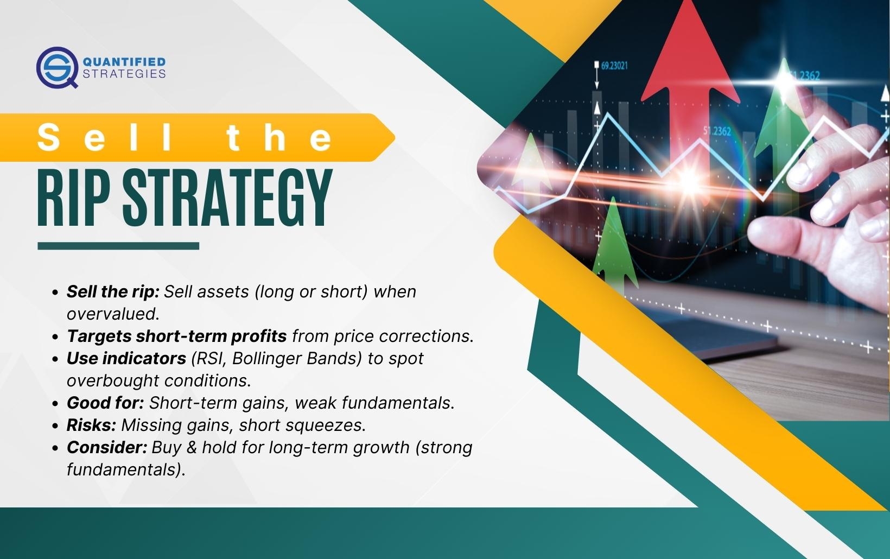

## Table of Contents

## What is the 'Sell the Rip' strategy?

The 'Sell the Rip' strategy is a way to make money in the stock market by selling stocks when their prices go up a little bit after going down a lot. People use this strategy when they think the stock's price will not keep going up and will start going down again. It's kind of like the opposite of "buy low, sell high." Instead, you are selling when the price goes up a bit, expecting it to fall again.

This strategy is often used during times when the market is not doing well overall. For example, if a stock has been falling for a while and then suddenly goes up a little, someone using the 'Sell the Rip' strategy would sell the stock at that higher price. They believe that the small increase is just a temporary bump and that the stock will continue to fall. This way, they can make some profit before the price drops again.

## How does the 'Sell the Rip' strategy differ from 'Buy the Dip'?

The 'Sell the Rip' and 'Buy the Dip' strategies are opposite ways to make money in the stock market. 'Sell the Rip' means selling a stock when its price goes up a little bit after falling a lot. People who use this strategy think the price will not keep going up and will fall again soon. They want to sell at the higher price to make some profit before the price drops.

On the other hand, 'Buy the Dip' means buying a stock when its price goes down a lot. People who use this strategy believe the price will go back up eventually. They buy the stock at a lower price, hoping to sell it later at a higher price and make a profit. So, 'Sell the Rip' is about selling when the price goes up a bit, while 'Buy the Dip' is about buying when the price goes down a lot.

## What are the basic principles behind the 'Sell the Rip' strategy?

The 'Sell the Rip' strategy is based on the idea that when a stock's price goes up a little bit after falling a lot, it might not keep going up. People who use this strategy think the price will go back down soon. They want to sell the stock at the higher price to make some money before it falls again. This strategy is often used when the overall market is not doing well, and people think the small increase in price is just temporary.

The key to the 'Sell the Rip' strategy is timing. You have to watch the stock's price closely and decide when to sell. If you sell too early, you might miss out on a bigger increase. If you wait too long, the price might start falling again before you sell. It's all about trying to catch that small increase in price and selling before it goes back down.

## In what market conditions is the 'Sell the Rip' strategy most effective?

The 'Sell the Rip' strategy works best when the stock market is going through a tough time. This means when lots of stocks are losing value and people are worried about the economy. During these times, a stock might go down a lot and then go up just a little bit. People using the 'Sell the Rip' strategy think this small increase won't last and the stock will start falling again soon. So, they sell the stock at the higher price to make some money before it goes down.

This strategy can be really useful in a bear market, where the overall trend is for stock prices to go down. In a bear market, even when a stock goes up a little, it's often just a short break before it continues to fall. By selling at these small increases, people can take advantage of the ups and downs to make some profit, even when the market is not doing well overall. It's all about catching those small moments of increase and getting out before the price drops again.

## What are the key indicators to look for when implementing the 'Sell the Rip' strategy?

When using the 'Sell the Rip' strategy, you need to watch for certain signs that tell you when to sell. One important sign is when a stock's price goes up a little bit after it has been falling for a while. This small increase might be a good time to sell because you think the price will start falling again soon. Another thing to look at is the overall market. If the market is in a bad place and most stocks are going down, a small increase in one stock might not last long. So, you want to sell before the price goes back down.

It's also helpful to pay attention to news and events that might affect the stock's price. If there's bad news about the company or the economy, it could mean the stock will keep falling after a small increase. Technical indicators, like moving averages or resistance levels, can also give you clues about when to sell. These indicators help you see patterns in the stock's price and make a better guess about when it might go back down. By keeping an eye on these signs, you can use the 'Sell the Rip' strategy to make some money even when the market is not doing well.

## How can a beginner identify a 'rip' in the market?

A beginner can identify a 'rip' in the market by watching how a stock's price moves. A 'rip' happens when a stock's price goes up a little bit after it has been falling for a while. This small increase might look like a good sign, but if the overall market is not doing well, it might not last long. So, you need to keep an eye on the stock's price and see if it goes up after a big drop. If it does, that could be a 'rip.'

To spot a 'rip,' it's also helpful to look at the bigger picture. Check if the overall market is going through a tough time, with lots of stocks losing value. If the market is in a bad place, a small increase in one stock might just be a short break before it falls again. You can also pay attention to news and events that might affect the stock's price. If there's bad news about the company or the economy, it could mean the stock will keep falling after a small increase. By watching these things, you can get better at spotting 'rips' in the market.

## What are the risks associated with the 'Sell the Rip' strategy?

The 'Sell the Rip' strategy can be risky because you might sell a stock too early. If you sell when the price goes up just a little bit, you could miss out on a bigger increase. The stock might keep going up instead of falling back down like you thought. This means you would lose the chance to make more money if the price kept rising.

Another risk is that you might not sell at the right time. If you wait too long to sell, the price might start falling again before you can get out. This could lead to a loss if the price drops below where you bought it. It's all about timing, and getting it wrong can cost you money. So, you need to be careful and watch the market closely when using this strategy.

## Can you provide an example of a successful 'Sell the Rip' trade?

Imagine a stock called XYZ that has been dropping for a few weeks. It went from $50 to $30 because of bad news about the company. One day, the stock suddenly goes up to $32. Someone using the 'Sell the Rip' strategy sees this small increase and thinks it won't last. They decide to sell their shares of XYZ at $32, making a little profit before the price drops again.

A few days later, the stock price falls back to $28. The person who sold at $32 is happy because they made some money instead of losing more if they had kept the stock. By selling at the right time, they took advantage of the small increase in price and avoided a bigger loss.

## What technical analysis tools are most useful for the 'Sell the Rip' strategy?

When using the 'Sell the Rip' strategy, some key technical analysis tools can help you decide when to sell. One useful tool is the moving average, which shows the average price of a stock over a certain period of time. If the stock price goes above its moving average after a big drop, it might be a good time to sell because the price could be about to fall again. Another helpful tool is the relative strength index (RSI), which tells you if a stock is overbought or oversold. If the RSI shows the stock is overbought after a small increase, it might be a sign to sell before the price drops.

You can also use support and resistance levels to help with the 'Sell the Rip' strategy. Support levels are prices where a stock often stops falling, and resistance levels are prices where it often stops rising. If a stock goes up a little bit after falling and hits a resistance level, it might be a good time to sell because the price could start going down again. By using these technical analysis tools, you can better time your sells and make the most of small price increases in a falling market.

## How should one manage their portfolio when using the 'Sell the Rip' strategy?

When using the 'Sell the Rip' strategy, it's important to keep a close eye on your portfolio. This means watching the prices of your stocks all the time. You need to be ready to sell quickly when you see a small increase after a big drop. It's also a good idea to not put all your money into one stock. Instead, spread your money across different stocks. This way, if one stock doesn't work out with the 'Sell the Rip' strategy, you won't lose all your money.

Another thing to think about is how much risk you're okay with. The 'Sell the Rip' strategy can be risky because you might sell too early or too late. So, you should only use this strategy with a part of your money that you're okay with losing. Also, keep some money in safer places like savings accounts or bonds. This can help balance out the risk of using the 'Sell the Rip' strategy. By managing your portfolio carefully, you can use the 'Sell the Rip' strategy to make some money even when the market is not doing well.

## What are some advanced techniques for optimizing the 'Sell the Rip' strategy?

One advanced technique for optimizing the 'Sell the Rip' strategy is to use multiple time frames for analysis. Instead of just looking at the daily price movements, you can also check the weekly or even monthly charts. This can give you a better idea of the bigger trends and help you spot the small increases after big drops more accurately. Another technique is to use volume analysis. If the stock's price goes up a little bit but the trading volume is low, it might mean the increase won't last long. So, you can use this information to decide when to sell.

Another way to improve the 'Sell the Rip' strategy is to combine it with other trading strategies. For example, you could use the 'Sell the Rip' strategy along with a 'Buy the Dip' strategy. This means you buy stocks when they go down a lot and then sell them when they go up a little bit. By using both strategies together, you can make money from both the ups and downs of the market. It's also important to keep learning and adjusting your strategy based on what works and what doesn't. The more you practice and learn, the better you'll get at spotting the right times to sell and making the most of the 'Sell the Rip' strategy.

## How can one evaluate the performance of the 'Sell the Rip' strategy over time?

To evaluate the performance of the 'Sell the Rip' strategy over time, you need to keep track of your trades. Write down when you bought and sold each stock, and how much money you made or lost on each trade. You can use a notebook or a computer program to keep this information. Over time, look at all your trades to see if you are making more money than you are losing. If you are making money, the 'Sell the Rip' strategy is working well for you. If you are losing money, you might need to change how you use the strategy.

It's also helpful to compare the 'Sell the Rip' strategy to other ways of investing. For example, you could see how your money would have grown if you had just held onto the stocks instead of selling them. You can also compare your results to the overall market. If the market is going down but you are still making money with the 'Sell the Rip' strategy, that's a good sign. By keeping track of your trades and comparing them to other ways of investing, you can figure out if the 'Sell the Rip' strategy is working well for you over time.

## What are the key indicators for 'Selling the Rip'?

Identifying favorable entry and exit points in the 'sell the rip' strategy relies significantly on technical indicators. These indicators assist traders in spotting overbought conditions, thereby providing a foundation for making informed sell decisions during market rips.

The Relative Strength Index (RSI) is one of the most frequently applied tools for assessing overbought conditions. RSI is calculated using the formula:

$$

RSI = 100 - \left(\frac{100}{1 + RS}\right)
$$

where $RS$ is the average of $n$ days' up closes divided by the average of $n$ days' down closes. Typically, an RSI above 70 indicates overbought conditions, suggesting that a reversal might be imminent.

The Stochastic Oscillator is another essential indicator. It compares a particular closing price of an asset to a range of its prices over a certain period. The formula is:

$$

\text{Stochastic} \%K = \frac{\text{(Current Close - Lowest Low)}}{\text{(Highest High - Lowest Low)}} \times 100
$$

Where: 
- Current Close is the most recent closing price
- Lowest Low is the lowest price in the past periods
- Highest High is the highest price in the same period

A reading above 80 is typically considered overbought.

Williams %R is similar in function to the Stochastic Oscillator but flipped upside down. It helps traders recognize overbought conditions, with values closer to -20 indicating overbought status:

$$

\text{Williams} \%R = \frac{\text{(Highest High - Current Close)}}{\text{(Highest High - Lowest Low)}} \times -100
$$

Beyond these oscillators, Bollinger Bands and Moving Averages (MAs) offer insight into price peaks and [volatility](/wiki/volatility-trading-strategies). Bollinger Bands consist of a middle band (simple moving average) and two outer bands at a specified standard deviation level:

- Opening beyond the upper Bollinger Band signals overbought conditions, often preceding a cooldown in price.

Moving Averages, such as the Simple Moving Average (SMA) and the Exponential Moving Average (EMA), can highlight trend exhaustion points. A significant gap between short- and long-term MAs can indicate overvaluation and a potential sell point.

Utilizing these indicators systematically enhances the precision of executing sell decisions, supporting traders to better navigate and capitalize on market 'rips'. By understanding and applying these metrics, traders can set strategic entry and exit points that align with perceived asset overvaluation.

## References & Further Reading

[1]: ["Advances in Financial Machine Learning"](https://www.amazon.com/Advances-Financial-Machine-Learning-Marcos/dp/1119482089) by Marcos Lopez de Prado

[2]: Chan, E. P. (2009). ["Quantitative Trading: How to Build Your Own Algorithmic Trading Business"](https://github.com/ftvision/quant_trading_echan_book). Wiley.

[3]: Aronson, D. R. (2006). ["Evidence-Based Technical Analysis: Applying the Scientific Method and Statistical Inference to Trading Signals"](https://www.amazon.com/Evidence-Based-Technical-Analysis-Scientific-Statistical/dp/0470008741). Wiley.

[4]: Jansen, S. (2020). ["Machine Learning for Algorithmic Trading"](https://github.com/stefan-jansen/machine-learning-for-trading). Packt Publishing.

[5]: Bergstra, J., Bardenet, R., Bengio, Y., & Kégl, B. (2011). ["Algorithms for Hyper-Parameter Optimization."](https://dl.acm.org/doi/10.5555/2986459.2986743) Advances in Neural Information Processing Systems 24.