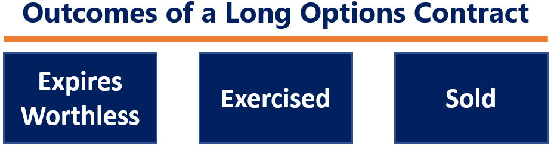

Options trading, with its vast array of instruments and techniques, presents a significant opportunity for traders seeking diversification and potential profit. The complexity of options trading stems from the diversity of strategies available and the cognitive challenges involved in predicting market behavior. In this article, we unravel key concepts including 'sell to close', various options trading strategies, and the integration of algorithmic trading to enhance their execution.

'Sell to close' is a fundamental concept in the lifecycle of an options contract, serving as a method for traders to exit their long positions. It is pivotal in managing portfolio risks and optimizing capital usage. Understanding when and how to execute a 'sell to close' order is crucial for achieving desired financial outcomes.



Options trading strategies like calls, puts, straddles, and spreads form the backbone of navigating different market conditions. These strategies allow traders to capitalize on fluctuations, hedge against potential losses, or leverage stable markets. Mastering these strategies requires a thorough understanding of market dynamics and the ability to anticipate changes.

The advent of algorithmic trading, or algo trading, has revolutionized the execution of options strategies. By utilizing algorithms to conduct trades, speed and precision are improved, while human errors are minimized. Algorithmic trading is capable of processing vast amounts of data quickly, enabling the execution of complex multi-leg strategies with high efficiency.

The integration of these elements in one's trading strategy can offer a significant competitive edge. Traders who combine options strategies with algorithmic trading tools are better equipped to make informed decisions, thus minimizing risks and maximizing potential returns. As markets continue to evolve, staying informed about these tools and strategies is essential for maintaining a successful edge in the world of options trading.

## Table of Contents

## Understanding Sell to Close in Options Trading

In options trading, "sell to close" is a fundamental transaction used by traders to exit their long positions on options contracts. This process is crucial for those holding options, as it provides a structured method to terminate ownership and potentially realize financial gains or mitigate losses.

When an investor holds a long position on an options contract, they have the right, but not the obligation, to buy (in the case of a call option) or sell (in the case of a put option) the underlying asset at a specified price within a certain time frame. As the option's expiration date approaches or depending on favorable market conditions, the trader may decide to execute a "sell to close" transaction.

Executing a sell-to-close order involves entering the market to sell the options contract that the trader currently owns. This can be visualized as follows:

1. **Profit Realization**: If the option has appreciated in value since the purchase, the trader can sell the option at a higher price than the purchase cost. For example, if an investor bought a call option for $2 per share and sells it for $5 per share before expiration, they secure a $3 per share profit.

2. **Loss Mitigation**: Conversely, if the market moves against the trader's position and the option has decreased in value, executing a sell-to-close order may limit further losses. Selling the option allows the trader to recover some capital before the option becomes worthless at expiration.

3. **Capital Reallocation**: By closing the position, traders free up capital that was tied into the options contract. This capital can be redirected into new trading opportunities or other investments that may offer better returns.

**Contrast with Similar Market Actions:**
The "sell to close" transaction is distinct from "sell to open" orders, which involve taking a short position by selling options contracts. In a "sell to open" scenario, the trader does not own the option initially but instead sells it to earn a premium, taking the obligation to fulfill the contract if exercised by the buyer.

In addition, "sell to close" differs from a "buy to close" operation, which pertains to closing a short options position. A trader who initially entered a short position by selling options would execute a buy-to-close order to purchase equivalent options and thus terminate their short position.

Overall, understanding the "sell to close" transaction is essential for effective options trading strategies. It allows traders to manage their portfolios by taking advantage of price movements and preserving capital for further investment.

## Exploring Options Trading Strategies

Options trading strategies provide traders with diverse approaches to harness the complexities of the financial markets. A strong grasp of these strategies enables traders to tailor their methods to specific market conditions, whether they are highly volatile or relatively stable.

**Call and Put Options:**

Call and put options are foundational components of options trading. A call option gives the trader the right, but not the obligation, to purchase an asset at a predetermined price (strike price) before or at the expiration date. Conversely, a put option grants the right to sell an asset at the strike price within the given timeframe. These options allow traders to speculate on market movements or hedge against potential losses.

For example, a trader anticipating a price increase may buy a call option, while expecting a price decline could lead to purchasing a put option. Here's a simple Python function to calculate the profit or loss from such options:

```python
def option_profit(option_type, strike_price, market_price, premium):
    if option_type == "call":
        return max(0, market_price - strike_price) - premium
    elif option_type == "put":
        return max(0, strike_price - market_price) - premium
    else:
        raise ValueError("Invalid option type. Choose either 'call' or 'put'.")

# Example usage:
profit = option_profit("call", 100, 110, 5)
print(f"Profit or Loss: {profit}")
```

**Straddles:**

The straddle strategy involves purchasing both call and put options of the same underlying asset, strike price, and expiration date. This strategy is particularly advantageous in highly volatile markets where substantial price movement is anticipated, but the direction is uncertain. Profit is realized if the asset's price moves significantly in either direction beyond the combined cost of the options.

**Spreads:**

Spreads are strategies that involve simultaneously buying and selling options of the same class on the same asset but with differing strike prices or expiration dates. Spreads limit potential profits but also reduce risk. Key spread strategies include:

1. **Bull Call Spread:** In a rising market, traders can use a bull call spread by buying a call option at a lower strike price and selling one at a higher strike price. This approach caps potential profit (the difference between strike prices) but lowers the net premium paid.

2. **Bear Put Spread:** For a declining market, a bear put spread involves buying a put option with a higher strike price and selling another with a lower strike price, again capping profit but reducing initial costs.

3. **Butterfly Spread:** This strategy is designed for stable markets and combines multiple bull and bear spreads. A trader buys one option at a lower strike, sells two at a middle strike, and buys another at a higher strike price. The profit is maximized if the market price remains near the middle strike price at expiration.

Understanding these strategies provides traders the flexibility to respond adaptively to market dynamics. By accurately predicting market conditions and applying the appropriate strategy, traders can optimize their performance and achieve favorable outcomes.

## The Role of Algorithmic Trading in Options Strategies

Algorithmic trading uses computer algorithms to automate trade execution, allowing traders to execute orders at speeds unachievable for humans. In options trading, this technology addresses several challenges and opportunities.

### Advantages in Options Trading

Algorithmic trading offers immediate advantages for options traders. The ability to execute trades rapidly minimizes slippage, the difference between the expected price of a trade and the actual price. This speed is crucial, particularly for options, as they are time-sensitive and market conditions can change rapidly. Additionally, algorithms reduce human error, ensuring consistency and reliability in trade execution.

Another benefit is the ability to handle complex strategies. Options trading often involves multi-leg strategies, such as straddles, strangles, or spreads. These involve multiple transactions executed simultaneously or in a particular sequence. Algorithms can manage these intricate orders, optimizing execution to ensure that all legs of the trade are completed according to the trader's intentions.

### Implementing Multi-Leg Strategies

In the context of options, algorithms are particularly useful for implementing multi-leg strategies. A multi-leg strategy comprises several components, possibly including combinations of buying and selling options contracts with different strike prices or expiration dates. Algorithms can synchronize these transactions to minimize transaction costs and execution risks. For example, executing a butterfly spread, which involves multiple buy/sell orders, can be streamlined through algorithmic execution.

Python, a versatile and widely-used programming language in financial markets, provides robust libraries and tools for developing [algorithmic trading](/wiki/algorithmic-trading) systems. Here's a simple example demonstrating how an algorithm could be structured to execute a basic options strategy in Python:

```python
import pandas as pd

# Example function to check market conditions and execute trades
def execute_options_strategy(market_data):
    # Define basic conditions for executing a straddle
    if market_data['volatility'] > threshold:
        buy_call(market_data['ticker'], quantity)
        buy_put(market_data['ticker'], quantity)

# Placeholder functions to simulate trading actions
def buy_call(ticker, quantity):
    print(f"Buying {quantity} call options for {ticker}")

def buy_put(ticker, quantity):
    print(f"Buying {quantity} put options for {ticker}")

# Example market data
market_data = pd.DataFrame({
    'ticker': ['AAPL', 'GOOGL'],
    'volatility': [0.3, 0.25]
})

# Set a threshold for volatility
threshold = 0.2
quantity = 10

# Execute strategy based on market data
for index, row in market_data.iterrows():
    execute_options_strategy(row)
```

### Technical and Financial Requirements

Entering the world of algorithmic trading in options requires both technical and financial preparatives. From a technical standpoint, a robust understanding of programming languages such as Python is essential. Moreover, a reliable infrastructure that includes a fast internet connection and access to real-time data feeds is critical.

Financially, traders should have a clear understanding of their capital limits. An adequate financial buffer allows for the unforeseen costs associated with algorithm deployment, such as trading fees and potential losses from failed algorithms. Maintaining a close relationship with brokerage services that provide API access for algorithmic trading is also advantageous.

By utilizing algorithmic trading, options traders can significantly enhance the efficiency of their trading strategies, capitalize on market movements with precision, and reduce the risks associated with manual execution. It requires a blend of programming skill, market knowledge, and strategic foresight, yet the potential rewards make it a valuable endeavor for serious options traders.

## Benefits and Challenges of Algorithmic Trading in Options

Algorithmic trading, known for its enhanced accuracy and rapid execution capabilities, significantly benefits options trading by minimizing human error and facilitating data-driven decision-making. These technologies allow traders to capitalize on market opportunities with greater precision by analyzing large datasets and executing trades at speeds unattainable for human traders.

### Advantages of Algorithmic Trading in Options

1. **Improved Accuracy**  
   Algorithms can manage complex calculations and multiple indicators simultaneously, leading to more precise trading decisions. By using predefined criteria, these algorithms can determine optimal entry and [exit](/wiki/exit-strategy) points, helping to reduce human biases and errors in trading.

2. **Faster Execution**  
   The speed at which algorithmic systems operate improves execution time, reducing the slippage that often occurs in manual trading. This rapid response capability allows traders to benefit from micro-movements in market prices, which are particularly important in volatile options markets.

3. **Data-Driven Decision-Making**  
   Through [machine learning](/wiki/machine-learning) and advanced analytics, algorithms process vast amounts of market data to identify patterns not easily discernible by human traders. By continuously analyzing historical and real-time data, algorithms facilitate informed decision-making, enhancing the effectiveness of various trading strategies.

### Challenges of Algorithmic Trading in Options

1. **Sophisticated Technology Requirements**  
   The implementation of algorithmic trading demands advanced hardware and software infrastructure, increasing the initial investment for traders. Ensuring reliable and powerful systems is essential for maintaining data integrity and execution speed, which can pose a barrier for small traders.

2. **Risk of Technical Failures**  
   Despite technological advancements, systems are not infallible and may experience outages or malfunctions. A single point of failure in either the hardware or software can lead to significant financial losses, making robust risk management practices vital.

3. **Market Impact and Liquidity Concerns**  
   High-frequency trading, often a subset of algorithmic strategies, can inadvertently affect market stability and [liquidity](/wiki/liquidity-risk-premium). The sheer [volume](/wiki/volume-trading-strategy) of trades executed by algorithms can exacerbate price fluctuations, occasionally creating adverse effects on the market.

### Balancing Pros and Cons

To effectively engage in algorithmic trading within options markets, traders must weigh the advantages of accuracy and speed against the potential challenges of technological dependency and market impact. A comprehensive understanding of these elements enables traders to develop robust strategies that mitigate risks while maximizing profit potential. Diversifying technology infrastructure, employing stringent risk management protocols, and staying abreast of market regulations can aid in overcoming these challenges and leveraging the benefits of algorithmic trading to the fullest.

## Conclusion

Combining 'sell to close' strategies with algorithmic trading can significantly enhance the efficiency and profitability of options trading. The 'sell to close' order assists traders in closing long positions, providing the flexibility to capitalize on favorable market movements or to mitigate potential losses. When merged with the precision of algorithmic trading, this strategy can achieve faster execution times and minimize human error, resulting in better trading outcomes.

As markets continue to evolve, staying informed and adaptable is key to success. The dynamic nature of financial markets necessitates a proactive approach in adopting new tools and strategies. Algorithmic trading, with its ability to process vast amounts of data rapidly, positions itself as an invaluable asset for traders looking to optimize their options strategies. By using real-time data, traders can make informed decisions that are well-aligned with current market conditions.

Leveraging advanced trading strategies and technologies enables traders to stay ahead in an increasingly competitive landscape. The automation inherent in algorithmic trading allows for the implementation of complex multi-leg strategies that can be executed efficiently, providing a competitive edge. This technological integration can also facilitate the management of larger portfolios while maintaining precision in execution.

Further learning and experimentation are encouraged to refine strategies for individual trading goals. Continuous education on market trends, new algorithms, and strategy models will empower traders to develop robust and adaptable plans. Experimentation through [backtesting](/wiki/backtesting) and paper trading can also provide valuable insights, enabling traders to perfect strategies before deploying them in live markets.

By combining fundamental trading strategies with algorithmic advancements, traders can significantly enhance their capability to navigate the complex world of options trading, ultimately aiming for better risk management and maximized returns.

## Additional Resources

### Additional Resources

To further enhance your understanding and skills in options trading and algorithmic strategies, consider exploring the following resources:

1. **Books and Articles:**
   - "Options, Futures, and Other Derivatives" by John C. Hull. This comprehensive textbook covers fundamental concepts and advanced strategies in options trading.
   - "Algorithmic Trading: Winning Strategies and Their Rationale" by Ernie Chan. This book provides insight into building and implementing algorithmic trading systems.

2. **Online Courses and Tutorials:**
   - Coursera and edX offer specialized courses in financial markets and algorithmic trading taught by instructors from prestigious universities.
   - Khan Academy provides free resources on options trading fundamentals.

3. **Platforms for Algorithmic Trading:**
   - **QuantConnect**: A cloud-based algorithmic trading platform that supports multiple asset classes, including options. It offers a powerful environment to test and deploy trading strategies in Python.
   - **Interactive Brokers**: Known for its comprehensive trading ecosystem, Interactive Brokers features a Trader Workstation (TWS) and an API for implementing custom algorithms.
   - **MetaTrader 5**: While more popular for forex and stock trading, it also supports options trading and has robust back-testing capabilities.

4. **Educational Websites:**
   - **Investopedia**: Offers a wealth of articles, tutorials, and dictionary entries explaining the basics and advanced concepts of options trading.
   - **The Options Industry Council (OIC)**: Provides educational resources including webinars, articles, and courses dedicated to options trading.

5. **Community Forums and Discussion Groups:**
   - Engage with communities like the /r/algotrading subreddit on Reddit, where traders share insights, coding tips, and strategies specific to algorithmic trading.
   - The Bogleheads forum is useful for discussions surrounding various trading strategies, including options and algorithmic approaches.

6. **Software and Libraries:**
   - **QuantLib**: An open-source library in C++ for modeling, trading, and risk management in real-life.
   - **Pandas and NumPy**: Python libraries that are essential for data manipulation and numerical analysis in financial data sets.
   - Example Python code snippet for a simple moving average crossover strategy:

     ```python
     import pandas as pd
     import numpy as np

     def moving_average_crossover(data, short_window=40, long_window=100):
         data['short_mavg'] = data['Close'].rolling(window=short_window, min_periods=1).mean()
         data['long_mavg'] = data['Close'].rolling(window=long_window, min_periods=1).mean()

         buy_signals = (data['short_mavg'] > data['long_mavg']) & (data['short_mavg'].shift(1) <= data['long_mavg'].shift(1))
         sell_signals = (data['short_mavg'] < data['long_mavg']) & (data['short_mavg'].shift(1) >= data['long_mavg'].shift(1))

         return buy_signals, sell_signals
     ```

By integrating these resources into your learning routine, you can enhance your knowledge and skills in options trading and algorithmic trading, enabling you to make better-informed decisions in your trading endeavors.

## References & Further Reading

[1]: Hull, J. C. (2018). ["Options, Futures, and Other Derivatives"](https://www.semanticscholar.org/paper/Options%2C-Futures%2C-and-Other-Derivatives-Hull/89bdee500c8623864fc9eb7a471546aa713acc44). Pearson.

[2]: Chan, E. (2013). ["Algorithmic Trading: Winning Strategies and Their Rationale"](https://github.com/ftvision/quant_trading_echan_book). Wiley Trading.

[3]: De Prado, M. L. (2018). ["Advances in Financial Machine Learning"](https://www.amazon.com/Advances-Financial-Machine-Learning-Marcos/dp/1119482089). Wiley.

[4]: Jansen, S. (2020). ["Machine Learning for Algorithmic Trading: Predictive models to extract signals from market and alternative data for systematic trading strategies with Python"](https://github.com/stefan-jansen/machine-learning-for-trading). Packt Publishing.

[5]: Chan, E. (2009). ["Quantitative Trading: How to Build Your Own Algorithmic Trading Business"](https://github.com/ftvision/quant_trading_echan_book). Wiley Trading.