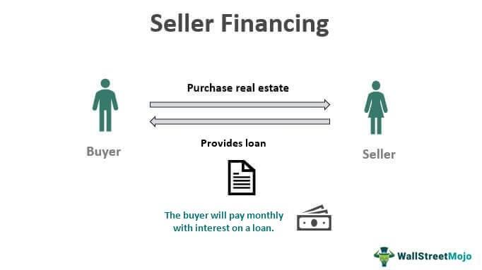

## Table of Contents

## What is a seller-financed real estate transaction?

A seller-financed real estate transaction is when the person selling a house also acts like a bank. Instead of the buyer getting a loan from a bank, the seller loans the buyer the money to buy the house. The buyer then pays the seller back over time, usually with interest. This can be helpful if the buyer can't get a loan from a bank.

This kind of deal can be good for both the buyer and the seller. For the buyer, it might be easier to buy a house if they can't get a bank loan. For the seller, they might be able to sell their house faster or for more money. But, it's important for both the buyer and the seller to be careful and make sure they understand the agreement well.

## How does seller financing differ from traditional mortgage financing?

Seller financing is different from traditional mortgage financing because in seller financing, the person selling the house acts like a bank and loans the buyer the money to buy the house. In traditional mortgage financing, the buyer gets a loan from a bank or a mortgage lender. With seller financing, the buyer and seller agree on the terms of the loan, like how much interest the buyer will pay and how long they have to pay back the loan. In traditional financing, the terms are set by the bank or lender.

Another difference is that seller financing can be easier for buyers who can't get a loan from a bank. Maybe their credit isn't good enough, or they don't have enough money for a down payment. Seller financing can help them buy a house anyway. Traditional financing usually has stricter rules about who can get a loan. For the seller, offering financing can mean selling the house faster or for more money, but it also means they have to wait to get all their money and take on the risk that the buyer might not pay them back.

## What are the benefits of seller financing for buyers?

Seller financing can be a big help for buyers who might not be able to get a loan from a bank. If a buyer's credit score is not good enough or they don't have enough money for a down payment, seller financing can give them a chance to buy a house. The seller might be willing to work with the buyer on terms that a bank wouldn't, like a smaller down payment or a lower [interest rate](/wiki/interest-rate-trading-strategies).

Another benefit for buyers is that the process of buying a house can be quicker and easier with seller financing. Since the buyer and seller are making the deal directly, there's less paperwork and fewer steps compared to going through a bank. This can mean the buyer can move into their new home faster and without the stress of dealing with a big bank.

## What are the advantages of seller financing for sellers?

Seller financing can help sellers sell their house faster. If a buyer can't get a loan from a bank, they might still be able to buy the house if the seller offers financing. This means the seller can sell their house to more people, not just those who can get a bank loan. It can be especially helpful in a slow real estate market, where it might be hard to find buyers who can get traditional financing.

Another advantage for sellers is that they might be able to sell their house for more money. When a seller offers financing, they can sometimes charge a higher price for the house or a higher interest rate on the loan. This can add up to more money over time than if they sold the house for a lower price with no financing. Plus, sellers can get a steady income from the interest payments the buyer makes, which can be a good way to make money after selling the house.

## What are the potential risks and drawbacks of seller financing for both parties?

For buyers, one big risk of seller financing is that if they miss payments, they might lose the house. The seller might not be as easy to work with as a bank if the buyer runs into money problems. Also, the interest rate on a seller-financed loan might be higher than what a bank would offer. Buyers need to be careful and understand all the terms of the loan before they agree to it.

For sellers, the main risk is that the buyer might not pay them back. If the buyer stops making payments, the seller might have to go through a long and costly process to get the house back. Sellers also have to wait to get all their money, instead of getting it all at once when they sell the house. This means they might not be able to use that money for other things they want or need. Both buyers and sellers need to be very clear about the terms of the loan and what will happen if things don't go as planned.

## What are the key legal and financial considerations in setting up a seller-financed deal?

When setting up a seller-financed deal, it's important to have a clear and detailed contract that spells out all the terms of the loan. This should include how much the buyer is borrowing, the interest rate, how long they have to pay it back, and what happens if they miss payments. Both the buyer and the seller should have a lawyer look over the contract to make sure it's fair and legal. They should also make sure they understand all the terms and agree on them before signing. It's a good idea to have everything in writing so there's no confusion later on.

Another important thing to think about is how the loan will be secured. Usually, the house itself is used as collateral, which means if the buyer doesn't pay, the seller can take the house back. This is done through a legal document called a mortgage or a deed of trust. The seller should also check the buyer's credit and make sure they can afford the payments. For the buyer, it's important to know how the payments will affect their taxes and to keep good records of all payments made. Both sides need to be careful and make sure they understand all the legal and financial details before going ahead with the deal.

## How can a buyer qualify for seller financing?

To qualify for seller financing, a buyer needs to show the seller that they can be trusted to make the loan payments on time. This usually means having a good credit history or being able to explain any problems with their credit. The buyer should also be able to prove they have enough income to make the monthly payments. Sometimes, the seller might ask for a down payment to show that the buyer is serious about the purchase.

The process of qualifying for seller financing can be less strict than getting a loan from a bank. The seller might be willing to work with the buyer on the terms of the loan, like the interest rate or how long they have to pay it back. But, the buyer still needs to be open and honest with the seller about their financial situation. Both the buyer and the seller should feel comfortable with the agreement before moving forward with the deal.

## What documentation is required for a seller-financed real estate transaction?

For a seller-financed real estate transaction, you need a few important documents. The main one is a promissory note, which is like an IOU. It says how much money the buyer is borrowing from the seller, the interest rate, and how the buyer will pay it back. Another important document is a mortgage or a deed of trust, which makes the house the collateral for the loan. This means if the buyer doesn't pay, the seller can take the house back.

You also need a purchase agreement that spells out the details of the sale, like the price of the house and any other terms the buyer and seller agree on. It's a good idea to have a lawyer look over all these documents to make sure they are legal and fair. Both the buyer and the seller should keep copies of all the documents and understand what they mean before signing anything.

## How is the interest rate determined in a seller-financed deal?

In a seller-financed deal, the interest rate is usually decided by the seller and the buyer talking it over and agreeing on a number. The seller might look at what banks are charging for loans and decide to charge a little more or a little less. Sometimes, the seller might want a higher interest rate than a bank would offer because they are taking on more risk by lending the money themselves. The buyer and seller can negotiate to find a rate that works for both of them.

The interest rate can also depend on the buyer's credit score and how much money they are putting down. If the buyer has a good credit score and a big down payment, the seller might be willing to offer a lower interest rate. But if the buyer's credit is not so good or they can't put much money down, the seller might ask for a higher rate to make up for the extra risk. It's important for both the buyer and the seller to be clear about the interest rate and how it will affect the payments before they agree to the deal.

## What are the tax implications of seller financing for both buyer and seller?

For the seller, offering financing can have some tax benefits and some things to watch out for. When the seller gets payments from the buyer, part of the money is usually considered interest income. This means the seller has to pay taxes on that interest, just like they would on other kinds of income. But, if the seller spreads out the payments over time, they might be able to pay less tax each year than if they got all the money at once. Sellers need to be careful, though, because if they don't follow the IRS rules about reporting the income, they could get in trouble.

For the buyer, the tax implications are a bit different. The interest they pay on the loan can usually be deducted from their taxes, just like with a regular mortgage. This can help the buyer save money on their taxes. But, they need to keep good records of all their payments and make sure they follow the rules for claiming the deduction. Both the buyer and the seller should talk to a tax professional to make sure they understand all the tax rules and how they apply to their situation.

## How can balloon payments be structured in seller financing agreements?

Balloon payments in seller financing agreements are big payments that the buyer has to make at the end of the loan term. Instead of paying off the whole loan little by little over time, the buyer makes smaller payments for a while and then pays a big lump sum at the end. This can help the buyer because the monthly payments are smaller, but they need to be ready to come up with a lot of money at the end of the loan.

The seller and buyer can agree on how big the balloon payment will be and when it's due. It might be after a few years or at the end of the loan term. The seller might be okay with a balloon payment because they get most of their money back at once, but it's a risk because the buyer might not be able to pay it. Both the buyer and seller need to plan carefully and make sure they understand the terms of the balloon payment before they agree to it.

## What are the best practices for managing and concluding a seller-financed real estate transaction?

To manage a seller-financed real estate transaction well, both the buyer and the seller need to communicate clearly and keep good records. They should have a detailed contract that spells out all the terms of the loan, like the interest rate, payment schedule, and what happens if the buyer misses payments. It's a good idea for both sides to have a lawyer look over the contract to make sure it's fair and legal. The buyer should always make payments on time and keep receipts, while the seller should keep track of the payments received. If problems come up, like the buyer missing a payment, they should talk about it right away and try to find a solution that works for both of them.

To conclude a seller-financed real estate transaction successfully, both parties need to plan ahead, especially if there's a balloon payment at the end. The buyer should start saving for the balloon payment well in advance and look into options like refinancing with a bank if they can't pay it all at once. The seller should be ready to work with the buyer if they run into trouble making the final payment. Once the loan is paid off, the seller should give the buyer the deed to the house and both should sign a document saying the loan is paid in full. Keeping good records and staying in touch throughout the loan term can help make sure the transaction goes smoothly from start to finish.

## What is Seller Financing and How Does it Work?

Seller financing, also referred to as owner financing, is a method in real estate transactions where the seller provides financing to the buyer. This arrangement allows the buyer to make installment payments directly to the seller, eliminating the need for a traditional mortgage from a financial institution. Typically, this type of financing manifests through a direct agreement between the buyer and seller, formalized using promissory notes. These legal documents detail the terms of the loan, including the interest rate, repayment schedule, and possible contingencies.

Unlike conventional mortgages, where third-party lenders such as banks perform extensive checks on the borrower's creditworthiness, seller financing places the seller in the position of the lender. This setup allows for greater flexibility in setting loan conditions. Both parties can negotiate terms that suit their specific circumstances, which can include interest rates often higher or similar to institutional loans due to the increased risk taken by the seller. The repayment schedule can also be customized, sometimes offering interest-only payments for a set initial period followed by a final balloon payment.

The structure of seller-financed deals can vary significantly. A common element is the "amortization schedule," which outlines the loan repayment process over time. In its simplest form:

$$

A = \frac{P \cdot r(1+r)^n}{(1+r)^n-1} 
$$

Where:
- $A$ is the periodic payment amount
- $P$ is the principal amount
- $r$ is the periodic interest rate
- $n$ is the total number of payments

One of the main advantages of seller financing is that it bypasses traditional bank processes, leading to a significantly quicker transaction closing. This is because the agreement does not require the numerous checks and balances typically needed in bank-financed deals. However, the buyer and seller should clearly understand the associated legal requirements to ensure the transaction complies with state and federal laws. Employing professional services, such as real estate attorneys or experienced [agents](/wiki/agents), can ensure that these transactions are handled correctly, protecting the interests of both parties involved.

## What is Algorithmic Trading in Real Estate?

Algorithmic trading, although commonly associated with financial markets, has found innovative applications within real estate, utilizing algorithms to predict market trends and optimize property transactions. By adapting strategies from financial markets, these algorithms can enhance decision-making processes in real estate, particularly in pricing strategies and risk management concerning various financing methods, including seller financing.

Advanced algorithms and data-driven models, such as those used in predictive analytics, can help stakeholders in real estate projects ascertain optimal moments to buy or sell properties by analyzing historical data and current market trends. These algorithms employ techniques from [machine learning](/wiki/machine-learning) and [artificial intelligence](/wiki/ai-artificial-intelligence) to process vast amounts of data, ranging from past sales, economic indicators, demographic shifts, and even social media signals, generating predictions about future market conditions.

A fundamental approach in algorithm development involves creating a model by training it on historical data to predict future values, which can be expressed mathematically as:

$$

y_{pred} = f(x_1, x_2, ..., x_n) 
$$

where $y_{pred}$ is the predicted output (e.g., property prices), and $x_1, x_2, ..., x_n$ represent various input features (such as interest rates, employment levels, and housing demand).

Furthermore, fintech solutions have harnessed the power of AI to streamline financing processes, particularly beneficial for non-traditional financing like seller financing. These technologies can offer tailored suggestions on loan structuring by analyzing the nuances of seller financing deals and borrower profiles, effectively reducing risks associated with defaults and ensuring compliance with financial regulations.

Such innovations not only advance the efficiency of transactions but also open new opportunities for investors and sellers by providing them with precise tools for financial decision-making. As the intersection of technology and real estate continues to evolve, the role of [algorithmic trading](/wiki/algorithmic-trading) principles is set to expand, presenting a transformative approach to real estate market engagement.

## References & Further Reading

[1]: Olmsted, P. R. (2011). ["Seller Financing as an Alternative to Mortgages."](https://olmsted.org/olmsted-papers-project/) Real Estate Review, 40(1), 15-21.

[2]: Geltner, D., Miller, N. G., Clayton, J., & Eichholtz, P. (2013). ["Commercial Real Estate Analysis and Investments,"](https://www.researchgate.net/publication/245702364_Commercial_Real_Estate_Analysis_and_Investments) Cengage Learning.

[3]: Taylor, M. (2017). ["Understanding Seller Financing Transactions."](https://www.realestatelawcorp.com/seller-financing-in-real-estate-a-comprehensive-guide-to-understanding-the-process-and-legal-implications/) Nolo.

[4]: Lopez de Prado, M. (2018). ["Advances in Financial Machine Learning."](https://books.google.com/books/about/Advances_in_Financial_Machine_Learning.html?id=oU9KDwAAQBAJ) Wiley.

[5]: Oranburg, S. C. (2018). ["Fintech and the Innovation Trilemma."](https://www.law.georgetown.edu/georgetown-law-journal/wp-content/uploads/sites/26/2019/02/1Fintech-and-the-Innovation-Trilemma.pdf) Hofstra Law Review, 48(3), Article 8.

[6]: Jansen, S. (2018). ["Machine Learning for Algorithmic Trading: Predictive Models to Extract Signals From Market and Alternative Data for Systematic Trading Strategies with Python."](https://www.amazon.com/Machine-Learning-Algorithmic-Trading-alternative/dp/1839217715) Packt Publishing.

