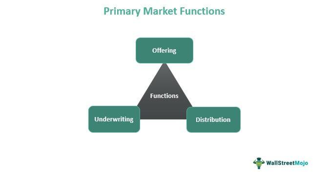

## Table of Contents

## What is a seller?

A seller is someone who sells things. They can sell products like clothes, food, or toys, or services like haircuts or cleaning. Sellers can work in stores, online, or even from their homes. Their main job is to give customers what they want and make money from it.

Sellers need to know a lot about what they are selling. They should be able to answer questions and help customers choose the right product or service. Good sellers also need to be friendly and good at talking to people. This helps them make more sales and keep customers happy.

## What are the primary roles of a seller?

A seller's main job is to sell things to customers. This can be anything from clothes and toys to services like cleaning or haircuts. Sellers can work in stores, online, or from home. Their goal is to give customers what they want and make money from it. To do this well, sellers need to know a lot about what they are selling. They should be able to answer questions and help customers pick the right thing.

Another important role of a seller is to be good with people. They need to be friendly and able to talk to customers easily. This helps them make more sales and keep customers happy. Sellers also need to keep track of their stock and make sure they always have enough of what people want to buy. By doing these things, sellers can do their job well and help their business grow.

## What are the different types of sellers?

There are many types of sellers. Some sellers work in stores, like in a supermarket or a clothing shop. They help customers find what they need and answer their questions. Other sellers work online, selling things on websites like Amazon or eBay. They might never meet their customers face-to-face but still need to be good at describing their products and answering emails or messages.

Another type of seller is a street vendor. These sellers set up small stands or carts on the street and sell things like food, drinks, or small items. They need to be good at attracting people who are walking by. There are also sellers who work from home, like people who sell things they make themselves, like crafts or baked goods. They might use social media or their own websites to reach customers.

Lastly, there are service sellers. These are people who sell things you can't touch, like haircuts, cleaning services, or lessons. They need to be good at what they do and also good at talking to people to explain their services. Each type of seller has a different way of working, but they all need to understand their customers and be good at selling.

## Can you provide examples of different types of sellers?

Some sellers work in stores. For example, a person who works at a supermarket helps customers find food and answers their questions about products. Another example is a salesperson at a clothing store who helps people pick out clothes and suggests what might look good on them. These sellers need to know a lot about what they sell and be good at talking to people.

Other sellers work online. For example, someone who sells things on Amazon or eBay might never meet their customers in person. They need to write good descriptions of their products and answer emails or messages quickly. Another type is a person who sells homemade crafts or baked goods from home, using social media or their own website to reach customers.

There are also sellers who work on the street, like street vendors. They set up small stands or carts and sell things like food, drinks, or small items. They need to be good at attracting people who are walking by. Service sellers are another type. They sell things you can't touch, like haircuts, cleaning services, or lessons. They need to be good at what they do and also good at explaining their services to people.

## How does a seller differ from a vendor or a supplier?

A seller is someone who sells things directly to customers. They can work in stores, online, or even from home. Their main job is to help customers find what they need and make sales. Sellers need to know a lot about their products and be good at talking to people. They are the ones who interact with customers the most and help them make buying decisions.

A vendor is similar to a seller but often works in a more specific way. Vendors might set up at events or markets and sell things directly to people who come by. They can sell food, crafts, or other items. Vendors need to be good at attracting people and making quick sales. They might also be businesses that sell products to other businesses, not just to individual customers.

A supplier, on the other hand, is someone who provides the products that sellers and vendors sell. Suppliers don't usually sell directly to the end customer. Instead, they sell to stores or other businesses. Their job is to make sure there are enough products available for sellers and vendors to sell. Suppliers need to manage their stock well and make sure everything is delivered on time.

## What skills are essential for a successful seller?

A successful seller needs to be good at talking to people. They should be friendly and able to help customers find what they need. Good communication is important because it helps sellers explain their products and answer questions. Sellers also need to listen to what customers want and be able to suggest the right things for them. Being good with people makes customers feel happy and more likely to buy something.

Another important skill for a seller is knowing a lot about their products. They should be able to tell customers all about what they are selling, like how it works and why it's good. This knowledge helps sellers answer questions and make customers feel confident in their choices. Sellers also need to keep track of their stock and make sure they always have enough of what people want to buy. By understanding their products well, sellers can do a better job and help their business grow.

## How do sellers adapt to different market conditions?

Sellers have to change how they work when the market changes. If people are not buying as much, sellers might lower their prices or offer special deals to get more customers. They might also try to sell different things that people want more. For example, if everyone is buying masks, a seller might start selling masks too. Sellers also need to pay attention to what is happening around them, like if there is a new store nearby or if people are shopping more online. By understanding these changes, sellers can find new ways to sell their things.

Another way sellers adapt is by using new tools and technology. If more people are shopping on their phones, sellers might make a website that works well on phones. They might also use social media to show their products and talk to customers. When things like the internet or new apps come out, sellers can use them to reach more people and sell more. By staying up-to-date with technology, sellers can keep their business strong even when the market changes.

## What are the legal and ethical responsibilities of a seller?

Sellers have to follow the law when they sell things. This means they need to be honest about what they are selling and not trick people. They also need to make sure their products are safe and do what they say they will do. Sellers need to follow rules about how they sell, like not selling to kids if it's not allowed. They also need to pay taxes on what they make and keep good records of their sales. If they don't follow these rules, they can get in trouble with the law.

Sellers also have to act in a good and fair way. This means they should treat all customers the same and not be mean or unfair to anyone. They need to be honest about the price and not try to trick people into paying more. Sellers should also care about the environment and try not to hurt it with their business. If something goes wrong with a product, they should try to fix it or give the customer their money back. By acting ethically, sellers can build trust with their customers and keep their business strong.

## How do technology and e-commerce impact the role of a seller?

Technology and e-commerce have changed a lot about what sellers do. Now, sellers can reach customers all over the world using the internet. They can set up online stores on websites like Amazon or eBay, or make their own websites. This means they don't need a physical store anymore. Sellers also use social media to show their products and talk to customers. They can use apps and software to keep track of their stock and see what people are buying. This helps them know what to sell and how much to charge.

E-commerce also makes it easier for sellers to offer things like fast shipping and easy returns. Customers can buy things with just a few clicks, and sellers can send them out quickly. But it also means sellers have to compete with more people because anyone can sell online. So, they need to be good at using technology to make their business stand out. They might use online ads or special deals to get more customers. By using technology well, sellers can make their job easier and reach more people.

## What strategies can sellers use to increase their sales?

Sellers can use different strategies to sell more things. One way is to offer special deals or discounts. This can make people want to buy more because they feel like they are getting a good price. Sellers can also use social media to show their products and talk to customers. By posting pictures and videos, they can make people interested in what they are selling. Another good strategy is to know what customers want and have enough of those things in stock. If sellers can give customers what they need quickly, they are more likely to make a sale.

Another important strategy is to be good at talking to people. Sellers should be friendly and helpful so customers feel happy and want to come back. They can also learn about their products and answer questions well. This makes customers trust them more and feel good about buying. Sellers can also use technology to help them sell more. For example, they can use apps to keep track of what they are selling and see what is popular. By using these strategies, sellers can sell more and grow their business.

## How do sellers manage inventory and supply chain logistics?

Sellers need to keep track of their inventory to make sure they always have enough things to sell. They use special software or apps to see how many items they have and how many are selling. This helps them know when to order more. If they run out of something, they might lose sales, so it's important to keep the right amount of stock. Sellers also need to think about how much space they have to store things and how quickly they can get new items.

Sellers also have to manage the supply chain, which means getting products from the supplier to the customer. They work with suppliers to make sure they get the right products at the right time. This can involve planning when to order things and how to get them to the store or the customer's house. Sellers need to choose the best way to ship things so they arrive quickly and safely. By managing inventory and the supply chain well, sellers can make sure they always have what customers want and can deliver it on time.

## What are the future trends that might affect the role of sellers?

In the future, more and more people will shop online, so sellers will need to be good at using the internet to sell things. They will use tools like social media and online ads to reach more customers. Sellers might also use new technology like virtual reality to show their products in a new way. This can make shopping more fun and help sellers stand out from others. They will need to keep learning about new ways to sell and use technology to stay ahead.

Another big change will be how sellers use data to make decisions. They will use information about what people are buying to know what to sell and how much to charge. This can help them make more sales and keep customers happy. Sellers will also need to think about being good to the environment. More people want to buy things that don't hurt the planet, so sellers will need to find ways to sell things that are good for the environment. By staying up-to-date with these trends, sellers can keep their business strong and grow in the future.

## What are the types of algorithmic trading strategies?

Algorithmic trading employs computer algorithms to automatically execute trades based on predefined strategies. Various types of algorithmic trading strategies have been developed to exploit different aspects of the market, enhancing efficiency and accuracy in trade execution.

### Trend-following Algorithms
Trend-following strategies aim to capitalize on the [momentum](/wiki/momentum) of asset prices. These algorithms identify trends in the market and place trades in the direction of the identified trend, continuing the process until the trend displays signs of reversal. They rely heavily on technical indicators such as moving averages and momentum indicators. A simple Python code to implement a basic moving average crossover trend-following strategy is:

```python
import pandas as pd

def moving_average_crossover(data, short_window=40, long_window=100):
    data['Short_MA'] = data['Close'].rolling(window=short_window, min_periods=1).mean()
    data['Long_MA'] = data['Close'].rolling(window=long_window, min_periods=1).mean()
    data['Signal'] = 0.0
    data['Signal'][short_window:] = np.where(data['Short_MA'][short_window:] > data['Long_MA'][short_window:], 1.0, 0.0)
    data['Position'] = data['Signal'].diff()
    return data[data['Position'] != 0]

# Assuming 'market_data' is a pandas DataFrame with 'Close' prices.
signals = moving_average_crossover(market_data)
```

### Mean Reversion Strategies
Mean reversion is based on the theory that prices and returns eventually move back towards the mean or average level. These strategies identify when the price of an asset has deviated significantly from its historical average and bet on its return to the mean. The z-score is commonly used to identify these deviations:

$$
z_t = \frac{P_t - \mu}{\sigma}
$$

where $P_t$ is the current price, $\mu$ is the mean of historical prices, and $\sigma$ is the standard deviation. Trades are generated when the z-score crosses certain thresholds.

### Statistical Arbitrage
Statistical [arbitrage](/wiki/arbitrage) involves algorithms that identify and exploit pricing inefficiencies between securities. These strategies often involve pairs trading, where two historically correlated assets are traded when their prices diverge from their expected relationship, profiting when they converge. A correlation threshold may be used to identify suitable pairs, and positions are balanced to maintain a neutral portfolio.

### Market-making Algorithms
Market-making algorithms aim to enhance liquidity by continuously quoting buy and sell prices. These algorithms profit from the bid-ask spread while attempting to hedge against adverse price movements. Effective [market making](/wiki/market-making) requires rapid updating of quotes based on market data and competitor actions. Algorithms monitor [order book](/wiki/order-book-trading-strategies) depths and trade quantities to maintain a desired inventory level, ensuring liquidity provision.

### High-frequency Trading (HFT)
[HFT](/wiki/high-frequency-trading-strategies) strategies involve executing a large number of trades in extremely short time frames to capture small price discrepancies. These algorithms require sophisticated infrastructure to minimize latency, often co-locating servers with exchanges. HFT applies various techniques, including order anticipation and statistical arbitrage, across multiple asset classes.

Algorithmic trading strategies leverage mathematical models and high-speed data processing for successful market engagement, promoting efficiency and innovation within financial markets.

## References & Further Reading

[1]: Bergstra, J., Bardenet, R., Bengio, Y., & Kégl, B. (2011). ["Algorithms for Hyper-Parameter Optimization."](https://dl.acm.org/doi/10.5555/2986459.2986743) Advances in Neural Information Processing Systems 24.

[2]: ["Advances in Financial Machine Learning"](https://www.amazon.com/Advances-Financial-Machine-Learning-Marcos/dp/1119482089) by Marcos Lopez de Prado

[3]: ["Evidence-Based Technical Analysis: Applying the Scientific Method and Statistical Inference to Trading Signals"](https://www.amazon.com/Evidence-Based-Technical-Analysis-Scientific-Statistical/dp/0470008741) by David Aronson

[4]: ["Machine Learning for Algorithmic Trading"](https://github.com/stefan-jansen/machine-learning-for-trading) by Stefan Jansen

[5]: ["Quantitative Trading: How to Build Your Own Algorithmic Trading Business"](https://github.com/LucindaYa/quant-resources/blob/master/Quantitative%20Trading%20How%20to%20Build%20Your%20Own%20Algorithmic%20Trading%20Business.pdf) by Ernest P. Chan