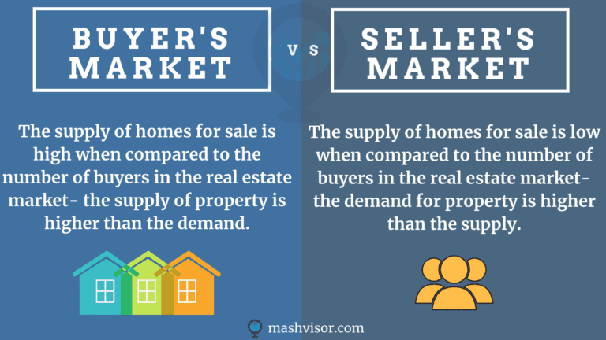

## Table of Contents

## What is a seller's market in the context of investing?

A seller's market in the context of investing means that there are more people wanting to buy than there are things to buy. This often happens when the economy is doing well and people feel confident about spending money. In this situation, sellers have the advantage because they can set higher prices and buyers have to compete to get what they want.

For example, in the real estate market, a seller's market means there are more people looking to buy houses than there are houses available. This can drive up the prices of homes because buyers might offer more money to outbid others. It's a good time for people selling their homes, but not so good for people trying to buy one.

## How can you identify a seller's market in real estate investing?

You can tell it's a seller's market in real estate when there are more people wanting to buy houses than there are houses for sale. This means that houses don't stay on the market for long. If you see homes selling quickly, often within a few days or weeks, it's a sign of a seller's market. Another clue is when there are lots of people coming to open houses and bidding wars start happening. This shows that buyers are eager and willing to pay more to get a home.

Another way to spot a seller's market is by looking at the prices of homes. In a seller's market, home prices usually go up because there's so much demand. If you notice that the prices of homes in your area are rising faster than usual, it's likely a seller's market. Also, if homes are selling for more than their asking price, that's another clear sign. Sellers have the upper hand and can ask for higher prices because buyers are competing to buy.

## What are the key characteristics of a seller's market in the stock market?

In the stock market, a seller's market happens when there are more people wanting to buy stocks than there are stocks available for sale. This means that the demand for stocks is higher than the supply. When this happens, stock prices tend to go up because buyers are willing to pay more to get the stocks they want. You can tell it's a seller's market when you see stock prices rising quickly and the market seems to be doing well overall.

Another sign of a seller's market in the stock market is when there are a lot of buyers trying to buy stocks, but not many sellers. This can lead to a situation where stocks are hard to find because everyone wants to buy them, but not many people want to sell. If you see that stocks are selling for more than their usual price and there are lots of people trying to buy, it's likely a seller's market. This is a good time for people who own stocks because they can sell them for a higher price.

## How does a seller's market affect investment strategies for beginners?

In a seller's market, beginners need to be careful with their investment strategies. Since prices are going up and there are more buyers than sellers, it can be a good time to invest if you can find stocks or properties to buy. But, it can be hard because everything is in high demand. Beginners might need to be patient and wait for the right opportunity to buy something at a price they can afford. It's important not to rush into buying just because the market is hot, as you might end up paying too much.

Another thing beginners should think about is their long-term goals. In a seller's market, it might be tempting to try and make quick profits by buying and selling quickly. But, this can be risky, especially for someone new to investing. It's usually better to focus on long-term growth and not get too caught up in the excitement of a seller's market. By keeping a steady plan and sticking to it, beginners can build a strong investment portfolio over time, even if the market is favoring sellers.

## What are the potential risks of investing in a seller's market?

Investing in a seller's market can be risky because prices are high and might not keep going up. If you buy something when the price is already high, you might lose money if the market changes and prices go down. It's like buying a toy that everyone wants right now, but if people stop wanting it, the price will drop and you'll be stuck with something that's not worth as much as you paid.

Another risk is that you might feel pressured to buy quickly because everyone else is buying. This can lead to making bad decisions, like buying something without doing enough research or paying more than you should. It's important to take your time and not let the excitement of a seller's market push you into a bad investment. Remember, just because everyone else is buying doesn't mean it's the right choice for you.

## How can investors take advantage of a seller's market?

Investors can take advantage of a seller's market by selling their investments at a higher price. Since there are more people wanting to buy than there are things to sell, investors can get a good price for their stocks or properties. If you own something that's in high demand, you can sell it for more money than you would in a normal market. This is a great time to cash in on your investments and make a profit.

Another way to take advantage of a seller's market is by being smart about what you buy. Even though prices are high, if you can find something that's still a good deal, you might be able to buy it and then sell it later for even more money. You need to do your homework and look for opportunities where the price might keep going up. By being patient and choosing carefully, you can buy low and sell high, even in a seller's market.

## What historical examples illustrate the impact of a seller's market on investments?

One famous example of a seller's market is the housing market in the United States before the 2008 financial crisis. During the early 2000s, there were a lot more people wanting to buy houses than there were houses for sale. This made house prices go up a lot. People thought the prices would keep going up, so they kept buying. But when the market crashed in 2008, a lot of people lost money because they had bought houses at high prices that suddenly dropped.

Another example is the dot-com bubble of the late 1990s. During this time, there was a big demand for stocks in internet and technology companies. Everyone wanted to buy these stocks, so the prices went up a lot. People thought the internet was the future, so they kept buying more and more. But when the bubble burst in 2000, the prices of these stocks fell sharply. Investors who had bought at the peak of the seller's market lost a lot of money when the market turned around.

## How do economic indicators signal the presence of a seller's market?

Economic indicators can show when it's a seller's market by looking at things like how fast prices are going up and how many people are buying. If you see that the prices of houses or stocks are going up quickly, it means there are a lot of people wanting to buy and not enough things to sell. Another sign is when the number of sales goes up a lot. This means buyers are rushing to buy before prices get even higher. Also, if the unemployment rate is low and people feel good about the economy, they are more likely to spend money, which can make a seller's market even stronger.

Another important indicator is the inventory level, which shows how many houses or stocks are available to buy. In a seller's market, the inventory is usually low because everything gets sold quickly. If you see that the time it takes to sell a house or stock is getting shorter, it's a clear sign that it's a seller's market. Also, if the economy is growing and people's incomes are going up, they might want to invest more, which adds to the demand and helps create a seller's market. By keeping an eye on these indicators, you can tell when it's a good time for sellers.

## What role do interest rates play in creating a seller's market?

Interest rates play a big role in creating a seller's market because they affect how much it costs to borrow money. When interest rates are low, it's cheaper for people to take out loans to buy houses or invest in stocks. This makes more people want to buy, which can lead to a seller's market. If lots of people are trying to buy and there aren't enough things to sell, the prices go up and sellers have the advantage.

On the other hand, when interest rates are high, it costs more to borrow money. This can make fewer people want to buy because loans are more expensive. If fewer people are buying, it's harder to create a seller's market. But if the economy is doing really well and people feel confident, even high interest rates might not stop a seller's market from happening. So, interest rates are important, but they're just one part of the bigger picture.

## How should investors adjust their portfolios during a seller's market?

During a seller's market, investors should think about selling some of their investments that have gone up in price. Since there are a lot of buyers, it's a good time to sell and make a profit. But, it's also important not to sell everything. Keeping some investments can be good if you believe their prices will keep going up. It's all about finding a balance between selling to make money now and holding onto investments for future growth.

Another thing investors should do is look for new opportunities to buy. Even though prices are high, there might be some good deals if you look carefully. You need to do your homework and find investments that might keep going up in value. By being smart about what you buy and sell, you can take advantage of the seller's market while also planning for the long term.

## What advanced strategies can experienced investors use to navigate a seller's market?

Experienced investors can use a strategy called "selling into strength" during a seller's market. This means they sell their investments when the prices are high and there's a lot of demand. By doing this, they can make a good profit. But, they also need to be careful not to sell everything at once. They should keep some investments that they think will keep going up in value. This way, they can take advantage of the high prices now and still have a chance to make more money later.

Another strategy is to look for undervalued assets that others might not see. Even in a seller's market, there can be opportunities to buy things at a good price if you do your research. Experienced investors might find stocks or properties that are not as popular but still have a lot of potential. By buying these undervalued assets, they can wait for the market to recognize their value and then sell them for a higher price later. This requires patience and a good understanding of the market, but it can lead to big rewards.

## How do global economic conditions influence the duration and intensity of a seller's market?

Global economic conditions can make a seller's market last longer or become more intense. If the world economy is doing well, more people might want to invest in things like stocks or houses. This can make a seller's market stronger because there are more buyers than sellers. Also, if other countries are doing well, they might invest more money in other countries, which can keep the demand high and make prices go up even more. So, a good global economy can make a seller's market last longer and be more intense.

On the other hand, if the global economy is not doing well, it can make a seller's market shorter and less intense. When other countries are struggling, people might not want to invest as much. This can lower the demand for stocks or houses, which can make a seller's market weaker. Also, if there are big problems like a global financial crisis, it can quickly change a seller's market into a buyer's market. So, global economic conditions play a big role in how long a seller's market lasts and how strong it is.

## What strategies and considerations should be taken into account when investing in a seller's market?

Investing in a seller's market presents unique challenges primarily due to inflated asset prices. However, strategic approaches can allow investors to achieve successful outcomes. One effective strategy is to focus on sectors that are poised for long-term growth, even if current valuations are high. This involves identifying industries or asset classes with robust future potential, such as technology or renewable energy, which are expected to benefit from structural economic shifts or regulatory support.

Diversification is another key tactic. By spreading investments across different sectors and asset types, investors can mitigate risks associated with price fluctuations in any single market segment. This balanced approach can help counterbalance the inflated prices typical of a seller's market. Moreover, diversification can include geographical spread as well, as different regions may not experience the same degree of market buoyancy at the same time.

In addition to diversification, seeking undervalued opportunities in less crowded markets can be beneficial. This involves identifying niches or emerging sectors where demand has not yet reached its peak, thus avoiding the premium costs associated with more popular investment areas. Investors may employ value investing principles, which focus on purchasing assets that appear undervalued based on intrinsic valuation metrics, such as the discounted cash flow model:

$$
\text{Intrinsic Value} = \sum_{t=1}^{n} \frac{CF_t}{(1 + r)^t}
$$

Where $CF_t$ is the cash flow in year $t$, $n$ is the number of years projected, and $r$ is the discount rate. This formula helps identify investments trading below their projected worth.

Additionally, investors could consider contrarian strategies, which involve moving against prevailing market trends, buying temporarily undervalued assets sold off due to market overreaction rather than fundamental change.

Overall, careful analysis and strategic planning are essential when investing in a seller's market. Leveraging insights into market behaviors and adopting a forward-looking perspective can enhance investment decisions and outcomes. Adaptability and awareness of broader economic trends will support efforts to overcome the inherent challenges of a seller's market environment.

## References & Further Reading

[1]: Bergstra, J., Bardenet, R., Bengio, Y., & Kégl, B. (2011). ["Algorithms for Hyper-Parameter Optimization."](https://dl.acm.org/doi/10.5555/2986459.2986743) Advances in Neural Information Processing Systems 24.

[2]: ["Advances in Financial Machine Learning"](https://www.amazon.com/Advances-Financial-Machine-Learning-Marcos/dp/1119482089) by Marcos Lopez de Prado

[3]: ["Evidence-Based Technical Analysis: Applying the Scientific Method and Statistical Inference to Trading Signals"](https://www.amazon.com/Evidence-Based-Technical-Analysis-Scientific-Statistical/dp/0470008741) by David Aronson

[4]: ["Machine Learning for Algorithmic Trading"](https://github.com/stefan-jansen/machine-learning-for-trading) by Stefan Jansen

[5]: ["Quantitative Trading: How to Build Your Own Algorithmic Trading Business"](https://www.amazon.com/Quantitative-Trading-Build-Algorithmic-Business/dp/1119800064) by Ernest P. Chan