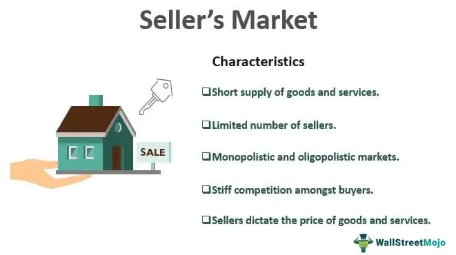

In finance, understanding the nuances of different market conditions is crucial for investors. The investment landscape is constantly evolving, presenting both opportunities and challenges that require strategic navigation. Among these, the seller's market presents a unique set of dynamics where demand exceeds supply, often enabling sellers to set higher prices due to limited alternatives for buyers. This environment necessitates a thorough understanding of market behavior to devise effective investment strategies.

In parallel, the technological advancement in trading, particularly through algorithmic trading, is revolutionizing how investors approach the market. Algorithmic trading leverages complex algorithms to analyze market conditions and execute trades swiftly and accurately. This technology-driven approach not only minimizes human error but also capitalizes on fleeting price inefficiencies, offering potential for substantial gains in high-frequency trading environments.



This article aims to explore these critical components of the investment market, providing investors with insights on optimizing their strategies amid these conditions. By thoroughly understanding the characteristics of a seller's market and the application of algorithmic trading, investors can enhance their decision-making processes and strategically position themselves in an ever-changing financial market.

## Table of Contents

## Understanding the Investment Market

The investment market is a multifaceted domain constituting various types of financial instruments such as stocks, bonds, real estate, commodities, and more. Each component of the market reacts distinctly to economic conditions and market trends, necessitating meticulous examination by investors seeking to make informed decisions.

Stocks are equity securities that represent ownership in a corporation, and their value can be influenced by numerous factors including corporate performance, investor sentiment, and macroeconomic indicators. In contrast, bonds are debt securities and tend to be affected by [interest rate](/wiki/interest-rate-trading-strategies) changes and credit ratings, with investors receiving fixed periodic interest payments. Real estate investments involve property acquisition and management and are heavily influenced by local market conditions, interest rates, and economic cycles.

The commodities market, covering a range of goods such as oil, gold, and agricultural products, is sensitive to supply and demand dynamics, geopolitical events, and currency fluctuations. Additionally, alternative investments, such as hedge funds and private equity, offer potential for diversification but come with their own set of risks and liquidity considerations.

Understanding how each of these market sectors responds to different stimuli is crucial for investors seeking to optimize their portfolios. For example, during periods of economic expansion, stocks may offer attractive returns while bonds could face pressure from rising interest rates. Conversely, during a recession, traditionally 'safer' investments like bonds or real estate may become more appealing.

Analyzing market sectors collectively as well as individually allows investors to identify correlations and diversification benefits. For instance, a well-balanced portfolio might mitigate risks if one sector underperforms due to unforeseen economic changes. Tools such as asset allocation models and statistical analysis can assist investors in evaluating market segments effectively. Diversification remains a key strategy, reducing risk by spreading investments across various asset classes.

In conclusion, comprehending the diverse characteristics and behaviors of different investment market components is paramount for investors. It enables them to craft strategies that align with their financial goals while navigating the complexities of economic conditions and market trends.

## Seller's Market: Definition and Examples

A seller's market occurs when the demand for goods or assets significantly surpasses the available supply, thus providing sellers a notable advantage. This imbalance in the market dynamics allows sellers to set higher prices because buyers have limited alternatives and are willing to pay more to acquire the desired goods or assets.

In a seller's market, competition among buyers tends to increase, often leading to bidding wars, as each buyer attempts to secure the product or asset in high demand. The scarcity of availability grants sellers the power to dictate terms, resulting in increased profitability.

A quintessential example of a seller's market can be observed within the real estate sector. In real estate, a seller's market is characterized by a low inventory of available properties coupled with high buyer interest. This situation can arise from various factors, such as population growth, economic upswings attracting new residents, or limited new construction projects. As a result, homes can sell quickly, often above the asking price, fueled by multiple offers from competing buyers.

Consider the following scenario: a city with a burgeoning population may experience a significant influx of new residents seeking housing. If the rate of new home construction fails to keep pace with this demand, the existing housing market will experience increased competition among buyers. Consequently, property owners can raise their prices due to the scarcity of available homes, thus benefiting from the seller's market conditions.

Overall, a seller's market reflects an economic environment where sellers are positioned favorably due to the robust demand against insufficient supply. This advantage enables them to maximize profits by negotiating higher sales prices while buyers navigate limited purchasing options.

## Investing in a Seller's Market: Strategies and Considerations

Investing in a seller's market presents unique challenges primarily due to inflated asset prices. However, strategic approaches can allow investors to achieve successful outcomes. One effective strategy is to focus on sectors that are poised for long-term growth, even if current valuations are high. This involves identifying industries or asset classes with robust future potential, such as technology or renewable energy, which are expected to benefit from structural economic shifts or regulatory support.

Diversification is another key tactic. By spreading investments across different sectors and asset types, investors can mitigate risks associated with price fluctuations in any single market segment. This balanced approach can help counterbalance the inflated prices typical of a seller's market. Moreover, diversification can include geographical spread as well, as different regions may not experience the same degree of market buoyancy at the same time.

In addition to diversification, seeking undervalued opportunities in less crowded markets can be beneficial. This involves identifying niches or emerging sectors where demand has not yet reached its peak, thus avoiding the premium costs associated with more popular investment areas. Investors may employ value investing principles, which focus on purchasing assets that appear undervalued based on intrinsic valuation metrics, such as the discounted cash flow model:

$$
\text{Intrinsic Value} = \sum_{t=1}^{n} \frac{CF_t}{(1 + r)^t}
$$

Where $CF_t$ is the cash flow in year $t$, $n$ is the number of years projected, and $r$ is the discount rate. This formula helps identify investments trading below their projected worth.

Additionally, investors could consider contrarian strategies, which involve moving against prevailing market trends, buying temporarily undervalued assets sold off due to market overreaction rather than fundamental change.

Overall, careful analysis and strategic planning are essential when investing in a seller's market. Leveraging insights into market behaviors and adopting a forward-looking perspective can enhance investment decisions and outcomes. Adaptability and awareness of broader economic trends will support efforts to overcome the inherent challenges of a seller's market environment.

## The Role of Algorithmic Trading in Modern Investing

Algorithmic trading, often referred to as algo trading, leverages sophisticated algorithms to scrutinize market conditions and execute trades with exceptional speed and precision. The core advantage of this approach lies in its ability to minimize human error and to capitalize on small price movements that may result in profitable trades. By automating the trading process, algorithms can efficiently process vast amounts of data and make swift decisions that would be impossible for human traders to achieve manually.

The efficacy of [algorithmic trading](/wiki/algorithmic-trading) is particularly pronounced in high-frequency trading ([HFT](/wiki/high-frequency-trading-strategies)) environments where the rapid execution of trades can translate into significant gains. High-frequency trading involves executing thousands, or even millions, of orders in fractions of a second. Algorithms are designed to identify and exploit minute discrepancies in price across different markets or securities. This capability is advantageous in volatile market conditions, including those often found in a seller's market, where rapid price changes can occur.

One of the key functions of algorithmic trading is [arbitrage](/wiki/arbitrage), which seeks to profit from price differences of a security between two or more markets. For instance, if a stock is priced differently on two exchanges, an algorithm can detect this discrepancy and execute a buy on the lower-priced market and a sale on the higher-priced market, pocketing the difference as profit. This strategy relies on the algorithm's ability to quickly detect and act upon these opportunities before they dissipate.

Moreover, algorithmic trading can be beneficial in reducing transaction costs and increasing the efficiency of trading operations. By decreasing the reliance on manual interventions, algo trading lowers the likelihood of costly errors and slippage, which occurs when there is a disparity between the expected price of a trade and the actual executed price. Enhanced by continual advancements in [artificial intelligence](/wiki/ai-artificial-intelligence) and [machine learning](/wiki/machine-learning), algorithms become more adept over time, further refining their capacity to predict market movements and optimize trading strategies.

In summary, algorithmic trading serves as a powerful tool in modern investing by promoting precision, speed, and efficiency. Its role is amplified in volatile markets, characteristic of a seller's market, where quick adjustments can lead to substantial gains. As technology evolves, the impact of algorithmic trading is set to increase, providing a competitive edge to investors who effectively harness its potential.

## Examples of Algorithmic Trading Strategies

Algorithmic trading strategies are crucial for capitalizing on market inefficiencies and generating profits. One of the most prevalent strategies is trend-following. This approach identifies and exploits predictable movements based on the assumption that asset prices are more likely to continue trending in their current trajectory rather than reverse. These trends are detected using various technical indicators such as moving averages and [momentum](/wiki/momentum) oscillators, which form the backbone of the algorithms used in this strategy.

Arbitrage strategies are another common practice in algorithmic trading. They take advantage of price discrepancies for the same asset across different markets or financial instruments. When a price difference is detected, trades are executed simultaneously to buy the asset at a lower price in one market and sell it at a higher price in another, locking in a risk-free profit. High-frequency trading platforms are often employed to execute these trades in milliseconds, thus beating market participants who operate with a time lag.

Market-making strategies focus on providing [liquidity](/wiki/liquidity-risk-premium) to markets by placing simultaneous buy and sell orders for the same security. The strategy profits from the bid-ask spread, the difference between the buying price (bid) and the selling price (ask). The algorithm continuously adjusts these orders to maintain a tight spread, thus [earning](/wiki/earning-announcement) a small profit with each transaction. By doing so, market makers also contribute to market efficiency and liquidity.

Overall, these strategies demonstrate how algorithmic trading can exploit various market dynamics, including inefficiencies and liquidity imbalances, to create profitable trading opportunities. As technology advances, these strategies continue to evolve, incorporating sophisticated data analysis and machine learning to enhance their efficacy and adapt to changing market conditions.

## Challenges and Opportunities of Algo Trading

Algorithmic trading has revolutionized the investment landscape by allowing for rapid and efficient execution of trades based on complex algorithms. However, this approach is not without its challenges and opportunities.

One of the primary advantages of algorithmic trading is its speed. Algorithms can process vast amounts of data and execute trades within milliseconds, which is significantly faster than any human trader could achieve. This speed is critical in today's fast-paced markets, where opportunities can arise and disappear in the blink of an eye.

Efficiency is another key benefit. Algorithms are designed to minimize human error, which can lead to more consistent performance. By following predefined rules and strategies, algorithmic trading reduces the risk of emotional decision-making, which is often cited as a pitfall for human traders.

Despite these advantages, algorithmic trading also faces significant challenges. One major concern is the technological dependency inherent in algorithmic systems. Traders must rely on robust technological infrastructure, including high-performance computing and reliable internet connectivity. Any failure in these systems can lead to significant financial losses.

Market [volatility](/wiki/volatility-trading-strategies) poses another challenge. While algorithms are designed to adapt to changing market conditions, extreme volatility can result in unexpected outcomes, causing algorithms to behave unpredictably. Traders must continuously monitor and adjust their algorithms to account for new market data and trends.

Furthermore, algorithmic trading requires constant refinement. As markets evolve, so too must the algorithms. This necessitates ongoing development and testing, which can be resource-intensive. Algorithm designers must integrate new data and insights to maintain competitive edge and ensure that their strategies remain profitable.

Innovations in artificial intelligence (AI) and machine learning are expanding the capabilities of algorithmic trading. AI algorithms can learn from past market data, identify patterns, and adapt to new market conditions more efficiently than traditional models. Machine learning techniques are increasingly being used to enhance the predictive power of trading algorithms, allowing them to execute trades with increased accuracy.

Python, a popular programming language in the trading community, provides numerous libraries and tools for implementing and back-testing algorithmic strategies. Libraries such as `pandas` for data manipulation, `numpy` for numerical computations, and `scikit-learn` for machine learning make it accessible for traders to develop sophisticated trading algorithms. Below is a simple example of how Python can be used to back-test a moving average crossover strategy:

```python
import pandas as pd

# Load historical market data
data = pd.read_csv('market_data.csv')  # Assume 'market_data.csv' contains date, price columns

# Calculate moving averages
data['SMA_50'] = data['price'].rolling(window=50).mean()
data['SMA_200'] = data['price'].rolling(window=200).mean()

# Define trading signals
data['Signal'] = 0
data.loc[data['SMA_50'] > data['SMA_200'], 'Signal'] = 1  # Buy signal
data.loc[data['SMA_50'] < data['SMA_200'], 'Signal'] = -1  # Sell signal

# Calculate returns
data['Returns'] = data['price'].pct_change()
data['Strategy_Returns'] = data['Returns'] * data['Signal'].shift(1)

# Evaluate strategy performance
cumulative_strategy_returns = (1 + data['Strategy_Returns']).cumprod()
print("Cumulative Strategy Returns: ", cumulative_strategy_returns.iloc[-1])
```

In conclusion, while algorithmic trading offers unparalleled speed and efficiency, it must continuously overcome challenges such as technological reliance and market volatility. Nevertheless, advancements in AI and machine learning are unlocking new possibilities, allowing traders to devise more adaptive and intelligent strategies. As the financial markets continue to evolve, algorithmic trading is likely to play an increasingly significant role in shaping investment strategies.

## Conclusion

Both a seller’s market and algorithmic trading present unique opportunities and challenges for investors. Understanding market conditions is fundamental in identifying these opportunities. In a seller’s market, where the demand outstrips supply, investors might face higher entry costs. However, those who can anticipate long-term value growth in such conditions might realize significant returns. Critical analysis and sector-specific insights help navigate the inflated prices typical of a seller's market.

Algorithmic trading offers technological leverage by executing trades with speed and precision unattainable by human capabilities alone. Algorithms can process vast amounts of data and execute trades based on pre-defined strategies, thereby reducing the influence of emotional bias and human error. The ability to exploit small price differentials at [high frequency](/wiki/high-frequency-trading) provides a distinct competitive advantage, particularly in volatile environments. However, investors must remain vigilant against technological dependencies and ensure their strategies are constantly refined to adapt to changing market conditions.

In summary, the integration of technology with insightful analysis equips investors to better tackle market challenges. Both a disciplined approach to understanding macroeconomic conditions and the strategic implementation of advanced trading technologies will be crucial. Informed decision-making, complemented by technological adeptness, will empower investors to navigate the financial investment landscape effectively, adapting to its continuously evolving nature.

## References & Further Reading

[1]: Bergstra, J., Bardenet, R., Bengio, Y., & Kégl, B. (2011). ["Algorithms for Hyper-Parameter Optimization."](https://dl.acm.org/doi/10.5555/2986459.2986743) Advances in Neural Information Processing Systems 24.

[2]: ["Advances in Financial Machine Learning"](https://www.amazon.com/Advances-Financial-Machine-Learning-Marcos/dp/1119482089) by Marcos Lopez de Prado

[3]: ["Evidence-Based Technical Analysis: Applying the Scientific Method and Statistical Inference to Trading Signals"](https://www.amazon.com/Evidence-Based-Technical-Analysis-Scientific-Statistical/dp/0470008741) by David Aronson

[4]: ["Machine Learning for Algorithmic Trading"](https://github.com/stefan-jansen/machine-learning-for-trading) by Stefan Jansen

[5]: ["Quantitative Trading: How to Build Your Own Algorithmic Trading Business"](https://www.amazon.com/Quantitative-Trading-Build-Algorithmic-Business/dp/1119800064) by Ernest P. Chan