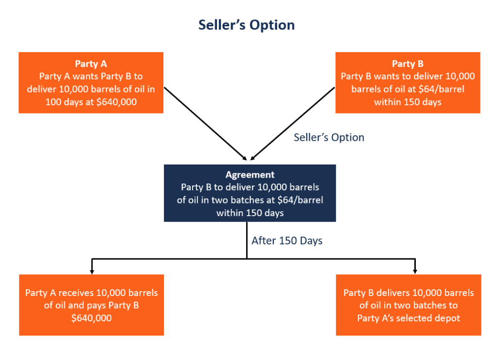

## Table of Contents

## What is a seller's option?

A seller's option is a type of contract used in real estate or other sales. It gives the seller the right to decide something important about the sale. For example, the seller might be able to choose the closing date. This is different from a normal sale, where the buyer and seller agree on everything together.

This option can be helpful for sellers. It gives them more control over the sale process. They can wait for a better time to sell or choose a date that works best for them. But, it can also make things harder for buyers. They might have to wait longer or deal with uncertainty. Both the buyer and seller need to understand the option clearly before agreeing to it.

## How does a seller's option work in trading?

In trading, a seller's option is a type of contract that gives the seller the right to decide when to deliver the goods or complete the sale. This is often used in commodity trading, where the seller might want to wait for a better price or a more convenient time to deliver. For example, if a farmer is selling wheat, they might use a seller's option to choose the best time to sell their crop based on market conditions.

This option can be beneficial for the seller because it gives them more control over the timing of the sale. They can wait for prices to go up or for other favorable conditions. However, it can be challenging for the buyer, who might have to wait longer or deal with uncertainty about when they will receive the goods. Both the buyer and seller need to clearly understand the terms of the option before entering into the agreement.

## What are the key components of a seller's option?

A seller's option includes a few important parts. First, there is the right to choose. This means the seller can pick when to finish the sale or deliver the goods. This part is very important because it gives the seller control. Second, there is a time limit. The seller can't wait forever. They have to make their choice before a certain date. This helps keep things fair for the buyer.

Another part is the price. Sometimes, the price can change based on when the seller decides to sell. If the seller waits for a better time, the price might go up. But it could also go down. This makes the option a bit risky for both the seller and the buyer. Finally, there are rules about how the option can be used. Both the seller and buyer need to know these rules well. This helps avoid surprises and keeps the deal fair for everyone.

## In what markets are seller's options commonly used?

Seller's options are often used in markets where the timing of a sale can make a big difference. One of these markets is agriculture. Farmers might use seller's options when selling crops like wheat or corn. They can wait for the best time to sell, hoping to get a higher price. This helps them make more money from their hard work. Real estate is another market where seller's options are common. Home sellers might use these options to choose the best time to close the deal. This can help them move when it's most convenient or when they can get the best price.

In commodity markets, seller's options are also popular. These markets deal with raw materials like oil, metals, and grains. Sellers in these markets can use options to wait for better prices or more favorable delivery times. This can be very helpful when prices go up and down a lot. In the stock market, seller's options are less common, but they can still be used. For example, a company selling shares might use a seller's option to decide when to sell, based on market conditions. This gives them more control over the sale process.

## What are the benefits of using a seller's option for a seller?

Using a seller's option gives a seller more control over when they sell their goods or property. This can be really helpful because it lets them wait for a better time to sell. For example, a farmer can wait for the price of their crops to go up before selling. Or a homeowner can choose a closing date that works best for them. This control can help sellers make more money or make the sale easier.

Another benefit is that sellers can plan better. Knowing they can choose when to sell helps them prepare for the future. They can make decisions based on what's happening in the market or in their life. This can reduce stress and make the whole process smoother. But sellers need to be careful because waiting too long can sometimes mean missing out on a good deal.

## What are the risks associated with seller's options for buyers?

When a buyer agrees to a seller's option, they take on some risks. One big risk is not knowing when the sale will happen. The seller gets to choose the time, so the buyer has to wait. This can make it hard for the buyer to plan. They might need the goods or property at a certain time, but they can't be sure when they'll get it.

Another risk is that the price might change. If the seller waits for a better time to sell, the price could go up. This means the buyer might end up paying more than they expected. Or, if the market goes down, the seller might not want to sell at all. This leaves the buyer without the goods or property they need. Buyers need to think about these risks before agreeing to a seller's option.

## How can a seller's option be structured in a contract?

A seller's option can be structured in a contract by clearly stating that the seller has the right to choose when to complete the sale or deliver the goods. The contract should include a specific time frame within which the seller must make their decision. This helps to ensure that the buyer does not have to wait indefinitely. The contract should also outline any conditions that might affect the seller's decision, such as market prices or other factors. This way, both the buyer and seller know what to expect.

In addition, the contract should detail how the price might change based on when the seller decides to sell. If the price can go up or down, this should be clearly explained. The contract should also include any rules about how the seller's option can be used, to avoid any confusion or disagreements later on. By having all these details in the contract, both parties can feel more secure about the deal and understand their rights and responsibilities.

## What is the difference between a seller's option and a buyer's option?

A seller's option and a buyer's option are two different types of agreements that give control to different people in a sale. A seller's option gives the seller the right to decide when to complete the sale or deliver the goods. This means the seller can wait for a better time to sell, like when the price is higher or when it's more convenient for them. The buyer has to wait and might not know when they will get the goods or property.

On the other hand, a buyer's option gives the buyer the right to decide if and when they want to buy. This means the buyer can choose the best time for them to complete the purchase. They might wait for a lower price or until they are ready to use the goods or property. The seller has to be ready to sell whenever the buyer decides, which can be challenging for them. Both types of options help one side have more control, but they also come with risks for the other side.

## How do regulatory frameworks impact the use of seller's options?

Regulatory frameworks can affect how seller's options are used in different markets. Governments and organizations make rules to keep things fair and clear for everyone. These rules can say how long a seller can wait before they have to sell. They can also say what information needs to be in the contract. This helps make sure that buyers know what they are agreeing to and don't get surprised later.

Sometimes, these rules can make it harder for sellers to use options. For example, if the rules say the seller can only wait a short time, they might not be able to wait for a better price. This can make seller's options less useful for them. But the rules also protect buyers by making sure they know when they will get their goods or property. This balance helps keep the market fair for everyone involved.

## Can you provide an example of a successful use of a seller's option?

A farmer named John used a seller's option to sell his wheat. He knew that the price of wheat could go up later in the year. So, he made a deal with a buyer that let him choose when to sell his wheat. John waited until the price was high and then sold his wheat. He made more money than if he had sold it right away. This helped him pay for his farm and have more money for the next year.

The buyer agreed to the seller's option because they knew they would get good wheat from John. They were willing to wait because they trusted John and wanted to keep doing business with him. Even though they had to wait, they were happy with the deal because they got the wheat they needed at a fair price. Both John and the buyer were happy with how the seller's option worked out.

## What strategies can be employed to mitigate risks when dealing with seller's options?

To mitigate risks when dealing with seller's options, sellers should carefully plan their timing. They need to watch the market closely and have a good idea of when prices might go up or down. Sellers should also set a clear time limit in the contract, so they don't wait too long and miss out on a good deal. It's important for sellers to communicate well with the buyer, so both sides understand the plan and feel comfortable with the option.

Buyers can reduce risks by making sure the contract has a clear end date for the seller's decision. They should also talk about the price and how it might change. Buyers can ask for updates from the seller to know when they might get the goods or property. By understanding the market and the seller's plans, buyers can feel more in control and less worried about waiting. Both sellers and buyers need to work together and be clear about their expectations to make the seller's option work well for everyone.

## How do advanced financial models assess the valuation of seller's options?

Advanced financial models use special math to figure out how much a seller's option is worth. They look at things like how long the seller can wait, what the price might do, and how much the price might change. These models use numbers to guess what will happen in the future. They help sellers and buyers see if the option is a good deal. By using these models, people can make better choices about when to sell or buy.

One common way to value a seller's option is by using a model called the Black-Scholes model. This model helps people understand how the price of something might change over time. It uses numbers to show how much risk there is and what might happen if the seller waits. The model can tell sellers when it might be best to sell to make the most money. For buyers, it shows how much they might have to pay if they wait for the seller to decide.

## References & Further Reading

[1]: Ahrens, K. (2019). ["The Impact of Algorithmic Trading on Real Estate Markets."](https://www.semanticscholar.org/paper/Assessing-the-Impact-of-Algorithmic-Trading-on-A-Gsell/820fa261b451f5b57decf4f8ccf526247fcbc2ff) Journal of Real Estate Finance and Economics.

[2]: Lopez de Prado, M. (2018). ["Advances in Financial Machine Learning."](https://www.amazon.com/Advances-Financial-Machine-Learning-Marcos/dp/1119482089) Wiley.

[3]: Chan, E. P. (2013). ["Algorithmic Trading: Winning Strategies and Their Rationale."](https://github.com/ftvision/quant_trading_echan_book) Wiley.

[4]: Jansen, S. (2020). ["Machine Learning for Algorithmic Trading: Predictive models to extract signals from market and alternative data for systematic trading strategies."](https://github.com/stefan-jansen/machine-learning-for-trading) Packt Publishing.

[5]: Teo, J. (2021). ["The Role of Algorithms in the Evolution of Real Estate Transactions."](https://www.annualreviews.org/content/journals/10.1146/annurev-soc-090820-020800) Financial Decision Making.