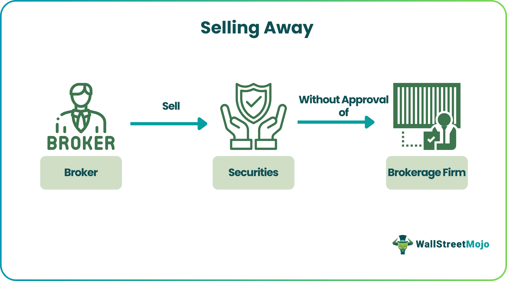

In the ever-evolving world of finance, investment advising, financial regulations, and trading strategies are constantly evolving. The landscape is significantly shaped by the rise of algorithmic trading (algo trading), wherein investment advisors and regulatory bodies strive to keep pace with rapidly advancing technologies. This development necessitates an understanding of complex financial concepts and the formulation of strategies to effectively harness these changes.

This article explores key aspects of investment advising, financial regulation, the concept of ‘selling away,’ and the implications of algo trading. Algorithmic trading, characterized by the use of sophisticated computer algorithms to manage trading activities, is a prime example of technology's influence on financial markets. These algorithms allow for high-speed trading, offering precise and efficient trading capabilities that were previously unattainable through manual processes.



Understanding these concepts is essential for both investors and advisors to navigate the complexities of the financial market. As financial technology continues to evolve, both regulatory frameworks and advisory roles are challenged to adapt. Without proper awareness and adaptation, the rapid pace of technological innovation may outstrip existing controls, potentially leading to market inefficiencies or regulatory oversights.

In conclusion, gaining insights into these aspects not only equips investors and advisors with the necessary knowledge to make informed decisions but also reinforces the imperative of ongoing education in a continuously transforming financial environment.

## Table of Contents

## Understanding Investment Advising

Investment advising is a pivotal component of the financial industry, providing individuals and institutions with expert guidance to make strategic investment decisions. Advisors play a critical role in evaluating a client's financial goals, assessing their risk tolerance, and analyzing current market conditions to recommend appropriate financial products. This personalized advice helps clients to construct diversified portfolios that align with their objectives, whether it be capital growth, income generation, or risk management.

Traditionally, investment advisors operate on a one-on-one basis with clients, offering personalized advice and managing portfolios. This role involves extensive research and continuous monitoring of market trends to ensure that investment strategies remain aligned with the client's goals. Advisors typically focus on asset allocation, balancing various types of investments such as stocks, bonds, and mutual funds to optimize returns relative to the client's risk appetite.

With advancements in technology, the landscape of investment advising is undergoing a significant transformation. The emergence of robo-advisors is reshaping the traditional advisory model by providing automated, algorithm-driven financial planning services with minimal human intervention. These platforms assess a client's financial situation and preferences using initial questionnaires, then employ sophisticated algorithms to develop and manage investment portfolios. As a result, robo-advisors offer a cost-effective and accessible alternative for clients, particularly those with smaller asset bases who might not engage traditional advisors.

Additionally, the rise of [algorithmic trading](/wiki/algorithmic-trading) platforms is influencing the advisory sector by introducing faster, data-intensive strategies that capitalize on market inefficiencies. Algorithmic trading employs pre-programmed instructions accounting for variables like timing, price, and [volume](/wiki/volume-trading-strategy) to execute trades far more swiftly than human traders. The integration of these platforms into advisory services necessitates a shift in the advisor's role toward interpreting complex data outputs and maintaining the human element of risk assessment and strategic planning.

As technology continues to evolve, investment advisors are increasingly required to blend traditional skills with technological acuity. Those willing to adapt by leveraging data analytics and tech-driven tools can offer more robust and comprehensive advisory services. This evolution fosters a dynamic environment where advisors can provide enhanced value, balancing the precision and efficiency of algorithms with personalized insights that address the nuanced needs of individual clients.

## The Role of Financial Regulation

Financial regulation serves as a cornerstone for maintaining the integrity and stability of financial markets. It ensures that the interests of investors are safeguarded and that financial activities are conducted fairly and transparently. Regulatory frameworks are designed to mitigate risks that can arise from various financial transactions, thereby enhancing market confidence and preventing systemic crises.

One of the primary objectives of financial regulation is investor protection. This includes implementing measures to prevent fraud, ensuring the proper disclosure of information, and establishing standards for advisor conduct. By requiring transparent disclosures, regulations help investors make informed decisions, reducing the likelihood of misunderstanding or deception regarding financial products and services.

Ensuring fair practices is another critical aspect of financial regulation. Regulatory bodies work to prevent market manipulation and other unfair practices that can distort market operations. For example, regulations may prohibit insider trading or establish rules for the fair treatment of all market participants. These measures ensure a level playing field, promoting competitive and efficient markets.

Risk mitigation is also a fundamental aim of financial regulation. Financial markets are inherently exposed to various risks, including credit risk, [liquidity](/wiki/liquidity-risk-premium) risk, and operational risk. Regulations address these risks through rules on capital adequacy, liquidity requirements, and risk management practices. By setting these standards, regulators help prevent the build-up of excessive risk within financial institutions that could lead to broader market instability.

In the United States, major regulatory bodies such as the Securities and Exchange Commission (SEC) and the Financial Industry Regulatory Authority (FINRA) play crucial roles in overseeing financial markets. The SEC is primarily responsible for enforcing federal securities laws, regulating securities markets, and protecting investors. It sets rules for trading activities and requires regular disclosures from companies to ensure markets function smoothly and transparently.

FINRA, on the other hand, oversees brokerage firms and their registered representatives. It establishes rules regarding advisor conduct and enforces regulations to ensure the ethical treatment of clients. For instance, FINRA's rules mandate that advisors must prioritize their clients' best interests, thereby promoting trust in the advisor-client relationship.

In summary, financial regulation is essential for ensuring the stability, fairness, and transparency of financial markets. Regulatory bodies like the SEC and FINRA play a pivotal role in setting and enforcing rules that protect investors, promote fair trading environments, and mitigate risks associated with financial activities. Through these efforts, financial regulation supports the overall health and resilience of the financial system.

## Explaining 'Selling Away' in Financial Services

'Selling away' in financial services occurs when a broker offers clients securities not approved by their brokerage firm. This practice can lead to significant regulatory violations and risks for both the broker and the client. From a regulatory standpoint, selling away is concerning because it undermines the oversight that brokerage firms are supposed to have over the investment products their brokers offer. By circumventing this oversight, brokers may expose clients to investments that have not been subjected to the rigorous vetting processes designed to ensure suitability and compliance with financial laws.

For investors, the risks associated with selling away are substantial. Since the securities offered have not been approved by the brokerage firm, they might not meet the firm's standards for risk and transparency. This lack of approval could mean that these investment opportunities are either high-risk, lack essential disclosures, or are outright fraudulent. Consequently, investors might find themselves holding investments that are unsuitable for their financial goals and risk tolerance, potentially leading to financial losses.

Regulatory bodies such as the Financial Industry Regulatory Authority (FINRA) and the U.S. Securities and Exchange Commission (SEC) have established rules to prevent such practices. For example, FINRA Rule 3280 stipulates that brokers must notify their employers of any outside business activities, including the sale of securities not offered by the firm. By doing so, the firm can exercise its supervisory responsibilities, ensuring that its brokers do not expose clients to unsuitable products. This requirement emphasizes the need for transparency and accountability in financial transactions, safeguarding investor interests.

Understanding the implications of selling away is crucial for both investors and financial professionals. Investors should demand full disclosure about the approval status of any security their broker recommends, while brokers should adhere strictly to their firm's policies. Remaining vigilant about the securities being offered can protect investors from unvetted financial products and maintain the integrity of the financial services industry.

## The Rise of Algorithmic Trading

Algorithmic trading, commonly known as algo trading, leverages computer algorithms to make and execute trading decisions automatically. These algorithms utilize predetermined criteria—such as timing, price, and volume—to initiate and close trades at speeds and frequencies that a human trader cannot match. The primary advantages of algo trading include increased speed and efficiency, reduced transaction costs, and the elimination of emotional biases in trading decisions.

Despite its benefits, algorithmic trading introduces significant complexities and compliance challenges. One of the primary concerns is the increased market [volatility](/wiki/volatility-trading-strategies) that can result from high-frequency trading ([HFT](/wiki/high-frequency-trading-strategies)), a subset of algo trading, which executes a large number of orders at extraordinary speeds. The flash crash of May 6, 2010, when major U.S. stock indices dropped and rebounded rapidly within minutes, raised awareness of the potential risks associated with algorithmic trading. Such market disruptions necessitate robust risk management and surveillance systems.

Regulators find it challenging to keep pace with the rapid technological advancements in trading systems. The complexity of algorithms, coupled with the opaque nature of some trading strategies, can hinder effective oversight. Fragmented awareness among regulators arises because different trading platforms may implement varying standards and technologies, leading to inconsistencies in monitoring and enforcement.

To address these challenges, regulatory bodies across the globe have taken steps toward implementing stricter oversight mechanisms. For instance, the U.S. Securities and Exchange Commission (SEC) and the Commodity Futures Trading Commission (CFTC) have introduced measures requiring more detailed reporting and transparency in the operations of algorithmic trading systems. Moreover, trading firms are encouraged to implement rigorous testing and validation processes for their algorithms to ensure they operate as intended and do not adversely impact market stability.

In summary, while algorithmic trading offers notable advantages in terms of speed and efficiency, it also presents complexities and compliance challenges that require careful regulation and oversight. As technology continues to advance, regulators must adapt and enhance their frameworks to manage the risks associated with modern trading practices effectively.

## Implications of Algo Trading on Financial Regulation

Algorithmic trading, commonly known as algo trading, has revolutionized how trading is conducted in financial markets. As its adoption becomes widespread, regulatory bodies are compelled to develop new frameworks that ensure the integrity and stability of the financial system. The primary objectives in this evolving landscape include ensuring transparency, preventing market manipulation, and safeguarding investors from potential risks.

### Ensuring Transparency

Transparency in algorithmic trading involves making sure that trades are conducted fairly and that information is equally accessible to all market participants. Regulatory bodies emphasize the disclosure of trading algorithms' structure and intent, which helps maintain a level playing field. Higher transparency reduces the likelihood of unfair practices and builds investor confidence.

One approach to enhancing transparency is requiring detailed reporting of algorithmic trading activities. This includes mandating that trading firms submit logs and data regarding the decision-making processes of their algorithms. Such data helps regulators monitor for aberrant trading patterns that could indicate manipulative behaviors.

### Preventing Market Manipulation

Market manipulation remains a significant concern in algo trading. Techniques like spoofing—where traders place orders they intend to cancel to influence stock prices—are particularly problematic in high-frequency trading environments. To counteract such practices, regulators necessitate robust surveillance systems that leverage [machine learning](/wiki/machine-learning) and data analytics to detect suspicious trading behavior.

For instance, employing anomaly detection algorithms can aid in identifying unusual patterns that deviate from normal trading activities. Here is a simple Python snippet using `scikit-learn` to illustrate anomaly detection using Isolation Forest:

```python
from sklearn.ensemble import IsolationForest
import numpy as np

# Sample trading data
X = np.array([[100, 3], [110, 2], [120, 5], ..., [300, 50]]) # hypothetical trading data features

# Fit the model
clf = IsolationForest(random_state=0).fit(X)

# Predict anomalies
predictions = clf.predict(X)
anomalies = X[predictions == -1]
print(f"Detected anomalies:\n{anomalies}")
```
This basic example highlights how data analysis tools can complement regulatory efforts to uphold market integrity.

### Protecting Investors

Investor protection is paramount as algo trading algorithms become more complex. Regulators focus on ensuring that trading algorithms do not exploit investors, particularly less sophisticated market participants who might be disadvantaged by high-speed trading systems. Guidelines and compliance requirements are instituted to protect investors from predatory practices and to foster trust in automated systems.

### Collaboration for Effective Oversight

The rapid pace of technological advancement necessitates a collective effort among regulatory bodies, financial institutions, and tech developers. Collaboration enables the sharing of insights and resources vital to crafting efficient regulation and compliance tools. Cross-border cooperation is also crucial, as trading often transcends national jurisdictions.

Engaging tech developers in the regulatory process ensures that the established guidelines are technologically feasible and adequately address potential risks associated with new advancements. Simultaneously, financial institutions can offer practical perspectives on implementation challenges, contributing to the development of balanced regulations.

In conclusion, the proliferation of algo trading has pressed regulatory bodies to innovate and adapt their oversight mechanisms continually. Ensuring transparency, preventing manipulation, and protecting investors remain central regulatory aims. Achieving these requires not only technological tools and qualitative insights but also a coordinated effort across the financial ecosystem.

## The Future of Investment Advising and Regulation

As financial technologies continue to evolve, the landscape of investment advising and regulation will need to adapt. The incorporation of advanced tools and integrated platforms is expected to redefine how advisors and regulators operate. This evolution is characterized by several key trends that promise to shape the future of financial services.

One significant trend is the rise of more integrated platforms. These platforms are designed to combine various financial services, providing clients with a seamless experience. Such platforms could potentially merge investment advising with personal banking, insurance, and other financial products, making it easier for clients to manage their financial portfolios comprehensively. Integration allows for better data analysis and provides a holistic view of a client's financial status, enabling more personalized and accurate advice.

Advanced AI tools are also anticipated to play a crucial role in the future of investment advising. Machine learning algorithms can analyze vast amounts of data at unprecedented speeds, identifying patterns and predicting market trends more accurately than traditional methods. For instance, AI-driven tools can assess a client's risk tolerance and investment goals, automatically adjusting portfolio allocations to optimize returns or reduce risk. These tools can enhance decision-making processes, offering predictions and insights that are data-informed and evidence-backed.

The implementation of AI tools requires ethical considerations and poses regulatory challenges. Ensuring that AI systems operate transparently and without biases is critical for maintaining client trust and fair market practices. Regulators will need to establish guidelines that balance innovation with consumer protection, ensuring that AI enhances rather than undermines market integrity.

Enhanced regulatory frameworks are essential in this rapidly evolving environment. As technology advances, regulatory bodies are tasked with updating existing frameworks to address new risks and ensure fair practices. This may involve creating new laws or revising existing regulations to accommodate developments like algorithmic trading and digital assets. Collaborative efforts between tech developers, financial institutions, and regulators will be crucial in crafting regulations that are both effective and adaptive.

Additionally, staying informed about technological advancements and market trends will be essential for advisors and regulators. Continuous education and professional development programs can help financial professionals keep pace with innovations and regulatory changes. Leveraging technology ethically while understanding its implications can aid professionals in effectively navigating the evolving landscape.

In conclusion, as financial technologies advance, the future of investment advising and regulation will demand adaptability and foresight. Embracing integrated platforms, advanced AI tools, and robust regulatory frameworks will be vital strategies for professionals aiming to excel in a transformed financial landscape.

## Conclusion

Investment advising, financial regulation, and trading methods like algorithmic trading form a complex and interconnected system within modern finance. Each element impacts the others, and their alignment ensures the stability and efficiency of financial markets. Investment advisors play crucial roles in guiding investors, while regulatory bodies enforce standards that safeguard market integrity. Algorithmic trading, with its high-speed technology, enhances trade efficiency but also introduces new compliance challenges.

For financial professionals and consumers, a robust understanding of regulatory compliance and the technological impacts on trading and investment practices is crucial. The rapid pace of technological advancements necessitates continuous learning and adaptation. Financial professionals will need to leverage technology effectively and ethically to stay competitive and compliant. Similarly, consumers must remain informed to make sound investment decisions and to protect themselves against potential risks.

The landscape of finance is continually shaped by emerging technologies and evolving regulations. The ability to adapt quickly to changes, while maintaining a focus on ethical practices and regulatory compliance, will be key to success in the financial markets. As these sectors continue to evolve, stakeholders must prioritize education and agile strategies to navigate future challenges effectively.

## References & Further Reading

[1]: Bergstra, J., Bardenet, R., Bengio, Y., & Kégl, B. (2011). ["Algorithms for Hyper-Parameter Optimization."](https://papers.nips.cc/paper/4443-algorithms-for-hyper-parameter-optimization) Advances in Neural Information Processing Systems 24.

[2]: ["Advances in Financial Machine Learning"](https://www.amazon.com/Advances-Financial-Machine-Learning-Marcos/dp/1119482089) by Marcos Lopez de Prado

[3]: ["Evidence-Based Technical Analysis: Applying the Scientific Method and Statistical Inference to Trading Signals"](https://www.amazon.com/Evidence-Based-Technical-Analysis-Scientific-Statistical/dp/0470008741) by David Aronson

[4]: ["Machine Learning for Algorithmic Trading"](https://github.com/stefan-jansen/machine-learning-for-trading) by Stefan Jansen

[5]: ["Quantitative Trading: How to Build Your Own Algorithmic Trading Business"](https://www.amazon.com/Quantitative-Trading-Build-Algorithmic-Business/dp/1119800064) by Ernest P. Chan