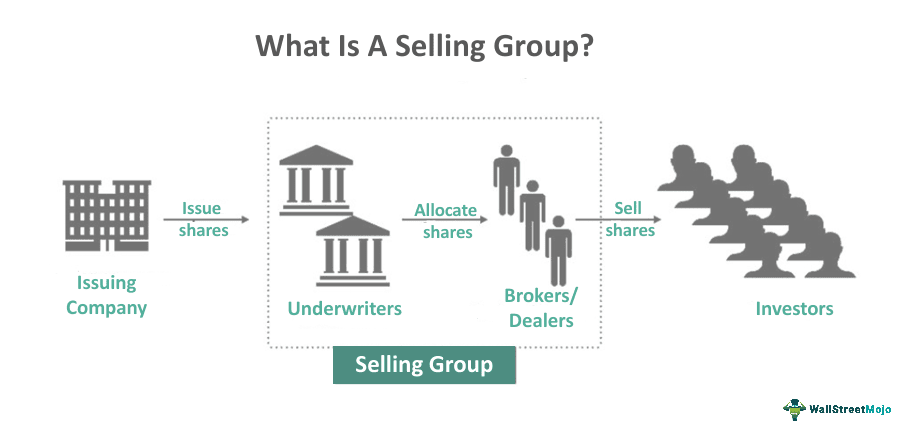

The financial landscape is continually evolving, with technological advancements transforming traditional processes across various sectors. One significant development in this context is the integration of algorithmic trading within financial markets, underwriting, and the dynamics of selling groups. The seamless fusion of these elements has brought about considerable changes in how financial transactions are conducted and managed.

Algorithmic trading employs sophisticated algorithms to automate the trading process, significantly improving the speed and efficiency of financial transactions. By integrating algorithmic trading into financial markets, underwriting processes, and selling group activities, the efficiency and accuracy of trading operations have been enhanced, promoting more informed and timely decision-making. This integration is particularly evident as algorithms generate trading signals and execute trades much faster than human traders, thus facilitating market operations.



Moreover, in underwriting and selling group dynamics, algorithmic trading assists in risk assessment and market condition evaluations. It enables underwriters to make precise pricing decisions based on comprehensive data analytics and real-time market insights. Selling groups benefit from improved distribution strategies and market access optimization, ensuring that securities reach a broader audience more effectively.

The intricate connections between these elements significantly impact modern finance by improving market efficiency, accuracy, and decision-making processes. By enhancing the functionality of financial markets through technological innovations, these integrations support a more dynamic and responsive financial ecosystem. The objective here is to clarify the complex world of financial markets, selling groups, underwriting, and algorithmic trading, presenting a cohesive understanding of their combined role in shaping the present and future state of global finance.

## Table of Contents

## Understanding Financial Markets

Financial markets serve as platforms where various assets, including stocks, bonds, commodities, and currencies, are bought and sold. These markets are crucial for the economy because they facilitate essential functions such as price discovery, risk management, and liquidity provision. Price discovery is a process through which market prices are determined based on supply and demand dynamics, allowing investors to make informed decisions. Risk management is enabled through diverse financial instruments, such as derivatives, which participants use to hedge against potential losses. The liquidity in financial markets ensures that participants can quickly buy or sell assets with minimal impact on the asset's price.

The participants in financial markets are diverse and range from individual retail investors to large, institutional entities like pension funds, hedge funds, banks, and insurance companies. These participants engage in market activities for various reasons, such as investment, speculation, hedging, and arbitrage, contributing to the market's complexity and depth.

Technological advancements, particularly [algorithmic trading](/wiki/algorithmic-trading), have significantly transformed financial markets by enhancing speed and efficiency. Algorithmic trading employs sophisticated algorithms to automate trading processes, allowing for rapid execution of trades that surpasses human capabilities. This technology has introduced high-frequency trading ([HFT](/wiki/high-frequency-trading-strategies)), where trades are executed in fractions of a second, significantly increasing turnover in financial markets.

Automation is a critical driver of change in financial markets, fundamentally altering how trades are executed and how information is processed. It enables market participants to implement complex trading strategies that incorporate large volumes of data and adjust rapidly to market conditions. This evolution toward automated trading systems reduces human errors and emotional biases, promoting data-driven decision-making.

The integration of technology into financial markets also presents challenges, such as the need for robust cybersecurity measures to protect against data breaches and system failures. It requires continuous advancements in infrastructure to support the increasing [volume](/wiki/volume-trading-strategy) and complexity of trades. Furthermore, regulatory frameworks must evolve to keep pace with technological changes, ensuring market integrity and protecting investor interests.

In summary, financial markets are vital components of the global economy, offering platforms for buying and selling various assets while providing essential functions like price discovery and [liquidity](/wiki/liquidity-risk-premium) provision. The landscape of these markets is continually being reshaped by technological advancements, with algorithmic trading playing a pivotal role in enhancing market efficiency and operational processes.

## Role of Selling Groups in Financial Markets

A selling group comprises financial institutions responsible for the distribution and marketing of newly issued or secondary securities within the financial markets. Although these entities do not partake directly in the underwriting process, their role is crucial in ensuring that securities are distributed to a wide audience. Through its extensive network, a selling group can efficiently optimize the distribution and sales of new issues, enhancing the reach and accessibility of these securities.

The structure of a selling group typically includes several types of financial institutions, such as brokerage firms, investment banks, and other financial intermediaries, each playing a part in the marketing and sales process. These institutions collaborate to pool resources, share risks, and maximize the dissemination of new securities to the market. This collaborative effort is not only instrumental in reaching a broad audience but also supports the liquidity of the securities markets by facilitating the buying and selling of these financial instruments.

Selling groups play a vital role in maintaining market liquidity, a critical [factor](/wiki/factor-investing) for the smooth functioning of financial markets. Liquidity refers to the ease with which an asset can be bought or sold in the market without affecting its price. By dispersing new issues widely and ensuring they are available to a broad spectrum of investors, selling groups help maintain appropriate levels of supply and demand, supporting price stability and reducing [volatility](/wiki/volatility-trading-strategies).

The efficient functioning of selling groups also complements the efforts of underwriting syndicates. While underwriters determine the initial pricing and manage the risk associated with new securities, selling groups enhance the distribution network needed to bring these securities to market. This synergy is vital in achieving balanced and efficient markets, as it allows for the quick and smooth absorption of new securities.

In conclusion, understanding the function and structure of a selling group offers valuable insights into the broader financial ecosystem. Their operations are integral to ensuring robust market liquidity and stability, ultimately contributing to a more efficient financial market environment.

## The Mechanics of Underwriting

Underwriting is a fundamental component of financial markets, focusing on the evaluation of risk and the establishment of pricing and terms for issuing securities. Underwriters, typically large financial institutions, assume the initial risk of unsold securities, ensuring that issuers receive the capital they seek while managing the potential financial burden associated with these assets. They operate as intermediaries between the issuer and the public, facilitating the introduction of new securities to the market.

The underwriting process begins with assessing a company's financial health and market conditions to determine its ability to meet future obligations. This involves scrutinizing financial statements, credit ratings, and market trends. The critical task of setting the pricing and terms for securities issuance lies heavily on accurate risk evaluation. Underwriters conduct thorough due diligence, sampling various aspects of the company's operations and external economic factors to forecast potential perils and opportunities.

Moreover, underwriters gauge the market's capacity to absorb new securities, which is vital for successful offerings. They assess investor sentiment and demand, leveraging their deep market insights to predict the level of interest in a new issue. This evaluation helps in determining the issue size and pricing strategy, aiming to strike a balance between issuer aspirations and market realities.

Technological advancements have significantly transformed traditional underwriting methods. Data analytics and Artificial Intelligence (AI) have enhanced risk evaluation and decision-making processes. By employing sophisticated algorithms, underwriters can analyze vast amounts of data swiftly, uncover patterns, and derive insights that might be missed manually. For example, [machine learning](/wiki/machine-learning) algorithms can predict the probability of defaults or identify correlations within datasets, offering a more nuanced risk assessment.

A simple Python example of using a machine learning model like logistic regression to predict credit risk (probability of default) could be illustrated as follows:

```python
from sklearn.model_selection import train_test_split
from sklearn.linear_model import LogisticRegression
from sklearn.metrics import classification_report, accuracy_score
import pandas as pd

# Load dataset (hypothetical data)
data = pd.read_csv('credit_data.csv')
X = data[['income', 'credit_score', 'debt_to_income']]
y = data['default']

# Split into train and test sets
X_train, X_test, y_train, y_test = train_test_split(X, y, test_size=0.3, random_state=42)

# Create logistic regression model
model = LogisticRegression()
model.fit(X_train, y_train)

# Predict and evaluate
predictions = model.predict(X_test)
print("Accuracy:", accuracy_score(y_test, predictions))
print(classification_report(y_test, predictions))
```

This capability to process data in real-time improves the precision of underwriting decisions, ensuring that securities are priced accurately and that the issuer's risk is minimized. Algorithmic approaches not only expedite the underwriting process but also facilitate more informed decision-making, allowing underwriters to respond swiftly to changing market dynamics. The integration of these technologies signifies a shift towards a more efficient and robust underwriting framework, crucial for supporting the complexities of modern financial markets.

## Algorithmic Trading: Transforming Financial Transactions

Algorithmic trading, often referred to as algo trading, is a method of executing orders using automated and pre-programmed trading instructions that account for variables such as time, price, and volume. This approach leverages advanced algorithms to automate trading processes, enabling rapid execution of trades that exceed human capabilities in terms of speed and efficiency.

One of the primary advantages of algorithmic trading is its ability to execute trades at a fraction of a second. This speed allows traders to capitalize on favorable market conditions and fleeting opportunities, which would be impossible for manual trading. Algorithmic trading significantly reduces the likelihood of human error and minimizes the impact of emotional bias, thereby promoting data-driven decision-making.

Various strategies are employed in algorithmic trading to optimize transactions, each serving a distinct purpose within the market. Trend-following is a common strategy where algorithms are programmed to initiate trades based on existing price trends, reducing the need for predicting market behavior. Arbitrage is another popular strategy, wherein traders exploit price differences of identical or similar financial instruments across different markets or forms. For instance, algorithmic systems can swiftly identify and leverage disparities in asset pricing between a stock exchange and a futures market. Mean reversion strategies rely on the assumption that an asset's price will revert to its mean or average price over time, guiding algorithmic systems to execute buy or sell orders when prices deviate significantly from the norm.

The impact of algorithmic trading extends throughout market operations, altering the dynamics significantly. As algorithms handle the execution, they facilitate increased market liquidity by ensuring that a steady flow of buy and sell orders is maintained. This, in turn, aids in narrowing spreads and maintaining competitive pricing within markets. Furthermore, the enhanced data processing capabilities of algorithms enable comprehensive analysis and modeling of market behavior, informing more precise trading strategies.

Algorithmic trading represents a transformative shift in financial transactions, redefining how trades are conducted and markets operate. As technology continues to advance, its role in reshaping the financial landscape becomes ever more pronounced, fostering an environment driven by efficiency and informed decision-making.

## Integration of Algo Trading in Underwriting and Selling Groups

Algorithmic trading, commonly referred to as algo trading, is increasingly integrated into the underwriting processes and selling group activities within financial markets. This integration is facilitating a more precise estimation of market conditions and improving risk management across these financial functions. By leveraging advanced algorithms and real-time data processing, selling groups can enhance their distribution strategies to effectively reach a broader market audience. This capability allows them to adapt quickly to shifts in demand and market dynamics, ensuring the efficient placement of securities.

In underwriting, algo trading provides remarkable enhancements to risk assessment and pricing strategies. The use of algorithms allows underwriters to analyze vast datasets quickly, identifying trends and patterns that inform better decision-making. Algorithms can simulate various market scenarios, enabling underwriters to anticipate potential market responses and adjust pricing or issuance strategies accordingly. This results in more accurate pricing models, reducing the underwriter's exposure to unsold securities.

Real-time data processing capabilities brought by algorithmic trading create a substantial synergetic effect between underwriting and selling groups. With continuous access to live market data, both entities can make informed choices that support a more dynamic and responsive financial environment. Selling groups can use this information to finetune their offerings, while underwriters can mitigate risks by adjusting their strategies in response to evolving market conditions.

Python code, for instance, can be utilized to exemplify how predictive analytics models are used to forecast market trends. Here's a basic example of a linear regression model using Python that can help in predicting market activity:

```python
import pandas as pd
from sklearn.model_selection import train_test_split
from sklearn.linear_model import LinearRegression
import numpy as np

# Sample data
data = pd.DataFrame({
    'Market_Indicator': np.random.rand(100),
    'Security_Price': np.random.rand(100) * 100
})

# Split the data into training/testing sets
train, test = train_test_split(data, test_size=0.2)

# Split the training data into input and output variables
X_train = train[['Market_Indicator']]
y_train = train['Security_Price']

# Create linear regression object and train the model
regressor = LinearRegression()
regressor.fit(X_train, y_train)

# Predict using the test input
X_test = test[['Market_Indicator']]
predictions = regressor.predict(X_test)

# Display coefficients and make predictions
print('Coefficients:', regressor.coef_)
predicted_security_prices = regressor.predict(X_test)
```

This synergy between algo trading in underwriting and selling groups elevates the adaptability and responsiveness of financial systems to emerge market challenges and opportunities, fostering an environment where data-driven strategies can thrive. As technological advancements continue to permeate financial practices, the coupling of algorithmic trading within these areas demonstrates a progressive approach to achieving efficiency and innovation in modern finance.

## Advantages and Challenges of Algorithmic Approaches

Algorithmic trading has revolutionized the financial markets by introducing algorithms that enhance accuracy, minimize costs, and boost market liquidity. These algorithms are adept at processing large data sets quickly, allowing precise execution of trades and efficient management of investment portfolios. One of the significant advantages is the reduction in transaction costs due to high-frequency trading, which capitalizes on minimal price movements. Moreover, algorithmic approaches ensure improved market liquidity by increasing trade volumes and narrowing bid-ask spreads, contributing to a more

## Conclusion

The convergence of financial markets, underwriting, selling groups, and algorithmic trading signifies a new era in finance. This integration has fundamentally redefined the landscape, indicating an era characterized by enhanced efficiency and innovation. Technological advancements have streamlined processes that were traditionally labor-intensive, offering heightened accuracy and reduced timeframes for execution. Participants in modern financial markets are now required to adapt swiftly to these advancements, employing new tools to maintain competitive edges in a rapidly evolving sector.

Embracing these technologies is not merely advantageous but essential for navigating future market challenges and opportunities. The requirement for a thorough understanding and implementation of algorithmic processes and data analytics has become critical as businesses strive to optimize operations and mitigate risks. Thus, the financial sector is increasingly reliant on the seamless blend of human insight and machine precision, where human expertise drives strategic decisions complemented by the computational power of algorithms.

The future of finance is poised to be integrated further, where continuous innovations promise not only to reshape traditional financial paradigms but also to introduce more robust solutions to emerging market demands. Ensuring the capacity to adapt and harness these technological advancements will be key for stakeholders wishing to sustain and enhance their market presence. As such, the financial industry stands on the cusp of transformation where progress dictates the balancing act between technological prowess and human judgment.

## References & Further Reading

- **Bergstra, J., Bardenet, R., Bengio, Y., & Kégl, B.**: Their work on hyper-parameter optimization is crucial for enhancing algorithmic techniques used in trading and risk management. Hyper-parameter tuning can significantly influence the performance of financial models, especially those used in high-frequency trading algorithms and underwriting risk assessments.

- **Lopez de Prado, M.**: His book, "Advances in Financial Machine Learning," provides insights into how machine learning tools are reshaping financial strategies. The methodologies discussed, including data structures and algorithmic frameworks, are relevant for improving efficiency and accuracy in financial transactions.

- **Fraser, J. R. S., & Simkins, B.**: "Enterprise Risk Management: Today's Leading Research and Best Practices" covers the latest research on risk management. Understanding these practices is essential for modern underwriting processes and selling group operations that rely heavily on precise risk evaluation and mitigation strategies.

- **Chan, E. P.**: "Algorithmic Trading: Winning Strategies and Their Rationale" offers a comprehensive look at the strategies that drive successful algorithmic trading. His insights into strategies like arbitrage, trend following, and mean reversion are instrumental for traders looking to optimize algorithmic approaches for maximum market impact.

- **Bäumlrich, A. D.**: In "Innovations in Insurance, Risk- and Asset Management," Bäumlrich explores cutting-edge developments in managing financial and insurance risks. These innovations are relevant for both underwriting and selling groups seeking to navigate complex market dynamics through enhanced algorithmic trading and data-driven decision-making.

These references are pivotal for anyone interested in the intersection of algorithmic trading, underwriting, and modern financial market structures. They provide foundational knowledge and advanced insights necessary to understand and leverage the evolving financial technologies.

