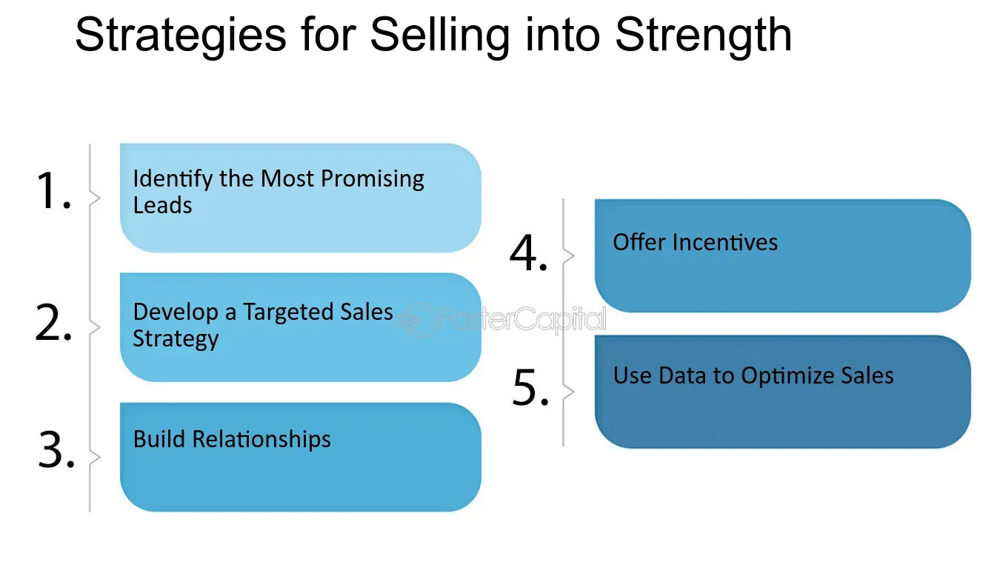

## Table of Contents

## What does 'selling into strength' mean in the context of trading and investing?

'Selling into strength' is a trading strategy where you sell an asset when its price is going up or is at a high point. This means you are taking advantage of the good times to sell, rather than waiting for the price to drop. It's like selling your house when the real estate market is hot, so you can get a better price.

This strategy is often used to lock in profits. If you bought a stock at a low price and it has gone up a lot, you might decide to sell it while it's still high. This way, you make sure you get the profit before the price might go down again. It's a way to be smart about when you sell, trying to get the best possible price.

## Why is selling into strength considered a good strategy for some investors?

Selling into strength is considered a good strategy for some investors because it helps them make the most money possible. When the price of something they own goes up, they sell it at that high price. This way, they lock in their profit before the price might go down again. It's like picking the best time to sell, when things are going well, instead of waiting and risking a lower price later.

This strategy also helps investors manage risk. By selling when the price is high, they avoid the chance of losing money if the price drops suddenly. It's a way to be safe and smart with their investments. Instead of hoping the price will keep going up, they take their profit and move on to the next opportunity.

## Can you explain the basic principles behind selling into strength?

Selling into strength is all about timing. When you own something like a stock and its price starts to go up, you might decide to sell it at that high point. The main idea is to sell when things are going well, instead of waiting and hoping the price will keep going up. By selling when the price is high, you make sure you get the most money you can from your investment.

This strategy also helps you avoid losing money. If you wait too long and the price drops, you might end up selling for less than you wanted. By selling into strength, you lock in your profit before the price can go down. It's a way to be smart and safe with your investments, taking your profit when you can and not risking it all on a hope that the price will keep rising.

## What are the key indicators that suggest it's time to sell into strength?

One key indicator that it might be time to sell into strength is when the price of your investment reaches a new high. If the price has been going up and up, and it hits a peak that's higher than before, that could be a good time to sell. You want to take your profit while the price is still high, before it might start to go down.

Another sign is when there's a lot of good news about the investment, and the price goes up because of it. If everyone is talking about how great the company is, and the price is going up because of all the excitement, that's a good time to think about selling. You can sell when everyone else is buying, and lock in your profit.

Lastly, if you see the price starting to slow down after going up a lot, that could be a warning sign. If the price isn't going up as fast as it was before, it might be starting to level off or even get ready to go down. That's a good time to sell into strength, before the price drops and you miss out on your profit.

## How does market sentiment influence the decision to sell into strength?

Market sentiment is how people feel about the market or a specific investment. If everyone is feeling good and excited about a stock, the price usually goes up. This positive sentiment can be a signal that it's a good time to sell into strength. When everyone is buying because they think the price will keep going up, you can sell your shares at a high price and lock in your profit.

On the other hand, if you start to see that people are getting less excited or even worried about the investment, it might be a sign that the price could go down soon. This change in sentiment can be a warning that it's time to sell into strength before the price drops. By paying attention to how people feel about the market, you can make smarter decisions about when to sell and make the most money.

## What are some common mistakes to avoid when trying to sell into strength?

One common mistake people make when trying to sell into strength is waiting too long. They see the price going up and up, and they think it will keep going higher. But if they wait too long, the price might start to go down, and they could miss out on their profit. It's important to sell when the price is high, not wait for it to go even higher.

Another mistake is not paying attention to market sentiment. If everyone is excited about a stock and the price is going up because of it, that's a good time to sell. But if people start to get worried or less excited, the price might go down soon. It's important to sell into strength before the sentiment changes and the price drops.

Lastly, some people might get too greedy. They see the price going up and want to make even more money, so they don't sell when they should. But being too greedy can lead to losing money if the price suddenly drops. It's better to take your profit when you can and be happy with what you made, instead of risking it all for a little more.

## Can you provide examples of stocks or assets that have been successfully sold into strength?

One example of selling into strength happened with Apple stock in early 2020. The stock had been going up a lot because of good news about their new products and strong sales. An investor who bought Apple stock at a lower price saw the price hit a new high in January 2020. They decided to sell their shares at that high price, locking in a big profit. A few months later, the stock price dropped because of the start of the COVID-19 pandemic. By selling into strength, the investor avoided losing money when the price went down.

Another example is with Bitcoin in late 2021. Bitcoin's price had been going up a lot, and it reached a new high in November 2021. Many people were excited about it, and the price kept going up because of all the positive sentiment. An investor who had bought Bitcoin earlier decided to sell some of their Bitcoin at that high price. They made a good profit and were happy with what they made. A few months later, the price of Bitcoin started to go down. By selling into strength, the investor was able to take their profit before the price dropped.

## How does selling into strength differ from other selling strategies like stop-loss orders?

Selling into strength is about selling an investment when its price is going up or at a high point. The idea is to take advantage of the good times to sell and lock in your profit before the price might go down. It's a strategy that tries to get the best possible price by selling when everyone else is buying and excited about the investment. This way, you can make the most money and avoid losing it if the price drops later.

On the other hand, a stop-loss order is a different kind of selling strategy. With a stop-loss order, you set a specific price at which you want to sell your investment automatically. This price is usually lower than the current price, and it's meant to limit your losses if the price goes down a lot. The stop-loss order sells your investment for you if it hits that low price, so you don't lose too much money. Unlike selling into strength, a stop-loss order is more about protecting your money from big losses than trying to make the most profit.

## What role do technical analysis tools play in deciding when to sell into strength?

Technical analysis tools help investors decide when to sell into strength by showing them patterns and signals in the price of an investment. These tools can tell you if the price is going up a lot and might be reaching a high point. For example, if you see the price making higher highs and higher lows on a chart, that's a sign that the price is strong and might keep going up. You can use this information to decide when to sell, trying to get the best price before it might start to go down.

Another way technical analysis tools help is by showing you when the price might be slowing down after going up a lot. If you see the price starting to level off or not going up as fast as before, that could be a warning sign that it's time to sell into strength. Tools like moving averages or the Relative Strength Index (RSI) can show you when the price might be getting too high and ready to drop. By using these tools, you can make smarter decisions about when to sell and lock in your profit.

## How can an investor adjust their selling into strength strategy based on different market conditions?

When the market is doing really well and prices are going up a lot, an investor might decide to sell into strength more quickly. They see that everyone is excited and buying, so they want to take their profit before the price might start to go down. In a strong market, it's a good idea to sell when the price hits a new high or when there's a lot of good news about the investment. This way, the investor can make the most money and not miss out on their profit.

On the other hand, if the market is not doing so well and prices are going up and down a lot, an investor might be more careful about selling into strength. They might wait for a really strong sign that the price is going up before they decide to sell. In a shaky market, it's important to pay close attention to technical analysis tools and market sentiment. If the investor sees that the price is going up but might not last long, they can sell into strength to lock in their profit before the price drops again.

## What advanced techniques can be used to maximize profits when selling into strength?

One advanced technique to maximize profits when selling into strength is using a trailing stop order. This is like a stop-loss order, but it moves up as the price of your investment goes up. You set it at a certain percentage below the highest price, and if the price goes down that much, it sells your investment automatically. This way, you can keep making money as the price goes up, but if it starts to go down, you sell and lock in your profit before it drops too much. It's a smart way to make the most money while still being safe.

Another technique is to use options trading. You can sell call options on your stock when the price is going up. This means you agree to sell your stock at a certain price in the future, and you get money right away for agreeing to do that. If the price keeps going up, you still make money from the stock going up, and you also get the money from selling the option. But if the price starts to go down, you can still sell your stock at the higher price you agreed to. This can help you make more money when selling into strength, but it's a bit more complicated and risky, so you need to know what you're doing.

## How do expert traders integrate selling into strength into a broader investment strategy?

Expert traders often use selling into strength as part of a bigger plan to make money and keep their investments safe. They look at the price of their investments and try to sell when it's going up or at a high point. This helps them make the most money possible before the price might go down. They also pay attention to how people feel about the market and use tools like charts and indicators to help them decide when to sell. By doing this, they can take their profit when things are going well and not risk losing it if the price drops later.

In their overall strategy, expert traders might also use other ways to sell, like stop-loss orders or options trading, along with selling into strength. They might set a stop-loss order to protect their money if the price goes down a lot, or they might sell call options to make extra money while the price is going up. By mixing these different strategies together, they can make more money and be safer at the same time. This way, they can keep making profits and growing their investments over time.

## What is a Real-World Example of Selling Into Strength?

A practical illustration of selling into strength involves a trader who initially purchases stocks at $50 each. Expecting an upward market movement, the trader anticipates a potential price reversal near the $75 mark. However, instead of waiting for the stock price to hit this peak and risk a downturn, the trader opts to sell at $70. This decision ensures a solid profit margin, calculated as:

$$

\text{Profit per share} = \text{Selling price} - \text{Purchase price} = 70 - 50 = \$20 
$$

By executing this sale at $70, the trader safeguards against the unpredictability of market reversals and secures a gain. Such a strategy is particularly valuable in volatile markets, where timing is crucial. The approach of selling into strength embodies disciplined trading practices, preventing traders from succumbing to the emotional drive to chase potentially elusive peaks. This method underscores the importance of setting realistic profit targets and adhering to them to mitigate unforeseen losses and ensure a stable investment return.

## References & Further Reading

[1]: ["Advances in Financial Machine Learning"](https://www.amazon.com/Advances-Financial-Machine-Learning-Marcos/dp/1119482089) by Marcos Lopez de Prado

[2]: ["Evidence-Based Technical Analysis: Applying the Scientific Method and Statistical Inference to Trading Signals"](https://www.amazon.com/Evidence-Based-Technical-Analysis-Scientific-Statistical/dp/0470008741) by David Aronson

[3]: ["Machine Learning for Algorithmic Trading"](https://github.com/stefan-jansen/machine-learning-for-trading) by Stefan Jansen

[4]: ["Quantitative Trading: How to Build Your Own Algorithmic Trading Business"](https://www.amazon.com/Quantitative-Trading-Build-Algorithmic-Business/dp/1119800064) by Ernest P. Chan