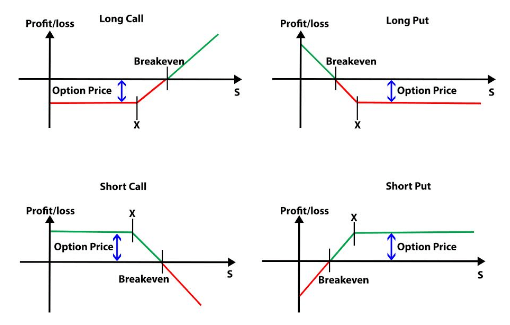

## Table of Contents

## What is a put option?

A put option is a type of financial contract that gives you the right, but not the obligation, to sell a specific asset at a set price within a certain time. The asset could be stocks, commodities, or other financial instruments. The set price is called the strike price, and the time period is known as the expiration date. If you think the price of the asset will go down, you can buy a put option to make a profit.

Here's how it works: Imagine you buy a put option for a stock that's currently trading at $50, with a strike price of $45 and an expiration date one month from now. If the stock price drops below $45 before the expiration date, you can exercise your option to sell the stock at $45, even if the market price is lower. This means you can buy the stock at the lower market price and then sell it at the higher strike price, making a profit. If the stock price stays above $45, you don't have to do anything, and you only lose the money you paid for the option.

## How does selling a put option work?

When you sell a put option, you are making a promise to buy a certain asset at a set price if the person who bought the option decides to use it. This set price is called the strike price. For example, if someone buys a put option from you with a strike price of $40, you agree to buy the asset from them at $40 if they choose to sell it to you before the option expires.

You get paid a fee, called a premium, for selling the put option. This money is yours to keep no matter what happens. But, if the price of the asset falls below the strike price and the buyer decides to use the option, you have to buy the asset at the higher strike price, even if it's worth less in the market. This means you could lose money if the asset's price drops a lot. If the asset's price stays above the strike price, the buyer won't use the option, and you keep the premium as profit.

## What are the basic risks associated with selling put options?

Selling put options can be risky. The main risk is that you might have to buy the asset at a higher price than it's worth in the market. This happens if the asset's price falls below the strike price and the buyer decides to use the option. For example, if you sold a put option with a strike price of $50 and the asset's price drops to $40, you'd have to buy it at $50, which means you lose $10 per share.

Another risk is that your potential losses can be very big. Unlike buying options, where your loss is limited to the premium you paid, selling options can lead to much bigger losses. If the asset's price drops a lot, your losses can be much more than the premium you received. This is why selling put options is considered a more advanced and riskier strategy.

## What are the potential benefits of selling put options?

Selling put options can give you a way to make money. When you sell a put option, you get a fee called a premium. This money is yours to keep no matter what happens. If the price of the asset stays above the strike price, the person who bought the option won't use it, and you keep the premium as profit. This can be a good way to earn some extra money if you think the price of the asset will stay the same or go up.

Another benefit is that selling put options can be a way to buy an asset at a lower price. If you want to own a certain stock but think it's too expensive right now, you can sell a put option with a strike price that you're happy with. If the stock's price falls below the strike price and the buyer uses the option, you'll have to buy the stock at the strike price. This means you get to buy the stock at a price you're okay with, and you also get to keep the premium you received for selling the option.

## How can a beginner start selling put options?

If you're a beginner interested in selling put options, the first step is to open a brokerage account that allows options trading. Not all brokerages offer this, so make sure to choose one that does. Once your account is set up, you'll need to get approval to trade options. This usually involves filling out a form where you'll need to show that you understand the risks and have some experience with investing. Your broker might ask you to take an options trading [course](/wiki/best-algorithmic-trading-courses) or pass a test to make sure you know what you're doing.

After you're approved, you can start selling put options. To do this, you'll need to pick a stock or asset you're interested in and decide on a strike price and expiration date that you're comfortable with. When you sell the put option, you'll receive a premium, which is yours to keep no matter what happens. If the stock's price stays above the strike price until the option expires, you keep the premium as profit. But if the stock's price falls below the strike price, you might have to buy the stock at the higher strike price, so be ready for that possibility. Always remember that selling put options can be risky, so start small and learn as you go.

## What are the key factors to consider before selling a put option?

Before you sell a put option, think about the price of the stock and where you think it might go. If you believe the stock's price will stay the same or go up, selling a put option can be a good way to make some money from the premium. But if you think the stock's price might go down a lot, be careful. If the stock's price falls below the strike price, you'll have to buy the stock at that higher price, which could cost you more than the premium you got.

Also, consider how much money you have and how much risk you're okay with. Selling put options can lead to big losses if the stock's price drops a lot. Make sure you have enough money to buy the stock if you have to, and that you're ready to lose more than the premium if things go badly. It's a good idea to start small and learn as you go, so you don't risk too much money at first.

## How can you manage the risks when selling put options?

One way to manage the risks when selling put options is by choosing the right strike price. Pick a strike price that you're comfortable with, one that's below the current stock price but not so low that it's likely to be reached. This way, you can still earn the premium, but you're less likely to have to buy the stock at a high price if the stock goes down. Another way is to only sell put options on stocks that you wouldn't mind owning. If you have to buy the stock because its price falls below the strike price, it won't be such a bad thing if it's a stock you believe in.

Another important way to manage risk is to use stop-loss orders. A stop-loss order can help limit your losses if the stock's price starts to fall a lot. You can set a stop-loss order to buy back the put option if the stock's price drops to a certain level, which can help you avoid even bigger losses. Also, make sure you don't use all your money to sell put options. Keep some money aside so you can handle the cost of buying the stock if you have to. By being careful and planning ahead, you can lower the risks of selling put options.

## What are some advanced strategies for selling put options?

One advanced strategy for selling put options is called the "cash-secured put." With this strategy, you sell a put option and set aside enough cash to buy the stock if the option is exercised. This way, you're ready to buy the stock at the strike price if you have to, and you earn the premium no matter what. It's a good way to buy a stock you like at a lower price while also making some money from the premium. Just make sure you're okay with buying the stock at the strike price if the stock's price falls.

Another strategy is called the "covered put." In this strategy, you sell a put option and also short sell the same stock. Short selling means you borrow the stock and sell it, hoping to buy it back later at a lower price. If the stock's price goes down, you can buy it back cheaper and keep the difference as profit. But if the stock's price goes up, you could lose money. This strategy can be riskier, so it's important to be careful and understand the risks before trying it.

A third strategy is using a "put credit spread." Here, you sell a put option at a higher strike price and buy another put option at a lower strike price. The premium you get from selling the higher strike put is more than the cost of buying the lower strike put, so you make some money right away. If the stock's price stays above the higher strike price, both options expire worthless, and you keep the difference in premiums as profit. If the stock's price falls below the lower strike price, your losses are limited to the difference between the two strike prices, minus the premium you received. This strategy can help limit your risk while still giving you a chance to make money.

## How does the selection of strike price and expiration date affect the outcome of selling put options?

The strike price you pick when selling a put option is really important because it can change how much risk you take and how much money you can make. If you choose a strike price that's close to the stock's current price, you'll get a bigger premium, but there's a bigger chance the stock's price will fall below the strike price. This means you might have to buy the stock at a higher price than it's worth in the market, which could lead to a loss. On the other hand, if you pick a strike price that's much lower than the current stock price, you'll get a smaller premium, but there's less chance you'll have to buy the stock. So, you need to find a balance between the premium you want and the risk you're okay with.

The expiration date you choose also matters a lot. If you sell a put option with a short expiration date, like a week or a month, you'll get a smaller premium, but the risk is over quickly. If the stock's price stays above the strike price until the option expires, you keep the premium as profit. But if you choose a longer expiration date, like three or six months, you'll get a bigger premium, but you'll have to wait longer to see if you made a profit. Plus, there's more time for the stock's price to change, which can be riskier. So, when you're [picking](/wiki/asset-class-picking) the strike price and expiration date, think about how much risk you want to take and how long you're willing to wait for the outcome.

## Can you explain the concept of 'naked' versus 'covered' put selling?

When you sell a 'naked' put option, you don't own the stock that the option is for. You're just promising to buy the stock at the strike price if the person who bought the option decides to use it. This can be risky because if the stock's price falls a lot, you could lose a lot of money. You get a premium for selling the option, but if you have to buy the stock at a high price when it's worth less, your losses can be bigger than the premium you got. Naked put selling is for people who are okay with taking big risks and who think the stock's price won't fall too much.

On the other hand, 'covered' put selling is less risky. When you sell a covered put, you also short sell the same stock. Short selling means you borrow the stock and sell it, hoping to buy it back later at a lower price. If the stock's price goes down, you can buy it back cheaper and keep the difference as profit. If the person who bought the put option decides to use it, you can use the stock you short sold to meet your promise. This way, your risk is lower because you have the stock to give if you need to. Covered put selling is for people who want to take less risk but still want to make money from selling options.

## What are the tax implications of selling put options?

When you sell put options, you need to think about taxes. The money you get from selling a put option is called a premium, and it's usually taxed as regular income. If you have to buy the stock because the option is used, you might make a profit or a loss when you sell the stock later. This profit or loss is taxed as a capital gain or loss. If you hold the stock for less than a year, it's a short-term capital gain or loss, which is taxed like regular income. If you hold it for more than a year, it's a long-term capital gain or loss, which usually has a lower tax rate.

It's a good idea to keep good records of all your put option trades. This way, you can figure out your taxes correctly when it's time to file. If you're not sure about how to handle the taxes, it's smart to talk to a tax professional. They can help you understand the rules and make sure you're doing everything right.

## How do market conditions influence the strategy of selling put options?

Market conditions play a big role in deciding whether selling put options is a good idea. If the market is going up or staying steady, selling put options can be a good way to make some money. You get a premium for selling the option, and if the stock's price stays above the strike price, you keep that money as profit. But if the market is going down, selling put options can be riskier. If the stock's price falls below the strike price, you might have to buy the stock at a higher price than it's worth, which could lead to a loss. So, it's important to look at what the market is doing before you decide to sell put options.

Another thing to think about is how much the market is moving around. If the market is very volatile, meaning the prices are changing a lot, selling put options can be more risky. The bigger the swings in the stock's price, the more likely it is that the price will fall below the strike price, and you'll have to buy the stock at a loss. On the other hand, if the market is calm and not moving much, selling put options might be safer because there's less chance of big price drops. Always keep an eye on the market and think about how it might affect your put option strategy.

## References & Further Reading

[1]: ["Options, Futures, and Other Derivatives"](https://www.amazon.com/Options-Futures-Other-Derivatives-10th/dp/013447208X) by John C. Hull

[2]: ["Option Volatility and Pricing"](https://books.google.fr/books/about/Option_Volatility_Pricing_Advanced_Tradi.html?id=NkSh3WjTg6AC&redir_esc=y) by Sheldon Natenberg