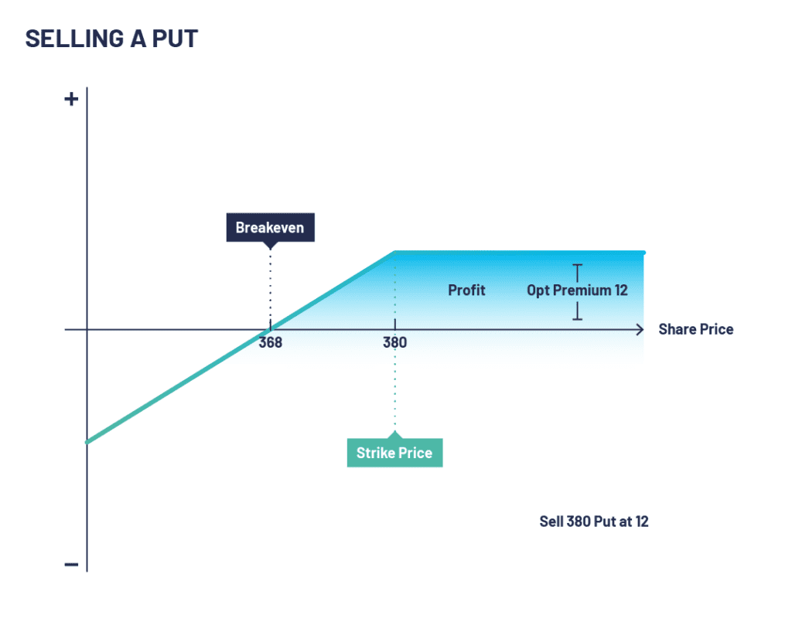

## Table of Contents

## What is a put option and how does it work?

A put option is a financial contract that gives you the right, but not the obligation, to sell a specific asset, like a stock, at a set price before a certain date. Imagine you think the price of a stock is going to drop. You can buy a put option for that stock. If the stock price does drop below the set price in the contract, you can use your put option to sell the stock at the higher set price, making a profit.

Here's how it works in practice: Let's say you buy a put option for a stock that's currently trading at $50. The put option gives you the right to sell the stock at $50, even if the market price drops. If the stock price falls to $40, you can buy the stock at $40 and then use your put option to sell it at $50, making a $10 profit per share (minus the cost of the put option). If the stock price stays above $50, you don't have to use the put option, and you only lose the money you paid for the option.

## What are the basic strategies for selling put options?

Selling put options is a strategy where you earn money by promising to buy a stock at a certain price if the person who bought the put option wants to sell it to you. This is called the premium, and you keep it no matter what happens with the stock price. If the stock price stays above the set price, the put option will expire worthless, and you keep the premium as profit. This is a good strategy if you think the stock price will stay the same or go up.

However, there's a risk if the stock price drops below the set price. If that happens, the person who bought the put option might want to sell the stock to you at the higher set price. You then have to buy the stock at the set price, which could be more than what it's worth in the market. This strategy is called "cash-secured" if you have enough money to buy the stock, or "naked" if you don't, which is riskier. Selling put options can be a way to buy stocks at a lower price if you're okay with the risk.

In summary, selling put options can be a way to make money from the premiums if the stock price stays high. But it's important to be ready to buy the stock if the price drops, so you need to understand the risks and have a plan for what to do if the market moves against you.

## How can selling put options generate income?

Selling put options can generate income by collecting premiums from buyers. When you sell a put option, you agree to buy a stock at a set price if the buyer decides to sell it to you. In return, the buyer pays you a fee, called the premium. If the stock price stays above the set price until the option expires, the buyer won't use the option, and you keep the premium as profit. This is a way to make money if you think the stock price will stay the same or go up.

However, there's a risk involved. If the stock price drops below the set price, the buyer might want to sell the stock to you at the higher set price. In this case, you have to buy the stock at the agreed-upon price, which could be more than its current market value. This is why it's important to have enough money set aside to buy the stock if needed, a strategy known as "cash-secured." Selling put options can be a good way to generate income, but you need to be ready for the possibility that you might have to buy the stock at a loss.

## What are the risks associated with selling put options?

Selling put options can be risky because if the stock price drops below the set price, you might have to buy the stock at a higher price than it's worth in the market. This means you could lose money if the stock keeps going down after you buy it. If you don't have enough money to buy the stock, this is called selling "naked" put options, which is very risky because you could lose a lot more than the premium you collected.

Another risk is that the stock might drop suddenly due to bad news or other unexpected events. This could force you to buy the stock at a loss right away. Even if you plan to hold onto the stock for a long time, a sharp drop in price can still hurt your investment. It's important to understand these risks and be ready for them when you decide to sell put options.

## How does market volatility affect the strategy of selling put options?

Market [volatility](/wiki/volatility-trading-strategies) can make selling put options riskier. When the market is volatile, stock prices can change a lot in a short time. This means there's a bigger chance that the stock price will drop below the set price of your put option. If that happens, you might have to buy the stock at a higher price than it's worth, which could lead to a loss. So, when the market is more volatile, you need to be more careful about which stocks you choose to sell put options on and make sure you have enough money to cover the risk.

On the other hand, higher volatility can also mean higher premiums. When the market is volatile, people are more willing to pay more for put options because they want protection against big price drops. This means you can earn more money from the premiums when you sell put options during volatile times. But you have to balance this against the increased risk of having to buy the stock at a loss. So, it's important to think carefully about whether the extra premium is worth the extra risk when the market is volatile.

## What are the key factors to consider before selling put options in a bull market?

When you're thinking about selling put options in a bull market, where stock prices are going up, you need to consider a few things. First, think about how likely it is that the stock will keep going up. In a bull market, it's more likely that the stock price will stay above the set price of your put option, which means you can keep the premium as profit. But even in a bull market, there can be surprises, so you need to pick stocks that you think will keep doing well.

Another thing to consider is how much money you're willing to risk. Even in a bull market, there's always a chance that the stock could drop suddenly. If that happens, you might have to buy the stock at a higher price than it's worth. So, make sure you have enough money set aside to cover this risk. Also, think about how long you're willing to wait for the stock price to go back up if you do have to buy it. In a bull market, selling put options can be a good way to make some extra money, but you need to be ready for the risks too.

## How should one adjust their approach to selling put options in a bear market?

In a bear market, where stock prices are going down, selling put options can be riskier. You need to be more careful because there's a bigger chance that the stock price will drop below the set price of your put option. If that happens, you'll have to buy the stock at a higher price than it's worth, which could lead to a loss. So, it's important to pick stocks that you think will not drop too much or that you're okay with owning if you have to buy them.

Even though it's riskier, selling put options in a bear market can still be a good way to make some money. The premiums might be higher because people are more worried about their stocks losing value, so they're willing to pay more for protection. But you need to make sure you have enough money to cover the risk of buying the stock if the price drops. It's also a good idea to think about how long you're willing to wait for the stock price to go back up if you do have to buy it. In a bear market, selling put options can be a way to make some money, but you need to be ready for the risks and think carefully about which stocks to choose.

## What are the advanced techniques for managing risk when selling put options?

One advanced technique for managing risk when selling put options is to use a strategy called "rolling." If the stock price starts to drop and it looks like you might have to buy the stock at a loss, you can try to "roll" the put option. This means you buy back the put option you sold and then sell a new put option with a later expiration date or a lower set price. This can give the stock more time to go back up or lower the price you might have to pay if you do have to buy it. It's like moving your bet to a different time or price to try to avoid a loss.

Another technique is to use a "stop-loss" order. This is a way to limit your losses if the stock price drops a lot. You can set a stop-loss order to buy back the put option you sold if the stock price reaches a certain low point. This can help you avoid having to buy the stock at a big loss. It's like setting a safety net that automatically kicks in to protect you if things go really bad.

You can also use a strategy called "diversification." Instead of selling put options on just one stock, you can spread your risk by selling put options on different stocks in different industries. This way, if one stock drops a lot, you might still be okay with the others. It's like not putting all your eggs in one basket. By using these advanced techniques, you can try to manage the risks of selling put options and protect your money better.

## How can one use technical analysis to improve the timing of selling put options?

Technical analysis can help you pick better times to sell put options by looking at stock charts and patterns. You can use tools like moving averages, which show the average price of a stock over time, to see if the stock is going up or down. If the stock price is above its moving average, it might be a good time to sell a put option because the stock is likely to keep going up. You can also look at support and resistance levels, which are prices where the stock often stops going down or up. Selling a put option near a support level can be good because the stock might bounce back up from there.

Another way to use technical analysis is to look at chart patterns like head and shoulders or double bottoms. These patterns can tell you if a stock might change direction soon. For example, if you see a head and shoulders pattern, it might mean the stock is about to go down, so it might not be a good time to sell a put option. But if you see a double bottom, it could mean the stock is about to go up, which could be a good time to sell a put option. By using these technical analysis tools, you can try to time your put option sales better and make more money while managing your risk.

## What role does the selection of strike price and expiration date play in maximizing profits from selling put options?

When you sell put options, [picking](/wiki/asset-class-picking) the right strike price and expiration date can really help you make more money. The strike price is the price at which you agree to buy the stock if the buyer wants to sell it to you. If you pick a strike price that's lower than the current stock price, you might get a smaller premium, but it's also less likely that you'll have to buy the stock. If you pick a strike price that's closer to the current stock price, you can get a bigger premium, but there's a bigger chance you'll have to buy the stock if it drops. So, you need to think about how much risk you're okay with and how much money you want to make from the premium.

The expiration date is also important. If you pick a shorter expiration date, you might get a smaller premium because there's less time for the stock price to change a lot. But if you pick a longer expiration date, you can get a bigger premium because there's more time for the stock price to move. The trick is to find a balance between getting a good premium and not having to wait too long for the option to expire. By choosing the right strike price and expiration date, you can try to make more money from selling put options while keeping your risk under control.

## How can one integrate selling put options into a broader investment portfolio?

Selling put options can be a smart way to add some extra money to your investment portfolio. When you sell a put option, you get paid a premium by someone who wants to sell a stock to you at a set price. If the stock price stays above that set price, you keep the premium as profit. This can be a good way to make some extra money, especially if you pick stocks that you think will stay the same or go up. You can use the money from the premiums to buy more stocks or invest in other things, helping your portfolio grow.

But you need to be careful because selling put options can be risky. If the stock price drops below the set price, you might have to buy the stock at a higher price than it's worth. So, it's important to pick stocks that you're okay with owning if you have to buy them. You should also make sure you have enough money set aside to cover this risk. By carefully choosing which put options to sell and managing your risk, you can use this strategy to make your investment portfolio stronger and more diverse.

## What are the tax implications of profits from selling put options and how can they be optimized?

When you make money from selling put options, you have to pay taxes on your profits. The tax you pay depends on how long you held the put option before selling it. If you held it for less than a year, the profit is considered a short-term capital gain, and you'll pay your regular income tax rate on it. If you held it for more than a year, it's a long-term capital gain, and you'll pay a lower tax rate, which could be 0%, 15%, or 20%, depending on your income. This means that if you can hold onto your put options for over a year, you might pay less in taxes.

To make the most of your tax situation, you can use a few strategies. One way is to try to hold your put options for more than a year to get the lower long-term capital gains tax rate. Another way is to offset your gains by selling other investments at a loss, a strategy called tax-loss harvesting. This can help lower your overall tax bill. It's also a good idea to talk to a tax professional who can give you personalized advice based on your situation and help you plan the best way to manage your taxes when selling put options.

## What are Put Options and How Do They Work?

Put options are a fundamental component of options trading, serving as financial instruments that give the holder the right, but not the obligation, to sell an asset at a specified price, known as the strike price, before or on a certain expiration date. This contrasts with call options, which grant the right to purchase an asset under similar conditions. The primary function of put options is to provide investors with a mechanism to hedge against potential declines in the value of an underlying asset, thus offering a form of insurance.

Mathematically, the payoff of a put option can be represented as:

$$
\text{Payoff} = \max(K - S, 0)
$$

where $K$ is the strike price and $S$ is the spot price of the underlying asset at expiration. When the spot price $S$ falls below the strike price $K$, the put option holder can exercise the option to sell the asset at the higher strike price, thus realizing a profit.

The key distinctions between call and put options lie in their financial implications and strategic use cases. Call options are typically used when an investor anticipates an increase in the price of the underlying asset, aiming to purchase it at a lower locked-in price. Conversely, put options are beneficial when investors expect a decline in the underlying asset's price, protecting against downside risk or capitalizing on anticipated market drops.

Put options are particularly advantageous in several scenarios:

1. **Protecting Long Positions:** Investors holding substantial stock portfolios can use put options to guard against market downturns. By purchasing put options, they can ensure a minimum sale price for their holdings, thus limiting potential losses.

2. **Speculative Trading:** Traders expecting a specific asset to drop in value can buy put options to benefit from such a decline without needing to short sell the asset directly.

3. **Generating Income:** Investors who write put options (i.e., sell them) can earn premium income. This strategy capitalizes on stable or rising market conditions, where the likelihood of the option being exercised is low.

Overall, put options serve as versatile tools in an investor's toolkit that aid in risk management, income generation, and speculative trading, offering significant flexibility based on market conditions and individual investment goals.

## What is Risk Management in Put Option Trading?

Risk management is a critical component in the trading of put options, as it shields traders from excessive losses while optimizing the potential for gains. Proper risk management practices protect investment portfolios and ensure long-term sustainability in market participation.

### Importance of Risk Management

In trading, especially with options such as puts, market volatility can lead to significant profit opportunities but also potential losses. Effective risk management strategies are crucial to withstand these risks without eroding capital. By implementing structured approaches, traders can limit exposure to unfavorable movements and maintain a steady [course](/wiki/best-algorithmic-trading-courses) towards their investment objectives.

### Strategies for Mitigating Risks When Trading Put Options

Several strategies can mitigate risks in put options trading:

1. **Protective Puts**: This involves buying put options for stocks held in the portfolio. A protective put serves as an insurance policy — if the stock price plummets, the put option hedge can reduce losses.

   Example: An investor holding 100 shares of a stock priced at $100 might buy a put option with a strike price of $95. If the stock falls to $80, the put option limits the loss to $5 per share, plus the premium paid.

2. **Stop-Loss Orders**: Setting stop-loss thresholds can automatically trigger a sale when the asset's price falls to a particular point, thus limiting losses.

3. **Position Sizing**: Calculating position sizes based on capital and risk tolerance ensures that no single trade can inflict excessive damage.

   Formula: 
$$
   \text{Position Size} = \frac{\text{Account Risk} \times \text{Portfolio Value}}{\text{Trade Risk}}

$$
   where Account Risk is the percentage of the total capital a trader is willing to lose on a trade.

4. **Portfolio Diversification**: Spreading investments across various assets and classes minimizes risk exposure to any single entity.

### Role of Algorithmic Trading in Enhancing Risk Management

Algorithmic trading acts as a modern tool that can substantially improve risk management through automated rules and systematic approaches:

1. **Automation of Stop-Losses and Take-Profits**: Algorithms can automatically monitor trades and execute stop-losses or take-profits based on pre-set criteria, thus reducing the need for manual intervention and emotional decision-making.

2. **Backtesting and Real-Time Adjustments**: Algorithms enable traders to backtest different risk management strategies against historical data to identify the most effective approaches. Real-time data analysis can adjust strategies dynamically as market conditions change.

3. **Example of an Algorithmic Strategy in Python**: A simple algorithm to manage risk might include moving average crossovers to decide entry and exit points:

```python
import pandas as pd
import numpy as np

def moving_average_strategy(data, short_window=5, long_window=20):
    signals = pd.DataFrame(index=data.index)
    signals['signal'] = 0.0

    signals['short_mavg'] = data['Close'].rolling(window=short_window, min_periods=1, center=False).mean()
    signals['long_mavg'] = data['Close'].rolling(window=long_window, min_periods=1, center=False).mean()

    signals['signal'][short_window:] = np.where(signals['short_mavg'][short_window:] > signals['long_mavg'][short_window:], 1.0, 0.0)   
    signals['positions'] = signals['signal'].diff()

    return signals

# data: Pandas DataFrame containing stock price information
signals = moving_average_strategy(data)
```
This code provides a basic framework to implement risk management strategies using algorithms, offering an automatic decision-making process that can adapt to market changes quickly and efficiently.

In summary, risk management in put option trading is essential to balance potential gains against potential losses. By leveraging strategies such as protective puts, stop-loss orders, and portfolio diversification, combined with [algorithmic trading](/wiki/algorithmic-trading)'s power to automate risk mitigation, traders can enhance their ability to manage risk effectively and sustain their trading operations over the long term.

## References & Further Reading

[1]: Bergstra, J., Bardenet, R., Bengio, Y., & Kégl, B. (2011). ["Algorithms for Hyper-Parameter Optimization."](https://papers.nips.cc/paper/4443-algorithms-for-hyper-parameter-optimization) Advances in Neural Information Processing Systems 24.

[2]: ["Advances in Financial Machine Learning"](https://www.amazon.com/Advances-Financial-Machine-Learning-Marcos/dp/1119482089) by Marcos Lopez de Prado

[3]: ["Evidence-Based Technical Analysis: Applying the Scientific Method and Statistical Inference to Trading Signals"](https://www.amazon.com/Evidence-Based-Technical-Analysis-Scientific-Statistical/dp/0470008741) by David Aronson

[4]: ["Machine Learning for Algorithmic Trading"](https://github.com/stefan-jansen/machine-learning-for-trading) by Stefan Jansen

[5]: ["Quantitative Trading: How to Build Your Own Algorithmic Trading Business"](https://www.amazon.com/Quantitative-Trading-Build-Algorithmic-Business/dp/1119800064) by Ernest P. Chan