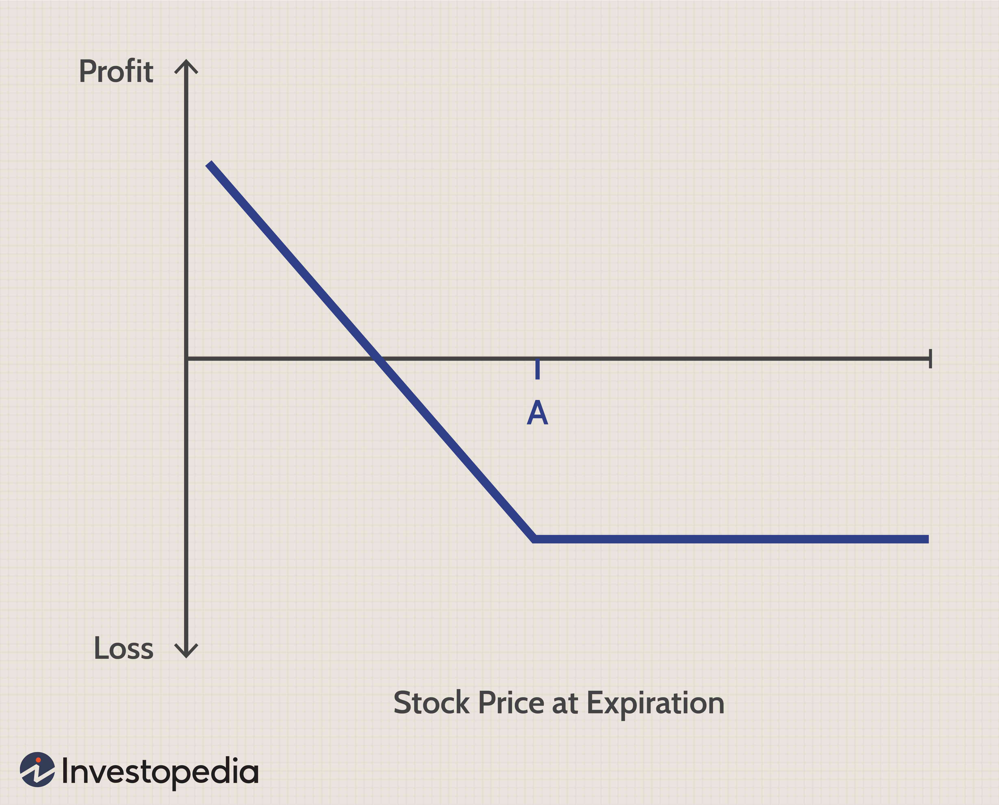

Options trading is a critical component of the financial markets, offering investors a variety of tools to hedge risks, speculate on market movements, or increase leverage. It involves buying and selling options contracts, which grant the holder the right, but not the obligation, to buy or sell an underlying asset at a predetermined price within a specified period. Understanding options trading is crucial not only for professional investors but also for individual traders seeking to expand their investment arsenal.

Put options are an integral part of options trading. A put option offers the buyer the right to sell a specific quantity of an asset at an agreed-upon price—known as the strike price—on or before the contract's expiration date. This contrasts with call options, which grant the right to purchase the asset. The main appeal of put options lies in their utility for hedging existing positions against potential downturns; for instance, if an investor holds a stock expected to fall, purchasing a put option can protect against losses. Additionally, put options can generate income through premium collection when market conditions favor selling these contracts.



In recent years, the financial markets have seen a significant shift with the advent of algorithmic trading, which has dramatically transformed the landscape. Algorithmic trading involves using computer programs to execute trades based on predefined criteria, such as timing, price, or volume. This method optimizes strategies by refining decision-making processes, enhancing efficiency, and reducing human errors. In options trading, algorithmic strategies can identify market trends and manage complex trades more effectively than manual trading.

As the intersection of traditional strategies and technological advancement, algorithmic trading provides a powerful platform for executing put option trades with precision and agility, maximizing returns while minimizing risk. This makes a compelling case for understanding both put options and algorithmic trading as essential components of a modern investor's toolkit.

## Table of Contents

## Understanding Put Options

Put options are a fundamental component of options trading, serving as financial instruments that give the holder the right, but not the obligation, to sell an asset at a specified price, known as the strike price, before or on a certain expiration date. This contrasts with call options, which grant the right to purchase an asset under similar conditions. The primary function of put options is to provide investors with a mechanism to hedge against potential declines in the value of an underlying asset, thus offering a form of insurance.

Mathematically, the payoff of a put option can be represented as:

$$
\text{Payoff} = \max(K - S, 0)
$$

where $K$ is the strike price and $S$ is the spot price of the underlying asset at expiration. When the spot price $S$ falls below the strike price $K$, the put option holder can exercise the option to sell the asset at the higher strike price, thus realizing a profit.

The key distinctions between call and put options lie in their financial implications and strategic use cases. Call options are typically used when an investor anticipates an increase in the price of the underlying asset, aiming to purchase it at a lower locked-in price. Conversely, put options are beneficial when investors expect a decline in the underlying asset's price, protecting against downside risk or capitalizing on anticipated market drops.

Put options are particularly advantageous in several scenarios:

1. **Protecting Long Positions:** Investors holding substantial stock portfolios can use put options to guard against market downturns. By purchasing put options, they can ensure a minimum sale price for their holdings, thus limiting potential losses.

2. **Speculative Trading:** Traders expecting a specific asset to drop in value can buy put options to benefit from such a decline without needing to short sell the asset directly.

3. **Generating Income:** Investors who write put options (i.e., sell them) can earn premium income. This strategy capitalizes on stable or rising market conditions, where the likelihood of the option being exercised is low.

Overall, put options serve as versatile tools in an investor's toolkit that aid in risk management, income generation, and speculative trading, offering significant flexibility based on market conditions and individual investment goals.

## Fundamentals of Put Option Strategies

Put option strategies can serve important roles in trading by providing flexibility to traders who wish to profit or hedge against downward movements in an underlying asset’s price. This section outlines various strategies involving put options, their advantages and risks, and guidance for strategy selection based on market conditions and investment goals.

### Covered Puts

A covered put strategy involves selling a put option while shorting an equivalent amount of the underlying asset. This strategy is typically adopted when the trader anticipates little to no change in the asset's price. The primary advantage of covered puts lies in their potential to generate additional income for the trader through the premium received from selling the put option. However, this approach also carries risks, particularly the possibility of substantial losses if the price of the underlying asset increases. The short position on the asset can result in significant financial strain as the trader may need to repurchase the asset at a much higher price.

### Protective Puts

Protective puts are employed as a defensive mechanism by purchasing a put option for an asset already owned, essentially acting as an insurance policy against downward price movements. This strategy is particularly beneficial during periods of market [volatility](/wiki/volatility-trading-strategies) when protecting existing gains or principal is a priority. The protective put allows the investor to establish a minimum sale price for the asset, thereby limiting potential losses. The primary disadvantage is the cost of purchasing the put, which can diminish overall portfolio returns if the market remains stable or appreciates. Nevertheless, for risk-averse investors or those seeking to safeguard significant investments, the protective put provides a valuable hedging tool.

### Selecting the Right Strategy

The choice of strategy hinges on two main factors: market conditions and investment objectives. In a stable or slightly bearish market, covered puts might be more appealing for traders looking to secure premium income without expecting significant price increases. On the other hand, in uncertain or bearish conditions, protective puts can offer vital protection against substantial price drops, potentially preserving capital for future opportunities.

Ultimately, the appropriateness of each strategy is determined by the trader's risk tolerance and financial goals. Those inclined to accept greater risk for the possibility of higher rewards may lean towards aggressive strategies like covered puts, seeking income through premiums while managing short positions closely. Conversely, conservative investors prioritizing capital preservation might favor protective puts despite their cost, choosing to shield investments from adverse market movements.

## Algorithmic Trading in Options Market

Algorithmic trading is a vital component of modern financial markets, fundamentally transforming how options are traded. Algorithms use complex mathematical models to make trading decisions at speeds unattainable by human traders. This approach leverages advanced computing power and data analysis to execute trades with precision and consistency.

One of the primary benefits of [algorithmic trading](/wiki/algorithmic-trading) in options markets is speed. Algorithms can identify and capitalize on trading opportunities in milliseconds, far quicker than manual trading processes. This speed advantage is crucial in markets where prices can change rapidly and opportunities are short-lived. Additionally, algorithmic trading enhances efficiency by allowing the simultaneous analysis of multiple markets and trading signals, optimizing decision-making processes.

Another advantage is the reduction of human error. Trading in volatile and fast-paced environments can lead to emotional decision-making, potentially resulting in mistakes. Algorithms, on the other hand, execute trades based on predefined criteria, eliminating emotional biases and ensuring that trades are made in accordance with strategic goals. This consistency is particularly beneficial in maintaining disciplined trading practices.

Common algorithms used in options trading include:

1. **Market Making Algorithms:** These algorithms provide liquidity by continuously placing buy and sell limit orders in the market. They profit from the bid-ask spread, aiming to facilitate trading and reduce market impact.

2. **Statistical Arbitrage:** These strategies exploit pricing inefficiencies between related options or between options and their underlying securities. Algorithms identify and capitalize on deviations from expected pricing relationships, using techniques such as pairs trading and mean reversion.

3. **Trend Following Algorithms:** These algorithms analyze market trends to make trading decisions, typically using moving averages or other momentum indicators. They aim to profit from sustained market movements, whether upward or downward.

4. **Volatility Arbitrage:** Focusing on options, these algorithms trade based on the discrepancy between expected and realized volatility. This approach often involves delta-neutral strategies, striving to profit from changes in volatility rather than price direction.

5. **Delta Hedging:** This involves maintaining a delta-neutral position by dynamically adjusting the portfolio as market conditions change, minimizing the risk associated with the directional movements of the underlying asset.

Algorithmic trading in options markets continues to evolve, with advancements in [machine learning](/wiki/machine-learning) and [artificial intelligence](/wiki/ai-artificial-intelligence) paving the way for even more sophisticated strategies. The integration of these technologies offers the potential for further enhancing the speed, accuracy, and profitability of trading systems, making algorithmic trading an indispensable tool in the options market landscape.

## Implementing Algo Trading Strategies for Put Options

To implement algorithmic trading systems specifically for put options, traders should begin by establishing a robust technological infrastructure. This typically involves selecting a reliable trading platform that supports algorithmic execution, such as MetaTrader, NinjaTrader, or custom-built systems. These platforms should be connected with real-time data feeds to ensure accurate market analysis and execution precision. The core components of an algorithmic system include the trading strategy, the execution algorithm, and a risk management module.

### Example Strategies for Put Options

1. **Trend Following Strategy**: This strategy capitalizes on put options by identifying and following established market trends. The algorithm could be programmed to use moving averages or other technical indicators to detect bearish trends, prompting the purchase of put options. For instance, a simple moving average crossover strategy may buy a put option when a short-term moving average crosses below a long-term moving average, indicating a downward trend.

2. **Mean Reversion Strategy**: Put options can also benefit from mean reversion strategies, which assume that asset prices will revert to their historical mean. The algorithm sets thresholds to identify when an asset is overbought or oversold. For example, if a stock deviates two standard deviations above its mean price, a put option might be purchased in anticipation of a price correction.

### Best Practices in Algo Trading for Put Options

#### System Design and Testing

- **Backtesting**: Before deploying any algorithmic strategy live, extensive backtesting with historical data is crucial. This process assesses the strategy's performance across various market conditions. The backtesting should account for transaction costs and slippage to provide more realistic results.

- **Simulation**: Using paper trading or simulation environments to test the strategy in real-time without financial risk. This step allows traders to observe the strategy's behavior and make necessary adjustments.

#### Execution and Monitoring

- **Latency Management**: Ensuring low latency in order execution can significantly enhance performance, especially in a volatile options market. Co-locating servers with the exchange's servers or using higher bandwidth can help reduce latency.

- **Continuous Monitoring**: Algorithms should be continuously monitored to ensure they are functioning as intended. Any discrepancies or system failures need to be addressed immediately to prevent financial loss.

#### Risk Management

- **Dynamic Risk Controls**: Implement automated risk management features that adjust position sizes or halt trading during adverse conditions. Algorithms can be designed to automatically sell off positions if losses exceed a predetermined threshold.

- **Diversity and Adaptability**: It is wise to employ multiple algorithms catering to different market scenarios. Additionally, updating and refining algorithms in response to market changes ensures ongoing efficacy.

Through a combination of these strategies and best practices, traders can effectively harness the power of algorithmic trading tailored for put options. This approach not only optimizes the execution of strategies but also enhances the ability to manage risks comprehensively.

## Risk Management in Put Option Trading

Risk management is a critical component in the trading of put options, as it shields traders from excessive losses while optimizing the potential for gains. Proper risk management practices protect investment portfolios and ensure long-term sustainability in market participation.

### Importance of Risk Management

In trading, especially with options such as puts, market volatility can lead to significant profit opportunities but also potential losses. Effective risk management strategies are crucial to withstand these risks without eroding capital. By implementing structured approaches, traders can limit exposure to unfavorable movements and maintain a steady [course](/wiki/best-algorithmic-trading-courses) towards their investment objectives.

### Strategies for Mitigating Risks When Trading Put Options

Several strategies can mitigate risks in put options trading:

1. **Protective Puts**: This involves buying put options for stocks held in the portfolio. A protective put serves as an insurance policy — if the stock price plummets, the put option hedge can reduce losses.

   Example: An investor holding 100 shares of a stock priced at $100 might buy a put option with a strike price of $95. If the stock falls to $80, the put option limits the loss to $5 per share, plus the premium paid.

2. **Stop-Loss Orders**: Setting stop-loss thresholds can automatically trigger a sale when the asset's price falls to a particular point, thus limiting losses.

3. **Position Sizing**: Calculating position sizes based on capital and risk tolerance ensures that no single trade can inflict excessive damage.

   Formula: 
$$
   \text{Position Size} = \frac{\text{Account Risk} \times \text{Portfolio Value}}{\text{Trade Risk}}

$$
   where Account Risk is the percentage of the total capital a trader is willing to lose on a trade.

4. **Portfolio Diversification**: Spreading investments across various assets and classes minimizes risk exposure to any single entity.

### Role of Algorithmic Trading in Enhancing Risk Management

Algorithmic trading acts as a modern tool that can substantially improve risk management through automated rules and systematic approaches:

1. **Automation of Stop-Losses and Take-Profits**: Algorithms can automatically monitor trades and execute stop-losses or take-profits based on pre-set criteria, thus reducing the need for manual intervention and emotional decision-making.

2. **Backtesting and Real-Time Adjustments**: Algorithms enable traders to backtest different risk management strategies against historical data to identify the most effective approaches. Real-time data analysis can adjust strategies dynamically as market conditions change.

3. **Example of an Algorithmic Strategy in Python**: A simple algorithm to manage risk might include moving average crossovers to decide entry and exit points:

```python
import pandas as pd
import numpy as np

def moving_average_strategy(data, short_window=5, long_window=20):
    signals = pd.DataFrame(index=data.index)
    signals['signal'] = 0.0

    signals['short_mavg'] = data['Close'].rolling(window=short_window, min_periods=1, center=False).mean()
    signals['long_mavg'] = data['Close'].rolling(window=long_window, min_periods=1, center=False).mean()

    signals['signal'][short_window:] = np.where(signals['short_mavg'][short_window:] > signals['long_mavg'][short_window:], 1.0, 0.0)   
    signals['positions'] = signals['signal'].diff()

    return signals

# data: Pandas DataFrame containing stock price information
signals = moving_average_strategy(data)
```
This code provides a basic framework to implement risk management strategies using algorithms, offering an automatic decision-making process that can adapt to market changes quickly and efficiently.

In summary, risk management in put option trading is essential to balance potential gains against potential losses. By leveraging strategies such as protective puts, stop-loss orders, and portfolio diversification, combined with algorithmic trading's power to automate risk mitigation, traders can enhance their ability to manage risk effectively and sustain their trading operations over the long term.

## Case Studies

### Real-World Examples of Successful Put Option Trading Strategies

In the analysis of put option trading strategies, examining real-world case studies provides invaluable insights into the practical application and effectiveness of these strategies. Below, we explore some notable examples where put options have been successfully employed, highlighting key lessons for traders.

**Case Study 1: Protective Puts for Portfolio Hedging**

One significant example comes from institutional investors who frequently utilize protective puts to hedge against market downturns. During the 2008 financial crisis, many fund managers employed protective put strategies to mitigate losses. By purchasing put options on indexes or individual stocks, these managers effectively set a floor on potential losses. This strategy proved particularly useful as it allowed them to maintain their equity positions while having a safety net in place. The primary lesson here is that protective puts can be a powerful tool for risk management, particularly during periods of high volatility.

**Case Study 2: Generating Income with Put Selling**

Another successful application of put options is through put selling to generate income. A prominent example is seen with seasoned investors engaging in the cash-secured put strategy. By selling put options on stocks they are willing to own, investors can collect premiums while being prepared to purchase the underlying assets if prices fall to the strike price. During 2020's market fluctuations, several investors capitalized on the heightened volatility by selling puts on stable, high-quality companies. This approach allowed them to acquire shares at a discounted price or pocket the premium if options expired worthless. The key takeaway is that put selling can effectively generate income, especially in volatile markets, while potentially acquiring desired stocks at favorable prices.

**Case Study 3: Algorithmic Execution of Put Option Strategies**

Advancements in algorithmic trading have further refined the application of put option strategies. For instance, hedge funds employing algorithmic trend-following strategies have successfully integrated put options into their execution. By automating the buying of puts when specific technical indicators forecast a market decline, these funds have enhanced their response times and minimized human error. One [hedge fund](/wiki/hedge-fund-trading-strategies) reported a significant reduction in drawdowns and improved overall returns by implementing such algorithmic strategies during market corrections. This showcases the benefit of combining algorithmic precision with strategic put option deployment to enhance performance in dynamic market conditions.

**Lessons for Future Trading Decisions**

1. **Risk Management Through Protective Puts:** Protective puts remain an essential tool for safeguarding investments against market downturns. Investors should consider incorporating them into their portfolios during volatile periods.

2. **Income Generation with Put Selling:** Selling put options can be an effective strategy to generate additional income, especially for investors interested in acquiring specific stocks at lower prices.

3. **Enhancing Strategy Execution with Algorithms:** Leveraging algorithmic trading can significantly improve the speed and efficiency of executing put option strategies, allowing traders to capitalize on market opportunities with reduced risk of human error.

4. **Adaptation and Flexibility:** Successful traders should remain adaptable, using historical insights to refine their strategies and incorporate new technologies such as algorithmic systems to remain competitive.

These case studies underscore the versatility and potential benefits of put options in trading strategies, encouraging traders to tailor these approaches to their investment goals and market conditions.

## Conclusion

Understanding the complexities of options trading, particularly put options, is fundamental for any trader looking to secure their investments or capitalize on market movements. Throughout our discussion, we explored the intricate nature of put options, the various strategies that underpin their usage, and the burgeoning role that algorithmic trading plays in optimizing these strategies.

Put options offer traders the ability to hedge against potential losses in the market or to speculate on downward price movements, providing both defensive and opportunistic tools. The strategic employment of put options, whether through covered or protective puts, allows investors to tailor their risk exposure to suit their unique financial goals and prevailing market conditions.

The integration of algorithmic trading into the options market represents a transformative shift. Algorithms enhance trading efficiency, speed, and accuracy, significantly reducing human errors and enabling traders to execute complex strategies with precision. By leveraging algorithms, traders can capitalize on intricate market patterns and movements that would otherwise be challenging to exploit manually.

In particular, the adaptability of algorithmic trading to put options is noteworthy. Algorithms can be fine-tuned to specific strategies like [trend following](/wiki/trend-following) or mean reversion, making trading not only more efficient but also more consistent in performance. By automating the decision-making process, traders can continually adjust strategies in response to real-time market data, thus optimizing their positions and outcomes.

As we reflect on the synergy between put options trading and algorithmic trading, it becomes evident that the combination of these two can lead to more robust trading strategies. Traders should actively consider evolving their approaches to include algorithmic components, not just for efficiency but for improved strategy execution and risk management. The future of trading lies in this blend of human insight and technological advancement, and those who integrate both effectively are likely to secure a competitive edge in the market.

## References & Further Reading

[1]: Bergstra, J., Bardenet, R., Bengio, Y., & Kégl, B. (2011). ["Algorithms for Hyper-Parameter Optimization."](https://papers.nips.cc/paper/4443-algorithms-for-hyper-parameter-optimization) Advances in Neural Information Processing Systems 24.

[2]: ["Advances in Financial Machine Learning"](https://www.amazon.com/Advances-Financial-Machine-Learning-Marcos/dp/1119482089) by Marcos Lopez de Prado

[3]: ["Evidence-Based Technical Analysis: Applying the Scientific Method and Statistical Inference to Trading Signals"](https://www.amazon.com/Evidence-Based-Technical-Analysis-Scientific-Statistical/dp/0470008741) by David Aronson

[4]: ["Machine Learning for Algorithmic Trading"](https://github.com/stefan-jansen/machine-learning-for-trading) by Stefan Jansen

[5]: ["Quantitative Trading: How to Build Your Own Algorithmic Trading Business"](https://www.amazon.com/Quantitative-Trading-Build-Algorithmic-Business/dp/1119800064) by Ernest P. Chan