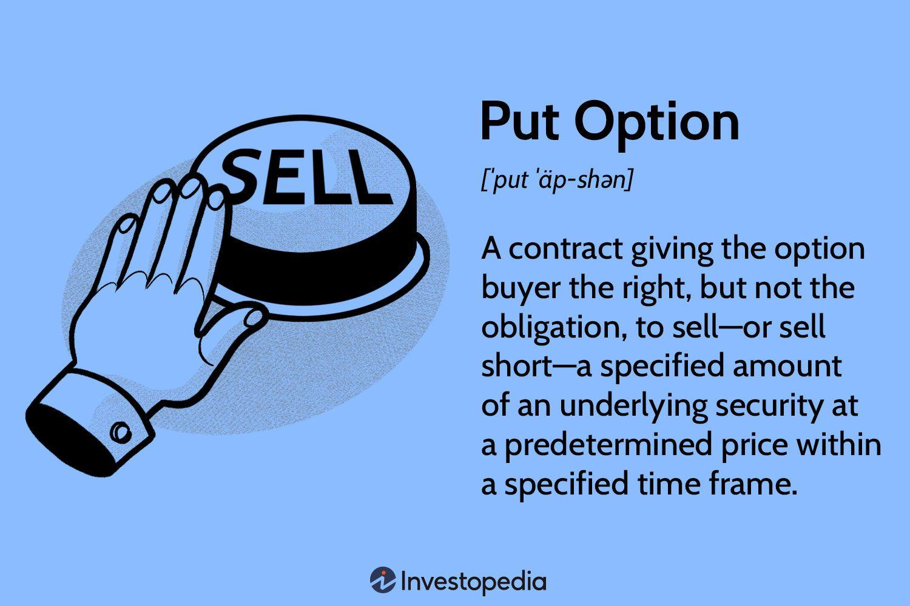

## Table of Contents

## What is a put option?

A put option is a type of financial contract that gives the buyer the right, but not the obligation, to sell a specific asset at a set price within a certain time period. The asset could be stocks, commodities, or other financial instruments. The set price is called the strike price, and the time period is known as the expiration date. If the market price of the asset falls below the strike price, the buyer can exercise the option to sell the asset at the higher strike price, making a profit.

For example, imagine you buy a put option for a stock that's currently trading at $50, with a strike price of $45 and an expiration date one month away. If the stock price drops to $40 before the expiration date, you can exercise your option to sell the stock at $45, even though its market value is only $40. This means you make a profit of $5 per share, minus the cost of the option itself. If the stock price stays above $45, you can let the option expire worthless, and your loss would be limited to the price you paid for the option.

## How does selling a put option work?

When you sell a put option, you are the one giving someone else the right to sell you a specific asset at a set price before a certain date. This set price is called the strike price. You get paid a fee for selling the put option, which is called the premium. If the price of the asset stays above the strike price until the expiration date, the buyer won't use their right to sell it to you, and you keep the premium as profit. But if the price drops below the strike price, the buyer might choose to sell you the asset at that higher price.

For example, let's say you sell a put option for a stock that's currently worth $50, with a strike price of $45 and an expiration date one month away. You receive a premium for this. If the stock price stays above $45 until the expiration date, the buyer won't sell it to you, and you keep the premium. But if the stock price drops to $40, the buyer can exercise their option and sell you the stock for $45. You'll have to buy it at $45 even though it's only worth $40 in the market. Your loss would be $5 per share, but it's reduced by the premium you received when you sold the option.

## What are the basic requirements to sell put options?

To sell put options, you need to have a brokerage account that allows options trading. Not all brokers offer this, so you might need to shop around. Once you have the right account, you'll need to get approval from your broker to trade options. This usually involves filling out an options agreement and answering questions about your investment experience and financial situation.

After getting approval, you need to have enough money in your account to cover the potential purchase of the asset if the option is exercised. This is called the margin requirement. The amount can vary, but it's typically a percentage of the asset's value. If you don't have enough money to cover this, you won't be able to sell the put option. It's important to understand these requirements and risks before you start selling put options.

## What are the risks associated with selling put options?

Selling put options can be risky because you might have to buy the asset at a higher price than it's worth in the market. If the price of the asset drops below the strike price, the buyer of the put option can make you buy it from them. This means you could lose money if the asset's price keeps falling. The most you can lose is a lot, but it's limited to the difference between the strike price and zero, minus the premium you got for selling the option.

Another risk is that you need to have enough money in your account to cover the potential purchase of the asset. This is called the margin requirement. If you don't have enough money, you might get a margin call, which means you have to add more money to your account quickly. If you can't do that, your broker might close your position, and you could lose money. So, it's important to make sure you have enough money to handle the worst-case scenario before you start selling put options.

## What are the potential benefits of selling put options?

Selling put options can give you a way to make money. When you sell a put option, you get paid a fee called a premium. If the price of the asset stays above the strike price until the option expires, you keep the premium as profit. This can be a good way to earn some extra money, especially if you think the price of the asset won't drop much.

Another benefit is that selling put options can let you buy an asset at a lower price than it's currently worth. If you want to own the asset but think it's too expensive right now, you can sell a put option with a strike price that's lower than the current market price. If the price drops to that level, you'll have to buy the asset, but you'll get it at a discount. Plus, the premium you received helps lower the cost even more.

## How can selling put options generate income?

Selling put options can help you make money by giving you a fee called a premium. When you sell a put option, someone else pays you this fee for the right to sell you an asset at a set price later on. If the price of the asset stays above this set price until the option expires, the person who bought the option won't use it. This means you get to keep the premium as your profit. It's like getting paid for nothing, as long as the asset's price doesn't drop too much.

Another way selling put options can generate income is if you want to buy an asset but think it's too expensive right now. You can sell a put option with a strike price that's lower than the current market price. If the price drops to that level, you'll have to buy the asset, but you'll get it cheaper than it is now. Plus, the premium you got when you sold the option helps lower the cost even more. This way, you can end up with the asset at a good price and still make some money from the premium.

## What is the break-even point when selling a put option?

When you sell a put option, the break-even point is the price at which you neither make money nor lose money. This happens when the price of the asset falls to the strike price minus the premium you received for selling the option. For example, if you sold a put option with a strike price of $50 and received a premium of $2, your break-even point would be $48. If the asset's price is above $48 when the option expires, you keep the premium and make a profit. If it's below $48, you start to lose money.

It's important to know your break-even point because it helps you understand how much risk you're taking. If the asset's price drops below the break-even point, you'll have to buy the asset at the strike price, which will be more than what it's worth in the market. This means you'll lose money, but the premium you received can help reduce your loss. So, always keep an eye on the break-even point to manage your risks better.

## How does the choice of strike price affect the strategy?

Choosing the right strike price is a big part of selling put options. If you pick a strike price that's close to the current price of the asset, you'll get a bigger premium. This is good because it means more money for you right away. But it's also riskier because the asset's price doesn't have to fall very far for you to have to buy it at the strike price. So, if you think the price might go down a little, you might want to pick a strike price that's close to the current price to get a bigger premium.

On the other hand, if you pick a strike price that's a lot lower than the current price, you'll get a smaller premium. This means less money for you right away, but it's safer because the asset's price has to fall a lot before you have to buy it. This can be a good choice if you think the price will stay the same or go up. It's all about balancing the money you get now with the risk you're willing to take. The strike price you choose will change how much money you can make and how much you might lose.

## What role does the expiration date play in selling put options?

The expiration date is really important when you're selling put options. It's the date when the option stops being valid. If you sell a put option, you want to think about how long you want to be on the hook for buying the asset. A shorter expiration date means less time for the price to drop, so it's less risky. But you'll get a smaller premium because the buyer is paying for a shorter time. A longer expiration date gives the buyer more time, so you can get a bigger premium. But it also means more time for the price to fall, which makes it riskier for you.

Choosing the right expiration date can help you balance the money you make with the risk you take. If you think the price of the asset won't change much in the short term, you might pick a shorter expiration date to get a quick premium with less risk. But if you're okay with waiting and think the price might go up over time, a longer expiration date could give you a bigger premium. It's all about figuring out how long you're willing to wait and how much risk you want to take.

## How can one manage risk when selling put options?

Managing risk when selling put options is all about being smart and careful. One way to do this is by [picking](/wiki/asset-class-picking) a strike price that's lower than the current price of the asset. This means you'll get a smaller premium, but it's safer because the price has to drop a lot before you have to buy the asset. Another way is to choose a shorter expiration date. A shorter time means less chance for the price to go down a lot, so you're taking less risk. But you'll get a smaller premium because the buyer is paying for less time.

Another important thing is to always have enough money in your account to cover the potential purchase of the asset. This is called the margin requirement. If the price drops and you have to buy the asset, you need to be able to do it without getting into trouble. If you don't have enough money, you might get a margin call, which means you have to add more money quickly. If you can't, your broker might close your position, and you could lose money. So, make sure you have enough money to handle the worst-case scenario before you start selling put options.

Lastly, it's a good idea to keep an eye on the market and be ready to act if things start going the wrong way. If the price of the asset starts to drop a lot, you might want to buy back the put option to limit your losses. This will cost you the difference between the premium you got and what you have to pay to buy it back, but it can stop you from losing even more money if the price keeps falling. Always think about how much risk you're willing to take and be ready to make changes to your strategy if things don't go as planned.

## What advanced techniques can be used to enhance the selling put options strategy?

One advanced technique to enhance selling put options is using a strategy called the "cash-secured put." This means you have enough money in your account to buy the asset if the option gets exercised. By doing this, you make sure you can cover the cost if the price drops below the strike price. This strategy can be good if you want to own the asset but at a lower price. You get to keep the premium if the price stays above the strike price, and if it drops, you buy the asset at a discount. It's like getting paid to wait for a chance to buy something cheaper.

Another technique is called "rolling the put." If the price of the asset starts to drop and you're worried about having to buy it at a loss, you can buy back the put option you sold and sell a new one with a later expiration date or a lower strike price. This can give you more time for the price to go back up, or it can reduce your potential loss if the price keeps falling. Rolling the put costs you the difference between the premium you got and what you have to pay to buy it back, but it can help you manage risk better. It's all about making smart moves to keep your losses small and your chances of making money high.

## How does market volatility impact the strategy of selling put options?

Market volatility can really change how well selling put options works for you. When the market is more volatile, the prices of assets can swing up and down a lot. This means the premiums you get for selling put options can be higher because buyers are willing to pay more for the chance to sell the asset at a set price if it drops. But it also means more risk for you. If the price of the asset falls a lot, you might have to buy it at a higher price than it's worth in the market. So, in a volatile market, you can make more money from the premiums, but you also have to be ready for bigger losses.

To handle this, you might want to be more careful with your choices. Picking a strike price that's lower than the current price can help you get a smaller premium but also lower your risk. And choosing a shorter expiration date can mean less time for the price to drop a lot, which can also help you manage risk. But if you think the market will calm down soon, you might be okay with taking a bit more risk for a bigger premium. It's all about balancing the money you can make with the risk you're willing to take in a volatile market.

## What are Put Options and How Do They Work?

A put option is a type of financial derivative that grants the holder the right, but not the obligation, to sell a specific quantity of an underlying asset, usually a stock, at a predetermined price, known as the strike price, before the option expires. This establishes a floor price for the asset, offering protection against depreciation in value. The seller, or writer, of the put option is obligated to purchase the underlying stock at the strike price if the option holder exercises the option.

Put options serve various purposes in investment strategies. Primarily, buyers often utilize put options as a hedging mechanism to protect against potential declines in stock prices. By purchasing a put, investors can insure their portfolios against market downturns, effectively locking in a minimum sale price for their assets, which reduces risk exposure.

On the other hand, sellers can harness put options to generate income through the premiums paid by buyers for the option. This premium serves as immediate income and rewards the seller for accepting the obligation to purchase the underlying stock if the market moves against them. Notably, selling put options can be appealing in markets that are stable or exhibit slight bullish tendencies. In such environments, the seller's anticipation is that the stock price will remain above the strike price, thereby allowing the option to expire worthless. Consequently, the seller retains the premium as profit without having to purchase the underlying asset.

The underlying concept here is closely tied to the time value and probability of price movements in the market. Given that options have an expiration date, their value diminishes over time, a phenomenon known as time decay. Sellers aim to capitalize on this erosion of value, particularly when they assess that the probability of the option being exercised is low within the given time frame.

The mathematical valuation of put options can be assessed using models such as the Black-Scholes formula or binomial models, which compute the option's fair price based on factors including the current stock price, option's strike price, time to expiration, risk-free [interest rate](/wiki/interest-rate-trading-strategies), and the asset's [volatility](/wiki/volatility-trading-strategies):

$$

P = Xe^{-rT}N(-d_2) - S_0N(-d_1) 
$$

where 

$$

d_1 = \frac{\ln(S_0/X) + (r + \sigma^2 / 2)T}{\sigma\sqrt{T}}
$$

$$

d_2 = d_1 - \sigma\sqrt{T} 
$$

In these equations, $P$ represents the put option price, $S_0$ is the current stock price, $X$ is the strike price, $T$ is the time to expiration, $r$ is the risk-free interest rate, $\sigma$ is the volatility, and $N$ is the cumulative distribution function of the standard normal distribution. These mathematical tools enable traders to quantify both the premium to charge when selling puts and the expected fair market value of these options.

## References & Further Reading

[1]: Natenberg, S. (1994). ["Option Volatility and Pricing: Advanced Trading Strategies and Techniques."](https://www.amazon.com/Option-Volatility-Pricing-Strategies-Techniques/dp/0071818774) McGraw-Hill Education.

[2]: Hull, J. C. (2014). ["Options, Futures, and Other Derivatives."](https://www.amazon.com/Options-Futures-Other-Derivatives-9th/dp/0133456315) Pearson.

[3]: Bondarenko, O. (2003). ["Why Are Put Options So Expensive?"](https://papers.ssrn.com/sol3/papers.cfm?abstract_id=375784) Quarterly Journal of Finance.

[4]: Chan, E. (2008). ["Quantitative Trading: How to Build Your Own Algorithmic Trading Business."](https://rickorford.com/quantitative-trading/) John Wiley & Sons.

[5]: Euan Sinclair. (2010). ["Option Trading: Pricing and Volatility Strategies and Techniques."](https://www.amazon.com/Option-Trading-Volatility-Strategies-Techniques/dp/0470497106) John Wiley & Sons.

[6]: Jansen, S. (2020). ["Machine Learning for Algorithmic Trading: Predictive Models to Extract Signals from Market and Alternative Data for Systematic Trading Strategies with Python."](https://www.amazon.com/Machine-Learning-Algorithmic-Trading-alternative/dp/1839217715) Packt Publishing.