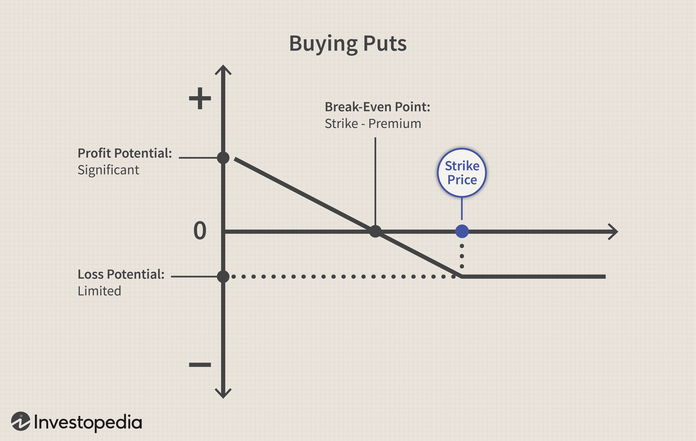

In algorithmic trading, selling put options is recognized as a robust strategy for income generation and risk management. This strategy involves the strategic practice of writing put options to collect premiums, thus becoming an integral component of various trading portfolios. The use of algorithms in trading has notably amplified the efficiency of put-selling strategies, allowing traders to systematically enhance returns. By employing algorithms, traders can execute predefined strategies that capitalize on market opportunities with precision and speed, arguably reducing the emotional and psychological biases often present in manual trading methods.

Options trading, particularly focusing on selling puts, has gained substantial traction among traders who aim to employ a structured approach to enhance portfolio performance. The practice of selling put options stands out due to its potential to offer consistent income streams in conditions where the trader anticipates that the underlying asset will either remain stable or show a mild increase in value. The key is to master the balance between collecting immediate income from premiums and managing the obligations that arise if the option is exercised, obligating the seller to buy the asset at the strike price.



This guide aims to elucidate the core concepts surrounding the practice of selling put options and underscores how algorithmic trading optimizes these strategies by leveraging technology for execution. A fundamental understanding of put options and the rationale for selling them are essential, as these concepts form the basis for developing backtested strategies for successful implementation. Algorithmic trading introduces the promise of optimizing put-selling strategies by refining decision-making processes, adjusting to market dynamics, and managing risk through systematic analysis and execution.

## Table of Contents

## Understanding Put Options

A put option is a type of financial derivative that grants the holder the right, but not the obligation, to sell a specific quantity of an underlying asset, usually a stock, at a predetermined price, known as the strike price, before the option expires. This establishes a floor price for the asset, offering protection against depreciation in value. The seller, or writer, of the put option is obligated to purchase the underlying stock at the strike price if the option holder exercises the option.

Put options serve various purposes in investment strategies. Primarily, buyers often utilize put options as a hedging mechanism to protect against potential declines in stock prices. By purchasing a put, investors can insure their portfolios against market downturns, effectively locking in a minimum sale price for their assets, which reduces risk exposure.

On the other hand, sellers can harness put options to generate income through the premiums paid by buyers for the option. This premium serves as immediate income and rewards the seller for accepting the obligation to purchase the underlying stock if the market moves against them. Notably, selling put options can be appealing in markets that are stable or exhibit slight bullish tendencies. In such environments, the seller's anticipation is that the stock price will remain above the strike price, thereby allowing the option to expire worthless. Consequently, the seller retains the premium as profit without having to purchase the underlying asset.

The underlying concept here is closely tied to the time value and probability of price movements in the market. Given that options have an expiration date, their value diminishes over time, a phenomenon known as time decay. Sellers aim to capitalize on this erosion of value, particularly when they assess that the probability of the option being exercised is low within the given time frame.

The mathematical valuation of put options can be assessed using models such as the Black-Scholes formula or binomial models, which compute the option's fair price based on factors including the current stock price, option's strike price, time to expiration, risk-free [interest rate](/wiki/interest-rate-trading-strategies), and the asset's [volatility](/wiki/volatility-trading-strategies):

$$

P = Xe^{-rT}N(-d_2) - S_0N(-d_1) 
$$

where 

$$

d_1 = \frac{\ln(S_0/X) + (r + \sigma^2 / 2)T}{\sigma\sqrt{T}}
$$

$$

d_2 = d_1 - \sigma\sqrt{T} 
$$

In these equations, $P$ represents the put option price, $S_0$ is the current stock price, $X$ is the strike price, $T$ is the time to expiration, $r$ is the risk-free interest rate, $\sigma$ is the volatility, and $N$ is the cumulative distribution function of the standard normal distribution. These mathematical tools enable traders to quantify both the premium to charge when selling puts and the expected fair market value of these options.

## The Appeal of Selling Put Options

Selling put options is an attractive strategy in the financial markets, primarily due to the potential for generating steady income through the collection of premiums. This income is derived from the characteristic time decay inherent in options, whereby the value of an option decreases as it approaches its expiration date. The time decay, represented by the Greek letter Theta (θ), is a core concept in options pricing, which implies that with the passage of time, an option's extrinsic value decreases, ultimately benefiting the seller if the option expires worthless.

The strategic use of selling put options is particularly appealing for traders and investors who maintain a neutral-to-bullish market outlook. By engaging in this strategy, they anticipate that the stock will remain stable or experience a mild appreciation over time. This stance allows them to capitalize on the price stability or moderate gains of the underlying asset without having to predict significant upward movements.

For investors interested in acquiring stocks at a more advantageous price point, selling put options offers an additional advantage. It provides a structured mechanism to potentially purchase stocks at a desired lower price. By selling a put option at a specific strike price, an investor essentially sets a price at which they are willing to buy the stock, should the option be assigned. This opportunity arises while simultaneously collecting option premiums, effectively lowering the net cost basis of acquiring the stock.

In practical terms, consider a stock currently trading at $100. An investor may sell a put option with a strike price of $90 for a premium of $5. If the stock price remains above $90 until expiration, the investor retains the premium as profit without any obligation to purchase the stock. However, if the stock price falls below $90, the investor may be obligated to buy the stock at the strike price, thus effectively acquiring it at a net cost of $85 ($90 strike price minus $5 premium received). This strategy allows investors to establish a predisposed buying condition that aligns with their financial objectives while benefiting from the premium income generated.

In conclusion, the appeal of selling put options lies in their dual benefit: the potential for consistent income via collected premiums and the opportunity to acquire stocks at predetermined, potentially discounted prices. This strategy is particularly suited for traders and investors who are comfortable with the associated risks and have a clear understanding of market dynamics.

## Cash-Secured Put Strategy

A cash-secured put involves writing a put option with a commitment to have sufficient cash in reserve to purchase the underlying asset if the option is assigned. This strategy aligns with conservative trading approaches, ensuring that investors are prepared for the potential obligation of buying the stock. By maintaining the necessary cash, the risk of forced buying at an unfavorable price is mitigated, providing a buffer against market volatility.

Traders often employ this approach to generate regular premium income while simultaneously expressing a willingness to purchase stocks at a more desirable, typically lower price. This dual objective is attractive for investors looking for stable returns; collecting the option premium upfront can enhance portfolio income. The hope is that the put option will expire worthless when the market price of the stock remains above the strike price at expiration. In such a scenario, the trader retains the premium as pure profit, with no obligation to purchase the stock.

This strategy is particularly appealing in a slightly bullish or sideways market, where the likelihood of the option being exercised is relatively low. Additionally, by targeting stocks that are highly valued yet expected to appreciate slightly or maintain stability, traders effectively set a "limit order" through put options at the strike price.

Consider the Python implementation below, which estimates outcomes for a cash-secured put strategy:

```python
import numpy as np

def cash_secured_put(premium, strike_price, current_price, num_options, expiration):
    reserve_cash = strike_price * num_options * 100  # Scaling by 100 for option contract size
    initial_income = premium * num_options * 100

    if current_price > strike_price:
        return reserve_cash + initial_income, 'Option Expired Worthless'
    else:
        stock_cost = strike_price * num_options * 100
        return stock_cost - reserve_cash + initial_income, 'Stocks Purchased at Strike'

# Example values:
premium = 2.00  # premium per option
strike_price = 50
current_price = 55
num_options = 10
expiration = 30  # In days

profit_or_cost, status = cash_secured_put(premium, strike_price, current_price, num_options, expiration)
print(f"Profit/Cost of securing strategy: ${profit_or_cost}, Status: {status}")
```

The cash-secured put strategy exemplifies a prudent and strategic mode of income generation and potential stock acquisition at preferable prices. However, it requires a disciplined approach to risk management, as market downturns can result in obligatory stock acquisition at less-than-optimal prices. By preparing adequately and selecting suitable stocks, traders can optimize the benefits while controlling for inherent risks.

## Applying Algo Trading to Put Selling

Algorithmic trading optimizes the selling of put options by leveraging technology to automate and refine the trading process. By employing algorithms, traders can define specific criteria for executing trades, making it possible to capitalize on opportunities with precision and speed. This automation minimizes the impact of human emotions and errors, which can often lead to suboptimal trading decisions.

Algorithms can be constructed using a combination of historical data analysis and technical indicators. Historical data provides insights into past market behaviors, allowing traders to identify patterns and conditions under which selling put options has previously been profitable. For example, traders might employ moving averages, Bollinger Bands, or relative strength indicators to determine favorable entry and [exit](/wiki/exit-strategy) points for selling puts.

Consider a Python implementation of a basic algorithm for selling put options. This script uses historical price data and applies a simple moving average crossover strategy to trigger sell orders:

```python
import pandas as pd
from sklearn.linear_model import LinearRegression
import numpy as np

# Load historical price data
data = pd.read_csv('historical_stock_data.csv')
data['SMA_50'] = data['Close'].rolling(window=50).mean()
data['SMA_200'] = data['Close'].rolling(window=200).mean()

# Generate signals
data['Signal'] = np.where(data['SMA_50'] > data['SMA_200'], 1, 0)

# Calculate returns
data['Returns'] = data['Close'].pct_change()
data['Strategy'] = data['Signal'].shift(1) * data['Returns']

# Print strategy performance
strategy_return = (1 + data['Strategy']).cumprod().iloc[-1]
print(f'Strategy Return: {strategy_return - 1:.2%}')
```

In this example, the algorithm generates a signal to sell put options when the 50-day simple moving average crosses above the 200-day average, assuming this indicates a bullish market condition. The strategy's performance is measured by the compounded returns from the signals.

Algorithmic trading also excels in managing multiple trades and monitoring dynamic market conditions. The ability to swiftly react to market changes is crucial in the volatile landscape of options trading. For instance, an algorithm can continuously scan for specific volatility levels or changes in implied volatility, executing trades only when predefined thresholds are met.

Moreover, the scalability of [algorithmic trading](/wiki/algorithmic-trading) allows for the management of significant trading volumes, enabling traders to diversify across various assets and markets simultaneously. This can enhance the robustness of the overall trading strategy, distributing risk and potentially increasing profitability.

In conclusion, the incorporation of algorithmic trading into put selling strategies enhances efficiency and effectiveness. By automating trade execution based on well-defined criteria, traders can capitalize on opportunities swiftly and consistently, minimizing the risks associated with human intervention. With the ability to handle complex data and rapidly changing market conditions, algorithmic strategies in options trading can provide a competitive edge.

## Backtesting and Performance Analysis

Backtesting is an essential procedure in the development of any trading strategy, particularly those involving the sale of put options. It involves the use of historical data to simulate trades, allowing traders to predict the potential performance and profitability of their strategies before actual implementation. In essence, [backtesting](/wiki/backtesting) helps traders determine whether their strategy could have worked under past market conditions, providing a statistical foundation for sound decision-making.

Research, such as that conducted by Oleg Bondarenko, indicates that implied volatility tends to be historically overpriced compared to actual volatility. This discrepancy suggests that systematic put selling may yield attractive risk-adjusted returns over time. Bondarenko's studies reveal that by capitalizing on this overpricing, traders can benefit from the premium decay inherent in option trading, potentially leading to consistent profits.

To perform backtesting effectively, traders typically rely on software tools that parse extensive historical data, execute simulated trades, and generate performance metrics. This includes key indicators such as the Sharpe ratio, maximum drawdown, and cumulative returns. Backtesting can be conducted using programming languages like Python, which offers robust libraries such as Pandas for data manipulation and Backtrader for implementing and analyzing trading strategies.

Here is a simplified Python example illustrating how one might set up a backtest for selling put options using the Backtrader framework:

```python
import backtrader as bt

class PutSellingStrategy(bt.Strategy):
    def __init__(self):
        pass  # Initialize any indicators, counters, etc.

    def next(self):
        # Implement logic for selling puts
        if not self.position:  # Check if position is open
            self.sell_option()  # Pseudo-code to indicate put selling

    def sell_option(self):
        # This function should include logic for option selling
        pass

def run_backtest():
    cerebro = bt.Cerebro()
    cerebro.addstrategy(PutSellingStrategy)

    data = bt.feeds.YahooFinanceData(dataname='AAPL', fromdate=datetime(2010,1,1), todate=datetime(2020,1,1))
    cerebro.adddata(data)

    cerebro.run()
    cerebro.plot()

run_backtest()
```

The value of backtesting goes beyond mere validation; it serves as a tool for fine-tuning strategy parameters to optimize performance and risk management. By adjusting variables and testing different scenarios, traders can enhance their potential for success. Furthermore, backtesting offers insights into market conditions that may impact strategy effectiveness, such as volatility shifts and [liquidity](/wiki/liquidity-risk-premium) constraints.

In summary, backtesting is indispensable for anyone looking to develop and implement a put selling strategy with a solid foundation. By providing a glimpse into how a strategy might perform under historical market conditions, it offers a critical methodological approach to reduce uncertainty and bolster confidence in trading decisions.

## Risks of Selling Put Options

Selling put options, while offering potential income generation, comes with significant risks, especially when market conditions move unfavorably against the seller's positions. One primary concern is the obligation to purchase stocks at the strike price if the market declines substantially, leading to the potential acquisition of assets at prices higher than the current market value. This situation is particularly challenging if the market drop is steep and rapid, as the options seller may not have anticipated such a downturn. 

When a put option is assigned, the seller must buy the underlying stock at the predetermined strike price, even if its market value has decreased substantially. This scenario can lead to financial losses if the difference between the strike price and the market price is significant. For instance, if a trader sells a put option with a strike price of $50 and the stock price plummets to $30, the seller must buy the stock at $50, resulting in a $20 per share loss, excluding the premium received.

Furthermore, put option sellers face an unlimited downside risk. Unlike buying options, where the maximum loss is the premium paid, selling options exposes traders to losses that can far exceed the initial premium collected if the stock price falls significantly. The risk grows with the magnitude of the stock's price drop, as there is no theoretical limit to how low a stock price can go.

In addition to market risks, selling put options requires careful margin management to ensure sufficient funds are available to cover potential assignments. Failure to maintain adequate margin levels can lead to margin calls and forced liquidation of other assets, compounding potential losses.

To mitigate these risks, sellers can employ risk management techniques such as setting predefined exit strategies, utilizing stop-loss orders, or incorporating hedging strategies like buying protective puts. Additionally, algorithmic trading can aid in monitoring market conditions and executing trades efficiently, but it remains essential for traders to conduct thorough risk assessments and remain vigilant to changes in market dynamics.

## Conclusion

Selling put options in algorithmic trading presents a significant opportunity for traders to generate income, provided the strategy is executed with precision and accompanied by robust analysis and risk management. One of the main advantages of using automated trading systems is their ability to consistently execute trades based on predefined criteria. This automation ensures that trades are carried out swiftly and without emotional interference, which often plagues human traders.

Moreover, the speed at which automated systems can respond to market conditions offers a distinct edge in the fast-paced options market. By effectively analyzing historical data and integrating technical indicators, these systems can identify optimal moments for entering or exiting positions. This capability not only enhances the potential for profit but also aids in minimizing potential losses through timely decision-making.

However, it's crucial to acknowledge the inherent risks associated with selling put options. Adverse market movements can force traders to purchase underlying stocks at unfavorable prices, leading to substantial losses. Hence, a meticulously constructed algorithmic trading system is invaluable for managing these risks. Through continuous monitoring and adjustment of trading strategies, such systems can mitigate exposure to significant losses, ensuring selling put options remains a viable component of a comprehensive trading plan.

In conclusion, while algorithmic trading in selling put options can be highly rewarding, it requires a balanced approach of leveraging technology and maintaining rigorous risk management practices. When done correctly, it can become a powerful tool for income generation in a structured options trading strategy.

## References & Further Reading

[1]: Natenberg, S. (1994). ["Option Volatility and Pricing: Advanced Trading Strategies and Techniques."](https://www.amazon.com/Option-Volatility-Pricing-Strategies-Techniques/dp/0071818774) McGraw-Hill Education.

[2]: Hull, J. C. (2014). ["Options, Futures, and Other Derivatives."](https://www.amazon.com/Options-Futures-Other-Derivatives-9th/dp/0133456315) Pearson.

[3]: Bondarenko, O. (2003). ["Why Are Put Options So Expensive?"](https://papers.ssrn.com/sol3/papers.cfm?abstract_id=375784) Quarterly Journal of Finance.

[4]: Chan, E. (2008). ["Quantitative Trading: How to Build Your Own Algorithmic Trading Business."](https://rickorford.com/quantitative-trading/) John Wiley & Sons.

[5]: Euan Sinclair. (2010). ["Option Trading: Pricing and Volatility Strategies and Techniques."](https://www.amazon.com/Option-Trading-Volatility-Strategies-Techniques/dp/0470497106) John Wiley & Sons.

[6]: Jansen, S. (2020). ["Machine Learning for Algorithmic Trading: Predictive Models to Extract Signals from Market and Alternative Data for Systematic Trading Strategies with Python."](https://www.amazon.com/Machine-Learning-Algorithmic-Trading-alternative/dp/1839217715) Packt Publishing.