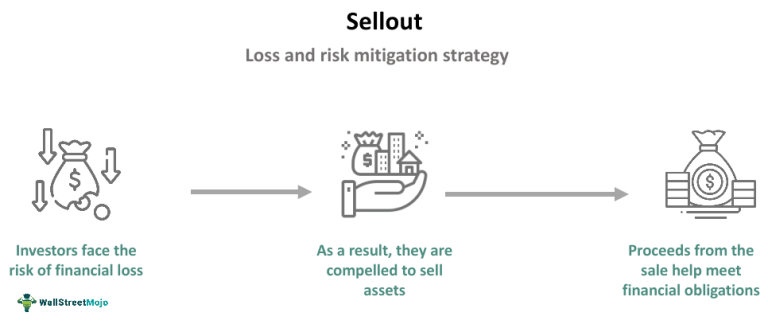

The rapidly evolving financial landscape has led to significant developments in trading methodologies. Among these, algorithmic trading has emerged as a compelling strategy that integrates advanced technology with financial expertise. This form of trading utilizes computer algorithms to automate trading decisions, which allows traders to execute trades at speeds and frequencies far beyond human capabilities. As a result, algorithmic trading has become particularly popular in environments characterized by high volatility and fast-paced changes.

Understanding market opportunities and developing an effective business strategy are crucial for maximizing the potential of algorithmic trading. Market opportunities can arise from persistent inefficiencies, discrepancies in pricing, and rapid responses to external events affecting financial instruments. A well-crafted strategy takes these factors into account and aligns them with the unique strengths of algorithmic systems—such as real-time data analysis and rapid execution—to optimize performance and manage risks.



As companies and investors navigate this complex trading method, strategic planning and awareness of market conditions are vital. A successful approach requires a comprehensive understanding of market dynamics and the ability to swiftly react to changes and emerging opportunities. This article focuses on integrating market opportunities, business strategies, sellout scenarios, and algorithmic trading, providing insights into the multifaceted approach required to leverage these elements effectively.

## Table of Contents

## What is Algorithmic Trading?

Algorithmic trading utilizes computer algorithms to automate trading processes, offering a strategic edge in financial markets by capitalizing on technology and minimizing human error. At its core, algorithmic trading involves pre-defined sets of rules and procedures that dictate trading decisions based on historical and real-time market data. These algorithms can process complex computations at speeds and volumes that human traders cannot achieve, thereby enhancing the efficiency and profitability of trades.

The core strategies employed in algorithmic trading include arbitrage, trend following, and market making. Arbitrage involves exploiting price discrepancies of financial instruments across different markets or currencies. For instance, if a stock is undervalued in one market and overvalued in another, an algorithm can rapidly execute simultaneous buy and sell orders to profit from this discrepancy. Trend following, another fundamental strategy, relies on the identification of prevailing market trends; algorithms are designed to buy or sell based on the perceived continuation of these trends, often using technical indicators like moving averages to guide their decisions. Market making involves providing liquidity to the market by placing buy and sell orders, thereby capitalizing on the bid-ask spread.

The automation inherent in algorithmic trading provides significant advantages such as high-speed trade execution and the ability to trade constantly without the need for human intervention. This enables the exploitation of short-lived market inefficiencies that arise due to information asymmetry or transient market conditions. However, the effectiveness of algorithmic trading depends on the robustness and adaptability of the underlying strategies. This necessitates continuous monitoring and refinement to ensure that algorithms remain effective amidst evolving market conditions and dynamics.

Despite the substantial capabilities of [algorithmic trading](/wiki/algorithmic-trading), it is not without challenges. The design and implementation of successful trading algorithms require sophisticated financial and programming expertise. Additionally, as market conditions shift, algorithms must be updated or recalibrated to maintain their efficacy. Consequently, algorithmic traders often employ advanced techniques such as [machine learning](/wiki/machine-learning) to enhance the adaptability and predictive power of their models.

In conclusion, algorithmic trading represents a synthesis of finance and technology, offering numerous possibilities for profit by leveraging computational power and innovative strategies. However, its success hinges on the development of intelligent algorithms capable of navigating intricate and ever-changing market landscapes.

## Market Opportunities in Algorithmic Trading

The financial markets present abundant opportunities for algorithmic trading, with market [volatility](/wiki/volatility-trading-strategies) and technological advancements playing pivotal roles in this dynamic landscape. Algorithmic trading capitalizes on the fluctuations in market prices and emerging patterns by employing sophisticated computational models and data analysis techniques. 

Market opportunities for algorithmic trading can be effectively identified through a rigorous data-driven approach. Analyzing historical data, traders can detect recurring patterns or anomalies that signal potential trading profits. For instance, machine learning models can be developed to classify various patterns and predict future price movements based on learned conditions. A common method involves employing statistical techniques such as moving averages, mean reversion, or Bollinger Bands to spot trends and reversals.

Leveraging market opportunities often involves exploiting brief inefficiencies that arise due to supply-demand imbalances or external events. High-frequency trading ([HFT](/wiki/high-frequency-trading-strategies)) firms, for instance, thrive on minuscule inefficiencies by executing trades in fractions of a second. These firms use latency [arbitrage](/wiki/arbitrage) strategies to capitalize on momentary price discrepancies across different markets or trading platforms.

Algorithmic trading strategies can also be engineered to react swiftly to news events or economic announcements. Sentiment analysis and natural language processing (NLP) techniques allow algorithms to assess and quantify the impact of news on asset prices. Rapid execution following significant news can lead to advantageous positions before the market reaches a new equilibrium.

An exemplary Python framework for executing such strategies could involve using libraries like pandas for data manipulation and [backtrader](/wiki/backtrader) for [backtesting](/wiki/backtesting) trading strategies. Here's a simple illustration of a moving average crossover strategy in Python:

```python
import backtrader as bt

class MovingAverageCrossover(bt.SignalStrategy):
    def __init__(self):
        self.signal_add(bt.SIGNAL_LONG, bt.indicators.CrossOver(
            bt.indicators.SimpleMovingAverage(self.data.close, period=20),
            bt.indicators.SimpleMovingAverage(self.data.close, period=50)
        ))

cerebro = bt.Cerebro()
cerebro.addstrategy(MovingAverageCrossover)
data = bt.feeds.YahooFinanceData(dataname='AAPL', fromdate='2020-01-01', todate='2020-12-31')
cerebro.adddata(data)
cerebro.run()
cerebro.plot()
```

This code sets up a trading strategy that buys when the 20-day simple moving average crosses above the 50-day simple moving average, indicative of a bullish trend.

By systematically analyzing vast datasets and implementing responsive algorithms, traders can exploit and enhance their positions in the face of rapid market changes. The perpetual evolution of financial markets provides a fertile ground for those skilled in aligning technological prowess with strategic foresight in algorithmic trading.

## Business Strategy for Algorithmic Trading

Developing a successful business strategy for algorithmic trading requires a comprehensive understanding of competitive advantages and market position. A robust strategy involves several key elements:

1. **Risk Management**: Effective risk management is fundamental to algorithmic trading. The volatile nature of financial markets necessitates strategies that can mitigate potential losses. This involves setting stop-loss limits, calibrating position sizes based on market conditions, and continuous monitoring of market risk parameters. Advanced algorithms capable of assessing real-time risk can provide a buffer against unforeseen market events.

2. **Portfolio Diversification**: Diversification is another cornerstone of a successful strategy, helping to spread risk across various asset classes and trading strategies. By diversifying, businesses can reduce the exposure to any single asset or market movement. This practice minimizes the impact of adverse price movements in one area by leveraging gains or stability in others.

3. **Real-Time Data Analysis**: Access to and analysis of real-time data is critical in algorithmic trading. Real-time data enables quick reactions to market changes, optimizing trading decisions. Cutting-edge technologies such as machine learning and natural language processing can be integrated to analyze market trends and predict movements, thus enhancing the decision-making process. These technologies facilitate processing vast amounts of data, identifying patterns and anomalies, and executing trades based on derived insights.

4. **Technological Infrastructure**: A solid technological infrastructure is essential to support the demands of algorithmic trading. This includes high-performance computing systems for rapid execution of trades, reliable data feeds for accurate market information, and secure storage solutions for historical data analysis. The technological framework must ensure minimal latency and high reliability, enabling traders to capitalize on fleeting market opportunities.

5. **Expert Knowledge**: Employing expert knowledge is crucial in optimizing trading algorithms. This involves a team of quantitative analysts, data scientists, and financial experts who can design, test, and refine algorithms. They bring a deep understanding of financial markets along with the technical expertise needed to develop strategies that align with the company’s objectives and risk appetite. Continuous training and adaptation to market changes ensure that the team remains at the forefront of trading innovations.

In conclusion, constructing a successful business strategy for algorithmic trading is multifaceted, requiring risk management, diversification, advanced data analytics, robust technological infrastructure, and expert knowledge. Each component plays a pivotal role in optimizing trading outcomes and achieving sustainable competitive advantage in the dynamic and fast-paced environment of financial markets.

## Understanding Sellouts and their Role in Trading

Sellouts occur when a trader or institution must sell assets to meet immediate financial obligations, typically due to [liquidity](/wiki/liquidity-risk-premium) issues or as a response to market pressures. These forced liquidations can significantly influence market dynamics by introducing a sudden increase in supply, often leading to a decline in prices.

In trading, sellouts represent both challenges and opportunities. On one hand, they can lead to suboptimal selling prices, potentially resulting in financial loss for the entity liquidating assets. On the other hand, for investors and traders with the right tools and strategies, sellouts can open up attractive entry points for assets at reduced prices. This is particularly relevant in cases of forced sales, where assets are offloaded at lower than market value to fulfill urgent obligations.

Algorithmic trading can capitalize on sellout scenarios by enabling rapid decision-making processes. These systems, powered by sophisticated algorithms, can swiftly analyze market conditions and execute trades based on predefined criteria. This capability is critical when reacting to short squeezes—a situation where a heavily shorted stock sees a rapid price increase, forcing short sellers to buy back shares at higher prices, further driving up the stock's price. Algorithmic trading systems can identify such patterns and execute trades to profit from the volatility created by these short squeezes.

For instance, an algorithm might be programmed to detect specific market signals associated with an impending sellout scenario. This could involve monitoring trading volumes, price movements, and even news events that might trigger a large-scale liquidation. Upon detection, the system can automatically buy undervalued assets or short overvalued ones, depending on the anticipated market trend. Furthermore, algorithms can incorporate machine learning techniques to improve their predictive accuracy over time, learning from previous sellout cases and adjusting their strategies accordingly.

The successful implementation of algorithmic strategies during sellouts requires continuous real-time monitoring of markets and a robust understanding of liquidity and potential price changes. It's critical to design algorithms with adaptive capabilities that consider current market conditions and historical data to manage risks efficiently during periods of high volatility.

In summary, understanding sellouts and integrating them into an algorithmic trading framework can present significant opportunities for traders. By leveraging technology and strategic insight, traders can navigate the complexities of forced asset sales, turning potential market disruptions into profitable ventures.

## Integrating Sellout Strategies with Algorithmic Trading

Algorithmic trading strategies can be effectively tailored to respond to sellout events, where quick decision-making and agility are paramount. These strategies necessitate the incorporation of real-time monitoring systems and adaptive algorithms to manage portfolio risks proficiently. Real-time monitoring allows traders to swiftly detect market conditions indicative of sellout scenarios, such as sharp declines in asset prices or unusual trading volumes. 

Adaptive algorithms are integral, as they adjust trading strategies in response to new data inputs and market conditions, maintaining optimal performance despite volatility. For instance, if a sellout event leads to a sudden drop in asset price, an algorithm can quickly assess whether to execute a purchase order to capitalize on the opportunity or adjust stop-loss levels to mitigate potential losses. Adaptive algorithms can employ machine learning techniques to predict market movements based on historical data and current trends, refining strategies over time.

Understanding market liquidity is crucial during sellouts. Liquidity refers to the ability to buy or sell an asset without causing significant price changes. In sellouts, liquidity can be constrained, leading to more significant price swings and potential execution challenges. Algorithmic trading strategies can include liquidity analysis tools, which assess [order book](/wiki/order-book-trading-strategies) depth and transaction costs to determine optimal order sizes that minimize market impact.

A fundamental approach to managing liquidity risks involves calculating the expected market impact, $I$, using the formula:

$$
I = \frac{V}{V_{\text{total}}} \times \sigma
$$

where $V$ is the transaction volume, $V_{\text{total}}$ is the total volume available in the order book, and $\sigma$ represents the standard deviation of historical price changes. By understanding the likely impact of executing large trades, algorithms can strategize order splitting or time-weighted average price (TWAP) executions to manage risks.

Moreover, sellout strategies can integrate real-time data feeds from news outlets and social media to anticipate forced sales triggered by market news. Algorithms can be programmed to test various scenarios based on sentiment analysis, optimizing trade execution during periods of heightened market emotions.

Code implementation for sentiment analysis in Python could look like this:

```python
from textblob import TextBlob
import requests

def fetch_news(api_key, query):
    url = f"https://newsapi.org/v2/everything?q={query}&apiKey={api_key}"
    response = requests.get(url)
    return response.json()

def analyze_sentiment(news_articles):
    sentiments = []
    for article in news_articles['articles']:
        analysis = TextBlob(article['description'])
        sentiments.append(analysis.sentiment.polarity)
    return sum(sentiments) / len(sentiments)

api_key = "your_api_key"
query = "forced sellout"
news_data = fetch_news(api_key, query)
average_sentiment = analyze_sentiment(news_data)

print(f"Average sentiment score: {average_sentiment}")
```

In summary, a comprehensive algorithmic trading strategy that integrates sellout considerations must have robust mechanisms for real-time market analysis and adaptive frameworks that respond effectively to liquidity changes and price fluctuations. Balancing speed, accuracy, and market understanding, traders can enhance decision-making efficiency during sellouts, potentially maximizing profitability and reducing risks.

## Regulatory Considerations and Ethical Implications

Algorithmic trading, a cornerstone of modern financial markets, is subject to profound regulatory oversight and ethical scrutiny. Regulatory frameworks are designed to ensure that trading activities align with the principles of transparency, efficiency, and fairness, key tenets that uphold market integrity. Various authorities globally have established guidelines that traders must adhere to, ensuring that algorithmic strategies do not compromise these fundamental principles.

### Regulatory Requirements

In the United States, for instance, the Securities and Exchange Commission (SEC) mandates that algorithmic trading strategies comply with rules set to prevent fraudulent practices and conflicts of interest. Similarly, the Commodity Futures Trading Commission (CFTC) enforces regulations to ensure market stability and protect investors against potential abuses arising from high-frequency trading.

In Europe, the Markets in Financial Instruments Directive II (MiFID II) has laid down stringent requirements for algorithmic trading. This includes the obligation for firms to maintain robust risk controls and ensures that their trading systems are resilient and subject to thorough testing. Additionally, MiFID II demands transparency in trading activities to prevent market manipulation, requiring traders to report significant algorithmic trading activities to relevant authorities.

### Ethical Considerations

Ethical concerns revolve around the potential for algorithmic trading to disrupt fair market practices. Ensuring that trading algorithms do not engage in manipulative behavior, such as spoofing or layering, is paramount. Spoofing involves placing large orders with no intention of executing them, thereby misleading other market participants about the demand or supply of a security. Layering entails submitting multiple orders that a trader intends to cancel before execution, creating a false impression of market interest.

Traders must be vigilant in adhering to ethical standards to maintain their reputation and the trust of their clients and peers. This includes implementing algorithms that promote fair competition and do not exploit market vulnerabilities to the detriment of other participants. Ethical guidelines also encourage transparency in disclosing algorithmic strategies utilized and ensuring that these strategies provide equitable returns without resorting to deceptive practices.

### Safeguarding Operations and Reputation

To safeguard their operations, traders must implement comprehensive compliance programs that address both regulatory and ethical standards. This includes regular audits of algorithmic systems, thorough backtesting to ensure performance aligns with expected outcomes, and continuous monitoring to detect any aberrations or signs of manipulative activity.

Moreover, education and training are vital components in fostering a culture of ethical behavior among trading teams. By embedding a strong ethical framework within the organizational culture, firms can better navigate the complex landscape of algorithmic trading while respecting regulatory mandates.

Ultimately, adherence to regulatory requirements and upholding ethical practices are not merely legal obligations but critical components of sustainable trading operations that protect the broader market ecosystem. As algorithmic trading continues to evolve with technological advancements, maintaining a robust ethical and regulatory framework will be essential for continued innovation and fair market practices.

## Conclusion

The intersection of market opportunities, strategic business planning, and algorithmic trading offers vast potential for financial gains. In an environment where financial markets are increasingly influenced by data and technology, the strategic deployment of algorithmic trading can lead to significant competitive advantages. By effectively identifying and exploiting market opportunities, businesses and individual traders can harness the dynamics of volatile markets to optimize returns.

Investors and companies need to be proactive in addressing challenges related to sellout conditions and market volatility. This requires a keen understanding of market trends and the ability to respond rapidly to changing conditions. Algorithmic trading systems, with their capability for real-time data analysis and swift execution, are well-positioned to capitalize on these scenarios. Sellout conditions, while often challenging, can present unique opportunities for traders to acquire undervalued assets or profit from price inefficiencies.

Continued innovation and regulatory compliance will shape the future landscape of algorithmic trading. As financial technologies evolve, incorporating machine learning and [artificial intelligence](/wiki/ai-artificial-intelligence) into trading algorithms is likely to yield even more sophisticated tools for predicting market movements. However, this must be balanced with adherence to regulatory standards designed to ensure fair and transparent market practices. Regulatory bodies worldwide continue to refine their frameworks to address the complexities introduced by advanced trading technologies.

In conclusion, the strategic implementation of algorithmic trading, supported by thorough market analysis and compliance with ethical and regulatory standards, is poised to drive substantial financial gains in today's rapidly changing economic landscape. Maintaining a forward-looking approach and leveraging technological advancements will be essential for stakeholders aiming to thrive in this competitive arena.

## References & Further Reading

[1]: Bergstra, J., Bardenet, R., Bengio, Y., & Kégl, B. (2011). ["Algorithms for Hyper-Parameter Optimization."](https://dl.acm.org/doi/10.5555/2986459.2986743) Advances in Neural Information Processing Systems 24.

[2]: ["Advances in Financial Machine Learning"](https://www.amazon.com/Advances-Financial-Machine-Learning-Marcos/dp/1119482089) by Marcos Lopez de Prado

[3]: ["Evidence-Based Technical Analysis: Applying the Scientific Method and Statistical Inference to Trading Signals"](https://www.amazon.com/Evidence-Based-Technical-Analysis-Scientific-Statistical/dp/0470008741) by David Aronson

[4]: ["Machine Learning for Algorithmic Trading"](https://github.com/stefan-jansen/machine-learning-for-trading) by Stefan Jansen

[5]: ["Quantitative Trading: How to Build Your Own Algorithmic Trading Business"](https://www.amazon.com/Quantitative-Trading-Build-Algorithmic-Business/dp/1119800064) by Ernest P. Chan