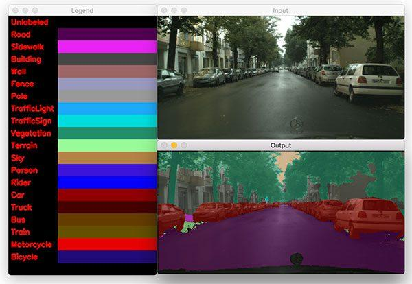

## Table of Contents

## What is semantic segmentation in machine learning?

Semantic segmentation in machine learning is a technique used to label each pixel in an image with a class that represents what the pixel is part of. Imagine you have a picture of a street scene. Semantic segmentation would help you identify and label every pixel that belongs to cars, roads, buildings, and pedestrians separately. This is different from just saying there's a car in the image; it tells you exactly where each car is, pixel by pixel.

This technique is very useful in many areas like self-driving cars, where knowing the exact location of objects in an image can help the car navigate safely. It's also used in medical imaging to identify and label different types of tissues or anomalies in scans. To perform semantic segmentation, machine learning models, often deep neural networks, are trained on large datasets of images where each pixel is already labeled. These models learn to predict the class of each pixel in new images they haven't seen before.

## How does semantic segmentation differ from instance segmentation?

Semantic segmentation and instance segmentation are both techniques used in computer vision to analyze images, but they do so in different ways. Semantic segmentation labels each pixel in an image with a class, grouping pixels that belong to the same category together. For example, in a picture of a park, all the pixels that are part of trees would be labeled as "tree," and all the pixels that are part of the sky would be labeled as "sky." This means that if there are multiple trees in the image, semantic segmentation would not distinguish between them; they would all be labeled as "tree."

Instance segmentation goes a step further. It not only labels each pixel with a class, but it also distinguishes between different instances of the same class. Using the same park example, instance segmentation would label each tree separately, even though they all belong to the "tree" class. This means you could count the number of trees in the image because each tree would have its own unique label. This makes instance segmentation more detailed and useful in scenarios where knowing the number of objects is important, like in autonomous driving where knowing the number of cars on the road is crucial for safety.

## What are the common applications of semantic segmentation?

Semantic segmentation is used in many areas where understanding the exact location of objects in an image is important. One common application is in self-driving cars. These cars use semantic segmentation to understand the road, other cars, pedestrians, and traffic signs. By knowing exactly where these objects are, the car can drive safely and make smart decisions. Another use is in medical imaging. Doctors use semantic segmentation to look at scans and find out where different tissues or diseases are. This helps them plan treatments and surgeries better.

Another area where semantic segmentation is helpful is in agriculture. Farmers use it to analyze images of their fields to see where different crops or weeds are growing. This helps them manage their farms more efficiently. In the world of robotics, semantic segmentation helps robots understand their surroundings better. For example, a robot in a warehouse can use it to find and pick up items more accurately. Overall, semantic segmentation is a powerful tool that helps in many fields by giving detailed information about what's in an image.

## What is the Atrous Spatial Pyramid Pooling (ASPP) module and how does it work?

The Atrous Spatial Pyramid Pooling (ASPP) module is a part of some deep learning models that helps them understand images better. It does this by looking at the image in different ways at the same time. Imagine you're looking at a picture through different magnifying glasses, each showing you a different level of detail. ASPP does something similar by using different "holes" or gaps in the way it processes the image. This helps the model catch details at different scales, which is really useful for tasks like semantic segmentation where you need to understand what each pixel in an image represents.

ASPP works by using a technique called "atrous convolution," which is just a fancy way of saying it adds gaps or "holes" between the points it uses to look at the image. By changing the size of these gaps, ASPP can see the image at different levels of detail without losing any information. For example, with small gaps, it can focus on fine details, while larger gaps let it see bigger patterns. The module combines these different views to make a better overall understanding of the image. This is especially helpful in tasks where objects can be of different sizes and you need to recognize them all accurately.

## How does the Pyramid Pooling Module improve semantic segmentation?

The Pyramid Pooling Module (PPM) helps make semantic segmentation better by looking at the image in different sizes all at once. Imagine you're trying to understand a picture by looking at it from far away and then up close. PPM does something like that. It takes the image and breaks it down into different levels of detail. By doing this, it can catch both the big picture and the small details, which is really important for understanding what each pixel in the image represents.

This module works by creating several versions of the image, each at a different scale. It then combines these versions to get a fuller picture of what's in the image. For example, if you have a picture with both a big tree and a small bird, PPM can help the model see both clearly. By understanding the image at different levels, the model can label each pixel more accurately, making semantic segmentation more effective.

## What is the NEAT module and what makes it unique in semantic segmentation?

The NEAT module, which stands for Neural Architecture Expansion and Transformation, is a unique approach to improving semantic segmentation. What makes it special is that it can change its own structure to better fit the task at hand. Imagine you're building a puzzle, and you can keep adding or changing pieces until the picture is clear. That's what NEAT does with its network. It starts with a basic design but can grow and adapt, making it better at understanding images.

NEAT's uniqueness comes from its ability to find the best way to label pixels in an image by adjusting itself. It's like a plant growing in different directions to get more sunlight. By expanding and transforming, NEAT can focus on the important parts of an image, making its predictions more accurate. This makes it a powerful tool for semantic segmentation, where understanding every pixel is key.

## How does the PointRend module enhance the accuracy of semantic segmentation at object boundaries?

The PointRend module helps make semantic segmentation more accurate, especially at the edges of objects. It does this by focusing on the tricky parts where different things meet, like where a car's tire touches the road. PointRend uses a clever trick: it picks out the pixels that are hard to label and looks at them more closely. By doing this, it can tell the difference between objects more clearly, even when they are very close together.

To do its job, PointRend uses something called "point-based rendering." This means it looks at certain points in the image and uses a special way of figuring out what those points are part of. It's like zooming in on the edges of things to see them better. By paying extra attention to these points, PointRend makes sure the edges in the image are labeled correctly, which makes the whole picture more accurate.

## What are the key features of the Global Convolutional Network in semantic segmentation?

The Global Convolutional Network (GCN) is a special kind of network used in semantic segmentation. It helps the computer understand the whole image better by looking at it in a way that captures both big and small details. GCN uses something called large-kernel convolutions, which means it looks at big areas of the image at once. This helps the network see the overall shape and layout of objects in the image. By doing this, GCN can label each pixel more accurately, even if the objects are big or spread out.

Another important feature of GCN is that it can handle different sizes of objects well. It does this by using a technique called "boundary refinement," which helps make the edges of objects clearer. This is really helpful in semantic segmentation because it makes sure that the boundaries between different things in the image are labeled correctly. Overall, GCN makes semantic segmentation more accurate by looking at the big picture and fine-tuning the details, especially at the edges of objects.

## How does the Channel-wise Cross Attention mechanism contribute to better semantic segmentation?

The Channel-wise Cross Attention mechanism helps improve semantic segmentation by making the network pay more attention to important parts of the image. Imagine you're looking at a picture and you want to focus on the most interesting details. This mechanism does something similar by helping the computer decide which parts of the image are most important for labeling each pixel correctly. It does this by looking at different channels, or layers, of the image and figuring out how they relate to each other. By understanding these relationships, the network can better understand what each pixel represents.

This mechanism works by using a special kind of attention that looks across the channels of the image. It's like having a conversation between different parts of the image, where each part shares information to help the others. This helps the network see patterns and details that might be hard to notice otherwise. By using this channel-wise cross attention, the network can make more accurate predictions about what each pixel is part of, which is really important for tasks like semantic segmentation where understanding every pixel is key.

## What role does the Channel-wise Cross Fusion Transformer play in semantic segmentation?

The Channel-wise Cross Fusion Transformer helps make semantic segmentation better by mixing information from different parts of the image in a smart way. Imagine you're trying to understand a picture by looking at different pieces and putting them together. This transformer does something similar by looking at different channels, or layers, of the image and figuring out how they can help each other. By doing this, it can see the whole picture more clearly and label each pixel more accurately.

This transformer uses a special way of paying attention to different parts of the image. It's like having a conversation between different layers of the image, where each layer shares what it knows to help the others. This helps the network catch important details and patterns that might be hard to see otherwise. By using this channel-wise cross fusion, the network can understand what each pixel represents better, which is really important for tasks like semantic segmentation where knowing every pixel is key.

## How does the Short-Term Dense Concatenate (STDC) network architecture improve semantic segmentation performance?

The Short-Term Dense Concatenate (STDC) network architecture helps make semantic segmentation better by using a smart way to connect different parts of the network. Imagine you're building a tower with blocks, and you want to make sure each block helps the ones above it. STDC does something like that by letting each layer in the network use information from the layers right before it. This helps the network catch important details quickly and label each pixel more accurately. By doing this, STDC can understand the image better and make better predictions about what each pixel represents.

Another way STDC improves semantic segmentation is by keeping the network simple but powerful. It does this by using fewer layers but making sure each layer works hard. This means the network can run faster and use less computer power, which is really helpful for tasks like self-driving cars where quick decisions are important. By being both fast and accurate, STDC makes semantic segmentation more effective and easier to use in real life.

## What advanced techniques like the Flow Alignment Module, Bilateral Guided Aggregation Layer, and Dense Atrous Spatial Pyramid Pooling (DASPP) can be used to further refine semantic segmentation results?

The Flow Alignment Module helps make semantic segmentation better by fixing problems that can happen when objects move in a video. Imagine you're watching a video of a car driving by. The car moves from one frame to the next, and this can make it hard for the computer to label the pixels correctly. The Flow Alignment Module uses something called optical flow to understand how things are moving. By doing this, it can keep track of the car and make sure the labels stay accurate, even as the car moves. This helps the network understand the video better and label each pixel more correctly.

The Bilateral Guided Aggregation Layer and Dense Atrous Spatial Pyramid Pooling (DASPP) also help improve semantic segmentation by focusing on different parts of the image. The Bilateral Guided Aggregation Layer looks at the image and uses information from different scales to make better predictions. It's like looking at a picture from far away and then up close to catch all the details. DASPP takes this a step further by using many different sizes of "holes" or gaps when looking at the image. This helps the network see both big and small details at the same time. By combining these techniques, the network can understand the image better and label each pixel more accurately.