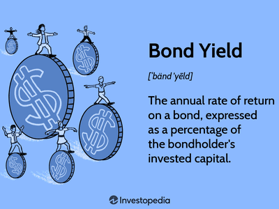

In the world of financial markets, the semi-annual bond basis (SABB) is a crucial concept, particularly in bond trading. This metric plays a fundamental role in facilitating the comparison of bond yields by standardizing different coupon payment schedules. Bonds often come with varying coupon payment frequencies, such as annual, semi-annual, or quarterly. These discrepancies can make direct yield comparisons challenging for investors. 

SABB addresses this challenge by converting bonds with non-semi-annual coupon payments to an equivalent basis that pays semi-annually. This standardization helps investors assess yields more accurately and make informed investment decisions. For instance, knowing the SABB enables investors to compare a bond that pays quarterly coupons with one paying annual coupons by effectively translating their yields to a semi-annual equivalent. 



Moreover, SABB's significance is underscored by its influence on investment strategies and the structuring of bond portfolios. Investors and portfolio managers rely on SABB to evaluate and select bonds based on their yield performance. By adjusting for payment schedule differences, SABB provides a more consistent framework for predicting yield outcomes and aligning them with investment goals.

This article aims to explore the intricacies of SABB, its impact on bond trading, and the role of algorithmic trading in optimizing strategies. Understanding SABB is essential for investors looking to compare bond yields effectively and optimize their trading strategies, thus offering a robust tool for maximizing returns in the bond market.

## Table of Contents

## Understanding Semi-Annual Bond Basis (SABB)

Semi-Annual Bond Basis (SABB) is a technique employed to harmonize the yield comparison of bonds with varying coupon payment schedules, transforming bonds that do not pay semi-annual coupons into an equivalent framework. This standardization is critical as it provides investors with the ability to make informed decisions by evaluating bonds on a consistent yield basis. In essence, SABB adjusts the yield of bonds with non-semi-annual coupon payments, ensuring comparability by converting those yields into a semi-annual equivalent yield.

The mechanics of SABB prove especially beneficial in markets characterized by a diversity of bond payment frequencies, including quarterly, annual, and even irregular schedules. This diversity can otherwise present significant challenges when attempting to assess and compare bond yields directly. By converting different payment schedules into a uniform semi-annual basis, investors gain a clearer view of the yield performance across various bonds, thus enhancing the decision-making process.

For instance, consider a bond that pays interest annually with a nominal [interest rate](/wiki/interest-rate-trading-strategies) $r_1$. Its yield would need to be converted into a semi-annual bond basis to facilitate an accurate comparison with a bond paying semi-annually at a nominal rate $r_2$. This conversion employs specific formulae: 

$$
Y_{\text{semi-annual}} = (1 + r_{\text{annual}})^{\frac{1}{2}} - 1
$$

This formula calculates the semi-annual yield equivalent of a bond with annual coupon payments. The semi-annual yield equivalent provides a standard measure through which different bonds, each with their individual coupon schedules, can be evaluated against each other.

In practice, SABB allows investors to decrypt the true yield potential of bonds, irrespective of their payment schemes, thereby serving as a crucial tool in portfolio management and investment strategy. Investors can make more equitable comparisons and align their bond selections more closely with their yield expectations, effectively mitigating market risks associated with disparate payment schedules.

## Algorithmic Trading in Bond Markets

Algorithmic trading has become a pivotal element in the bond markets, offering enhanced precision and speed in executing trades. Algorithms leverage computational power to process and analyze vast datasets, identifying favorable trading opportunities that may not be apparent through manual methods. This capability is particularly valuable in nuanced environments like Semi-Annual Bond Basis (SABB), where yield comparisons and coupon payment frequencies can complicate trading decisions.

In SABB, [algorithmic trading](/wiki/algorithmic-trading) systems utilize [machine learning](/wiki/machine-learning) and advanced analytics to improve the prediction of market trends and refine trading strategies. Machine learning algorithms can be trained on historical market data to recognize patterns and anticipate yield fluctuations. This enables traders to make informed decisions quickly, capitalizing on fleeting market conditions before they revert or counteract.

For example, a Python-based algorithm could be employed to assess yield spreads across bonds with varying coupon periods:

```python
import numpy as np
import pandas as pd

# Assuming we have a DataFrame 'data' with columns 'bond_id', 'yield', 'coupon_frequency'
data = pd.DataFrame({
    'bond_id': ['bond_1', 'bond_2', 'bond_3'],
    'yield': [0.05, 0.045, 0.052],
    'coupon_frequency': ['annual', 'semi-annual', 'quarterly']
})

# Calculate equivalent SABB yields
sabb_yields = data.apply(lambda row: adjust_to_sabb(row['yield'], row['coupon_frequency']), axis=1)

def adjust_to_sabb(yield_value, frequency):
    periods = {'annual': 1, 'semi-annual': 2, 'quarterly': 4}
    adjusted_yield = (1 + yield_value / periods[frequency]) ** periods['semi-annual'] - 1
    return adjusted_yield

data['sabb_yield'] = sabb_yields
print(data)
```

This code snippet depicts the transformation of different coupon frequencies to a common SABB yield basis, facilitating direct yield comparisons. Algorithms like these can execute trades by applying insights from yield analysis and market sentiment, thus reducing human errors and emotional decisions that typically detract from effective trading.

Moreover, sentiment analysis algorithms parse news articles, economic reports, and social media feeds to gauge market sentiment, which can affect bond prices and yields. By integrating this information, trades can be optimized to align with current sentiment trends, ensuring strategic alignment with investor sentiment and market dynamics.

The incorporation of algorithmic trading in bond markets signifies a shift towards more sophisticated trading paradigms. It provides a platform for continuous monitoring and adaptation to market conditions, thus crystallizing the prowess of algorithms in navigating the complexities associated with SABB and beyond.

## Impact of SABB on Bond Prices and Yields

Semi-annual bond basis (SABB) influences bond prices by aligning investor preferences with yield structures that are normalized for comparison across different coupon payment schedules. When bonds are issued with varying coupon payment frequencies—be it annual, semi-annual, or quarterly—they exhibit different sensitivities to interest rate changes, which in turn affects their yield spreads. This variation becomes evident through the relationship between bond prices and their yield to maturity (YTM).

The pricing of a bond can be significantly affected by the SABB, as it adjusts a bond’s yield to reflect a semi-annual compounding basis. Therefore, the price sensitivity or the duration of bonds with different compounding frequencies can affect investor decisions, leading to shifts in bond prices based on the perceived attractiveness of yield offers. The adjustment of bond yields to a common SABB metric enables investors to make direct yield comparisons, potentially leading to a realignment of their portfolios to maximize returns.

Consider the formula for adjusting bonds to a semi-annual basis:

$$
Y_{\text{semi}} = \left(1 + \frac{Y_{\text{non-semi}}}{m}\right)^m - 1
$$

where $Y_{\text{semi}}$ is the yield converted to a semi-annual basis, $Y_{\text{non-semi}}$ is the original yield, and $m$ is the number of periods per year for the original yield. This formula ensures yields are evaluated on a consistent frequency, providing clarity to investors on the real yield performance.

Understanding the impact of SABB on bond prices is crucial for developing strategies that capitalize on changes in yield spreads. Investors can exploit these variations by identifying bonds that are either overvalued or undervalued when adjusted to a semi-annual basis. This creates opportunities for [arbitrage](/wiki/arbitrage) or strategic positioning, where investors may take long or short positions depending on the expected reversion of the yield spreads.

Moreover, SABB aids in emphasizing the importance of duration and convexity in bond trading strategies. By assessing how incremental changes in interest rates impact bond prices, investors can adjust their portfolios to hedge against interest rate risks effectively.

In conclusion, SABB is a pivotal component in understanding bond price dynamics and yield spreads, allowing investors to tailor their trading strategies to prevailing market conditions. Proper application of SABB can optimize portfolio performance, ensuring alignment with market yield expectations and minimizing exposure to interest rate [volatility](/wiki/volatility-trading-strategies).

## Strategies for Trading with SABB

Successful trading with Semi-Annual Bond Basis (SABB) relies on its utility as a benchmark for identifying overvalued or undervalued bonds. By aligning bond yields to a semi-annual basis, investors can more accurately compare bonds of differing payment frequencies, enhancing their ability to make informed trading decisions. The practice of trading the basis is integral here, wherein traders exploit the differences in yield between bonds to realize potential gains.

One key strategy involves identifying arbitrage opportunities in the bond market. Traders leverage these arbitrage opportunities by simultaneously executing long and short positions. This process typically involves buying a bond with a lower yield and shorting one with a higher yield, anticipating a convergence of spreads that enables profit. This approach exploits yield spreads efficiently, given that the bonds being compared have been adjusted to a semi-annual equivalent, thereby reflecting a more standardized yield comparison.

Risk management remains a crucial component of successful SABB trading strategies. Traders need a keen understanding of how interest rate movements can affect bond yields, as changes in rates impact the present value of future cash flows from bonds, thereby influencing their appeal relative to SABB-adjusted benchmarks. Additionally, credit risks associated with bond issuers must be evaluated, as downgrades in credit rating affect yield spreads and consequently the bond's market price. Implementing robust risk management strategies ensures traders can safeguard against adverse market shifts.

Mathematically, the yield spread can be calculated and monitored using formulas that consider the SABB-adjusted yields of two bonds. Python can be utilized to model and simulate these yield spreads, facilitating the identification of potentially profitable arbitrage opportunities. Below is a basic example of Python code that can help simulate bond yield spreads:

```python
# Python code to calculate yield spread between two bonds
bond1_yield = 0.04  # Example yield for bond 1
bond2_yield = 0.045 # Example yield for bond 2

def calculate_yield_spread(yield1, yield2):
    return yield2 - yield1

yield_spread = calculate_yield_spread(bond1_yield, bond2_yield)
print(f"Yield Spread: {yield_spread:.4f}")
```

This example underscores the ease with which yield spreads can be determined and monitored, providing a basis for decision-making in an SABB context. Implementing these strategies effectively can lead to significant gains, provided traders remain vigilant of market dynamics and continuously adapt their approach to optimize for changing conditions.

## The Role of SABB in Bond Portfolio Management

Semi-Annual Bond Basis (SABB) serves as an essential tool in bond portfolio management by aiding investors in selecting bonds that align with their specific yield preferences. It enables portfolio managers to make informed decisions and adjust strategies in response to fluctuating market conditions and shifting investor demands. By standardizing bonds with differing coupon payment frequencies to a common semi-annual basis, SABB allows for a more straightforward comparison of yields, enhancing investment decision-making.

Portfolio managers utilize insights from SABB to optimize portfolio strategies, especially when assessing yield performance across various bonds. This standardization makes it possible to evaluate yield spreads accurately and discern how different bonds might perform relative to each other under varying market conditions.

Diversification and yield curve strategies are paramount when addressing the impacts of SABB on bond portfolios. By using SABB to harmonize yield measurements, managers can better craft diversification strategies that reduce risk and improve overall portfolio resilience. Diversification not only mitigates specific bond risks but also aligns with the broader strategic goal of achieving a balanced risk-return profile across the portfolio.

Understanding and applying SABB also enable managers to engage in yield curve strategies, which entail positioning in bonds with different maturities to capitalize on shifts in the yield curve. By comprehensively evaluating yield spreads through SABB, managers can detect and exploit anomalies or opportunities presented by changes in yield curve dynamics.

Moreover, with a keen grasp of SABB, portfolio managers are better equipped to mitigate risk and enhance portfolio performance. This understanding allows for systematic evaluation and adjustment based on yield spreads, which is crucial in a highly dynamic bond market. By regularly assessing these spreads, managers can anticipate possible shifts in bond prices and yields, ensuring that portfolios are not only resilient but also positioned for maximum potential returns. 

SABB, therefore, is a vital framework for informed bond portfolio management, facilitating strategic alignment of bond selections with investor yield objectives and optimizing investment outcomes through informed risk management and strategic diversification.

## Future Outlook and Conclusion

As technology advances, the integration of the Semi-Annual Bond Basis (SABB) with algorithmic trading is expected to become increasingly sophisticated. Currently, algorithmic trading contributes to the precision and speed of trading strategies in bond markets. Its future evolution will likely see a more profound reliance on data analytics and machine learning to fine-tune trading strategies involving SABB.

The application of machine learning techniques offers the potential to identify complex patterns in market data that traditional methods might overlook. Algorithms can be trained to adapt to new information quickly and predict market movements with greater accuracy. This adaptability is key to exploiting yield spreads and optimizing bond trading strategies with minimal human intervention. For example, investors might leverage machine learning to refine yield curve models, which help understand how SABB influences bond prices and yields over time.

In conclusion, SABB is a vital tool for investors aiming to enhance their returns in the bond market. It allows for the effective comparison of bond yields, aiding in the identification of investment opportunities and supporting informed decision-making. The continued evolution of algorithmic trading and machine learning will likely lead to more efficient use of SABB, providing investors with a competitive edge.

However, to capitalize fully on these advancements, continuous monitoring and adaptation to SABB trends will be essential. Investors and portfolio managers must remain vigilant to shifts in the market landscape, incorporating new technologies and methodologies as they emerge. This ongoing adaptation will ensure that strategies remain effective and responsive to changing market conditions, thereby optimizing portfolio performance in the dynamic world of bond trading.

## References & Further Reading

[1]: ["Fixed Income Securities: Tools for Today's Markets"](https://www.amazon.com/Fixed-Income-Securities-Markets-Finance/dp/1119835550) by Bruce Tuckman and Angel Serrat

[2]: ["Bond Markets, Analysis, and Strategies"](https://www.amazon.com/Bond-Markets-Analysis-Strategies-tenth/dp/026204627X) by Frank J. Fabozzi

[3]: Treynor, J. L. (1977). ["The Principles of Corporate Bond Pricing."](https://www.semanticscholar.org/author/Jack-L.-Treynor/95746110) Financial Analysts Journal.

[4]: ["Algorithmic Trading: Winning Strategies and Their Rationale"](https://www.wiley.com/en-us/Algorithmic+Trading%3A+Winning+Strategies+and+Their+Rationale-p-9781118746912) by Ernest P. Chan

[5]: ["Fixed Income Analysis"](https://en.wikipedia.org/wiki/Fixed_income_analysis) by Frank J. Fabozzi and Barbara S. Petitt

[6]: Litterman, R., & Scheinkman, J. (1991). ["Common factors affecting bond returns."](https://www.pm-research.com/content/iijfixinc/1/1/54) Journal of Fixed Income.

[7]: ["The Handbook of Fixed Income Securities"](https://www.amazon.com/Handbook-Fixed-Income-Securities-Ninth/dp/1260473899) by Frank J. Fabozzi