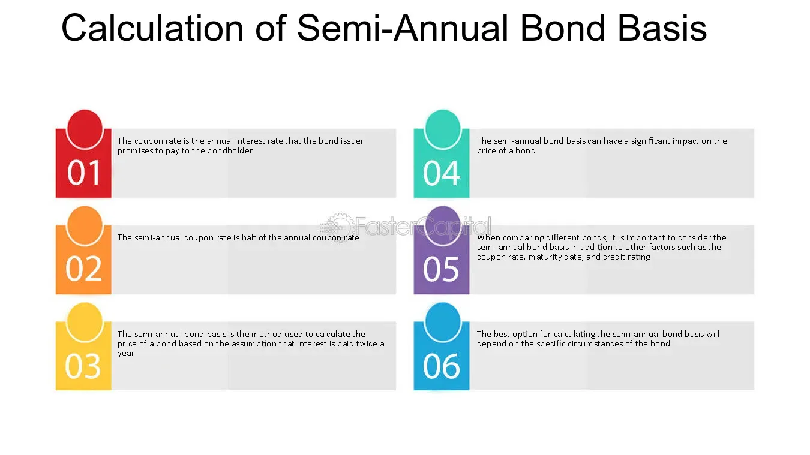

## Table of Contents

## What is a Semi-Annual Bond Basis?

A Semi-Annual Bond Basis is a way to compare the interest rates of bonds that pay interest at different times. Some bonds pay interest every six months, which is called semi-annually, while others might pay yearly or even more often. To make it fair when comparing these bonds, we use the Semi-Annual Bond Basis. This means we change the interest rate of bonds that don't pay semi-annually to what it would be if they did.

For example, if a bond pays interest once a year at a rate of 8%, we can change this to a semi-annual rate. To do this, we divide the yearly rate by two to get a semi-annual rate of 4%. This way, we can compare this bond fairly with another bond that already pays interest every six months. Using the Semi-Annual Bond Basis helps investors make better choices by making sure they are comparing apples to apples when looking at different bonds.

## How does the Semi-Annual Bond Basis differ from other bond bases?

The Semi-Annual Bond Basis is different from other bond bases because it uses a specific way to figure out the interest rate for bonds. It assumes that interest is paid twice a year, every six months. This is different from other bases like the Annual Bond Basis, where interest is paid once a year, or the Quarterly Bond Basis, where interest is paid four times a year. When comparing bonds, using the Semi-Annual Bond Basis means changing the interest rates of bonds that don't pay semi-annually to what they would be if they did. This helps investors compare different bonds more easily.

For example, if you have a bond that pays interest once a year at a rate of 6%, using the Semi-Annual Bond Basis would mean changing that rate to what it would be if the interest was paid every six months. You would divide the annual rate by two to get a semi-annual rate of 3%. This is different from how you would handle it on an Annual Bond Basis, where you wouldn't change the rate at all, or a Quarterly Bond Basis, where you would divide the annual rate by four to get a quarterly rate of 1.5%. By using the Semi-Annual Bond Basis, investors can see which bond is better in a way that's fair and easy to understand.

## Why is the Semi-Annual Bond Basis important in bond valuation?

The Semi-Annual Bond Basis is important in bond valuation because it helps investors compare bonds that pay interest at different times in a fair way. When you want to see which bond is a better deal, it can be hard if one bond pays interest every six months and another pays it once a year. By changing all bond interest rates to a semi-annual basis, investors can see which bond offers a better return without getting confused by different payment schedules.

Using the Semi-Annual Bond Basis also makes it easier to understand how much money a bond will make over time. If you know the semi-annual rate, you can figure out how much interest you'll get every six months and add it up to see the total return. This way, even if bonds have different ways of paying interest, you can still compare them and make smart choices about which bonds to buy.

## How is the yield calculated using the Semi-Annual Bond Basis?

To calculate the yield using the Semi-Annual Bond Basis, you need to first convert the bond's annual interest rate into a semi-annual rate. If a bond has an annual interest rate of 8%, you would divide that by 2 to get a semi-annual rate of 4%. This means the bond pays 4% interest every six months. Once you have the semi-annual rate, you can figure out the yield by adding up all the semi-annual interest payments you would get over the life of the bond and comparing that to the price you paid for the bond.

For example, if you buy a bond for $1,000 that pays 8% annually and matures in 5 years, you would first convert the 8% to a semi-annual rate of 4%. Every six months, you would get $40 in interest (4% of $1,000). Over 5 years, you would receive 10 semi-annual payments, which would total $400 in interest. To find the yield, you compare this total interest to the $1,000 you paid for the bond. The yield would be the total return you get from the bond, considering both the interest payments and any change in the bond's value when it matures.

## What are the advantages of using the Semi-Annual Bond Basis?

Using the Semi-Annual Bond Basis has a big advantage because it helps investors compare different bonds easily. When bonds pay interest at different times, like once a year or every three months, it can be hard to figure out which one is a better deal. By changing all the rates to a semi-annual basis, investors can see which bond gives them more money in a way that's fair and easy to understand. This means they can make better choices about which bonds to buy without getting confused by different payment schedules.

Another advantage is that the Semi-Annual Bond Basis helps investors understand how much money they will make from a bond over time. If you know the semi-annual rate, you can figure out how much interest you'll get every six months and add it up to see the total return. This makes it easier to plan and know what to expect from your investment. By using the Semi-Annual Bond Basis, investors can feel more confident in their decisions and have a clearer picture of their bond investments.

## Can you explain the process of converting annual yield to Semi-Annual Bond Basis?

Converting an annual yield to a Semi-Annual Bond Basis is pretty straightforward. If you have a bond that pays an annual interest rate of 6%, you need to change that rate to what it would be if the bond paid interest every six months. To do this, you just divide the annual rate by 2. So, a 6% annual rate becomes a 3% semi-annual rate. This means the bond would pay 3% interest every six months instead of 6% once a year.

Once you have the semi-annual rate, you can use it to figure out how much interest you'll get over the life of the bond. For example, if you buy a bond for $1,000 with an annual rate of 6% that matures in 5 years, you would get 3% every six months. That's $30 every six months (3% of $1,000). Over 5 years, you would get 10 payments, which adds up to $300 in interest. This way, you can compare this bond to others that might pay interest at different times, making it easier to see which one is a better deal.

## How does the Semi-Annual Bond Basis affect bond pricing?

The Semi-Annual Bond Basis affects bond pricing by making it easier to compare bonds that pay interest at different times. When you want to buy a bond, you look at how much interest it will pay you. If one bond pays interest every year and another pays it every six months, it can be hard to tell which one is a better deal. By changing all the interest rates to a semi-annual basis, you can see which bond will give you more money in a way that's fair and easy to understand. This helps you decide which bond to buy based on how much it will be worth to you over time.

When you use the Semi-Annual Bond Basis, you change the annual interest rate of a bond to a semi-annual rate by dividing it by two. For example, if a bond has an annual rate of 8%, you would divide that by 2 to get a semi-annual rate of 4%. This means the bond pays 4% interest every six months. By doing this, you can figure out how much interest you'll get over the life of the bond and compare it to other bonds. This way, you can see which bond is priced better because you know exactly how much money you'll make from each one.

## What are the common misconceptions about the Semi-Annual Bond Basis?

One common misconception about the Semi-Annual Bond Basis is that it changes the actual interest rate of a bond. It doesn't. The Semi-Annual Bond Basis is just a way to compare bonds that pay interest at different times. It changes the way we look at the interest rate so we can compare apples to apples. For example, if a bond pays 6% interest once a year, we divide that by 2 to see what it would be if it paid every six months. It's still the same bond, but we're looking at it in a different way to make comparisons easier.

Another misconception is that using the Semi-Annual Bond Basis makes a bond more valuable or less valuable. It doesn't change the bond's value; it just helps us understand and compare the bond's yield better. When we convert an annual rate to a semi-annual rate, we're not changing how much money the bond will make. We're just making it easier to see how much interest we'll get every six months instead of once a year. This way, we can compare different bonds and make better choices about which ones to buy.

## How do market conditions influence the effectiveness of the Semi-Annual Bond Basis?

Market conditions can change how useful the Semi-Annual Bond Basis is for comparing bonds. When the economy is doing well and interest rates are stable, using the Semi-Annual Bond Basis can be very helpful. It lets investors compare bonds that pay interest at different times easily. They can see which bond will give them more money over time without getting confused by different payment schedules. But if the economy is not doing well and interest rates are going up and down a lot, it can be harder to use the Semi-Annual Bond Basis. The value of bonds can change quickly, and it might be tough to figure out what the semi-annual rate really means.

Even with these challenges, the Semi-Annual Bond Basis can still be useful. It helps investors make sense of their options by giving them a common way to look at different bonds. When market conditions are changing a lot, investors might need to check their calculations more often and be ready to adjust their plans. But by using the Semi-Annual Bond Basis, they can still compare bonds and make smart choices about which ones to buy, even when the market is not stable.

## What are the regulatory considerations when using the Semi-Annual Bond Basis?

When using the Semi-Annual Bond Basis, there are some rules that investors need to follow. These rules come from financial regulators who want to make sure that everyone is playing fair and that investors are not being tricked. For example, in the United States, the Securities and Exchange Commission (SEC) has rules about how bonds should be valued and reported. These rules might say that when you use the Semi-Annual Bond Basis to compare bonds, you need to be clear about how you did the math and show all your work. This way, other people can check your numbers and make sure they are right.

Also, different countries might have their own rules about using the Semi-Annual Bond Basis. In some places, there might be special forms or reports that you need to fill out when you use this method to value bonds. It's important for investors to know these rules and follow them. If they don't, they could get in trouble with the regulators. By understanding and following the rules, investors can use the Semi-Annual Bond Basis to make smart choices about which bonds to buy, while also staying on the right side of the law.

## How does the Semi-Annual Bond Basis impact portfolio management strategies?

Using the Semi-Annual Bond Basis can help people who manage money, like portfolio managers, make better choices about which bonds to buy. When they look at different bonds, they want to know which one will give them more money over time. By changing all the interest rates to a semi-annual basis, they can compare bonds that pay interest at different times in a fair way. This helps them pick bonds that will make their portfolio grow more. For example, if one bond pays interest once a year and another pays it every six months, using the Semi-Annual Bond Basis lets them see which one is really the better deal.

Even though the Semi-Annual Bond Basis is helpful, portfolio managers need to think about other things too. They have to keep an eye on how the economy is doing and if interest rates are changing a lot. If the market is not stable, they might need to check their calculations more often and be ready to change their plans. But by using the Semi-Annual Bond Basis, they can still compare bonds and make smart choices about which ones to buy, even when things are not going smoothly. This way, they can manage their portfolio better and help their clients make more money.

## What advanced techniques can be used to optimize returns using the Semi-Annual Bond Basis?

To optimize returns using the Semi-Annual Bond Basis, portfolio managers can use a technique called bond laddering. This means they buy bonds that mature at different times, like every six months or a year apart. By using the Semi-Annual Bond Basis to compare these bonds, they can pick the ones that will give them the most money over time. When a bond matures, they can use the money to buy a new bond, keeping their money working for them. This way, they can keep getting interest and also have some money coming back to them regularly, which helps them make more money in the long run.

Another advanced technique is to use the Semi-Annual Bond Basis in bond swaps. This means selling one bond and buying another one that is expected to do better. By converting the interest rates of different bonds to a semi-annual basis, managers can see which bond will give them a better return. They might swap a bond with a lower semi-annual rate for one with a higher rate, even if the original bond pays interest annually. This can help them increase their returns without changing their overall investment strategy too much. By carefully choosing which bonds to swap, they can make their portfolio grow more over time.

## What is the Understanding of Semi-Annual Bond Basis (SABB)?

Semi-Annual Bond Basis (SABB) is a technique employed to harmonize the yield comparison of bonds with varying coupon payment schedules, transforming bonds that do not pay semi-annual coupons into an equivalent framework. This standardization is critical as it provides investors with the ability to make informed decisions by evaluating bonds on a consistent yield basis. In essence, SABB adjusts the yield of bonds with non-semi-annual coupon payments, ensuring comparability by converting those yields into a semi-annual equivalent yield.

The mechanics of SABB prove especially beneficial in markets characterized by a diversity of bond payment frequencies, including quarterly, annual, and even irregular schedules. This diversity can otherwise present significant challenges when attempting to assess and compare bond yields directly. By converting different payment schedules into a uniform semi-annual basis, investors gain a clearer view of the yield performance across various bonds, thus enhancing the decision-making process.

For instance, consider a bond that pays interest annually with a nominal [interest rate](/wiki/interest-rate-trading-strategies) $r_1$. Its yield would need to be converted into a semi-annual bond basis to facilitate an accurate comparison with a bond paying semi-annually at a nominal rate $r_2$. This conversion employs specific formulae: 

$$
Y_{\text{semi-annual}} = (1 + r_{\text{annual}})^{\frac{1}{2}} - 1
$$

This formula calculates the semi-annual yield equivalent of a bond with annual coupon payments. The semi-annual yield equivalent provides a standard measure through which different bonds, each with their individual coupon schedules, can be evaluated against each other.

In practice, SABB allows investors to decrypt the true yield potential of bonds, irrespective of their payment schemes, thereby serving as a crucial tool in portfolio management and investment strategy. Investors can make more equitable comparisons and align their bond selections more closely with their yield expectations, effectively mitigating market risks associated with disparate payment schedules.

## What is the impact of SABB on bond prices and yields?

Semi-annual bond basis (SABB) influences bond prices by aligning investor preferences with yield structures that are normalized for comparison across different coupon payment schedules. When bonds are issued with varying coupon payment frequencies—be it annual, semi-annual, or quarterly—they exhibit different sensitivities to interest rate changes, which in turn affects their yield spreads. This variation becomes evident through the relationship between bond prices and their yield to maturity (YTM).

The pricing of a bond can be significantly affected by the SABB, as it adjusts a bond’s yield to reflect a semi-annual compounding basis. Therefore, the price sensitivity or the duration of bonds with different compounding frequencies can affect investor decisions, leading to shifts in bond prices based on the perceived attractiveness of yield offers. The adjustment of bond yields to a common SABB metric enables investors to make direct yield comparisons, potentially leading to a realignment of their portfolios to maximize returns.

Consider the formula for adjusting bonds to a semi-annual basis:

$$
Y_{\text{semi}} = \left(1 + \frac{Y_{\text{non-semi}}}{m}\right)^m - 1
$$

where $Y_{\text{semi}}$ is the yield converted to a semi-annual basis, $Y_{\text{non-semi}}$ is the original yield, and $m$ is the number of periods per year for the original yield. This formula ensures yields are evaluated on a consistent frequency, providing clarity to investors on the real yield performance.

Understanding the impact of SABB on bond prices is crucial for developing strategies that capitalize on changes in yield spreads. Investors can exploit these variations by identifying bonds that are either overvalued or undervalued when adjusted to a semi-annual basis. This creates opportunities for [arbitrage](/wiki/arbitrage) or strategic positioning, where investors may take long or short positions depending on the expected reversion of the yield spreads.

Moreover, SABB aids in emphasizing the importance of duration and convexity in bond trading strategies. By assessing how incremental changes in interest rates impact bond prices, investors can adjust their portfolios to hedge against interest rate risks effectively.

In conclusion, SABB is a pivotal component in understanding bond price dynamics and yield spreads, allowing investors to tailor their trading strategies to prevailing market conditions. Proper application of SABB can optimize portfolio performance, ensuring alignment with market yield expectations and minimizing exposure to interest rate [volatility](/wiki/volatility-trading-strategies).

## References & Further Reading

[1]: ["Fixed Income Securities: Tools for Today's Markets"](https://www.amazon.com/Fixed-Income-Securities-Markets-Finance/dp/1119835550) by Bruce Tuckman and Angel Serrat

[2]: ["Bond Markets, Analysis, and Strategies"](https://www.amazon.com/Bond-Markets-Analysis-Strategies-tenth/dp/026204627X) by Frank J. Fabozzi

[3]: Treynor, J. L. (1977). ["The Principles of Corporate Bond Pricing."](https://www.semanticscholar.org/author/Jack-L.-Treynor/95746110) Financial Analysts Journal.

[4]: ["Algorithmic Trading: Winning Strategies and Their Rationale"](https://www.wiley.com/en-us/Algorithmic+Trading%3A+Winning+Strategies+and+Their+Rationale-p-9781118746912) by Ernest P. Chan

[5]: ["Fixed Income Analysis"](https://en.wikipedia.org/wiki/Fixed_income_analysis) by Frank J. Fabozzi and Barbara S. Petitt

[6]: Litterman, R., & Scheinkman, J. (1991). ["Common factors affecting bond returns."](https://www.pm-research.com/content/iijfixinc/1/1/54) Journal of Fixed Income.

[7]: ["The Handbook of Fixed Income Securities"](https://www.amazon.com/Handbook-Fixed-Income-Securities-Ninth/dp/1260473899) by Frank J. Fabozzi