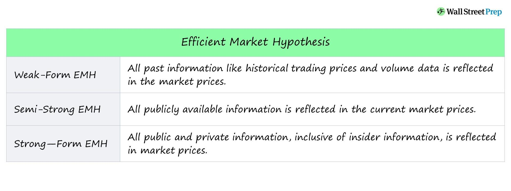

## Table of Contents

## What is the concept of market efficiency?

Market efficiency is a concept in economics and finance that describes how well markets reflect all available information in the prices of securities like stocks and bonds. When a market is efficient, it means that the prices of these securities quickly adjust to new information, so they always reflect their true value. This idea is important because it suggests that it's hard to consistently beat the market by finding undervalued stocks or other securities, since any new information is quickly priced in.

There are different levels of market efficiency, often described as weak, semi-strong, and strong. Weak form efficiency means that all past trading information is already reflected in current prices, so looking at historical price patterns won't help you predict future prices. Semi-strong efficiency goes further, saying that all publicly available information is reflected in prices, so even studying company reports or news won't give you an edge. Strong form efficiency is the most extreme, suggesting that even insider information is reflected in prices, making it impossible to gain an advantage no matter what information you have. Most people believe markets are at least semi-strong efficient, but there's still debate about how efficient they really are.

## How does semi-strong form efficiency differ from weak and strong form efficiency?

Semi-strong form efficiency is a step up from weak form efficiency. Weak form efficiency says that all past price information is already in the stock prices. So, looking at old price charts won't help you guess where prices are going next. But semi-strong form efficiency goes further. It says that not only past prices, but also all public information—like news articles, company reports, and economic data—is already in the stock prices. This means that if a company announces good news, the stock price will jump right away, and you can't use that news to make money because the price already reflects it.

Strong form efficiency is even more extreme than semi-strong. It says that all information, including secret or insider information, is already in the stock prices. So, even if you know something that nobody else knows, you still can't beat the market because the price already includes that secret information. Most people think markets are at least semi-strong efficient, but there's a lot of debate about whether they reach strong form efficiency. In reality, markets might be somewhere in between these levels, with different stocks and different times showing different levels of efficiency.

## What types of information are considered in semi-strong form efficiency?

Semi-strong form efficiency means that all public information is already in the prices of stocks. This includes things like news about a company, financial reports, economic data, and anything else that anyone can find out. If a company does well and reports good earnings, the stock price will go up right away because everyone can see the report.

This level of efficiency is different from weak form efficiency, which only looks at past prices. Semi-strong efficiency says that you can't make money just by looking at old price charts because all the public news and data are already in the price. So, if you want to beat the market, you need to know something that nobody else knows, but even that might not work if the market is strongly efficient.

## Can you explain the Efficient Market Hypothesis (EMH)?

The Efficient Market Hypothesis (EMH) is an idea in finance that says stock prices always show all the information that people know. It means that if something new happens, like a company doing well or the economy changing, the stock price will change right away to show that new information. So, it's hard to make more money than the market average because prices are always right.

There are three levels of EMH: weak, semi-strong, and strong. Weak form says that looking at past prices won't help you predict future prices because all that old information is already in the price. Semi-strong form goes further and says that all public information, like news or company reports, is also in the price. Strong form is the most extreme and says even secret information is in the price, so nobody can beat the market no matter what they know. Most people think markets are at least semi-strong, but there's still a lot of debate about how true EMH really is.

## How does semi-strong form efficiency relate to the Efficient Market Hypothesis?

Semi-strong form efficiency is a part of the Efficient Market Hypothesis (EMH). It says that all public information, like news or company reports, is already in the stock prices. So if a company does well and tells everyone, the stock price will go up right away because everyone can see the good news. This means you can't make more money than the market average just by looking at public information because the price already shows it.

The Efficient Market Hypothesis has three levels: weak, semi-strong, and strong. Semi-strong is in the middle. Weak form says that past prices are already in the stock price, so looking at old charts won't help you predict where prices will go next. Strong form says even secret information is in the price, so nobody can beat the market no matter what they know. Most people think markets are at least semi-strong efficient, but there's still a lot of debate about how true the EMH really is.

## What are some common tests used to assess semi-strong form efficiency?

To check if markets are semi-strong efficient, people do tests to see if stock prices change right away when new public information comes out. One common test is called an event study. In an event study, researchers look at how stock prices move after something big happens, like a company announcing earnings or a merger. If the stock price jumps right after the news, it suggests the market is semi-strong efficient because the price quickly shows the new information.

Another way to test semi-strong efficiency is by looking at how well people can make money using public information. For example, researchers might see if people who use stock-[picking](/wiki/asset-class-picking) strategies based on public data, like financial ratios or news, can beat the market. If these strategies don't work better than just buying the whole market, it supports the idea that markets are semi-strong efficient because all public information is already in the stock prices.

## Can you provide examples of events that might be used to test semi-strong form efficiency?

When testing semi-strong form efficiency, one common event researchers look at is when a company announces its earnings. If the market is semi-strong efficient, the stock price should change right away after the earnings are made public. For example, if a company reports better-than-expected earnings, you'd expect the stock price to go up quickly because everyone can see the good news. If the stock price doesn't change much or changes slowly, it might mean the market isn't semi-strong efficient because the new information isn't quickly reflected in the price.

Another event often used to test semi-strong form efficiency is a merger or acquisition announcement. When one company says it's going to buy another, the stock prices of both companies should adjust right away to reflect this news. For instance, if Company A announces it's buying Company B, you'd expect Company A's stock price to drop a bit because it's spending money, and Company B's stock price to rise because it's being bought at a premium. If the stock prices don't move as expected right after the announcement, it could suggest that the market isn't semi-strong efficient.

## How do stock prices react to new public information under semi-strong form efficiency?

Under semi-strong form efficiency, stock prices change right away when new public information comes out. This means if a company shares good news, like better-than-expected earnings, the stock price will go up quickly. Everyone can see the news, so the price adjusts to show the new information. If the market is semi-strong efficient, you can't make more money than the market average just by using public information because the price already shows it.

For example, if a company announces a merger, the stock prices of the companies involved should move right away. The company buying another might see its stock price drop a bit because it's spending money, while the company being bought might see its stock price rise because it's being bought at a higher price. If the stock prices don't change as expected right after the news, it might mean the market isn't semi-strong efficient.

## What are the implications of semi-strong form efficiency for investors and traders?

If the market is semi-strong efficient, it means that all public information, like news or company reports, is already in the stock prices. So, if you're an investor or trader, you can't make more money than the market average just by using this public information. If a company does well and tells everyone, the stock price will go up right away. This makes it hard to find stocks that are cheaper than they should be, because the price already shows all the public news.

For investors, this means that trying to pick individual stocks based on public information won't help you beat the market. Instead, it might be better to just buy a bunch of different stocks, like in an index fund. This way, you get the average return of the market without trying to guess which stocks will do better. Traders who like to buy and sell quickly might find it tough, too, because the prices move so fast with new information that it's hard to make money from short-term trades.

## How might anomalies and market inefficiencies challenge the concept of semi-strong form efficiency?

Anomalies and market inefficiencies can make people question if the market is really semi-strong efficient. An anomaly is when something happens that shouldn't happen if the market is efficient. For example, some studies have found that stocks with low prices compared to their earnings, called value stocks, tend to do better than the market over time. If the market were semi-strong efficient, this shouldn't happen because all public information, like a company's earnings, should already be in the stock price. So, if value stocks keep doing better, it suggests that the market might not be as efficient as we thought.

Another challenge comes from things like the January effect, where stocks, especially small ones, tend to go up a lot in January. This is hard to explain if the market is semi-strong efficient because it means there's a pattern that people can use to make money, which shouldn't be possible if all public information is already in the prices. These kinds of patterns and anomalies show that the market might not always be as good at using new information as the semi-strong form efficiency says. This makes investors and researchers wonder if there are ways to beat the market after all.

## What role does behavioral finance play in the critique of semi-strong form efficiency?

Behavioral finance looks at how people's feelings and mistakes can affect the stock market. It says that people aren't always smart and can make bad choices. This can make the market less efficient because prices might not always show all the right information. For example, if a lot of people get excited about a stock because of a news story, they might buy it and make the price go up, even if the news isn't that important. This means the market isn't semi-strong efficient because the price isn't just showing the real value of the stock.

Behavioral finance also talks about things like overconfidence and fear. If people are too sure about their choices, they might keep buying a stock even when it's not a good idea. Or if they're scared, they might sell too quickly. These actions can create patterns in the market that people can use to make money, which goes against the idea of semi-strong efficiency. So, behavioral finance shows that human behavior can make the market less efficient and harder to predict than the Efficient Market Hypothesis says.

## How have advancements in technology and information dissemination affected the validity of semi-strong form efficiency?

Advancements in technology and information dissemination have made it easier and faster for new public information to reach people. With the internet, news about companies can spread around the world in seconds. This means that stock prices can change very quickly when something new happens, like a company reporting earnings or announcing a merger. If the market is semi-strong efficient, all this public information should be in the stock prices right away. So, technology might make the market more efficient because it helps everyone get the same information at the same time.

However, technology can also create problems for semi-strong form efficiency. With so much information coming out all the time, it's hard for people to know what's really important. Sometimes, people might overreact to news or get excited about something that isn't a big deal. This can make stock prices move in ways that don't make sense if the market is supposed to be efficient. Also, with high-frequency trading and algorithms, some people can use technology to trade faster than others, which might mean that not everyone gets the same chance to use new information. So, while technology can help make the market more efficient, it can also make it harder for the market to be perfectly efficient.

## References & Further Reading

[1]: Fama, E. F., Fisher, L., Jensen, M. C., & Roll, R. (1969). ["The Adjustment of Stock Prices to New Information."](https://www.jstor.org/stable/2525569) International Economic Review, 10(1), 1-21.

[2]: Lo, A. W., & MacKinlay, A. C. (1999). ["A Non-Random Walk Down Wall Street."](https://www.jstor.org/stable/j.ctt7tccx) Princeton University Press.

[3]: Malkiel, B. G. (2003). ["The Efficient Market Hypothesis and Its Critics."](https://www.princeton.edu/~ceps/workingpapers/91malkiel.pdf) Journal of Economic Perspectives, 17(1), 59-82.

[4]: Shleifer, A. (2000). ["Inefficient Markets: An Introduction to Behavioral Finance."](https://academic.oup.com/book/27761) Oxford University Press.

[5]: Carhart, M. M. (1997). ["On Persistence in Mutual Fund Performance."](https://onlinelibrary.wiley.com/doi/full/10.1111/j.1540-6261.1997.tb03808.x) The Journal of Finance, 52(1), 57-82.