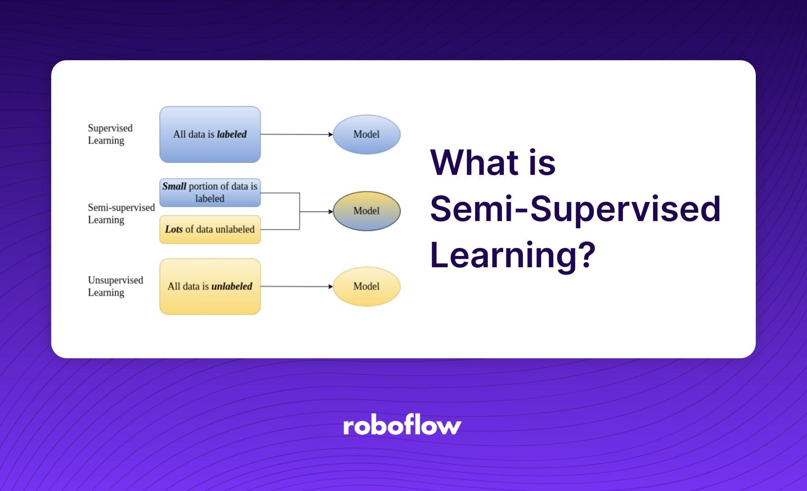

## Table of Contents

## What is semi-supervised learning and how does it differ from supervised and unsupervised learning?

Semi-supervised learning is a type of machine learning that falls between supervised and unsupervised learning. It uses a small amount of labeled data and a large amount of unlabeled data to train a model. This approach is useful when labeling data is expensive or time-consuming, but you still have a lot of data that isn't labeled. By combining both types of data, semi-supervised learning can improve the accuracy of the model compared to using only the labeled data.

Supervised learning, on the other hand, relies entirely on labeled data. In this method, the model is trained on a dataset where each example is tagged with the correct answer or outcome. For example, if you're teaching a model to recognize pictures of cats and dogs, each picture in the training set would be labeled as either "cat" or "dog." The model learns from these examples and tries to predict the correct label for new, unseen data. Unsupervised learning, conversely, uses only unlabeled data. It focuses on finding patterns or relationships within the data without any prior information about what the outcomes should be. Common tasks in unsupervised learning include clustering, where the algorithm groups similar data points together, and dimensionality reduction, which simplifies the data while retaining its important characteristics. Semi-supervised learning combines elements of both, using the labeled data to guide the learning process while also leveraging the larger pool of unlabeled data to enhance the model's understanding.

## What are some common applications of semi-supervised learning in real-world scenarios?

One common application of semi-supervised learning is in speech recognition systems. Imagine you want to build a system that can understand and transcribe human speech. Getting people to label every single audio clip with the correct transcription can be very time-consuming and expensive. Instead, you can use semi-supervised learning by starting with a small set of labeled audio clips and a much larger set of unlabeled ones. The system can learn from the labeled data and then use this knowledge to help it understand the patterns in the unlabeled data, improving its ability to transcribe speech more accurately over time.

Another application is in the field of image classification, such as identifying different types of objects in pictures. For example, if you're developing an app to help identify different species of birds, you might have a small number of images that are correctly labeled with the bird species, but a much larger collection of images that are not labeled. Semi-supervised learning can help the app learn from the labeled images and then use that knowledge to categorize the unlabeled ones, making the app more effective at identifying birds even with limited labeled data.

Semi-supervised learning is also used in fraud detection for financial transactions. Banks and credit card companies often have vast amounts of transaction data, but only a small fraction of it is labeled as fraudulent or not. By using semi-supervised learning, the system can learn from the labeled data and apply that learning to the larger pool of unlabeled transactions, helping to identify potentially fraudulent activities more accurately and efficiently.

## How does the MoCo method work in semi-supervised learning?

The MoCo (Momentum Contrast) method is a way to do semi-supervised learning that's really helpful when you have a lot of data without labels. It uses something called contrastive learning, which means the method tries to make similar things come close together and different things move apart. In MoCo, you have two versions of your data: one is the original data, and the other is a slightly changed version of it. The method learns by trying to match the original and changed versions together while pushing away other data points. This helps the model understand the data better, even without labels.

MoCo works by using a special kind of memory bank to keep track of the data it has seen. This memory bank helps the model remember what different pieces of data look like over time. When new data comes in, the model compares it to what's in the memory bank and decides if it's similar or different. By doing this over and over, the model gets better at understanding the data, even if most of it doesn't have labels. This makes MoCo a powerful tool for semi-supervised learning because it can use a lot of unlabeled data to improve its performance.

## What is Contrastive Predictive Coding and how is it applied in semi-supervised settings?

Contrastive Predictive Coding (CPC) is a way to teach machines to understand data by predicting future parts of it. Imagine you're listening to a song, and you can guess what's coming next based on what you've heard so far. CPC works in a similar way. It takes a piece of data, like a sound or an image, and tries to predict what will come next. By doing this, the machine learns to recognize patterns and features in the data. This is useful in semi-supervised learning because even if we don't have labels for all our data, the machine can still learn a lot by predicting future parts.

In semi-supervised settings, CPC helps by using both labeled and unlabeled data. The machine first learns to predict future parts of the data using the unlabeled part. This helps it understand the basic structure and patterns. Then, when it sees the labeled data, it can use what it learned from the unlabeled data to make better predictions and classifications. For example, if you're trying to identify different bird songs, CPC can learn the general patterns of bird songs from a lot of unlabeled recordings. When you add a few labeled recordings, the machine can use what it learned to better recognize and classify the different bird songs. This makes CPC a powerful tool for semi-supervised learning because it can make use of a lot of data, even when most of it isn't labeled.

## Can you explain the FixMatch algorithm and its effectiveness in semi-supervised learning?

The FixMatch algorithm is a way to teach machines to recognize things using both labeled and unlabeled data. It works by first making a guess about what an unlabeled piece of data might be. If the machine is pretty sure about its guess, it uses that guess as if it were a real label and trains on it. This helps the machine learn from a lot more data than just the labeled stuff. The key idea is to use the labeled data to make the machine confident enough to use its guesses on the unlabeled data.

FixMatch is effective because it can turn a lot of unlabeled data into useful training material. Imagine you're trying to teach a computer to tell the difference between pictures of cats and dogs. You might only have a few pictures labeled as "cat" or "dog," but you have thousands of pictures without labels. FixMatch lets the computer use its best guesses on those unlabeled pictures to learn more about cats and dogs. Studies have shown that FixMatch can make the computer much better at recognizing things, even when it starts with very few labeled examples. This makes it a powerful tool for semi-supervised learning where labeled data is hard to come by.

## What are the key differences between MoCo and MoCo v2, and how do these impact semi-supervised learning?

MoCo and MoCo v2 are both methods used in semi-supervised learning to help machines learn from data, but they have some important differences. MoCo v2 improves on the original MoCo by using a better way to create two different versions of the same piece of data. This is called [data augmentation](/wiki/data-augmentation). In MoCo v2, they use more varied and stronger ways to change the data, which helps the machine learn better patterns. They also added something called a projection head, which is a part of the model that helps it understand the data better before making final decisions.

These changes in MoCo v2 make it more effective for semi-supervised learning. By using better data augmentation, MoCo v2 can learn more from the unlabeled data, which is very important when you don't have many labels. The projection head helps the model make better guesses about the unlabeled data, which means it can use more of it to improve its learning. Overall, MoCo v2 can lead to better performance in tasks like image recognition, where you want to use as much data as possible to train the model, even if most of it isn't labeled.

## How does the Noisy Student method enhance model performance in semi-supervised learning?

The Noisy Student method helps improve model performance in semi-supervised learning by using a teacher-student approach. Imagine you have a teacher model that is already pretty good at recognizing things, like pictures of cats and dogs. This teacher model then teaches a student model by giving it lots of data, including data without labels. The student model tries to learn from this data, and to make it learn even better, the teacher adds some "noise" or changes to the data. This noise helps the student model see different versions of the same thing, making it more flexible and better at recognizing things even when they look a bit different.

The key to the Noisy Student method is that it goes through several rounds of teaching and learning. After the student learns from the noisy data, it becomes a new teacher and trains another student. This process can happen many times, and each time, the student gets better and better. By using both labeled and unlabeled data and adding noise, the Noisy Student method can make the model much more accurate at tasks like image classification, even when there are only a few labeled examples to start with. This makes it a powerful tool for semi-supervised learning where labeled data is hard to come by.

## What is Transductive Inference and how does it apply to semi-supervised learning?

Transductive inference is a way to use both labeled and unlabeled data to make predictions, but it's different from other methods because it focuses on the specific data you have, not on making a general model that can work on new data. Imagine you're trying to guess what kind of fruit is in a basket. With transductive inference, you use the fruits you know (labeled data) and the fruits you don't know (unlabeled data) to make a guess about the whole basket. You don't try to make a rule that can work for all baskets; you just focus on this one.

In semi-supervised learning, transductive inference can be really helpful because it can make use of a lot of unlabeled data to improve predictions. For example, if you're trying to classify pictures of animals, you might have a few pictures labeled as "cat" or "dog," and a lot more pictures without labels. Transductive inference lets you use all these pictures to make better guesses about what's in the unlabeled ones. This can make your predictions more accurate, even if you don't have many labeled examples to start with.

## How does Gradual Self-Training improve upon traditional self-training methods in semi-supervised learning?

Gradual Self-Training improves on traditional self-training methods by slowly adding more and more unlabeled data to the training process. In traditional self-training, the model starts with labeled data and then uses its predictions on unlabeled data to add more training examples. But this can sometimes lead to mistakes because the model might not be good enough yet. Gradual Self-Training fixes this by starting with just a little bit of the unlabeled data and slowly adding more as the model gets better. This way, the model can learn from easier examples first and then move on to harder ones, making it more accurate over time.

This method is especially helpful in semi-supervised learning where you don't have many labels. By using Gradual Self-Training, the model can make better use of the large amount of unlabeled data. It does this by being careful and adding data slowly, which helps avoid big mistakes. As the model improves, it can handle more complex examples, leading to better overall performance. This makes Gradual Self-Training a powerful tool for learning from both labeled and unlabeled data in a smart and effective way.

## What is the role of Meta Pseudo Labels in semi-supervised learning and how do they work?

Meta Pseudo Labels are a way to make machines better at learning from data, even when there aren't many labels. In semi-supervised learning, you often have a lot of data without labels and just a few with labels. Meta Pseudo Labels help by using a teacher model to guess labels for the unlabeled data. These guesses, or pseudo labels, are then used to train a student model. But what makes Meta Pseudo Labels special is that the teacher model keeps getting better too. It learns from the student model's performance, which helps both models improve over time.

The process works like this: first, the teacher model makes guesses about the unlabeled data. These guesses are then used to train the student model. After the student model learns, it gives feedback to the teacher model. The teacher model uses this feedback to update its own guesses, making them more accurate. This back-and-forth helps both models get better and better. By doing this, Meta Pseudo Labels can make the most out of the unlabeled data, leading to better performance in tasks like recognizing pictures or understanding speech, even when there are only a few labeled examples to start with.

## Can you describe the MixText approach and its advantages in semi-supervised text classification?

MixText is a way to teach computers to understand text better when you don't have many examples with labels. Imagine you're trying to teach a computer to tell if a review is good or bad. You might only have a few reviews labeled as "good" or "bad," but you have a lot more reviews without labels. MixText helps by mixing the labeled and unlabeled reviews together. It takes a labeled review and an unlabeled review, and then it creates new examples by mixing parts of both. This helps the computer learn from more data, even if most of it isn't labeled.

The big advantage of MixText is that it can make the computer much better at understanding text, even with just a few labeled examples. By mixing the reviews, the computer sees a lot of different ways to say things, which helps it learn the patterns better. This means it can tell if a new review is good or bad more accurately. MixText is really helpful when you want to classify text but don't have many labeled examples to start with.

## How does the State-Aware Tracker (STraTA) method utilize semi-supervised learning for object tracking?

The State-Aware Tracker (STraTA) method uses semi-supervised learning to make object tracking better. Imagine you're trying to follow a cat in a video. You might have a few frames where you know for sure where the cat is, but in most frames, you're not sure. STraTA helps by using both the frames where you know the cat's location and the frames where you don't. It starts with the known frames and then uses what it learns from them to guess where the cat might be in the unknown frames. This way, it can track the cat more accurately over time, even if it doesn't have labels for every frame.

STraTA works by paying attention to how the object, like the cat, changes from one frame to the next. It uses a special way to remember what the object looked like in the past and how it might look in the future. By doing this, STraTA can make better guesses about where the object is, even in frames without labels. This makes it really good at tracking objects in videos where you don't have a lot of labeled data to start with.

## References & Further Reading

[1]: Zhu, X., & Goldberg, A. B. (2009). ["Introduction to Semi-Supervised Learning."](https://link.springer.com/book/10.1007/978-3-031-01548-9) Synthesis Lectures on Artificial Intelligence and Machine Learning, 3(1), 1–130.

[2]: Chapelle, O., Scholkopf, B., & Zien, A. (2006). ["Semi-Supervised Learning."](https://ieeexplore.ieee.org/abstract/document/4787647) The MIT Press.

[3]: He, K., Fan, H., Wu, Y., Xie, S., & Girshick, R. (2020). ["Momentum Contrast for Unsupervised Visual Representation Learning."](https://arxiv.org/abs/1911.05722) Proceedings of the IEEE/CVF Conference on Computer Vision and Pattern Recognition (CVPR).

[4]: Oord, A. v. d., Li, Y., & Vinyals, O. (2018). ["Representation Learning with Contrastive Predictive Coding."](https://arxiv.org/abs/1807.03748) arXiv:1807.03748.

[5]: Sohn, K., Berthelot, D., Li, C.-L., Zhang, Z., Carlini, N., Cubuk, E. D., Kurakin, A., Zhang, H., & Raffel, C. (2020). ["FixMatch: Simplifying Semi-Supervised Learning with Consistency and Confidence."](https://arxiv.org/abs/2001.07685) arXiv:2001.07685.

[6]: Xie, Q., Luong, M.-T., Hovy, E., & Le, Q. V. (2019). ["Self-Training with Noisy Student improves ImageNet classification."](https://arxiv.org/abs/1911.04252) arXiv:1911.04252.

[7]: Pham, H., Dai, Z., Xie, Q., & Le, Q. V. (2021). ["Meta Pseudo Labels."](https://arxiv.org/abs/2003.10580) Proceedings of the IEEE/CVF Conference on Computer Vision and Pattern Recognition (CVPR).

[8]: Chen, T., Kornblith, S., Norouzi, M., & Hinton, G. (2020). ["A Simple Framework for Contrastive Learning of Visual Representations."](https://dl.acm.org/doi/abs/10.5555/3524938.3525087) arXiv:2002.05709.

[9]: Berthelot, D., Carlini, N., Goodfellow, I., Papernot, N., Oliver, A., & Raffel, C. (2019). ["MixMatch: A Holistic Approach to Semi-Supervised Learning."](https://arxiv.org/abs/1905.02249) Advances in Neural Information Processing Systems 32 (NeurIPS 2019).

[10]: Kitani, K. M., Ananthanarayanan, S., & Kamat, R. (2020). ["State-Aware Tracker for Partially Observable Scenarios."](https://scholar.google.com/citations?user=yv3sH74AAAAJ&hl=en) IEEE/RSJ International Conference on Intelligent Robots and Systems (IROS).