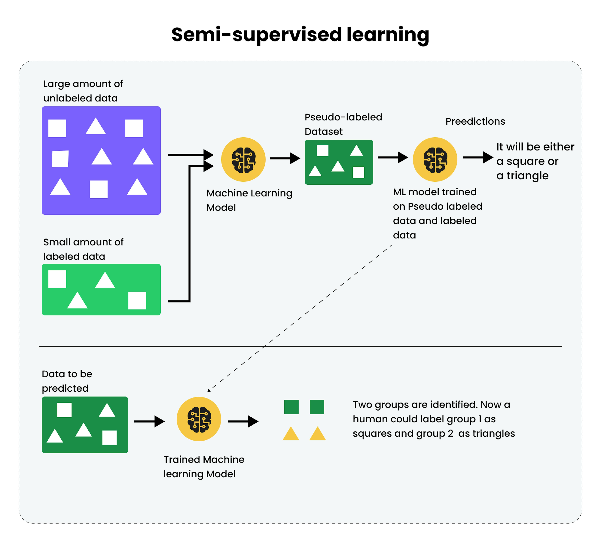

## Table of Contents

## What is Semi-Supervised Learning?

Semi-supervised learning is a type of machine learning that uses both labeled and unlabeled data to train models. This approach is useful when you have a lot of data but only a small part of it is labeled. Labeled data is information where the correct answer is known, like pictures of cats labeled as "cat." Unlabeled data is information without these labels, like pictures that are not categorized yet. By using both types of data, semi-supervised learning can improve the accuracy of predictions and make better use of available data.

In semi-supervised learning, the model first learns from the labeled data. Then, it uses what it learned to make guesses about the unlabeled data. Over time, the model gets better at understanding the patterns in all the data. This method can be especially helpful in situations where getting labels is expensive or time-consuming. For example, in medical imaging, getting labels from experts can be costly, so using semi-supervised learning can help make the most of the limited labeled data available.

## How does Semi-Supervised Learning differ from Supervised and Unsupervised Learning?

Semi-supervised learning is different from supervised and unsupervised learning because it uses both labeled and unlabeled data. Supervised learning only uses labeled data, where the correct answers are already known. For example, if you're teaching a computer to recognize cats, you'd show it many pictures labeled as "cat." In contrast, unsupervised learning uses only unlabeled data, where the computer has to find patterns on its own without any guidance. For instance, it might group similar pictures together without knowing they are cats.

Semi-supervised learning combines these two approaches. It starts by learning from the labeled data, just like supervised learning, to understand the basic patterns. Then, it uses this knowledge to help make sense of the unlabeled data, similar to how unsupervised learning works. This method is helpful when you have a lot of data but only a small amount of it is labeled. By using both types of data, semi-supervised learning can often make better predictions than using just one type alone.

## What are the main advantages of using Semi-Supervised Learning?

One of the main advantages of using semi-supervised learning is that it can make the most out of the data you have. Sometimes, getting labeled data can be hard or expensive. For example, if you need experts to label medical images, it can take a lot of time and money. Semi-supervised learning lets you use both the labeled data you have and the much larger amount of unlabeled data. This can help improve the accuracy of your model without needing to label everything.

Another advantage is that semi-supervised learning can lead to better predictions. When a model learns from both labeled and unlabeled data, it can find patterns that it might miss if it only used labeled data. This can be especially helpful in complex tasks where the relationships between data points are not easy to see. By using all the data available, semi-supervised learning can create a more complete picture of what the data is trying to tell us.

## Can you explain a simple example of Semi-Supervised Learning in practice?

Imagine you are teaching a computer to recognize different types of fruits. You have a bunch of pictures, but only a few of them are labeled. For example, you have 10 pictures labeled as "apple" and another 10 labeled as "banana." But you also have 100 pictures that are not labeled at all. This is where semi-supervised learning comes in handy.

First, the computer learns from the labeled pictures. It looks at the apples and bananas and starts to understand what makes an apple an apple and a banana a banana. Then, it uses this knowledge to look at the unlabeled pictures. It might guess that some of the unlabeled pictures look a lot like the apples it saw before, so it labels them as "apple." Over time, as it keeps learning, it gets better at guessing and can use more and more of the unlabeled pictures to improve its understanding of fruits. This way, the computer makes the most out of the data you have, even if not all of it is labeled.

## What types of algorithms are commonly used in Semi-Supervised Learning?

There are several types of algorithms used in semi-supervised learning. One common type is self-training. In self-training, the algorithm starts by learning from the labeled data. Then, it uses what it learned to label some of the unlabeled data. It adds these newly labeled examples back into the training set and repeats the process. This way, the algorithm keeps improving by using more and more data.

Another type is co-training. Co-training uses two or more different views or sets of features of the data. For example, if you are classifying emails as spam or not spam, one view might look at the words in the email, and another view might look at the sender's email address. Each view trains a model using the labeled data. Then, the models help each other label the unlabeled data. They keep working together until they both get better at making predictions.

A third type is graph-based methods. These methods represent the data as a graph where each point is a node, and similar points are connected by edges. The algorithm uses the labeled nodes to spread labels to the unlabeled nodes based on the connections in the graph. This helps the algorithm understand the relationships between the data points and make better predictions. Graph-based methods can be especially useful when the data has a lot of complex relationships.

## How does the performance of Semi-Supervised Learning compare to fully Supervised Learning?

Semi-supervised learning can often perform better than fully supervised learning when you have a lot of unlabeled data but only a small amount of labeled data. This is because semi-supervised learning makes use of all the data available, not just the labeled part. By learning from both types of data, the model can find more patterns and make more accurate predictions. For example, if you're trying to teach a computer to recognize different types of flowers, and you only have a few labeled pictures but many more unlabeled ones, semi-supervised learning can help the computer learn from all the pictures, not just the labeled ones.

However, if you have a lot of labeled data, fully supervised learning might perform just as well or even better than semi-supervised learning. This is because supervised learning focuses only on the labeled data, and when there's plenty of it, the model can learn very well from it. In such cases, the extra complexity of using unlabeled data in semi-supervised learning might not add much value. So, the performance of semi-supervised learning compared to fully supervised learning depends a lot on how much labeled and unlabeled data you have.

## What are the challenges faced when implementing Semi-Supervised Learning?

One of the main challenges in implementing semi-supervised learning is dealing with noisy or incorrect labels. When the algorithm uses its predictions to label the unlabeled data, it might make mistakes. These mistakes can then be added back into the training set, which can confuse the model and make its predictions less accurate over time. This problem is called "confirmation bias" because the model keeps confirming its own wrong guesses. To solve this, you need to be careful about how you choose which unlabeled data to label and use. You might need to use methods to check the confidence of the model's predictions before adding them to the training set.

Another challenge is that semi-supervised learning can be more complex to set up and run compared to fully supervised learning. You need to figure out how to mix the labeled and unlabeled data in a way that helps the model learn better. This can involve choosing the right algorithms, like self-training, co-training, or graph-based methods, and tuning their parameters. For example, in self-training, you need to decide how confident the model should be before it labels an unlabeled example. In co-training, you need to find good sets of features to use for each view. All of this can take more time and effort than just using labeled data alone.

## How can Semi-Supervised Learning be applied to real-world problems?

Semi-supervised learning can be really helpful in the real world, especially when you have a lot of data but only a little bit of it is labeled. For example, imagine you're working on a project to detect fake news on social media. Getting people to label news articles as real or fake can take a lot of time and money. But with semi-supervised learning, you can start with the few labeled articles you have and then use the computer to help label the many more unlabeled ones. The computer learns from the labeled articles and then makes guesses about the unlabeled ones, getting better over time. This way, you can build a better model to catch fake news without needing to label everything by hand.

Another real-world use of semi-supervised learning is in healthcare, like when doctors need to analyze medical images. Labeling these images as healthy or sick can be very expensive because it requires experts. With semi-supervised learning, you can use the few labeled images you have to teach the computer, and then let it help label the many more unlabeled images. Over time, the computer gets better at recognizing patterns in the images, which can help doctors make faster and more accurate diagnoses. This is a great example of how semi-supervised learning can make the most of the data you have, even if not all of it is labeled.

## What are the key considerations when choosing a Semi-Supervised Learning algorithm?

When choosing a semi-supervised learning algorithm, one key thing to think about is the amount and quality of the labeled and unlabeled data you have. If you have just a few labeled examples but a lot of unlabeled ones, algorithms like self-training can be a good choice. Self-training starts with the labeled data and then uses the model's predictions to label the unlabeled data. This can help the model learn more from all the data available. But if the unlabeled data is very different from the labeled data, or if the model's predictions might be wrong a lot, you might want to use a different algorithm. For example, co-training can be better if you can split your data into different views or sets of features. Co-training uses these different views to help the models learn from each other and make better predictions.

Another important thing to consider is how complex your data is and what kind of relationships you want the model to find. If your data has a lot of complex relationships, like in a social network where people are connected in different ways, graph-based methods can be very useful. These methods use a graph to show how the data points are related and can help the model understand these relationships better. But if your data is simpler, or if you want to keep things easy, you might choose a simpler algorithm like self-training. Also, think about how much time and effort you can spend on setting up and tuning the algorithm. Some algorithms, like co-training, need more work to set up because you have to find good sets of features for each view. But if you can spend the time, they might give you better results.

## How do you evaluate the effectiveness of a Semi-Supervised Learning model?

To evaluate the effectiveness of a semi-supervised learning model, you can use the same methods you use for supervised learning models. One common way is to split your data into a training set and a test set. You train the model on the training set, which includes both labeled and unlabeled data, and then see how well it does on the test set, which only has labeled data. You can measure how well the model does using things like accuracy, which is the percentage of correct predictions, or the F1 score, which is a balance between precision and recall. If the model does well on the test set, it means it learned good patterns from both the labeled and unlabeled data.

Another way to check how effective a semi-supervised learning model is by comparing it to a fully supervised model. You can train a fully supervised model using only the labeled data and see how it does on the test set. Then, you compare its performance to the semi-supervised model. If the semi-supervised model does better, it means using the unlabeled data helped. This can show you how much value the unlabeled data added to your model. Sometimes, you might also want to look at how the model's performance changes as you add more unlabeled data. This can help you understand if using more unlabeled data keeps making the model better or if there's a point where it stops helping.

## What are some advanced techniques used to improve Semi-Supervised Learning models?

One advanced technique to improve semi-supervised learning models is called "pseudo-labeling." In pseudo-labeling, the model uses its predictions on the unlabeled data to create new labels. These new labels, or pseudo-labels, are then added to the training set. The model keeps learning from both the real labels and the pseudo-labels, getting better over time. But, to make sure the pseudo-labels are good, the model only uses the ones it is very sure about. This helps avoid adding wrong labels that could confuse the model. By carefully choosing which pseudo-labels to use, the model can learn more from the unlabeled data and make better predictions.

Another technique is "consistency regularization." This method makes the model's predictions more stable by encouraging it to give the same answer even if the input data changes a little bit. For example, if you add some noise to an image, the model should still recognize it as the same thing. This is done by adding a special term to the model's loss function, which measures how different the predictions are when the input changes slightly. By making the model more consistent, it can learn better from the unlabeled data. This helps the model find the true patterns in the data, not just the noise, and can lead to better performance overall.

## Can you discuss recent research trends and future directions in Semi-Supervised Learning?

Recent research in semi-supervised learning has focused a lot on improving how models can use unlabeled data more effectively. One big trend is the use of deep learning techniques, like neural networks, to make better use of both labeled and unlabeled data. Researchers have been working on methods like "consistency regularization," where they try to make the model's predictions stay the same even if the input data changes a little bit. This helps the model learn the true patterns in the data and not just the noise. Another trend is the use of "pseudo-labeling," where the model makes guesses about the unlabeled data and then uses those guesses as if they were real labels. By carefully choosing which guesses to use, the model can learn more from the unlabeled data and make better predictions.

Looking into the future, semi-supervised learning is expected to play a bigger role in areas like natural language processing and computer vision. As more and more data becomes available, figuring out how to use both labeled and unlabeled data will be really important. Researchers are also looking into ways to combine semi-supervised learning with other types of learning, like reinforcement learning, to solve even more complex problems. For example, in self-driving cars, the car could learn from both labeled data about road signs and unlabeled data about different driving situations. The goal is to keep making models smarter and more accurate by using all the data we have, even if not all of it is labeled.