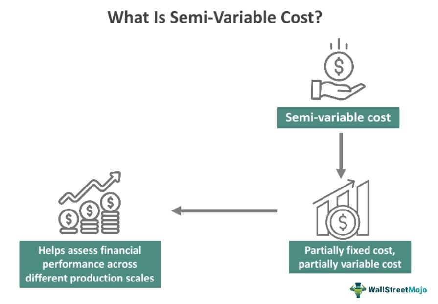

## Table of Contents

## What is a semi-variable cost?

A semi-variable cost is a type of cost that has both fixed and variable components. This means that part of the cost stays the same no matter how much you produce or sell, while another part changes depending on your level of activity. For example, a phone bill might have a fixed monthly charge plus charges for minutes used, which vary.

Understanding semi-variable costs is important for businesses because it helps them predict expenses more accurately. When planning, a company needs to know which costs will change with production levels and which will remain constant. This knowledge helps in budgeting and making decisions about pricing and production. For instance, if a business knows that its electricity bill has a fixed base rate plus a variable rate depending on usage, it can better plan for different levels of production.

## How does a semi-variable cost differ from fixed and variable costs?

A semi-variable cost is different from a fixed cost and a variable cost because it has parts of both. A fixed cost stays the same no matter how much you produce or sell. For example, rent for a store is a fixed cost because it doesn't change whether you sell a lot or a little. On the other hand, a variable cost changes directly with how much you produce or sell. For instance, the cost of raw materials is a variable cost because the more you produce, the more raw materials you need.

A semi-variable cost, however, includes a fixed part that doesn't change and a variable part that does change with your level of activity. Think of a utility bill like electricity: there might be a basic charge that you pay every month no matter what, and then an additional charge that depends on how much electricity you use. This mix of fixed and variable elements makes semi-variable costs unique and important for businesses to understand when planning their budgets and operations.

## Can you provide examples of semi-variable costs in a business?

In a business, one example of a semi-variable cost is the electricity bill. Imagine you run a bakery. You have to pay a basic charge for electricity every month, no matter how many cakes you bake. But if you start baking more cakes, you'll use more electricity, and that part of the bill will go up. So, the electricity bill has a fixed part and a variable part that changes with how much you bake.

Another example is the salary of employees who get paid a base salary plus a commission. Let's say you own a car dealership. Your salespeople get a fixed salary each month, but they also earn a commission for each car they sell. The fixed salary stays the same no matter how many cars they sell, but the commission changes depending on their sales. This makes the total salary a semi-variable cost because it has both a fixed and a variable part.

## How do semi-variable costs impact a company's budgeting?

Semi-variable costs make budgeting harder for a company because they are a mix of fixed and variable costs. When a company is planning its budget, it needs to guess how much it will produce or sell. This guess helps figure out the variable part of semi-variable costs. If the company gets its guess wrong, it might end up spending more or less than it planned.

Understanding semi-variable costs is important for a company to make a good budget. For example, if a company knows that its phone bill has a fixed part and a part that changes with how much the phones are used, it can plan better. The company can set aside money for the fixed part and then add more money depending on how much it thinks the phones will be used. This way, the company can make a budget that is more accurate and helps it spend its money wisely.

## What methods are used to calculate semi-variable costs?

One way to calculate semi-variable costs is called the high-low method. Imagine you have a bunch of data about your costs over time. With the high-low method, you look at the highest and lowest points of your activity level, like how many units you made or sold. You then see how the total cost changed between these two points. The difference in cost that's not because of the fixed part is the variable part. You can use this to figure out the variable cost per unit and then add back the fixed cost to get the total semi-variable cost.

Another method is called the scatter plot method. Here, you plot all your cost data on a graph where one axis shows your activity level and the other shows the total cost. When you look at the graph, you'll see a bunch of points that might look like they're following a line. You can draw a line that best fits these points. The slope of this line tells you the variable cost per unit, and where the line touches the y-axis shows the fixed cost. By using this line, you can predict the semi-variable cost for any level of activity. Both methods help businesses understand their semi-variable costs better, which is useful for planning and budgeting.

## How can a business forecast semi-variable costs?

To forecast semi-variable costs, a business can use the high-low method. This method involves looking at the times when the business was at its busiest and its quietest. By comparing the total costs at these two points, the business can figure out how much of the cost changes with activity and how much stays the same. For example, if the cost was $1,000 when the business made 100 units and $1,500 when it made 200 units, the difference in cost ($500) is due to the variable part. Dividing this by the difference in units (100) gives a variable cost of $5 per unit. The fixed cost can then be found by subtracting the total variable cost at one of the points from the total cost at that point. This way, the business can predict costs for different levels of activity.

Another way to forecast semi-variable costs is by using a scatter plot. The business plots all its cost data on a graph where one side shows how much it produced or sold and the other side shows the total costs. The points on the graph will form a pattern that can be used to draw a line that best fits the data. The slope of this line shows how much the cost changes with each unit of activity, which is the variable cost. Where the line touches the cost axis when activity is zero is the fixed cost. By using this line, the business can estimate its semi-variable costs for any level of activity in the future. This method helps businesses plan their budgets more accurately.

## What are the challenges in managing semi-variable costs?

Managing semi-variable costs can be tricky because they are a mix of fixed and variable parts. It's hard to predict how much the variable part will change because it depends on how much the business produces or sells. If the business guesses wrong about how busy it will be, it might end up spending more money than it planned. This can mess up the budget and make it hard to keep track of where the money is going.

Another challenge is that semi-variable costs can change a lot from one month to another. For example, if a business uses more electricity one month because it's really busy, the electricity bill will be higher. This makes it hard to plan ahead and set a budget that works all the time. Businesses need to keep a close eye on their semi-variable costs and be ready to adjust their plans if things change.

## How do semi-variable costs affect break-even analysis?

Semi-variable costs make break-even analysis more complicated because they have both a fixed part and a variable part. In break-even analysis, you need to figure out how much you need to sell to cover all your costs. With semi-variable costs, you have to split them into the fixed part, which stays the same no matter what, and the variable part, which changes depending on how much you sell. This means you have to guess how much the variable part will change, which can make your break-even point less certain.

Because semi-variable costs can change from month to month, they can move your break-even point around. If you're busy and use more of something like electricity, the variable part of the cost goes up, and you need to sell more to break even. On the other hand, if you're not so busy, the variable part goes down, and your break-even point might be lower. This makes it important to keep a close eye on semi-variable costs and be ready to change your plans if they change.

## What role do semi-variable costs play in pricing strategies?

Semi-variable costs are important when a business decides how much to charge for its products or services. These costs have a part that stays the same no matter how much you sell, and another part that changes depending on how busy you are. When setting prices, a business needs to make sure the price covers both the fixed part and the variable part of these costs. If the business doesn't charge enough to cover the semi-variable costs, it might lose money, especially if it gets really busy and the variable part of the costs goes up a lot.

Understanding semi-variable costs helps a business set prices that can change with how much it sells. For example, if a business knows that its electricity bill will go up when it makes more products, it might decide to charge more for those products during busy times. This way, the business can make sure it covers all its costs and still makes a profit. By keeping an eye on semi-variable costs, a business can adjust its prices to stay profitable no matter how busy it gets.

## How can semi-variable costs be optimized in operational management?

In operational management, businesses can optimize semi-variable costs by keeping a close eye on how much they use things like electricity or pay for employee commissions. If a business knows that its electricity bill has a part that stays the same and a part that changes with how much it produces, it can try to use less electricity when it's not busy. This means turning off lights or machines when they're not needed. For employee commissions, the business can set goals that encourage salespeople to sell more without spending too much on extra costs.

Another way to optimize semi-variable costs is by planning ahead. If a business can guess how busy it will be, it can plan its production and sales to make the most of the variable part of the costs. For example, if the business knows it will be really busy in the summer, it can make sure it has enough staff and resources to handle the extra work without spending too much. By understanding and managing semi-variable costs well, a business can save money and run more smoothly.

## What advanced analytical tools are used to model semi-variable costs?

Businesses use some fancy tools to figure out semi-variable costs. One popular tool is regression analysis. This tool looks at a bunch of data and finds a line that best fits how costs change with how busy the business is. The line helps show what part of the cost stays the same and what part changes. This makes it easier for the business to predict costs and plan better.

Another tool is cost-[volume](/wiki/volume-trading-strategy)-profit (CVP) analysis. This tool helps businesses see how costs, the number of things they sell, and their profits are all connected. By using CVP analysis, a business can see how semi-variable costs affect how much they need to sell to make money. This is really helpful for making decisions about pricing and how much to produce. Both of these tools help businesses understand and manage their semi-variable costs better.

## How do semi-variable costs influence long-term strategic planning in an organization?

Semi-variable costs play a big role in long-term strategic planning for an organization. These costs have a part that stays the same and a part that changes depending on how busy the business is. When planning for the future, a business needs to think about how these costs will change over time. If the business expects to grow and get busier, it needs to plan for higher variable costs. This means the business might need to find ways to save money or make more money to cover these costs. Understanding semi-variable costs helps the business make smart choices about where to invest and how to grow.

For example, if a business knows that its electricity bill will go up as it makes more products, it might decide to invest in energy-saving equipment. This can help keep the variable part of the electricity cost down, even as the business grows. Also, knowing about semi-variable costs can help the business set long-term goals for sales and production. If the business can predict how these costs will change, it can plan its budget and pricing strategies better. This way, the business can make sure it stays profitable and reaches its long-term goals.

## What are Semi-Variable Costs and How Can We Understand Them?

Semi-variable costs, also known as mixed costs, embody both fixed and variable components, which provide businesses with both flexibility and stability in their financial planning. These costs remain constant up to a certain level of activity. Beyond this point, they vary in direct proportion to the changes in production volume or sales. This dual nature makes them a critical element in budgeting and forecasting, as they allow for adaptive financial strategies that respond to production demands while maintaining a baseline predictability.

The fixed component of semi-variable costs represents the portion that does not change with the level of activity. For instance, a company might have a fixed monthly charge for electricity usage that covers basic operational expenses. On the other hand, the variable component reflects costs that fluctuate with the level of the company's operations. Continuing with the electricity example, this would include additional charges incurred when production levels increase, leading to higher electricity consumption.

Consider the example of a mobile phone bill used in a business setting. The fixed part might include the base charge for the service, while additional charges could accrue based on the number of calls made or data used, reflecting the variable portion. Similarly, vehicle expenses might consist of the fixed costs of insurance and registration, with the variable component arising from fuel and maintenance costs that increase with more extensive use or travel.

Mathematically, a semi-variable cost can be represented as:

$$
\text{Total Semi-variable Cost} = \text{Fixed Cost} + (\text{Variable Cost Rate} \times \text{Level of Activity})
$$

where:
- $\text{Fixed Cost}$ is the constant expense component,
- $\text{Variable Cost Rate}$ is the cost per unit of activity,
- $\text{Level of Activity}$ reflects the production or sales volume.

This formula aids businesses in understanding and forecasting their total costs as they operate within varying activity levels. By dissecting these costs into their fixed and variable elements, businesses can gain clearer insights into how their expenses relate to operational activities, which is crucial for precise budgeting and strategic resource allocation.

## References & Further Reading

[1]: Drury, Colin. ["Management and Cost Accounting"](https://link.springer.com/book/10.1007/978-1-4899-6828-9) by Colin Drury

[2]: Horngren, Charles T., Datar, Srikant M., & Rajan, Madhav V. ["Cost Accounting: A Managerial Emphasis"](https://archive.org/details/20240317_20240317_0811)

[3]: ["Accounting for Managers: Interpreting Accounting Information for Decision-Making"](https://www.amazon.com/Accounting-Managers-Interpreting-Information-Decision/dp/111900294X) by Paul M. Collier 

[4]: Hull, John. ["Options, Futures, and Other Derivatives"](https://www.amazon.com/Options-Futures-Other-Derivatives-9th/dp/0133456315) 

[5]: Burns, John, Quinn, Martin, Warren, Lorraine & Oliveira, Joao. ["Management Accounting"](https://www.amazon.com/Management-Accounting-Higher-Education-Business/dp/0077121619)