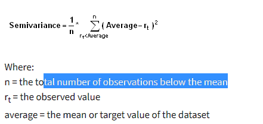

## Table of Contents

## What is semivariance and why is it important in finance?

Semivariance is a measure used in finance to look at the risk of an investment by focusing on the downside, or negative, returns. It calculates the average of the squared deviations of returns that fall below a certain target or average return. This is different from variance, which looks at all returns, both positive and negative. By focusing only on the downside, semivariance helps investors understand how much an investment might lose, which is often more important to them than how much it might gain.

In finance, semivariance is important because it gives a clearer picture of the risk an investor is taking. Many investors are more worried about losing money than missing out on gains, so knowing the downside risk is crucial. By using semivariance, investors can make better decisions about which investments to choose, especially if they want to avoid big losses. It helps in creating portfolios that are more aligned with an investor's risk tolerance and financial goals.

## How does semivariance differ from variance?

Semivariance and variance are both ways to measure how much an investment's returns can change, but they focus on different things. Variance looks at all the returns, whether they are good or bad. It calculates the average of the squared differences between each return and the average return. This gives a broad view of how much the returns can vary in any direction.

On the other hand, semivariance only looks at the bad returns, the ones that are below a certain target or the average return. It calculates the average of the squared differences of just these negative returns. This makes semivariance a better tool for understanding the risk of losing money, which is often what investors worry about the most. By focusing on the downside, semivariance helps investors see how much an investment might go down, rather than how much it might go up or down in total.

## What are the basic steps to calculate semivariance?

To calculate semivariance, you first need to decide on a target return, which could be the average return of the investment or another specific goal. Then, you look at all the returns of the investment and find the ones that are less than this target return. These are the returns that you will use for your semivariance calculation because they represent the downside risk.

Next, you take each of these negative returns and find the difference between them and the target return. You square these differences to make sure they are all positive numbers. After that, you add up all these squared differences and divide by the number of negative returns you used. This gives you the semivariance, which shows how much the investment's returns can fall below the target on average.

## Can you explain the formula used to compute semivariance?

The formula for semivariance is pretty straightforward. You start by [picking](/wiki/asset-class-picking) a target return, which could be the average return of your investment or any other goal you have in mind. Then, you look at all the returns of your investment and find the ones that are less than this target. These are the returns you'll use for your semivariance calculation because they show the downside risk. For each of these negative returns, you find the difference between the return and the target return. You square these differences to make sure they are all positive numbers. After that, you add up all these squared differences and divide by the number of negative returns you used. This gives you the semivariance, which tells you how much the investment's returns can fall below the target on average.

Let's break it down with a simple example. Imagine you have an investment with returns of -2%, 3%, -1%, and 5%, and your target return is 0%. The returns below the target are -2% and -1%. The difference between -2% and 0% is -2%, and when you square it, you get 4. The difference between -1% and 0% is -1%, and when you square it, you get 1. You add these squared differences together to get 4 + 1 = 5. Since there are 2 negative returns, you divide 5 by 2 to get a semivariance of 2.5. This number shows you the average squared downside risk of your investment compared to your target return.

## What types of data are typically used to calculate semivariance?

The data used to calculate semivariance usually comes from the returns of an investment over a certain period of time. These returns can be daily, weekly, monthly, or any other time frame that makes sense for the analysis. The returns are often expressed as percentages, showing how much the investment has gone up or down compared to its starting value. For example, if you're looking at stock prices, you might use the daily percentage change in the stock's price as your data.

To calculate semivariance, you need to know the target return, which could be the average return of the investment or a specific goal you have set. Then, you look at all the returns and pick out the ones that are below this target. These negative returns are the ones you use to find the semivariance. By focusing on these lower returns, semivariance helps you understand the risk of losing money, which is often what investors care about the most.

## How is semivariance used in portfolio management?

In portfolio management, semivariance helps investors see how much their investments might lose. This is important because many people worry more about losing money than missing out on gains. By looking at semivariance, investors can pick investments that have less chance of big losses. This helps them build a portfolio that matches how much risk they are willing to take and what they want to achieve with their money.

Portfolio managers use semivariance to make their portfolios safer. They look at the semivariance of different investments to see which ones might not lose as much money. Then, they can choose to put more money into these safer investments or mix them with riskier ones to balance out the risk. This way, they can help their clients avoid big drops in their portfolio's value and keep their investments more stable over time.

## What are the limitations of using semivariance as a risk measure?

One big limitation of using semivariance as a risk measure is that it only looks at the bad returns, the ones below a certain target. This means it ignores all the good returns, which can give you a one-sided view of how risky an investment really is. If an investment has a lot of big gains, semivariance won't show you that, so you might think it's riskier than it really is.

Another issue with semivariance is that it can be hard to calculate and understand. You need to pick a target return, and different people might choose different targets. This can make it tricky to compare the semivariance of different investments or to use it in a way that everyone agrees on. Plus, the math can be a bit confusing, especially if you're not used to working with numbers a lot.

## How does semivariance relate to downside risk?

Semivariance is all about downside risk. It looks at how much an investment might lose by focusing only on the returns that are less than a certain target, like the average return. This helps investors see how much their investment might go down, which is often what they worry about the most. By using semivariance, you get a clear picture of the risk of losing money, which is a big part of what downside risk is all about.

Downside risk is the chance that an investment will lose value, and semivariance is a way to measure it. Instead of looking at all the ups and downs like variance does, semivariance only cares about the downs. This makes it a useful tool for investors who want to avoid big losses. By understanding the semivariance, investors can make smarter choices about which investments to pick and how to build a portfolio that fits their risk tolerance and financial goals.

## Can semivariance be applied to assets other than stocks?

Yes, semivariance can be used for assets other than stocks. It can be applied to any kind of investment that has returns you can track over time. This includes things like bonds, real estate, commodities, and even mutual funds or exchange-traded funds (ETFs). The idea is the same: you look at the returns of these assets and focus on the ones that are below a certain target to see how much risk there is of losing money.

Using semivariance for different types of assets helps investors understand the downside risk no matter what they are investing in. For example, if you own rental properties, you can use semivariance to see how much your rental income might drop below what you expect. Or if you invest in bonds, you can look at the semivariance to understand how much the bond's value might fall. This way, semivariance gives you a tool to manage risk across all your investments, not just stocks.

## What are some advanced techniques for optimizing semivariance in portfolio construction?

One advanced technique for optimizing semivariance in portfolio construction is using mean-semivariance optimization. This method helps you build a portfolio that focuses on reducing the risk of losing money. Instead of looking at all the ups and downs like traditional methods do, mean-semivariance optimization only cares about the downs. It tries to find the best mix of investments that keeps the semivariance as low as possible while still aiming for good returns. This can be done using special computer programs that run lots of different scenarios to find the best portfolio for your goals.

Another technique is using downside risk constraints. This means setting rules for your portfolio that limit how much it can lose. For example, you might decide that you don't want your portfolio to drop more than a certain amount in any given year. By setting these limits, you can use semivariance to make sure your portfolio stays within these boundaries. This helps you keep control over the risk of losing money and can make your investments feel safer. Both of these techniques use semivariance to help you build a portfolio that matches your risk tolerance and financial goals.

## How does semivariance perform compared to other risk measures in empirical studies?

In empirical studies, semivariance often shows up as a better way to measure risk than other common methods like variance or standard deviation. This is because semivariance focuses on the bad returns, the ones that are below a certain target. Many investors care more about avoiding big losses than missing out on big gains, so semivariance gives them a clearer picture of the risk they're taking. Studies have found that using semivariance can help investors build portfolios that are less likely to lose a lot of money, which is a big plus for people who want to keep their investments safe.

However, semivariance isn't perfect and can have some downsides compared to other risk measures. For one, it can be harder to calculate and understand because you have to pick a target return, and different people might choose different targets. This can make it tricky to compare the semivariance of different investments or to use it in a way that everyone agrees on. Also, because semivariance only looks at the downside, it might miss out on important information about the good returns, which can give a one-sided view of an investment's risk. So, while semivariance can be very useful, it's often used alongside other risk measures to get a fuller picture of an investment's risk.

## What are the current research trends and future directions in the use of semivariance?

Current research on semivariance is looking at new ways to use it in portfolio management and risk assessment. Researchers are trying to make semivariance easier to calculate and understand so more people can use it. They're also working on combining semivariance with other risk measures to get a better overall picture of an investment's risk. For example, some studies are looking at how semivariance can be used with [value at risk](/wiki/var-value-at-risk) (VaR) or expected shortfall (ES) to create more robust risk management strategies. Another trend is using [machine learning](/wiki/machine-learning) and big data to find patterns in semivariance that can help predict future downside risk.

In the future, semivariance might become even more important in finance. As more investors focus on avoiding big losses, tools like semivariance that look at downside risk could become standard. Researchers might develop new models and algorithms that use semivariance to optimize portfolios in real-time, making it easier for investors to manage their risk. There's also a chance that semivariance could be used in other areas of finance, like insurance or real estate, to help people understand and manage the risk of losing money in those fields too.

## What is the role of semivariance in investment risk analysis?

Semivariance is a statistical measure that focuses exclusively on downside risk, distinguishing it from the broader measure of variance, which considers both upward and downward price fluctuations. This focus makes semivariance particularly relevant for investors who prioritize minimizing losses over capturing gains, aligning closely with the risk aversion principles in financial theory [1].

The calculation of semivariance involves determining the average of the squared deviations of returns that fall below a specified threshold, often the mean return of a dataset. This provides a more precise measure of potential downside risk by isolating negative returns:

$$
\text{Semivariance} = \frac{1}{N} \sum_{R_i < T} (T - R_i)^2
$$

Here, $N$ represents the number of observations where returns $R_i$ are less than the threshold $T$. The threshold $T$ is typically chosen as the mean return but can be adjusted according to specific investor needs or targets.

Risk-averse investors find semivariance appealing as it narrows the focus to losses, offering a nuanced assessment of a portfolio's risk profile by excluding positive return deviations. As investors are generally more concerned with negative outcomes, semivariance aids in understanding and mitigating potential unfavorable movements in portfolio value [2].

By omitting positive [volatility](/wiki/volatility-trading-strategies) from its calculations, semivariance simplifies the investor's decision-making process, providing a clear picture of downside risk. This exclusion of upside risk can be particularly valuable when tailoring strategies to meet specific risk appetites or when designing financial products aimed at reducing the likelihood of significant losses.

In practical investment management, semivariance serves as a complement to traditional variance measures, providing added depth to portfolio risk analysis. It enhances strategic planning by clearly reflecting scenarios investors might wish to avoid, thus supporting more informed and effective investment decisions [3].

References:
1. Markowitz, H. M. (1952). Portfolio Selection. The Journal of Finance.
2. Sortino, F. A., & Van Der Meer, R. (1991). Downside Risk. The Journal of Portfolio Management.
3. Nawrocki, D. (1999). A brief history of downside risk measures. The Journal of Investing.

## What is the Calculation and Formula for Semivariance?

Calculating semivariance involves a methodological approach that emphasizes returns beneath a specified threshold, which is frequently set as the mean return of the dataset. This calculation provides a focused view on downside risk by measuring only negative deviations.

The steps to calculate semivariance begin with defining the threshold, which serves as a benchmark to determine which returns are considered for the calculation. Following this, you collect return data for the period you're analyzing and identify those returns that fall below the threshold. The next step is to compute the squared deviations of these return values from the threshold. Finally, you average these squared deviations to obtain the semivariance value.

Mathematically, semivariance is expressed as: 

$$
\text{Semivariance} = \frac{1}{N} \sum_{R_t < T} (T - R_t)^2
$$

where $R_t$ represents individual return values, $T$ is the predetermined threshold, and $N$ is the total number of returns falling below the threshold.

For practical application, spreadsheets such as Excel can simplify these calculations through built-in functions that handle large datasets efficiently. The use of formulas, such as `=IF(return<T, (T-return)^2, "")` followed by an average calculation, facilitates quick results in spreadsheet applications.

In [algorithmic trading](/wiki/algorithmic-trading) and digital analytics, the automation of semivariance calculations is adeptly handled by programming languages like Python. The libraries `pandas` and `numpy` can be particularly useful for handling complex datasets and real-time data processing. Below is a simple Python code snippet to calculate semivariance:

```python
import numpy as np

returns = np.array([...])  # Replace with your return data
threshold = returns.mean()  # Define the threshold, often set as the mean

# Calculate semivariance
neg_dev = [max(0, threshold - r) for r in returns]
semivariance = np.mean(np.square(neg_dev))

print("Semivariance:", semivariance)
```

This Python code efficiently isolates returns below the threshold, computes the squared deviations, and averages these results to yield the semivariance. Such automation is advantageous for traders and analysts working with extensive datasets or requiring real-time analysis, enhancing decision-making through a clear insight into downside risk dynamics.

## References & Further Reading

[1]: Markowitz, H. M. (1952). ["Portfolio Selection."](https://onlinelibrary.wiley.com/doi/abs/10.1111/j.1540-6261.1952.tb01525.x) The Journal of Finance.

[2]: Sortino, F. A., & Van Der Meer, R. (1991). ["Downside Risk."](https://research.rug.nl/en/publications/downside-risk-capturing-whats-at-stake-in-investment-situations) The Journal of Portfolio Management.

[3]: Nawrocki, D. (1999). ["A brief history of downside risk measures."](https://www.researchgate.net/publication/2382526_A_Brief_History_of_Downside_Risk_Measures) The Journal of Investing.

[4]: Estrada, J. (2008). ["Mean-Semivariance Behavior: Downside Risk and Capital Asset Pricing."](https://blog.iese.edu/jestrada/files/2012/06/MSB2.pdf) The CFA Institute.

[5]: Alexander, C. (2008). ["Market Risk Analysis, Quantitative Methods in Finance,"](https://archive.org/details/marketriskanalys0001alex) Wiley. 

[6]: Sortino, F. A., & Satchell, S. E. (2001). ["Managing Downside Risk in Financial Markets."](https://www.sciencedirect.com/book/9780750648639/managing-downside-risk-in-financial-markets) Butterworth-Heinemann.