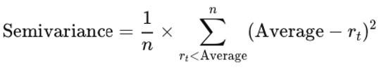

In today's volatile financial markets, understanding risk is critical for making informed investment decisions. While traditional metrics such as variance offer a measure of overall volatility by capturing both upside and downside fluctuations, they do not necessarily align with the concerns of risk-averse investors focused on mitigating losses. This article examines semivariance, a lesser-known but powerful metric, which offers a more targeted approach to analyzing downside risk in investment portfolios. By concentrating on negative deviations from a set benchmark, semivariance provides a clearer picture of potential adverse outcomes, helping investors and traders manage their portfolios more effectively.

As algorithmic trading continues to revolutionize financial markets, the ability to incorporate advanced risk metrics like semivariance becomes increasingly valuable. Unlike variance, which treats positive and negative deviations equally, semivariance focuses solely on downside risk, thus aligning more closely with an investor's aversion to losses rather than total volatility. This quality makes semivariance particularly significant for algorithmic traders and risk managers tasked with optimizing portfolio performance and tailoring strategies according to specific risk appetites.



Through integrating semivariance into risk management frameworks, traders and portfolio managers can enhance decision-making processes, align strategies with investor preferences, and improve overall portfolio performance. As we explore the intricacies of semivariance, this article will highlight its role in modern investment analysis and its advantages over traditional risk measures, offering insights on how it can be leveraged in various financial contexts.

## Table of Contents

## Understanding Semivariance in Investment Risk Analysis

Semivariance is a statistical measure that focuses exclusively on downside risk, distinguishing it from the broader measure of variance, which considers both upward and downward price fluctuations. This focus makes semivariance particularly relevant for investors who prioritize minimizing losses over capturing gains, aligning closely with the risk aversion principles in financial theory [1].

The calculation of semivariance involves determining the average of the squared deviations of returns that fall below a specified threshold, often the mean return of a dataset. This provides a more precise measure of potential downside risk by isolating negative returns:

$$
\text{Semivariance} = \frac{1}{N} \sum_{R_i < T} (T - R_i)^2
$$

Here, $N$ represents the number of observations where returns $R_i$ are less than the threshold $T$. The threshold $T$ is typically chosen as the mean return but can be adjusted according to specific investor needs or targets.

Risk-averse investors find semivariance appealing as it narrows the focus to losses, offering a nuanced assessment of a portfolio's risk profile by excluding positive return deviations. As investors are generally more concerned with negative outcomes, semivariance aids in understanding and mitigating potential unfavorable movements in portfolio value [2].

By omitting positive [volatility](/wiki/volatility-trading-strategies) from its calculations, semivariance simplifies the investor's decision-making process, providing a clear picture of downside risk. This exclusion of upside risk can be particularly valuable when tailoring strategies to meet specific risk appetites or when designing financial products aimed at reducing the likelihood of significant losses.

In practical investment management, semivariance serves as a complement to traditional variance measures, providing added depth to portfolio risk analysis. It enhances strategic planning by clearly reflecting scenarios investors might wish to avoid, thus supporting more informed and effective investment decisions [3].

References:
1. Markowitz, H. M. (1952). Portfolio Selection. The Journal of Finance.
2. Sortino, F. A., & Van Der Meer, R. (1991). Downside Risk. The Journal of Portfolio Management.
3. Nawrocki, D. (1999). A brief history of downside risk measures. The Journal of Investing.

## The Calculation and Formula for Semivariance

Calculating semivariance involves a methodological approach that emphasizes returns beneath a specified threshold, which is frequently set as the mean return of the dataset. This calculation provides a focused view on downside risk by measuring only negative deviations.

The steps to calculate semivariance begin with defining the threshold, which serves as a benchmark to determine which returns are considered for the calculation. Following this, you collect return data for the period you're analyzing and identify those returns that fall below the threshold. The next step is to compute the squared deviations of these return values from the threshold. Finally, you average these squared deviations to obtain the semivariance value.

Mathematically, semivariance is expressed as: 

$$
\text{Semivariance} = \frac{1}{N} \sum_{R_t < T} (T - R_t)^2
$$

where $R_t$ represents individual return values, $T$ is the predetermined threshold, and $N$ is the total number of returns falling below the threshold.

For practical application, spreadsheets such as Excel can simplify these calculations through built-in functions that handle large datasets efficiently. The use of formulas, such as `=IF(return<T, (T-return)^2, "")` followed by an average calculation, facilitates quick results in spreadsheet applications.

In [algorithmic trading](/wiki/algorithmic-trading) and digital analytics, the automation of semivariance calculations is adeptly handled by programming languages like Python. The libraries `pandas` and `numpy` can be particularly useful for handling complex datasets and real-time data processing. Below is a simple Python code snippet to calculate semivariance:

```python
import numpy as np

returns = np.array([...])  # Replace with your return data
threshold = returns.mean()  # Define the threshold, often set as the mean

# Calculate semivariance
neg_dev = [max(0, threshold - r) for r in returns]
semivariance = np.mean(np.square(neg_dev))

print("Semivariance:", semivariance)
```

This Python code efficiently isolates returns below the threshold, computes the squared deviations, and averages these results to yield the semivariance. Such automation is advantageous for traders and analysts working with extensive datasets or requiring real-time analysis, enhancing decision-making through a clear insight into downside risk dynamics.

## Significance of Semivariance in Portfolio Management

Semivariance serves as an essential tool for portfolio managers seeking to minimize downside risk. Unlike traditional risk measures that account for both gains and losses, semivariance focuses solely on negative returns, aligning more closely with investor preferences that prioritize loss reduction. By honing in on downside risk, semivariance offers a nuanced perspective that is especially beneficial in managing portfolios aimed at mitigating potential “drawdowns” or dips in value.

In the context of asset allocation, semivariance aids portfolio managers in selecting investments that lower the likelihood of substantial financial losses. This is achieved by providing a more precise measurement of risk, thereby allowing managers to tailor asset allocations to align with specific risk appetites. Through this targeted approach, semivariance facilitates disciplined investment strategies where potential losses are minimized, encouraging a trading culture that values risk awareness and prudence.

Additionally, semivariance can be instrumental in optimizing portfolio performance. For example, managers might focus on investments that exhibit low downside risk as calculated by semivariance, leading to more robust portfolios less susceptible to market downturns. This strategy is crucial when dealing with investments in volatile markets, where the risk of negative returns can significantly impact portfolio performance.

Moreover, semivariance complements existing risk measures by providing a more targeted view of potential losses, thus enhancing the portfolio construction and management process. It empowers investors by offering a metric that reflects their aversion to losses over volatility from positive returns.

In summary, semivariance offers portfolio managers an advanced tool to better align investment strategies with the risk preferences of investors, fostering a culture of conscientious risk management and strategic decision-making focused on financial resilience.

## Implications for Algorithmic Trading

Algorithmic trading strategies can benefit significantly from incorporating semivariance as a risk management tool, as it provides a refined mechanism for understanding and responding to downside risk. In dynamic market environments, where volatility can manifest unpredictably, semivariance allows traders to concentrate on potential negative outcomes, enabling more tailored trading decisions.

Traders using automated systems can leverage semivariance by programming dynamic responses to market conditions, specifically targeting downside volatility. For instance, by setting algorithms to react not merely to price movements, but to changes in the semivariance, traders can dynamically adjust positions to mitigate potential losses. This approach aligns trading strategies with specific risk preferences, enhancing the precision and effectiveness of algorithmic models.

Semivariance can also assist in refining trading algorithms by establishing performance benchmarks aimed at minimizing negative deviations from expected returns. By focusing on deviations below a certain threshold, these benchmarks can enforce stricter risk controls, thereby reducing exposure during periods of heightened downside risk. For instance, implementing semivariance calculations in Python could involve setting a target return threshold and calculating semivariance as follows:

```python
import numpy as np

def calculate_semivariance(returns, target=0):
    negative_diff = [min(0, ret - target) for ret in returns]
    semivariance = np.mean(np.square(negative_diff))
    return semivariance

# Example usage
returns = [0.05, -0.02, 0.03, -0.01, -0.04] # Example returns
target_return = 0.015
semivariance_value = calculate_semivariance(returns, target_return)
print(f'Semivariance: {semivariance_value}')
```

This code allows for real-time processing and recalibration of trading strategies based on the calculated semivariance, offering a robust metric to adjust to market fluctuations effectively.

In the rapidly evolving landscape of algorithmic trading, semivariance stands as a vital metric for making strategies more resilient to downside moves. By integrating semivariance, firms can achieve better alignment between trade execution strategies and investor risk profiles, ensuring that automated systems adhere to predefined risk thresholds even in volatile scenarios. This integration not only fosters disciplined investment practices but also ensures that trading strategies remain tightly coupled with the investor's risk appetite, ultimately contributing to improved portfolio outcomes.

## Applications and Limitations

Semivariance finds significant utility across various facets of investment, particularly in risk assessment, performance evaluation, and asset allocation. Its primary allure lies in its ability to gauge downside risks effectively, making it especially valuable for portfolios designed to minimize potential losses. By concentrating exclusively on adverse fluctuations below a target threshold, semivariance addresses the concerns of risk-averse investors who prioritize the minimization of negative outcomes over the complete volatility spectrum.

In risk assessment, semivariance provides a targeted method for identifying vulnerabilities in an investment portfolio by highlighting those returns that deviate negatively, providing clarity on the potential for financial downturns. Likewise, in performance evaluation, semivariance serves as a precise measure for comparing investments based on their downside potential, rather than their total return variance. This focus aids investors and fund managers in making informed decisions by assessing performance through a risk-averse lens.

Despite its advantages, semivariance has inherent limitations. One notable drawback is its exclusive focus on negative volatility, which inherently neglects the potential insights gained from positive fluctuations. By omitting the variance resulting from above-threshold returns, semivariance may underestimate a complete risk profile, possibly leading to suboptimal decision-making if not used in conjunction with other risk measures. Additionally, semivariance’s effectiveness is inherently linked to the availability and accuracy of historical return data. The measure’s precision demands a detailed and high-quality dataset to ensure reliable outcomes, posing challenges in data-sparse environments or with assets that have limited historical information.

While semivariance involves complex calculations, it remains a compelling tool for investors emphasizing downside risk minimization. Its precise focus appeals to those who predominantly seek to shield their portfolios from potential losses rather than endure risk from the entire volatility spectrum. This makes semivariance a strategic choice for integrating into investment analysis frameworks alongside more traditional risk measures, ultimately enriching decision-making processes with a comprehensive understanding of downside risks.

## Conclusion

Semivariance offers a sophisticated and investor-friendly approach to measuring downside risk, providing unique insights into investment performance. In the context of algorithmic trading, the integration of semivariance into trading systems is becoming increasingly pertinent. As algorithmic trading strategies evolve, embracing advanced metrics such as semivariance allows for a deeper alignment between trading execution and investor risk profiles. By concentrating on downside risk, semivariance empowers traders and portfolio managers to refine strategy performance and adapt to investor needs more precisely than traditional measures allow.

While semivariance will not supplant traditional risk measures like variance, it serves as a complementary tool, sharpening the focus on potential losses. By providing a more targeted view of downside risk, semivariance enriches the risk management toolkit, ensuring a more nuanced evaluation of investment performance and portfolio robustness. For investors and portfolio managers striving for a comprehensive understanding of risk, incorporating semivariance into analytics frameworks can enhance decision-making capabilities and lead to more resilient investment strategies.

Focusing on downside volatility, semivariance underscores strategic decision-making aimed at financial resilience and growth. This emphasis on mitigating potential losses bolsters disciplined investment practices and supports sustained performance in volatile markets. Therefore, adopting semivariance not only complements existing risk measures but also advances the precision and effectiveness of risk management in contemporary investment management.

## References & Further Reading

[1]: Markowitz, H. M. (1952). ["Portfolio Selection."](https://onlinelibrary.wiley.com/doi/abs/10.1111/j.1540-6261.1952.tb01525.x) The Journal of Finance.

[2]: Sortino, F. A., & Van Der Meer, R. (1991). ["Downside Risk."](https://research.rug.nl/en/publications/downside-risk-capturing-whats-at-stake-in-investment-situations) The Journal of Portfolio Management.

[3]: Nawrocki, D. (1999). ["A brief history of downside risk measures."](https://www.researchgate.net/publication/2382526_A_Brief_History_of_Downside_Risk_Measures) The Journal of Investing.

[4]: Estrada, J. (2008). ["Mean-Semivariance Behavior: Downside Risk and Capital Asset Pricing."](https://blog.iese.edu/jestrada/files/2012/06/MSB2.pdf) The CFA Institute.

[5]: Alexander, C. (2008). ["Market Risk Analysis, Quantitative Methods in Finance,"](https://archive.org/details/marketriskanalys0001alex) Wiley. 

[6]: Sortino, F. A., & Satchell, S. E. (2001). ["Managing Downside Risk in Financial Markets."](https://www.sciencedirect.com/book/9780750648639/managing-downside-risk-in-financial-markets) Butterworth-Heinemann.