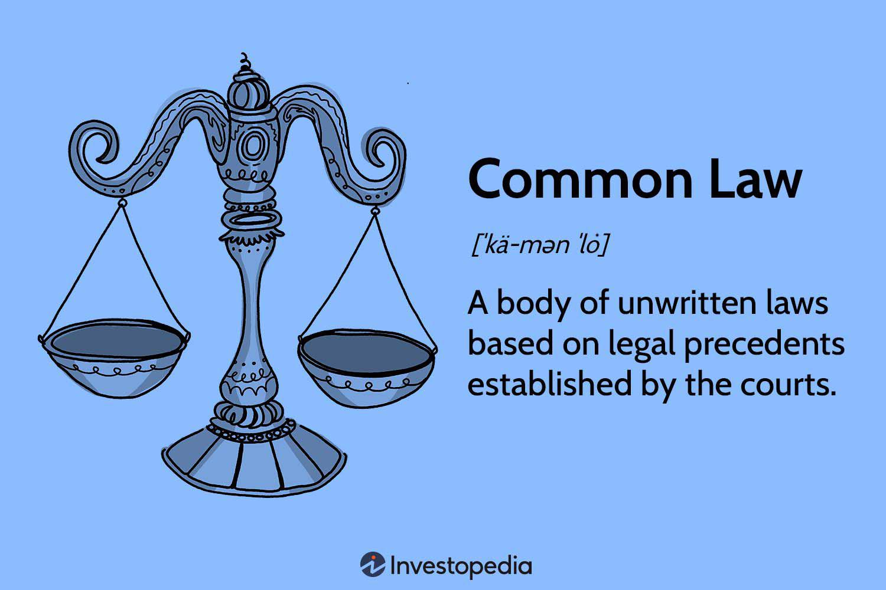

Senate bills are pivotal in shaping and defining the legislative landscape of the United States. These bills are proposed laws or amendments considered by the Senate, which serve as one of the two chambers of the U.S. Congress. The significance of Senate bills lies in their critical role in influencing national policies, addressing societal issues, and regulating various sectors. They act as instruments for government accountability and transparency, providing a structured approach to managing the country's legislative needs.

Algorithmic trading, meanwhile, has become a cornerstone of modern financial markets. This form of trading utilizes complex algorithms to execute orders with speed and accuracy, often within fractions of a second. The increase in algorithmic trading is driven by the need for efficiency and the ability to minimize costs and market impact. It offers the advantage of processing large volumes of trades that would be impossible for human traders in a short timeframe. However, despite its benefits, algorithmic trading is not without risks. It has raised concerns regarding market volatility, fairness, and the potential for systemic failures.



Amid these developments, the introduction of Senate Bill S. 2892, known as the Algorithmic Accountability Act of 2023, signals a growing recognition of the need to regulate algorithmic decision-making. This bill proposes to enhance transparency and oversight, particularly in the financial sector, by mandating assessments of the impacts and biases of automated systems. The proposed legislation reflects the importance of understanding and integrating Senate bills with modern technological trends, such as algorithmic trading, to safeguard the market's integrity and trust. 

Understanding the linkage between Senate bills and algorithmic trading is crucial. It not only aids in grasping how regulatory measures influence technological practices but also emphasizes the role of these legislative initiatives in shaping the future of financial markets and, by extension, the broader economic landscape. Through informed legislative controls, a balance can be struck between innovation and regulation, ensuring that the benefits of algorithmic advancements are harnessed responsibly.

## Table of Contents

## Understanding Senate Bills

A Senate bill is a draft of a proposed law introduced for consideration within the United States Senate. Senate bills, denoted by "S." followed by a number (e.g., S. 2892), serve as a vehicle for introducing new laws or amending existing ones. Their primary purpose is to address national issues, propose governmental changes, and establish statutory requirements through formal legislative processes.

The legislative process of a Senate bill involves several key steps. Initially, a bill is drafted, often by a Senator or a group of Senators, and then introduced on the Senate floor. Upon introduction, the bill is assigned to a relevant committee that specializes in the bill's subject matter. The committee reviews the bill, holds hearings, and may make amendments before voting on whether to send the bill back to the Senate floor. 

If the committee approves the bill, it proceeds to the Senate for debate. Senators may propose further amendments, and the full chamber votes on the bill. If the bill passes by a majority vote, it moves to the House of Representatives for consideration. The House follows a similar process of committee review, debate, and amendments. Should the House pass the bill, any differences between the Senate and House versions are reconciled, usually through a conference committee.

Once both chambers agree on a finalized version, the bill is sent to the President. The President can sign the bill into law, veto it, or allow it to become law without a signature. In the case of a veto, Congress can still enact the bill into law with a two-thirds majority vote in both the Senate and the House.

An example of a successfully passed Senate bill is the Civil Rights Act of 1964 (S. 1564), which transformed societal structures by prohibiting discrimination based on race, color, religion, sex, or national origin. This landmark legislation, initiated as S. 1564 and signed into law by President Lyndon B. Johnson, exemplifies the far-reaching impact Senate bills can have once enacted through the legislative process.

## Algorithmic Trading: An Overview

Algorithmic trading, a method of executing orders using automated pre-programmed trading instructions, has emerged as a transformative force in modern financial markets. Its inception dates back to the 1970s with the introduction of program trading, but it gained significant [momentum](/wiki/momentum) in the late 1990s and early 2000s with advances in technology and increased access to financial markets. Algorithmic trading employs mathematical models and complex algorithms to make high-speed trading decisions, often without human intervention.

One of the primary benefits of [algorithmic trading](/wiki/algorithmic-trading) is its ability to process vast amounts of data and execute trades at speeds beyond human capability. This speed can lead to increased [liquidity](/wiki/liquidity-risk-premium) in the markets, tighter bid-ask spreads, and improved pricing efficiency. For instance, algorithms can scan multiple markets and data sources in real-time to identify [arbitrage](/wiki/arbitrage) opportunities, thereby contributing to market consistency.

However, algorithmic trading is also associated with significant risks. One key concern is the potential for systemic risk due to the interconnectedness and rapid pace of automated trading systems. A well-known example is the "Flash Crash" of May 6, 2010, when the U.S. stock market experienced a sudden and severe drop, exacerbated by automated trading. Additionally, complex algorithms can behave unpredictably, leading to unintended trading errors or "fat finger" trades.

The impact of algorithmic trading on market [volatility](/wiki/volatility-trading-strategies) and efficiency is multifaceted. On one hand, automated trading can enhance market efficiency by quickly incorporating new information into asset prices. On the other hand, the same speed and complexity can contribute to increased short-term volatility, as evidenced by the occurrence of flash crashes and miniature price spikes.

To illustrate the programming aspect, consider a simple algorithm that triggers buy orders when a stock's short-term moving average surpasses its long-term moving average, a technique widely known as moving average crossover strategy. Here is a basic implementation in Python:

```python
import numpy as np
import pandas as pd

def moving_average_crossover(prices, short_window, long_window):
    signals = pd.DataFrame(index=prices.index)
    signals['price'] = prices
    signals['short_mavg'] = prices.rolling(window=short_window, min_periods=1).mean()
    signals['long_mavg'] = prices.rolling(window=long_window, min_periods=1).mean()
    signals['signal'] = 0.0
    signals['signal'][short_window:] = np.where(signals['short_mavg'][short_window:] > signals['long_mavg'][short_window:], 1.0, 0.0)
    signals['positions'] = signals['signal'].diff()
    return signals

prices = pd.Series([/* historical stock prices here */])
signals = moving_average_crossover(prices, short_window=40, long_window=100)
```

Despite these challenges, algorithmic trading remains an integral part of global financial markets due to its capacity to execute complex strategies swiftly and reliably. As technology continues to evolve, the role of algorithmic trading will likely expand, necessitating careful consideration of its benefits and potential risks.

## The Algorithmic Accountability Act of 2023

Senate Bill S. 2892, known as the Algorithmic Accountability Act of 2023, represents a significant legislative step toward regulating algorithmic decision-making processes used across various sectors. This bill aims to increase transparency and accountability in systems that employ complex algorithms, particularly focusing on those impacting critical business and financial decisions.

The primary objective of the Algorithmic Accountability Act is to mandate companies to conduct regular assessments of automated systems. These assessments are intended to evaluate and mitigate potential risks associated with bias, ineffective decision-making, and privacy violations. By doing so, the bill seeks to ensure that algorithmic systems operate fairly, ethically, and without unwarranted discrimination against consumers.

Key provisions of the bill include the requirement for companies to maintain detailed documentation of their algorithmic systems’ design and functionality. Companies must report the outcomes of risk assessments to relevant regulatory bodies and make this information available upon request. Additionally, the bill encourages the development of industry standards for algorithm design and implementation, promoting best practices in transparency and consumer protection.

As of its introduction, the bill has spurred considerable discussion regarding its necessity and feasibility. Some industry stakeholders argue that such regulations could stifle innovation due to the increased burden of compliance, while proponents highlight the bill’s potential to foster consumer trust and stability within the financial markets. The status of the bill, at the time of this writing, is under review by the Senate Committee, with several hearings scheduled to discuss its implications further.

If enacted, the Algorithmic Accountability Act could have a profound impact on how financial markets operate. By ensuring that algorithmic systems are regularly scrutinized and held to high ethical standards, the bill promises to enhance the integrity and reliability of algorithm-driven financial transactions. Consequently, this could lead to a more stable and equitable market environment, benefiting traders, investors, and consumers alike.

## Legislative Challenges and Implications

Passing legislation related to technology and finance presents several challenges. One primary hurdle is the rapid pace of technological innovation, which can outstrip the legislative process. As technologies evolve, laws may become quickly outdated, necessitating continual revisions and amendments to address these changes. This dynamic nature of technology imposes a significant burden on lawmakers to stay informed and adapt quickly.

Debates surrounding the regulation of algorithmic trading highlight these challenges. Proponents argue that algorithmic trading increases market efficiency by executing orders at speeds impossible for human traders to achieve. It is also suggested that algorithms can reduce transaction costs and contribute to increased liquidity. On the contrary, critics point out the potential for exacerbated market volatility, as witnessed during events like the 2010 Flash Crash. The capacity for algorithms to execute large volumes of trades in milliseconds means that errors or unexpected market conditions can lead to significant disruptions.

One focal point of debate is the ethical and security considerations involved in algorithmic trading. Since algorithms are capable of making thousands of trades in a second, errors in their design or logic could lead to substantial financial losses. Furthermore, there are concerns about market fairness, as high-frequency traders often have access to superior technology, potentially disadvantaging smaller investors.

If Senate Bill S. 2892, the Algorithmic Accountability Act of 2023, is enacted, its potential implications for various stakeholders must be considered. For traders, the bill could mean increased scrutiny and requirements for disclosure of proprietary algorithms, which could impact trade secrecy and competitive advantage. Investors might gain more confidence with additional transparency, potentially leading to a broader participation in the markets. Market operators, such as exchanges, may face increased regulatory compliance costs and might need to adapt their infrastructures to accommodate new rules.

In summary, while the intent underlying the legislation, such as Senate Bill S. 2892, aims to make markets safer and more equitable, its implementation is fraught with challenges that require balancing innovation with necessary regulation, ensuring both protection and progress in modern financial markets.

## Conclusion

The legislative process plays a crucial role in the regulation of emerging technologies, ensuring that advancements such as algorithmic trading operate within a framework that balances innovation with public interest. By understanding how Senate bills transition from proposals to enacted laws, we appreciate their significance in setting standards and norms for new technologies. The introduction of measures like the Algorithmic Accountability Act demonstrates the Senate's proactive approach in addressing the complexities introduced by technology.

Senate bills like S. 2892, the Algorithmic Accountability Act, are instrumental in shaping the future of algorithmic trading. They establish guidelines that foster responsible development and deployment of algorithms, aiming to mitigate risks such as market manipulation and systemic instability. This legislative oversight is necessary to maintain market confidence and protect stakeholders from potential abuses or unintended consequences of automated systems.

For traders, investors, and companies operating in financial markets, staying informed about legislative developments is crucial. Active engagement with proposed laws and regulations allows stakeholders to adapt to changes, ensure compliance, and contribute to shaping policies that reflect industry needs and societal values. As technologies continue to evolve, such active participation will support the creation of a balanced regulatory environment that encourages innovation while safeguarding the public interest.

## References & Further Reading

[1]: Hendershott, T., Jones, C. M., & Menkveld, A. J. (2011). ["Does Algorithmic Trading Improve Liquidity?"](https://onlinelibrary.wiley.com/doi/full/10.1111/j.1540-6261.2010.01624.x) The Review of Financial Studies, 24(8), 2134-2184.

[2]: Lopez de Prado, M. (2018). ["Advances in Financial Machine Learning"](https://www.amazon.com/Advances-Financial-Machine-Learning-Marcos/dp/1119482089). Wiley.

[3]: Laruelle, S., Rosenbaum, M., & Lehalle, C. A. (2013). ["Market Microstructure in Practice"](http://helper.ipam.ucla.edu/publications/fmws2/fmws2_12928.pdf). Springer.

[4]: Mayer-Schönberger, V., & Cukier, K. (2013). ["Big Data: A Revolution That Will Transform How We Live, Work, and Think"](https://psycnet.apa.org/record/2013-17650-000). Eamon Dolan/Mariner Books.

[5]: Kastner, M. (2013). ["High-Frequency Trading: A Practical Guide to Algorithmic Strategies and Trading Systems"](https://onlinelibrary.wiley.com/doi/pdf/10.1002/9781119203803.fmatter). McGraw-Hill.