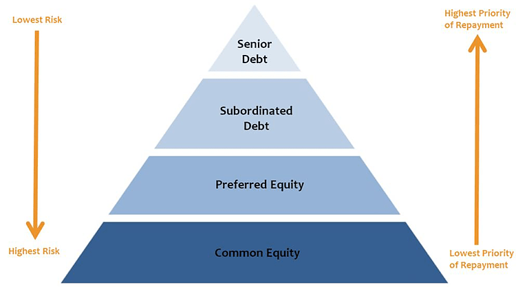

## Table of Contents

## What are Senior Note Bonds?

Senior Note Bonds are a type of debt security that companies issue to raise money. They are called "senior" because they have a higher priority for repayment compared to other types of debt if the company faces financial trouble. This means that if the company goes bankrupt, investors who hold senior note bonds get paid back before those who hold other types of bonds or debts.

These bonds usually offer a fixed interest rate, which means investors know exactly how much they will earn from the bond over time. Because they are safer than other types of bonds, senior note bonds often have lower interest rates. Investors like them because they are a more secure way to invest money and get a steady return, even though the return might not be as high as riskier investments.

## How do Senior Note Bonds differ from other types of bonds?

Senior Note Bonds are different from other types of bonds mainly because of their priority in getting paid back if a company has money problems. If a company goes bankrupt, people who own Senior Note Bonds get their money before people who own other types of bonds or debts. This makes Senior Note Bonds safer than other bonds. Because they are safer, they usually offer lower interest rates compared to riskier bonds. People who want a safer place to put their money might choose Senior Note Bonds.

Other types of bonds, like junior or subordinated bonds, have a lower priority for repayment. This means if a company can't pay all its debts, these bondholders might not get any money back until after the senior bondholders are paid. Because of this higher risk, junior bonds usually offer higher interest rates to attract investors. Some bonds, like convertible bonds, can be turned into company stock, which adds another layer of risk and potential reward. So, the main differences between Senior Note Bonds and other bonds are the priority of repayment and the level of risk and return.

## Who typically issues Senior Note Bonds?

Senior Note Bonds are usually issued by big companies that need to borrow a lot of money. These companies might be in different industries like making things, selling things, or providing services. They use the money they get from selling the bonds to grow their business, pay off other debts, or fund new projects.

Sometimes, governments or government agencies also issue Senior Note Bonds. They might need the money to build roads, schools, or other public projects. When governments issue these bonds, they are often seen as very safe because the government is less likely to go bankrupt compared to a company.

## What are the key features of Senior Note Bonds?

Senior Note Bonds are a type of bond that companies or governments issue to borrow money. They are called "senior" because if the company or government has money problems, people who own these bonds get paid back first. This makes Senior Note Bonds safer than other types of bonds. Because they are safer, they usually offer a lower [interest rate](/wiki/interest-rate-trading-strategies) compared to riskier bonds. Investors like them because they want a safer place to put their money and get a steady return, even if the return is not very high.

Big companies in different industries often issue Senior Note Bonds. They use the money to grow their business, pay off other debts, or start new projects. Sometimes, governments or government agencies also issue these bonds to pay for things like roads or schools. When governments issue them, they are seen as very safe because the government is less likely to go bankrupt than a company.

## How are Senior Note Bonds rated and what does the rating signify?

Senior Note Bonds are rated by special companies called credit rating agencies. These agencies look at how likely it is that the company or government issuing the bond will be able to pay back the money they borrowed. They give the bond a rating, which is like a grade in school. A high rating, like AAA or AA, means the bond is very safe and the company or government is likely to pay back the money. A lower rating, like BB or B, means the bond is riskier and there's a bigger chance the company or government might not pay back the money.

The rating is important because it helps investors decide if they want to buy the bond. If a bond has a high rating, more people will want to buy it because it's safer. But because it's safer, the interest rate on the bond might be lower. If a bond has a low rating, fewer people might want to buy it because it's riskier. But to make up for the risk, the interest rate on the bond might be higher. So, the rating tells investors about the safety and the return they can expect from the bond.

## What are the risks associated with investing in Senior Note Bonds?

Even though Senior Note Bonds are seen as safer than other types of bonds, there are still risks involved. One big risk is that the company or government that issued the bond might not be able to pay back the money they borrowed. This is called default risk. If the company goes bankrupt, even though Senior Note Bond holders get paid back first, there's still a chance they might not get all their money back if the company doesn't have enough money.

Another risk is interest rate risk. This happens when the interest rates in the economy go up. If you have a bond that pays a fixed interest rate, and new bonds start paying higher rates, the value of your bond might go down. People might not want to buy your bond because they can get a better deal somewhere else. If you need to sell your bond before it matures, you might have to sell it for less than you paid for it.

Lastly, there's inflation risk. Inflation means that the prices of things go up over time. If the interest rate on your bond is lower than the rate of inflation, the money you get back from the bond might not be worth as much as when you first invested it. This means your investment might lose its value over time, even if you get all your money back at the end.

## How do Senior Note Bonds function in the context of a company's capital structure?

Senior Note Bonds are a part of a company's capital structure, which is how a company decides to finance its operations and growth. In the capital structure, these bonds are considered debt. Companies use them to borrow money from investors, promising to pay back the money with interest over time. Because Senior Note Bonds have a higher priority for repayment than other types of debt, they sit at the top of the company's debt hierarchy. This means if the company runs into financial trouble and can't pay all its debts, the money from selling the company's assets goes first to the holders of Senior Note Bonds.

In a company's capital structure, Senior Note Bonds are often seen as a safer way to borrow money compared to other types of debt like junior bonds or loans. This is because investors know they will get their money back before other creditors if the company goes bankrupt. However, because they are safer, companies usually have to offer a lower interest rate on these bonds. This makes them attractive to investors who want a steady, if not very high, return on their investment. By issuing Senior Note Bonds, a company can balance its need for capital with the cost of borrowing, creating a more stable financial structure.

## What are the typical interest rates and maturity periods for Senior Note Bonds?

The interest rates on Senior Note Bonds can change depending on things like how safe the bond is, how long it lasts, and what's happening in the economy. Usually, the interest rates are lower than other types of bonds because Senior Note Bonds are safer. If a bond is seen as very safe, the interest rate might be around 2% to 4%. But if the bond is a bit riskier, the interest rate could be higher, maybe around 5% to 7%. These numbers can change a lot, so it's good to check what's happening in the market when you're thinking about buying a bond.

The time until a Senior Note Bond has to be paid back, which is called the maturity period, can be different for each bond. Some Senior Note Bonds might last for just a few years, like 3 to 5 years. Others might last much longer, like 10 to 30 years. Companies decide how long they want the bond to last based on what they need the money for and how long they think they can pay back the bond. Investors might choose shorter or longer maturity periods depending on when they want their money back and how much risk they're willing to take.

## How can investors purchase Senior Note Bonds?

Investors can buy Senior Note Bonds in a few different ways. One way is through a broker or a financial advisor. These are people who help you buy and sell investments. You can tell them which Senior Note Bonds you want to buy, and they will do the work to get them for you. Another way is to buy them directly from the company that is issuing the bonds. Sometimes, companies let you buy their bonds right from them, especially if they are big and well-known companies. You can find out how to do this by looking at the company's website or calling their investor relations department.

Another way to buy Senior Note Bonds is through a bond marketplace. These are special places where people can buy and sell bonds, kind of like a stock market but just for bonds. You can use a computer or a smartphone to buy bonds on these marketplaces. Some popular bond marketplaces are run by big financial companies. To use these marketplaces, you usually need to have an account with a brokerage firm that lets you trade bonds. Once you have an account, you can look at different Senior Note Bonds, see their interest rates and maturity dates, and decide which ones you want to buy.

## What are the tax implications of investing in Senior Note Bonds?

When you invest in Senior Note Bonds, you need to think about taxes. The interest you earn from these bonds is usually considered taxable income. This means you have to pay taxes on it every year, even if you don't get your money back until the bond matures. The tax rate depends on your income and where you live. Sometimes, if the bonds are issued by a government or a government agency, the interest might be tax-free at the federal level, but you might still have to pay state or local taxes on it.

If you sell your Senior Note Bonds before they mature, you might have to pay capital gains tax. This tax is on the profit you make from selling the bond for more than you paid for it. If you sell the bond for less than you paid, you might be able to claim a capital loss, which can help lower your taxes. It's a good idea to talk to a tax advisor to understand all the tax rules and how they apply to your situation.

## How do Senior Note Bonds perform during economic downturns compared to other securities?

During economic downturns, Senior Note Bonds can be a safer choice than other securities like stocks or junior bonds. Because they are at the top of the repayment list if a company goes bankrupt, they are less risky. This means that even if the economy is doing badly, investors might still get their money back from Senior Note Bonds. However, the value of these bonds can still go down if people think the company might have trouble paying back its debts. But overall, they are seen as a more stable investment during tough economic times.

Compared to stocks, Senior Note Bonds usually don't lose as much value during a downturn. Stocks can go down a lot because companies might make less money and people might not want to buy them. Senior Note Bonds, on the other hand, keep paying interest as long as the company can afford it. But if interest rates go up during a downturn, the value of existing bonds might go down because new bonds might offer higher interest rates. So, while Senior Note Bonds are safer than many other securities, they are not completely safe from economic changes.

## What advanced strategies can be used to optimize returns from Senior Note Bonds?

One way to get more out of Senior Note Bonds is by using a strategy called laddering. This means you buy bonds that mature at different times. For example, you might buy some bonds that mature in one year, some in three years, and some in five years. When the short-term bonds mature, you can take the money and buy new bonds. This way, you can take advantage of changes in interest rates. If rates go up, you can buy new bonds with higher rates. If rates go down, you still have some bonds with the old, higher rates. This can help you earn more money over time and manage the risk of interest rate changes.

Another strategy is to diversify your bond portfolio. Instead of putting all your money into Senior Note Bonds from one company or industry, you can spread it out across different companies and industries. This can help reduce the risk that one company or industry will have problems and not be able to pay back their bonds. You can also look at bonds from different countries or regions. This can help you take advantage of different economic conditions and interest rates around the world. By diversifying, you can make your investment safer and potentially earn more money.

## What are the key features and benefits of senior notes?

Senior notes distinguish themselves in the bond market by offering a unique set of features and benefits. Typically, these financial instruments have shorter maturity periods compared to other bonds, which can appeal to investors seeking quicker returns. The reduced maturity timeline can also mitigate the duration risk, a concern for many bond investors.

A critical feature of senior notes is that they can be either secured or unsecured. Secured senior notes are backed by collateral, which serves as an assurance of repayment. This collateral can take various forms, such as real estate, equipment, or other tangible assets. The presence of collateral generally provides an additional layer of security to investors, potentially reducing the investment's risk profile. On the other hand, unsecured senior notes, while not backed by specific assets, still hold a higher claim on the issuer's assets and earnings compared to junior debts.

Another compelling characteristic of senior notes is the possibility of them being convertible into common stock. Convertible senior notes offer the holder the opportunity to convert their bond into a predetermined number of shares of the issuing company, usually at specific times during the bond's life. This conversion feature provides potential equity upside, allowing investors to benefit from any appreciation in the issuer's stock price. The formula governing the conversion is typically defined as:

$$
\text{Conversion Ratio} = \frac{\text{Par Value of the Bond}}{\text{Conversion Price}}
$$

Here, the par value of the bond denotes the nominal value of the bond, while the conversion price is the price at which the bond can be converted into stock. This component introduces an equity-like characteristic to the senior notes, offering potential capital gains alongside fixed income returns.

These key features make senior notes a versatile and attractive option in the fixed-income market, balancing security with potential growth, thus aligning well with various investor strategies.

## References & Further Reading

[1]: Fabozzi, F. J. (2007). ["Fixed Income Analysis, Second Edition"](https://books.google.com/books/about/Fixed_Income_Analysis.html?id=lujLawVLS3YC). John Wiley & Sons.

[2]: Lopez de Prado, M. (2018). ["Advances in Financial Machine Learning"](https://www.amazon.com/Advances-Financial-Machine-Learning-Marcos/dp/1119482089). Wiley.

[3]: Chan, E. P. (2009). ["Quantitative Trading: How to Build Your Own Algorithmic Trading Business"](https://github.com/ftvision/quant_trading_echan_book). Wiley.

[4]: Jansen, S. (2020). ["Machine Learning for Algorithmic Trading - Second Edition"](https://github.com/stefan-jansen/machine-learning-for-trading). Packt Publishing.

[5]: Altman, E. I. (2002). ["Bankruptcy, Credit Risk, and High Yield Junk Bonds"](https://archive.org/details/bankruptcycredit0000altm). Wiley.

[6]: Aronson, D. R. (2007). ["Evidence-Based Technical Analysis: Applying the Scientific Method to Trading"](https://www.amazon.com/Evidence-Based-Technical-Analysis-Scientific-Statistical/dp/0470008741). Wiley.

[7]: BlackRock Investment Institute. (2019). ["Bonds