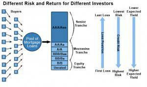

## Table of Contents

## What is senior security?

Senior security refers to a type of investment that has a higher priority for repayment compared to other investments. This means that if a company faces financial difficulties or goes bankrupt, the holders of senior securities get paid back before those who hold junior securities. Senior securities are often used in corporate finance and can include things like senior debt or senior bonds. Because they are less risky, senior securities usually have lower interest rates than junior securities.

In simple terms, think of senior security as being at the front of the line when it comes to getting money back. If a company has to pay back its debts, the people who own senior securities are the first ones to get their money. This makes senior securities a safer choice for investors who want to avoid big risks. However, because they are safer, they usually don't offer as high a return as riskier investments.

## Why is senior security important?

Senior security is important because it helps companies borrow money more easily. When a company needs to borrow money, it can offer senior securities to investors. These securities are safer for investors because they get paid back first if the company has trouble. This makes investors more willing to lend money to the company, even if it's a bit risky. So, senior securities help companies get the money they need to grow and do new projects.

Senior security is also important for investors who don't want to take big risks. Some people want to invest their money but don't want to lose it if the company they invest in has problems. Senior securities give these investors a safer option. They know that if the company goes bankrupt, they will get their money back before others. This makes senior securities a good choice for people who want to keep their money safe while still earning some interest.

## What are the basic types of senior security?

Senior security can come in different forms, but the two main types are senior debt and senior bonds. Senior debt is a loan that a company takes out, and it has to be paid back before other kinds of debt. This makes it safer for the lender because they get their money back first if the company has problems. Senior bonds are similar, but they are a way for a company to borrow money from lots of people at once. When you buy a senior bond, you are lending money to the company, and you get paid back before other bondholders if the company goes bankrupt.

Both senior debt and senior bonds are important because they help companies get money to grow and do new things. They are safer for investors because they get paid back first if something goes wrong. This makes more people willing to lend money to the company. But, because they are safer, senior securities usually don't offer as high a return as riskier investments. So, they are a good choice for people who want to keep their money safe while still earning some interest.

## How does senior security differ from other types of security?

Senior security is different from other types of security because it gets paid back first if a company has money problems. Think of it like being at the front of a line. If a company goes bankrupt, the people who own senior securities get their money before others. This makes senior securities safer than other types of security, like junior securities or common stock. Junior securities get paid after senior securities, and common stock is last in line. So, senior security is a safer choice for people who don't want to take big risks with their money.

Because senior securities are safer, they usually have lower interest rates than riskier securities. This means that people who buy senior securities might not make as much money as those who buy riskier securities. But, they are less likely to lose their money if the company has problems. So, senior securities are good for people who want to keep their money safe while still earning some interest. Other types of security, like junior securities or common stock, can offer higher returns, but they are riskier because they get paid back later if the company goes bankrupt.

## Can you provide examples of senior security measures in everyday life?

In everyday life, senior security can be seen in things like a home mortgage. When you take out a mortgage to buy a house, the bank gives you money and you promise to pay it back over time. If you can't pay back the mortgage, the bank can take your house. This is a kind of senior security because the bank gets paid back before anyone else if you have money problems. The bank is at the front of the line, so it's safer for them to lend you money.

Another example is when a business takes out a loan to buy new equipment. The loan is a senior security because if the business can't pay it back, the lender can take the equipment. This makes the loan safer for the lender because they get their money back before other people who might have lent money to the business. So, the lender is more willing to give the business the money it needs to grow.

## What are common threats to senior security?

Common threats to senior security come from things like when a company has too much debt or when the economy is not doing well. If a company borrows too much money, it might not be able to pay back its senior securities. This can happen if the company is not making enough money to cover all its debts. When the economy is bad, it can be harder for companies to make money, which can also make it harder for them to pay back their senior securities. So, too much debt and a bad economy are big threats to senior security.

Another threat to senior security is when a company makes bad choices or has problems with how it is run. If the people in charge of the company make bad decisions, like spending too much money on things that don't help the company grow, it can be hard for the company to pay back its senior securities. Also, if the company is not run well, it might not be able to make enough money to pay back its debts. So, bad decisions and poor management are also threats to senior security.

## How can seniors protect themselves from financial scams?

Seniors can protect themselves from financial scams by being careful about who they trust. They should not give out personal information, like their bank account numbers or social security numbers, to people they don't know well. If someone calls and says they need this information, seniors should hang up and call the company back using a number they know is safe. It's also a good idea to shred old bank statements and other papers with personal information on them, so no one can use them to steal their identity.

Another way seniors can stay safe from scams is by talking to someone they trust before making big financial decisions. This could be a family member, a friend, or a financial advisor. If someone is trying to get them to invest money or buy something, they should take their time and not feel rushed. Scammers often try to make people act quickly, so it's important to slow down and think things through. By being careful and getting advice from trusted people, seniors can keep their money safe from scammers.

## What technologies are available to enhance senior security?

There are many technologies that can help keep seniors safe. One example is medical alert systems. These are devices that seniors can wear, like a bracelet or a necklace. If they fall or need help, they can press a button and it will call for help right away. This can be very important if a senior lives alone and needs quick help. Another technology is smart home devices. These can include things like security cameras and smart locks. Seniors can use these to see who is at their door or to lock their doors from anywhere. This can help them feel safer in their own homes.

Another helpful technology is wearable health monitors. These are devices that seniors can wear to keep track of their heart rate, blood pressure, and other important health information. If something is wrong, the device can send an alert to a doctor or a family member. This can help seniors get the care they need quickly. Also, there are smartphone apps that can help seniors stay safe. These apps can send alerts if a senior leaves a safe area or if they need help. By using these technologies, seniors can feel more secure and get help when they need it.

## How do senior security rankings work and what do they measure?

Senior security rankings help investors understand how safe their investments are. They measure how likely it is that a company will be able to pay back its senior securities. The rankings look at things like how much debt the company has, how well it is making money, and how the economy is doing. If a company has a lot of debt and is not making much money, it might get a lower ranking because it could be harder for it to pay back its senior securities. On the other hand, if a company is doing well and has less debt, it might get a higher ranking because it is more likely to pay back its senior securities.

These rankings are important because they help investors decide if they want to buy senior securities from a company. If a company has a high ranking, investors might feel safer buying its senior securities because they think the company will be able to pay them back. But if a company has a low ranking, investors might be more careful because they think there is a bigger chance the company won't be able to pay them back. So, senior security rankings give investors a way to see how risky their investments might be.

## What are the best practices for implementing senior security in community settings?

In community settings, one of the best ways to implement senior security is by creating safe spaces where seniors feel protected and supported. This can be done by setting up regular safety checks and having community members look out for each other. For example, neighbors can agree to check on seniors living alone, especially during bad weather or after a fall. Also, having well-lit paths and secure locks on doors and windows can help keep seniors safe in their homes. Community centers can offer classes on how to stay safe from scams and how to use technology to get help quickly if needed.

Another important practice is to have good communication and emergency plans in place. Seniors should know who to call if they need help and how to reach them. It's helpful to have a list of emergency contacts and to make sure seniors have easy access to phones or medical alert systems. Community events can also be used to teach seniors about safety and to let them know about the resources available to them. By working together and making sure everyone knows the safety plans, the community can help keep its senior members secure and well-cared for.

## How can senior security be integrated into national security policies?

Senior security can be a part of national security policies by making sure older people are safe and protected. Governments can do this by setting up programs that help seniors stay safe at home and in their communities. For example, they can give money to help seniors fix their homes to make them safer, like adding ramps or better lighting. They can also create laws that protect seniors from scams and make sure they have access to medical help quickly if they need it. By doing these things, the government can help keep seniors safe, which is an important part of making the whole country safer.

Another way to include senior security in national security is by making sure seniors are not left out of emergency plans. During big events like natural disasters or pandemics, it's important that seniors get the help they need. Governments can make special plans for seniors, like having teams that check on them and make sure they have food, medicine, and a safe place to stay. By thinking about seniors in their national security plans, governments can make sure everyone in the country is taken care of, no matter their age.

## What are the future trends and innovations expected in the field of senior security?

In the future, we can expect to see more smart technology being used to keep seniors safe. Things like smart home devices and wearable health monitors will become even more advanced. These devices will be able to do more things, like automatically calling for help if a senior falls or if their health changes suddenly. They will also be easier to use, so seniors can feel more comfortable using them. This will help seniors live more independently and safely in their own homes.

Another trend we might see is more use of artificial intelligence (AI) to help with senior security. AI can be used to watch over seniors and notice if something is wrong, like if they are not moving around as much as usual. It can also help with things like reminding seniors to take their medicine or to eat healthy meals. By using AI, we can make sure seniors get the help they need quickly and stay safe and healthy. These innovations will make a big difference in how we take care of our older family members and friends.

## References & Further Reading

[1]: Bergstra, J., Bardenet, R., Bengio, Y., & Kégl, B. (2011). ["Algorithms for Hyper-Parameter Optimization."](https://dl.acm.org/doi/10.5555/2986459.2986743) Advances in Neural Information Processing Systems 24.

[2]: ["Advances in Financial Machine Learning"](https://www.amazon.com/Advances-Financial-Machine-Learning-Marcos/dp/1119482089) by Marcos Lopez de Prado

[3]: ["Evidence-Based Technical Analysis: Applying the Scientific Method and Statistical Inference to Trading Signals"](https://www.amazon.com/Evidence-Based-Technical-Analysis-Scientific-Statistical/dp/0470008741) by David Aronson

[4]: Fabozzi, Frank J. (2007). ["Bond Markets, Analysis, and Strategies,"](https://books.google.com/books/about/Bond_Markets_Analysis_and_Strategies_ten.html?id=bQpNEAAAQBAJ) 7th Edition. Upper Saddle River, NJ: Prentice Hall.

[5]: ["Quantitative Trading: How to Build Your Own Algorithmic Trading Business"](https://github.com/LucindaYa/quant-resources/blob/master/Quantitative%20Trading%20How%20to%20Build%20Your%20Own%20Algorithmic%20Trading%20Business.pdf) by Ernest P. Chan