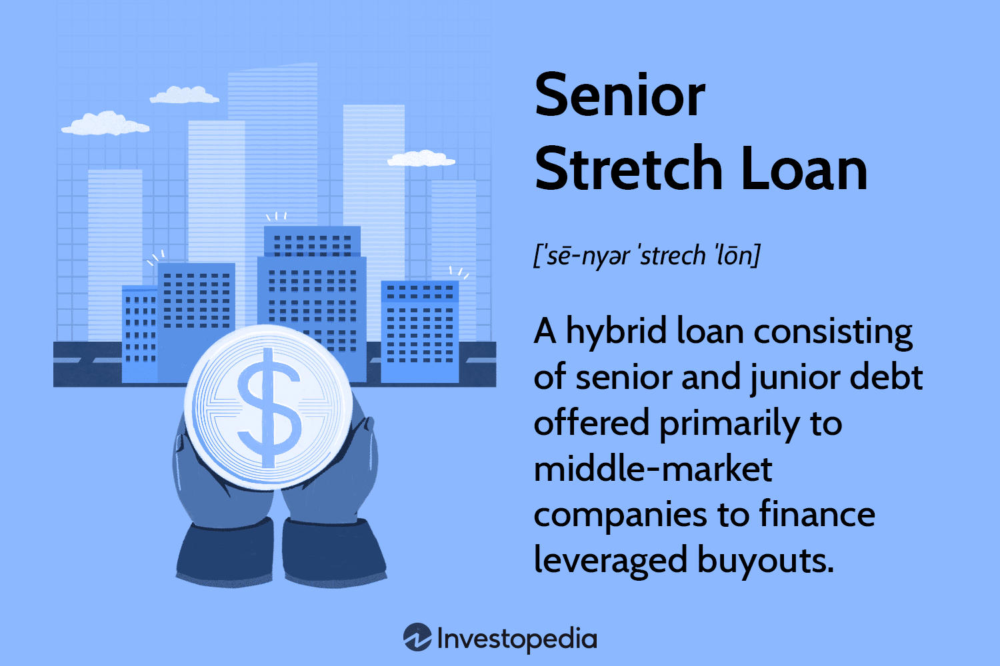

## Table of Contents

## What is a Senior Stretch Loan?

A Senior Stretch Loan is a type of financing that combines elements of both senior debt and subordinated debt. It is called a "stretch" loan because it stretches beyond traditional senior debt by including a portion that would typically be considered mezzanine or junior debt. This type of loan is often used by companies that need more capital than what a traditional senior loan can provide but want to avoid the higher costs and risks associated with mezzanine financing.

Senior Stretch Loans are attractive to borrowers because they offer a single loan package that can meet larger financing needs while still maintaining a lower overall cost of capital compared to separate senior and mezzanine loans. For lenders, these loans provide an opportunity to offer more comprehensive financing solutions to their clients, potentially increasing their business. However, because Senior Stretch Loans include riskier elements, they often come with higher interest rates and stricter covenants than standard senior loans.

## How does a Senior Stretch Loan work?

A Senior Stretch Loan works by giving a company more money than a regular senior loan would. It's like a mix of two types of loans: a senior loan, which is safer and cheaper, and a mezzanine loan, which is riskier and more expensive. When a company needs more money than a senior loan can provide but doesn't want to pay the high costs of a mezzanine loan, they can get a Senior Stretch Loan. This loan stretches the amount of money they can borrow by including some of the riskier parts of a mezzanine loan but keeps the overall cost lower than if they had two separate loans.

The way it works is simple. The company gets one big loan that covers what they need. Part of this loan acts like a senior loan, so it's safer for the lender and cheaper for the borrower. The other part is like a mezzanine loan, which is riskier but helps the company get the extra money they need. Because it includes this riskier part, the whole loan might have a higher interest rate than a regular senior loan, and the company might have to follow stricter rules. But it's still usually cheaper and easier than getting two separate loans.

## Who typically uses Senior Stretch Loans?

Companies that need more money than a regular loan can give them often use Senior Stretch Loans. These companies might be growing fast or buying another business. They want to borrow more money but don't want to pay the high costs of other types of loans like mezzanine loans. So, a Senior Stretch Loan helps them get the money they need without spending too much on interest.

These loans are popular with middle-sized businesses that are doing well but need extra cash to keep growing. They are also used by companies that are in the middle of big projects or changes, like expanding their business or making big upgrades. Senior Stretch Loans give these companies a way to get the money they need in one loan, which is simpler and often cheaper than getting several different loans.

## What are the key features of a Senior Stretch Loan?

A Senior Stretch Loan is a special type of loan that helps companies get more money than a regular loan would give them. It's like a mix of two loans: a safer, cheaper senior loan and a riskier, more expensive mezzanine loan. Companies use Senior Stretch Loans when they need more money than a regular loan can provide but don't want to pay the high costs of a mezzanine loan. This loan stretches the amount of money they can borrow by including some riskier parts but keeps the overall cost lower than if they had two separate loans.

The key features of a Senior Stretch Loan include a single loan package that meets larger financing needs. This makes it simpler for the company because they only have to deal with one loan instead of two. The loan has a lower overall cost of capital compared to getting separate senior and mezzanine loans. However, because it includes riskier elements, it often comes with higher interest rates and stricter rules than a regular senior loan. This type of loan is often used by growing middle-sized businesses or companies that are in the middle of big projects or changes.

## How does a Senior Stretch Loan differ from traditional senior debt?

A Senior Stretch Loan is different from traditional senior debt because it gives a company more money than a regular senior loan would. Traditional senior debt is safer and cheaper, but it only covers a certain amount of money. A Senior Stretch Loan, on the other hand, stretches beyond this by including some riskier parts that are usually found in mezzanine loans. This means a company can borrow more money with a Senior Stretch Loan than they could with just a traditional senior loan.

Because a Senior Stretch Loan includes these riskier parts, it usually has a higher interest rate and comes with stricter rules than traditional senior debt. However, it's still cheaper and easier for the company than getting two separate loans - a senior loan and a mezzanine loan. Companies that need more money than a regular loan can provide, but don't want to pay the high costs of a mezzanine loan, find Senior Stretch Loans helpful. These loans are often used by growing middle-sized businesses or companies in the middle of big projects or changes.

## What are the advantages of using a Senior Stretch Loan for a borrower?

A Senior Stretch Loan offers several advantages for borrowers. One big benefit is that it provides more money than a regular senior loan. This means a company can get the extra cash it needs for growth or big projects without having to get a separate, more expensive loan. It's like getting a bigger loan in one package, which makes things simpler and easier to manage.

Another advantage is that a Senior Stretch Loan can be cheaper than getting two separate loans. Even though it includes some riskier parts, the overall cost is lower than if a company had to get a senior loan and a mezzanine loan. This helps the company save money on interest and makes it easier to plan their finances. So, a Senior Stretch Loan helps companies get the money they need in a way that's both simple and cost-effective.

## What are the potential disadvantages or risks associated with Senior Stretch Loans?

One potential disadvantage of using a Senior Stretch Loan is that it comes with higher interest rates than a traditional senior loan. Because a Senior Stretch Loan includes riskier parts that are usually found in mezzanine loans, lenders charge more to cover that extra risk. This means the company has to pay more money over time, which can affect their budget and financial planning.

Another risk is that Senior Stretch Loans come with stricter rules or covenants than regular senior loans. These rules can limit what the company can do with the money or how they run their business. If the company doesn't follow these rules, they might have to pay penalties or even face the loan being called in early. This can put extra pressure on the company and make it harder for them to grow or make changes.

## How is the interest rate determined for a Senior Stretch Loan?

The interest rate for a Senior Stretch Loan is determined by looking at different things. Lenders think about how risky the loan is because it includes parts that are usually in mezzanine loans. These parts are riskier, so the interest rate goes up to cover that extra risk. Lenders also look at the company's credit history and how well they have paid back loans before. If the company has a good track record, the interest rate might be lower. But if the company has had problems paying back loans, the rate will be higher.

Another thing that affects the interest rate is the overall market conditions. If interest rates are high in the market, the rate for a Senior Stretch Loan will be high too. Lenders also think about how much money the company is borrowing and for how long. A bigger loan or a longer time to pay it back can mean a higher interest rate. All these things together help lenders decide on the right interest rate for a Senior Stretch Loan.

## What are the typical repayment terms for a Senior Stretch Loan?

The repayment terms for a Senior Stretch Loan can vary, but they usually last from three to seven years. This means the company has to pay back the loan over this time. The loan might have a fixed interest rate, which stays the same, or a floating rate, which can change. If it's a floating rate, it might go up or down based on market conditions. The company makes regular payments, which include both the interest and some of the loan amount, until the whole loan is paid off.

Sometimes, a Senior Stretch Loan can have a balloon payment at the end. This means the company pays back most of the loan in one big payment at the end of the term. This can help the company manage its cash flow better during the loan period because the regular payments are smaller. But it also means they need to have enough money saved up or another plan to pay the big payment at the end. Lenders might also set up rules, called covenants, that the company has to follow during the loan term. If the company doesn't follow these rules, it could affect the repayment terms or even make the loan due right away.

## How does the underwriting process for a Senior Stretch Loan differ from other loans?

The underwriting process for a Senior Stretch Loan is a bit different from other loans because it mixes parts of both senior and mezzanine loans. When a lender looks at a Senior Stretch Loan, they check the company's credit history and financial health, just like with any loan. But they also pay close attention to the extra risk that comes from the mezzanine part of the loan. This means they might ask for more detailed financial information and do a deeper analysis to make sure the company can handle the bigger loan and the higher interest rate.

Lenders also look at the company's plans for using the money and how they will pay it back. Because a Senior Stretch Loan is bigger and riskier, the lender wants to be sure the company has a solid plan. They might set stricter rules, called covenants, that the company has to follow. These rules can be about how the company spends the money or how it manages its finances. If the company doesn't follow these rules, it could affect the loan terms or even make the loan due right away. So, the underwriting process for a Senior Stretch Loan is more thorough and detailed than for a regular loan.

## What are the covenants and conditions typically attached to a Senior Stretch Loan?

Covenants and conditions for a Senior Stretch Loan are rules that the company has to follow while they have the loan. These rules are stricter than those for regular senior loans because a Senior Stretch Loan includes riskier parts. Common covenants include keeping certain financial ratios, like debt-to-equity or interest coverage ratios, within set limits. This means the company has to make sure their debt isn't too high compared to their equity, and they can cover their interest payments. Another common rule is that the company can't take on more debt without the lender's permission. This helps the lender make sure the company doesn't get into more financial trouble.

Other conditions might include regular financial reporting, where the company has to show the lender their financial statements on a set schedule. This helps the lender keep an eye on the company's financial health. The company might also have to meet certain performance targets, like hitting specific revenue or profit goals. If the company doesn't follow these covenants and conditions, it could face penalties, higher interest rates, or even have the loan called in early. These rules help protect the lender but can put extra pressure on the company to manage their finances carefully.

## How have Senior Stretch Loans evolved in the financial market over the past decade?

Over the past decade, Senior Stretch Loans have become more popular in the financial market. They started as a way for companies to get more money than a regular senior loan could give them, but without the high costs of a mezzanine loan. As more companies looked for ways to grow without spending too much on interest, lenders saw a chance to offer these loans. This made Senior Stretch Loans more common, especially for middle-sized businesses that needed extra cash for big projects or to buy other companies.

In the last few years, the rules and conditions for Senior Stretch Loans have also changed. Lenders have become more careful because these loans are riskier. They started adding stricter rules, called covenants, to make sure companies could handle the bigger loan and higher interest rates. Even with these changes, Senior Stretch Loans are still a good choice for companies that need more money than a regular loan can provide but want to keep costs down. They offer a simple way for companies to get the money they need in one loan package, which is easier to manage than getting two separate loans.

## How does a Senior Stretch Loan work?

Senior stretch loans are a sophisticated financial solution designed to meet the comprehensive funding needs of borrowers by integrating both senior and junior debt into one cohesive package. This hybrid structure eliminates the need to separately negotiate and manage different loan components, thereby streamlining the borrowing process. The distinctive feature of senior stretch loans is their configurability to encompass a broader range of financial requirements than traditional senior loans, often extending or "stretching" to accommodate greater leverage needs.

One of the inherent characteristics of senior stretch loans is the elevated risk compared to conventional senior loans. This increased risk primarily stems from the blend of junior or subordinated debt, which typically carries a higher risk of default. Consequently, lenders require compensation for this added risk through higher interest rates. The [interest rate](/wiki/interest-rate-trading-strategies) on a senior stretch loan can be depicted as:

$$
\text{Interest Rate} = \text{Base Rate} + \text{Risk Premium}
$$

Where:
- $\text{Base Rate}$ refers to the standard interest rate applied to senior debt.
- $\text{Risk Premium}$ accounts for the additional risk due to the inclusion of subordinated debt.

Despite the higher interest costs, the major advantage for borrowers lies in the speed and convenience offered by senior stretch loans. Traditional financing mechanisms necessitate the separate arrangement of senior and junior debt, often under different terms and conditions. This requires significant time and effort in negotiating and aligning the various elements of the financial package. In contrast, a senior stretch loan provides an integrative solution that simplifies documentation and eases the negotiation process.

However, this convenience and expedited access to capital come with added responsibility. Lenders face increased leverage exposure, meaning that they assume a higher level of financial risk should the borrower's ability to repay come into question. This necessitates careful assessment and underwriting by lenders to manage potential exposure effectively.

In summary, senior stretch loans offer a compelling alternative to traditional financing by integrating multiple debt layers into a single package. While they offer significant benefits in terms of speed and simplicity, both lenders and borrowers must carefully consider the associated risks and potential costs.

## What is the difference between the Loan Mechanism of Senior Stretch and Other Loans?

Senior stretch loans provide financial leverage by combining features of senior and subordinated debt. This hybrid approach offers borrowers an integrated financial package, potentially allowing access to higher leverage ratios and fostering financial flexibility. By contrast, traditional loans typically involve separate negotiations for senior and junior components, which may limit the borrower's ability to maximize leverage efficiently.

The unique structure of senior stretch loans can result in a higher leverage ratio, defined as:

$$
\text{Leverage Ratio} = \frac{\text{Total Debt}}{\text{Equity}}
$$

This higher ratio can benefit companies seeking to expand or manage buyouts without the need for separate senior and junior debt negotiations. This consolidation often results in reduced documentation and legal complexities, providing further cost advantages to the borrower.

In comparison to reverse mortgages, which are traditionally used by individuals to access home equity as cash flows without requiring repayment until the home is sold or the borrower passes away, senior stretch loans serve a more corporate focus, targeting business financing needs. Reverse mortgages are generally low-risk for the borrower, offering security for life post-retirement; however, they typically do not involve leveraging equity for growth, which is a central aspect of senior stretch loans.

The key distinction between senior stretch loans and other loan types lies in their ability to support higher leverage and potential growth while balancing risk. Traditional loans, for instance, offer stability and low-risk parameters but may limit strategic financial maneuvering due to less flexibility in leverage terms. 

The understanding of these diverse mechanisms is critical for businesses and individuals seeking to enhance their financial strategies. By evaluating and selecting loan structures that align with specific financial objectives and risk tolerance, borrowers can optimize their capital management and achieve desired financial outcomes.

## References & Further Reading

[1]: Berger, A. N., & Udell, G. F. (1998). ["The Economics of Small Business Finance: The Roles of Private Equity and Debt Markets in the Financial Growth Cycle."](https://www.sciencedirect.com/science/article/pii/S0378426698000387) Journal of Banking & Finance.

[2]: Bartram, S. M., Brown, G., & Conrad, J. (2011). ["The Effects of Derivatives on Firm Risk and Value."](https://web-docs.stern.nyu.edu/salomon/docs/conferences/bartram_brown_conrad.pdf) Journal of Financial and Quantitative Analysis.

[3]: Lopez de Prado, M. (2018). ["Advances in Financial Machine Learning."](https://www.amazon.com/Advances-Financial-Machine-Learning-Marcos/dp/1119482089) John Wiley & Sons.

[4]: Chan, E. P. (2008). ["Quantitative Trading: How to Build Your Own Algorithmic Trading Business."](https://github.com/egorpe/EPChan-QuantitativeTrading/blob/master/example7_6.m) John Wiley & Sons.

[5]: Aronson, D. R. (2006). ["Evidence-Based Technical Analysis: Applying the Scientific Method and Statistical Inference to Trading Signals."](https://www.amazon.com/Evidence-Based-Technical-Analysis-Scientific-Statistical/dp/0470008741) John Wiley & Sons.