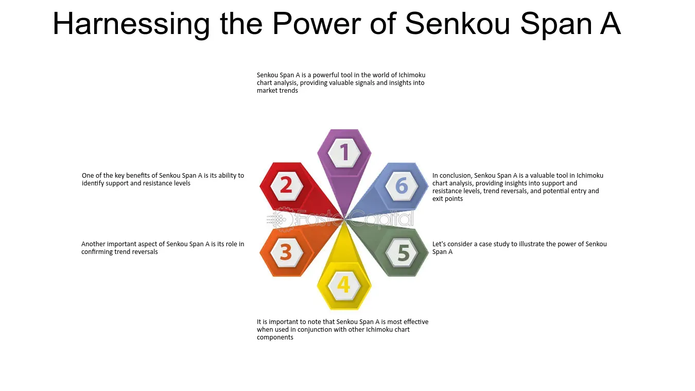

## Table of Contents

## What is Senkou Span A in technical analysis?

Senkou Span A is a part of the Ichimoku Cloud, which is a technical analysis tool used in trading. It is one of the two lines that form the "cloud" in the Ichimoku chart. To calculate Senkou Span A, you take the average of the Tenkan-sen (the conversion line) and the Kijun-sen (the base line), and then plot this average 26 periods ahead on the chart. This line helps traders see where the market might be heading in the future.

The Senkou Span A, along with Senkou Span B, creates the cloud on the Ichimoku chart. The cloud's color changes based on which line is higher. If Senkou Span A is above Senkou Span B, the cloud is usually colored green, suggesting a bullish trend. If Senkou Span B is above Senkou Span A, the cloud turns red, indicating a bearish trend. Traders use the position and color of the cloud to make decisions about buying or selling assets.

## How is Senkou Span A calculated?

Senkou Span A is a part of the Ichimoku Cloud, a tool used in trading to predict future price movements. It's calculated by taking the average of two other lines from the Ichimoku system: the Tenkan-sen and the Kijun-sen. The Tenkan-sen is the average of the highest high and the lowest low over the last 9 periods, while the Kijun-sen is the average of the highest high and the lowest low over the last 26 periods.

Once you have the values of the Tenkan-sen and the Kijun-sen, you add them together and divide by two to get the Senkou Span A value. This value is then plotted on the chart, but it's moved forward by 26 periods. This forward plotting helps traders see where the market might be heading in the future, making it a useful tool for predicting trends.

## What is the significance of Senkou Span A in the Ichimoku Cloud?

Senkou Span A is an important part of the Ichimoku Cloud, a tool traders use to predict where prices might go. It's made by averaging two other lines called Tenkan-sen and Kijun-sen, and then moving this average 26 periods into the future on the chart. This helps traders see where the market might be heading before it happens, which is really useful for making trading decisions.

The Senkou Span A, along with another line called Senkou Span B, makes up the cloud on the Ichimoku chart. The cloud changes color based on which line is on top. If Senkou Span A is above Senkou Span B, the cloud turns green, which usually means the market is going up. If Senkou Span B is above Senkou Span A, the cloud turns red, suggesting the market might go down. By looking at the color and position of the cloud, traders can decide when to buy or sell.

## How does Senkou Span A differ from Senkou Span B?

Senkou Span A and Senkou Span B are both parts of the Ichimoku Cloud, but they are calculated differently and serve different roles. Senkou Span A is made by averaging the Tenkan-sen and Kijun-sen, which are two other lines in the Ichimoku system. This average is then moved forward 26 periods on the chart. This line helps traders see where the market might be heading in the future because it's based on recent price movements.

Senkou Span B, on the other hand, is calculated by finding the average of the highest high and the lowest low over the last 52 periods. Like Senkou Span A, this value is also moved forward, but it's shifted 26 periods into the future just like Senkou Span A. Senkou Span B gives a longer-term view of the market because it uses data from a longer period.

Together, Senkou Span A and Senkou Span B form the cloud on the Ichimoku chart. The cloud's color changes based on which line is higher. If Senkou Span A is above Senkou Span B, the cloud is usually green, suggesting a bullish trend. If Senkou Span B is above Senkou Span A, the cloud turns red, indicating a bearish trend. This difference in calculation and the interaction between the two lines help traders understand both short-term and long-term market trends.

## What does Senkou Span A indicate about future price movements?

Senkou Span A helps traders guess where the market might go in the future. It's made by mixing two other lines, Tenkan-sen and Kijun-sen, and then moving this mix 26 periods ahead on the chart. This forward-looking line shows traders what the market might do before it happens, which is really helpful for making decisions about buying or selling.

When you look at Senkou Span A with another line called Senkou Span B, they make a cloud on the chart. The color of the cloud tells traders if the market might go up or down. If Senkou Span A is above Senkou Span B, the cloud turns green, which means the market might be going up. If Senkou Span B is above Senkou Span A, the cloud turns red, suggesting the market might go down. By watching the cloud's color and where it's going, traders can get a good idea of future price movements.

## How can Senkou Span A be used to identify support and resistance levels?

Senkou Span A can help traders figure out where the market might find support or resistance. Support is like a floor where the price might stop going down, and resistance is like a ceiling where the price might stop going up. When the price is below the cloud made by Senkou Span A and Senkou Span B, the top edge of the cloud, which is often Senkou Span A, can act as a resistance level. This means the price might have a hard time going above this line. On the other hand, if the price is above the cloud, the bottom edge of the cloud, which could be Senkou Span A, can act as a support level, helping to keep the price from falling too much.

Traders use these levels to make decisions about when to buy or sell. If the price gets close to the top of the cloud and seems like it can't go higher, traders might think about selling because the price might start to go down. If the price gets near the bottom of the cloud and seems like it can't go lower, traders might think about buying because the price might start to go up again. By watching how the price interacts with Senkou Span A, traders can get a better idea of where the market might turn around.

## What are common trading strategies involving Senkou Span A?

One common trading strategy involving Senkou Span A is to use it to find good times to buy or sell. Traders look at where the price is compared to the cloud made by Senkou Span A and Senkou Span B. If the price is below the cloud and it starts to move up towards Senkou Span A, traders might see this as a sign to buy. They think the price might keep going up and break through the resistance at the top of the cloud. On the other hand, if the price is above the cloud and starts to move down towards Senkou Span A, traders might see this as a sign to sell. They think the price might keep going down and find support at the bottom of the cloud.

Another strategy is to use Senkou Span A to confirm trends. If the price is above the cloud and Senkou Span A is moving up, traders might feel more sure that the market is in a strong uptrend. This could make them want to buy more or hold onto what they have. If the price is below the cloud and Senkou Span A is moving down, traders might feel more sure that the market is in a strong downtrend. This could make them want to sell or avoid buying. By watching how Senkou Span A moves, traders can get a better idea of whether the market is likely to keep going in the same direction or if it might change soon.

## How does the position of the price relative to Senkou Span A affect trading decisions?

When the price of a stock or asset is below the cloud formed by Senkou Span A and Senkou Span B, traders watch closely to see if the price moves up towards Senkou Span A. If it does, they might see this as a good time to buy. They think the price might keep going up and break through the top of the cloud, which is often Senkou Span A. This could mean the market is getting ready to go up, so buying could be a good move. On the other hand, if the price is above the cloud and starts moving down towards Senkou Span A, traders might see this as a good time to sell. They think the price might keep going down and find support at the bottom of the cloud, which could be Senkou Span A. This could mean the market is getting ready to go down, so selling could be a good move.

The position of the price relative to Senkou Span A also helps traders confirm if the market is in a strong trend. If the price is above the cloud and Senkou Span A is moving up, traders might feel more sure that the market is in a strong uptrend. This could make them want to buy more or hold onto what they have, expecting the price to keep going up. If the price is below the cloud and Senkou Span A is moving down, traders might feel more sure that the market is in a strong downtrend. This could make them want to sell or avoid buying, expecting the price to keep going down. By watching how the price moves compared to Senkou Span A, traders can make better decisions about when to buy or sell.

## Can Senkou Span A be used effectively in different market conditions?

Senkou Span A can be used in different market conditions, but it works best in markets that move in trends. When the market is going up or down steadily, Senkou Span A helps traders see where the price might go next. It's part of the Ichimoku Cloud, which shows a future area where the price might find support or resistance. If the market is in a clear uptrend and the price is above the cloud, traders might use Senkou Span A to decide when to buy more or hold onto their investments. In a downtrend, if the price is below the cloud, Senkou Span A can help traders decide when to sell or avoid buying.

In markets that move sideways or are very choppy, using Senkou Span A can be trickier. These markets don't have a clear direction, so the cloud might give confusing signals. Traders might see the price moving above and below the cloud a lot, making it hard to tell if it's a good time to buy or sell. Still, some traders use Senkou Span A to spot small trends within the sideways market or to find short-term trading opportunities. They look for moments when the price breaks through Senkou Span A to decide on quick trades. So, while Senkou Span A is most useful in trending markets, it can still offer some help in other conditions if used carefully.

## How does the time frame affect the interpretation of Senkou Span A?

The time frame you use on your chart can change how you see Senkou Span A. If you use a short time frame like a 15-minute chart, Senkou Span A will show you quick changes in the market. It can help you find short-term trends and make fast trading decisions. But because it moves quickly, it might give you more signals, and some of them could be wrong or not very important.

On the other hand, if you use a longer time frame like a daily or weekly chart, Senkou Span A will show you bigger, slower trends. It can help you see where the market might go over days or weeks. This can be good for making longer-term trading decisions. The signals you get from Senkou Span A on a longer time frame might be fewer, but they are usually more important and more reliable. So, choosing the right time frame depends on what kind of trading you want to do.

## What are the limitations and potential pitfalls of using Senkou Span A in trading?

Using Senkou Span A can be tricky because it's not perfect. One big problem is that it can give you wrong signals, especially in markets that move up and down a lot without a clear direction. When the market is not going up or down steadily, Senkou Span A might tell you to buy or sell when it's not a good time. This can make you lose money if you follow these signals without thinking more about what the market is really doing. Also, because Senkou Span A is part of the Ichimoku Cloud, it works best when you use it with other parts of the system and other tools. If you only look at Senkou Span A, you might miss important information that could help you make better trading decisions.

Another limitation is that Senkou Span A can be hard to use if you don't pick the right time frame for your chart. If you use a short time frame, Senkou Span A might move a lot and give you too many signals, some of which could be wrong. If you use a long time frame, it might not move enough to help you make quick trades. It's important to choose a time frame that fits your trading style and goals. Also, Senkou Span A is based on past prices, so it can't predict the future perfectly. The market can change suddenly because of news or other things that Senkou Span A can't see coming. So, it's good to use Senkou Span A along with other tools and always be careful about the risks in trading.

## How can Senkou Span A be integrated with other technical indicators for enhanced analysis?

Senkou Span A can be used with other technical indicators to make better trading choices. For example, you can use it with the Relative Strength Index (RSI). The RSI helps you see if a stock is overbought or oversold. If the price is above the cloud and Senkou Span A is moving up, but the RSI shows the stock is overbought, you might want to be careful about buying more. On the other hand, if the price is below the cloud and Senkou Span A is moving down, but the RSI shows the stock is oversold, it might be a good time to buy.

Another useful indicator to use with Senkou Span A is the Moving Average Convergence Divergence (MACD). The MACD helps you see the strength of a trend and when it might change. If the price is above the cloud and Senkou Span A is moving up, and the MACD also shows a strong uptrend, you might feel more sure about buying or holding onto your investments. If the price is below the cloud and Senkou Span A is moving down, and the MACD shows a strong downtrend, it might be a good time to sell or avoid buying. By combining Senkou Span A with other indicators, you can get a fuller picture of what the market might do next.

## What is the Ichimoku Cloud and how can it be understood?

The Ichimoku Cloud, formally known as Ichimoku Kinko Hyo, is a comprehensive technical analysis tool designed to provide insights into potential future price movements of financial assets. Developed by Japanese journalist Goichi Hosoda in the late 1930s, the system combines multiple indicators into a single chart, allowing traders to assess trend direction, momentum, and potential support and resistance levels at a glance. After three decades of fine-tuning and testing, Hosoda's technique was published in 1969, quickly becoming popular among Japanese traders and eventually gaining international recognition.

The Ichimoku Cloud consists of five key components, each serving distinct functions, which collectively provide a broader perspective compared to traditional technical analysis tools. These components are:

1. **Tenkan Sen (Conversion Line):** Calculated as the average of the highest high and the lowest low over the past nine periods, the Tenkan Sen is used to gauge short-term momentum. Its formula is:
$$
   \text{Tenkan Sen} = \frac{(\text{Highest High} + \text{Lowest Low})}{2}

$$

2. **Kijun Sen (Base Line):** Functioning as an indicator of medium-term momentum, the Kijun Sen is the average of the highest high and the lowest low over the past 26 periods. The formula is:
$$
   \text{Kijun Sen} = \frac{(\text{Highest High} + \text{Lowest Low})}{2}

$$

3. **Chikou Span (Lagging Span):** The current period's closing price plotted 26 periods back on the chart. It helps traders visualize how current prices compare to those in the past and can be indicative of trend strength.

4. **Senkou Span A (Leading Span A):** This is the average of the Tenkan Sen and Kijun Sen plotted 26 periods into the future, creating one of the cloud boundaries. It is expressed as:
$$
   \text{Senkou Span A} = \frac{(\text{Tenkan Sen} + \text{Kijun Sen})}{2}

$$

5. **Senkou Span B (Leading Span B):** The average of the highest high and the lowest low over the past 52 periods, also plotted 26 periods ahead. The formula is:
$$
   \text{Senkou Span B} = \frac{(\text{Highest High} + \text{Lowest Low})}{2}

$$

The space between Senkou Span A and Senkou Span B forms the Ichimoku "Cloud," or Kumo, which changes shape based on price movement, signaling potential support and resistance zones. If Senkou Span A is above Span B, the cloud is typically green, indicating potential bullish conditions. Conversely, if Span B is above Span A, the cloud is red, possibly hinting at bearish conditions.

The Ichimoku Cloud's strength lies in its holistic approach, combining trend identification, support and resistance levels, and [momentum](/wiki/momentum) insights into a single chart. It remains a valuable tool for traders worldwide, particularly in [algorithmic trading](/wiki/algorithmic-trading) strategies, where it aids in the creation of rule-based systems that capitalize on predictable price movements.

## What is Senkou Span A and how does it work?

Senkou Span A, an essential component of the Ichimoku Cloud, plays a vital role in technical analysis by helping traders assess potential support and resistance levels. Within the Ichimoku Cloud, Senkou Span A serves as one of the boundary lines that form the cloud structure, offering insights into potential market trends.

Senkou Span A is calculated using the conversion line (Tenkan Sen) and the baseline (Kijun Sen) by averaging them over a specified period. Mathematically, it can be expressed as:

$$
\text{Senkou Span A} = \frac{\text{Conversion Line} + \text{Base Line}}{2}
$$

To calculate Senkou Span A, the following steps are taken:

1. **Determine Conversion Line (Tenkan Sen):** The midpoint of the highest high and lowest low over the past 9 periods.
2. **Compute Base Line (Kijun Sen):** The midpoint of the highest high and lowest low over the past 26 periods.
3. **Calculate Senkou Span A:** The average of the conversion line and baseline, projected 26 periods into the future.

This calculation implies that Senkou Span A represents the average price behavior, providing an advanced visual representation of future support and resistance levels by plotting it forward on the chart. Its predictive nature allows traders to anticipate these critical levels, offering them better guidance on potential price reversals or trend continuations.

Senkou Span A functions by providing a delineation between potential bullish and bearish market conditions. When the current price remains above Senkou Span A, it may indicate a bullish market sentiment, suggesting that the level could act as support. Conversely, if the price is below Senkou Span A, it may suggest bearish conditions, potentially serving as a resistance point. This capability of Senkou Span A to predict support and resistance levels makes it a valuable tool for traders looking to navigate ever-changing market conditions effectively.

## How do you calculate Senkou Span A?

Calculating Senkou Span A involves a clear process centered around determining the conversion line (Tenkan Sen) and the base line (Kijun Sen) from historical price data. The focus ultimately extends to plotting this component 26 periods ahead to provide insights on future market dynamics.

**Step-by-Step Calculation Guide:**

1. **Determine the Conversion Line (Tenkan Sen):**
   - The conversion line averages the highest high and the lowest low over the past 9 periods. It can be calculated using:
$$
   \text{Tenkan Sen} = \frac{(\text{Highest High}_{9} + \text{Lowest Low}_{9})}{2}

$$
   This line represents short-term market sentiment.

2. **Determine the Base Line (Kijun Sen):**
   - The base line averages the highest high and the lowest low over the past 26 periods:
$$
   \text{Kijun Sen} = \frac{(\text{Highest High}_{26} + \text{Lowest Low}_{26})}{2}

$$
   This represents medium-term market sentiment.

3. **Calculate Senkou Span A:**
   - Senkou Span A, the first boundary of the Kumo, or "Cloud," is calculated by averaging the conversion line (Tenkan Sen) and the baseline (Kijun Sen):
$$
   \text{Senkou Span A} = \frac{(\text{Tenkan Sen} + \text{Kijun Sen})}{2}

$$
   This figure is then plotted 26 periods in the future, offering a predictive view of potential support and resistance levels.

4. **Using Historical Data:**
   - Historical data is vital in computing Senkou Span A. A minimum dataset of at least 26 periods is necessary to initially calculate and project the lines. More extended historical data enhances accuracy and reliability.

5. **Plotting 26 Periods Forward:**
   - By advancing the plot of Senkou Span A 26 periods into the future, it anticipates potential future support and resistance zones. This forward-looking nature distinguishes the Ichimoku system, making it useful for predictive analyses.

**Example in Python:**

To illustrate the calculation, Python code can automate these computations:

```python
import pandas as pd
import numpy as np

# Sample data: 'high' and 'low' are lists or arrays of historical high and low prices
data = pd.DataFrame({'high': high, 'low': low})

# Calculate Tenkan Sen
data['Tenkan_Sen'] = (data['high'].rolling(window=9).max() + data['low'].rolling(window=9).min()) / 2

# Calculate Kijun Sen
data['Kijun_Sen'] = (data['high'].rolling(window=26).max() + data['low'].rolling(window=26).min()) / 2

# Calculate Senkou Span A
data['Senkou_Span_A'] = (data['Tenkan_Sen'] + data['Kijun_Sen']) / 2

# Shift Senkou Span A 26 periods forward
data['Senkou_Span_A'] = data['Senkou_Span_A'].shift(26)

# Print the last few rows of data to see the calculation
print(data.tail())
```

This process allows traders to anticipate price movements, using Senkou Span A as a dynamic predictor of support and resistance, enhancing their strategic trading decisions within algorithmic frameworks.

## What are the differences between Senkou Span A and Simple Moving Averages?

Senkou Span A and simple moving averages (SMA) are both integral components in technical analysis, yet they serve distinct roles due to differences in their calculation, plotting, and predictive capabilities.

**Differences in Calculation and Plotting:**

Senkou Span A is part of the Ichimoku Cloud and is specifically calculated as the average of the Tenkan Sen (Conversion Line) and Kijun Sen (Base Line). Mathematically, it is expressed as:

$$
\text{Senkou Span A} = \frac{\text{Tenkan Sen} + \text{Kijun Sen}}{2}
$$

The result is plotted 26 periods ahead of the current price, which provides a forward-looking feature unique to the Ichimoku system.

In contrast, a simple moving average (SMA) is calculated by summing the closing prices of an asset over a specific period and then dividing by the number of periods. For example, a 10-period SMA is calculated as:

$$
\text{SMA} = \frac{\sum_{i=1}^{n} \text{Closing Price}_i}{n}
$$

where $n$ represents the number of periods. SMAs are plotted at the current time period without any forward projection, making them purely retrospective indicators.

**Predictive Nature of Senkou Span A:**

The forward plotting of Senkou Span A distinguishes it from the traditional SMA by providing predictive insights. By projecting 26 periods into the future, Senkou Span A, along with Senkou Span B, creates the Ichimoku Cloud, signaling potential support and resistance levels. These levels can help traders anticipate market movements before they happen, offering a proactive approach to visualizing future price support and resistance.

Senkou Span A's predictive advantage is enhanced when it interacts with Senkou Span B. When Span A is above Span B, the cloud is considered bullish, suggesting future support; conversely, when Span A is below Span B, it indicates bearish momentum and potential resistance. This forward-looking aspect allows traders to anticipate price movements rather than react to them only after they occur, as is the case with SMAs.

Simple moving averages, however, provide smoothed historical data, which is helpful for identifying trends after they have started but lacks the foresight present in Senkou Span A's forward projection. SMAs are often used to confirm trend directions rather than predict them, making them more useful in conjunction with other indicators that offer a current assessment of market conditions.

In practical trading scenarios, Senkou Span A's predictive nature can offer strategic insight, especially when combined with other timeframes and indicators, catering to both short-term and long-term trading strategies. This quality underscores Senkou Span A's distinctive role in technical analysis as a tool that doesn't only reflect past trends but also projects future possibilities on the price chart.

## References & Further Reading

[1]: ["Ichimoku Charts: An Introduction to Ichimoku Kinko Clouds"](https://www.amazon.com/Ichimoku-Charts-Introduction-Kinko-Clouds/dp/0857196081) by Nicole Elliott

[2]: ["Trading with Ichimoku Clouds: The Essential Guide to Ichimoku Kinko Hyo Technical Analysis"](https://www.amazon.com/Trading-Ichimoku-Clouds-Essential-Technical/dp/0470609931) by Manesh Patel

[3]: Pring, M. J. (2002). ["Technical Analysis Explained: The Successful Investor's Guide to Spotting Investment Trends and Turning Points."](https://www.amazon.com/Technical-Analysis-Explained-Fifth-Successful/dp/0071825177) McGraw-Hill.

[4]: Murphy, J. J. (1999). ["Technical Analysis of the Financial Markets: A Comprehensive Guide to Trading Methods and Applications."](https://archive.org/details/technicalanalysi0000murp) New York Institute of Finance.

[5]: "Algorithmic Trading: Winning Strategies and Their Rationale" by Ernest P. Chan (https://www.amazon.com/Algorithmic-Trading-Winning-Strategies-Rationale-ebook/dp/B00CY5HC0U)