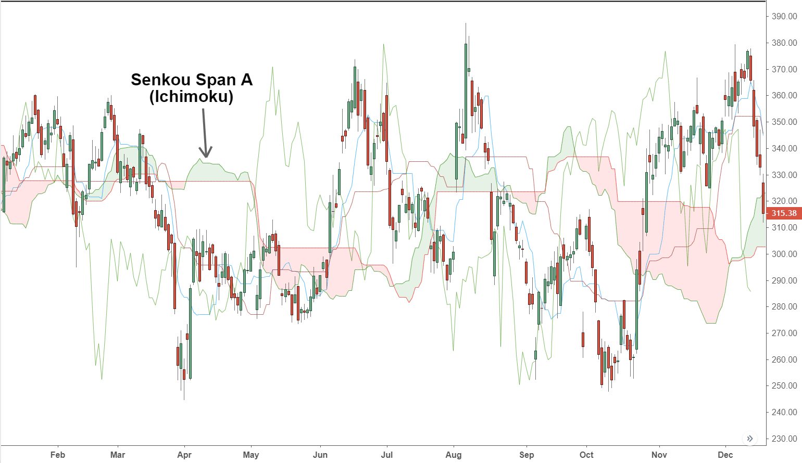

The Ichimoku Cloud, also known as Ichimoku Kinko Hyo, is a comprehensive technical analysis indicator used widely among traders to assess market trends and momentum. Developed by Japanese journalist Goichi Hosoda in the late 1930s, it was designed to provide a clearer picture of potential price action. At its core, the Ichimoku Cloud is a multi-faceted tool that combines several indicators to help traders identify potential support and resistance levels, gauge momentum, and determine the direction of trends.

A significant component of the Ichimoku Cloud is the Senkou Span A, which plays a fundamental role in defining the cloud's leading edge. Senkou Span A is calculated as the average of the Conversion Line (Tenkan Sen) and the Base Line (Kijun Sen), plotted 26 periods ahead. It acts as the first boundary of the cloud, offering insights into future support and resistance levels. The value of Senkou Span A helps create the 'cloud' itself when combined with Senkou Span B, offering traders a visual representation of potential market shifts. 



Technical indicators like the Ichimoku Cloud, and specifically components such as Senkou Span A, are integral to algorithmic trading strategies. These quantitative trading models rely on historical and real-time data to find patterns and predict future market behavior. Incorporating technical indicators into algorithms allows for systematic trading decisions, minimizing emotional bias and improving efficiency. As markets evolve and become more data-driven, indicators like the Ichimoku Cloud continue to serve as invaluable tools for traders seeking to enhance their decision-making processes and strategy development in volatile markets.

## Table of Contents

## Understanding the Ichimoku Cloud

The Ichimoku Cloud, formally known as Ichimoku Kinko Hyo, is a comprehensive technical analysis tool designed to provide insights into potential future price movements of financial assets. Developed by Japanese journalist Goichi Hosoda in the late 1930s, the system combines multiple indicators into a single chart, allowing traders to assess trend direction, momentum, and potential support and resistance levels at a glance. After three decades of fine-tuning and testing, Hosoda's technique was published in 1969, quickly becoming popular among Japanese traders and eventually gaining international recognition.

The Ichimoku Cloud consists of five key components, each serving distinct functions, which collectively provide a broader perspective compared to traditional technical analysis tools. These components are:

1. **Tenkan Sen (Conversion Line):** Calculated as the average of the highest high and the lowest low over the past nine periods, the Tenkan Sen is used to gauge short-term momentum. Its formula is:
$$
   \text{Tenkan Sen} = \frac{(\text{Highest High} + \text{Lowest Low})}{2}

$$

2. **Kijun Sen (Base Line):** Functioning as an indicator of medium-term momentum, the Kijun Sen is the average of the highest high and the lowest low over the past 26 periods. The formula is:
$$
   \text{Kijun Sen} = \frac{(\text{Highest High} + \text{Lowest Low})}{2}

$$

3. **Chikou Span (Lagging Span):** The current period's closing price plotted 26 periods back on the chart. It helps traders visualize how current prices compare to those in the past and can be indicative of trend strength.

4. **Senkou Span A (Leading Span A):** This is the average of the Tenkan Sen and Kijun Sen plotted 26 periods into the future, creating one of the cloud boundaries. It is expressed as:
$$
   \text{Senkou Span A} = \frac{(\text{Tenkan Sen} + \text{Kijun Sen})}{2}

$$

5. **Senkou Span B (Leading Span B):** The average of the highest high and the lowest low over the past 52 periods, also plotted 26 periods ahead. The formula is:
$$
   \text{Senkou Span B} = \frac{(\text{Highest High} + \text{Lowest Low})}{2}

$$

The space between Senkou Span A and Senkou Span B forms the Ichimoku "Cloud," or Kumo, which changes shape based on price movement, signaling potential support and resistance zones. If Senkou Span A is above Span B, the cloud is typically green, indicating potential bullish conditions. Conversely, if Span B is above Span A, the cloud is red, possibly hinting at bearish conditions.

The Ichimoku Cloud's strength lies in its holistic approach, combining trend identification, support and resistance levels, and [momentum](/wiki/momentum) insights into a single chart. It remains a valuable tool for traders worldwide, particularly in [algorithmic trading](/wiki/algorithmic-trading) strategies, where it aids in the creation of rule-based systems that capitalize on predictable price movements.

## Senkou Span A: What It Is and How It Works

Senkou Span A, an essential component of the Ichimoku Cloud, plays a vital role in technical analysis by helping traders assess potential support and resistance levels. Within the Ichimoku Cloud, Senkou Span A serves as one of the boundary lines that form the cloud structure, offering insights into potential market trends.

Senkou Span A is calculated using the conversion line (Tenkan Sen) and the baseline (Kijun Sen) by averaging them over a specified period. Mathematically, it can be expressed as:

$$
\text{Senkou Span A} = \frac{\text{Conversion Line} + \text{Base Line}}{2}
$$

To calculate Senkou Span A, the following steps are taken:

1. **Determine Conversion Line (Tenkan Sen):** The midpoint of the highest high and lowest low over the past 9 periods.
2. **Compute Base Line (Kijun Sen):** The midpoint of the highest high and lowest low over the past 26 periods.
3. **Calculate Senkou Span A:** The average of the conversion line and baseline, projected 26 periods into the future.

This calculation implies that Senkou Span A represents the average price behavior, providing an advanced visual representation of future support and resistance levels by plotting it forward on the chart. Its predictive nature allows traders to anticipate these critical levels, offering them better guidance on potential price reversals or trend continuations.

Senkou Span A functions by providing a delineation between potential bullish and bearish market conditions. When the current price remains above Senkou Span A, it may indicate a bullish market sentiment, suggesting that the level could act as support. Conversely, if the price is below Senkou Span A, it may suggest bearish conditions, potentially serving as a resistance point. This capability of Senkou Span A to predict support and resistance levels makes it a valuable tool for traders looking to navigate ever-changing market conditions effectively.

## Calculating Senkou Span A

Calculating Senkou Span A involves a clear process centered around determining the conversion line (Tenkan Sen) and the base line (Kijun Sen) from historical price data. The focus ultimately extends to plotting this component 26 periods ahead to provide insights on future market dynamics.

**Step-by-Step Calculation Guide:**

1. **Determine the Conversion Line (Tenkan Sen):**
   - The conversion line averages the highest high and the lowest low over the past 9 periods. It can be calculated using:
$$
   \text{Tenkan Sen} = \frac{(\text{Highest High}_{9} + \text{Lowest Low}_{9})}{2}

$$
   This line represents short-term market sentiment.

2. **Determine the Base Line (Kijun Sen):**
   - The base line averages the highest high and the lowest low over the past 26 periods:
$$
   \text{Kijun Sen} = \frac{(\text{Highest High}_{26} + \text{Lowest Low}_{26})}{2}

$$
   This represents medium-term market sentiment.

3. **Calculate Senkou Span A:**
   - Senkou Span A, the first boundary of the Kumo, or "Cloud," is calculated by averaging the conversion line (Tenkan Sen) and the baseline (Kijun Sen):
$$
   \text{Senkou Span A} = \frac{(\text{Tenkan Sen} + \text{Kijun Sen})}{2}

$$
   This figure is then plotted 26 periods in the future, offering a predictive view of potential support and resistance levels.

4. **Using Historical Data:**
   - Historical data is vital in computing Senkou Span A. A minimum dataset of at least 26 periods is necessary to initially calculate and project the lines. More extended historical data enhances accuracy and reliability.

5. **Plotting 26 Periods Forward:**
   - By advancing the plot of Senkou Span A 26 periods into the future, it anticipates potential future support and resistance zones. This forward-looking nature distinguishes the Ichimoku system, making it useful for predictive analyses.

**Example in Python:**

To illustrate the calculation, Python code can automate these computations:

```python
import pandas as pd
import numpy as np

# Sample data: 'high' and 'low' are lists or arrays of historical high and low prices
data = pd.DataFrame({'high': high, 'low': low})

# Calculate Tenkan Sen
data['Tenkan_Sen'] = (data['high'].rolling(window=9).max() + data['low'].rolling(window=9).min()) / 2

# Calculate Kijun Sen
data['Kijun_Sen'] = (data['high'].rolling(window=26).max() + data['low'].rolling(window=26).min()) / 2

# Calculate Senkou Span A
data['Senkou_Span_A'] = (data['Tenkan_Sen'] + data['Kijun_Sen']) / 2

# Shift Senkou Span A 26 periods forward
data['Senkou_Span_A'] = data['Senkou_Span_A'].shift(26)

# Print the last few rows of data to see the calculation
print(data.tail())
```

This process allows traders to anticipate price movements, using Senkou Span A as a dynamic predictor of support and resistance, enhancing their strategic trading decisions within algorithmic frameworks.

## Trading Signals: Using Senkou Span A

Senkou Span A plays a vital role in providing trading signals within the Ichimoku Cloud system by helping traders identify bullish and bearish trends. The core principle lies in its interaction with Senkou Span B, as the relative position of these spans can determine trend direction and potential strength.

When Senkou Span A crosses above Senkou Span B, it typically signals a bullish trend or buying opportunity. This crossover suggests that the trader's expectations of future prices are becoming more optimistic, which may drive the market upwards. Conversely, if Senkou Span A crosses below Senkou Span B, it indicates a bearish trend or a signal to sell, reflecting negative sentiment and potential price declines.

For a more comprehensive analysis, traders often use Senkou Span A alongside other Ichimoku components or external indicators to increase reliability and accuracy. Key indicators that can be used in conjunction include:

1. **Price vs. Cloud Position**: If the current price is above the cloud formed by Span A and Span B, it indicates an overall bullish trend. Alternatively, a price below the cloud suggests a bearish environment. The thickness of the cloud can also represent market volatility or the strength of support/resistance levels.

2. **Tenkan Sen (Conversion Line) and Kijun Sen (Base Line) Crossovers**: These lines provide additional signals. A cross of the Tenkan Sen over the Kijun Sen indicates a bullish signal, especially if it occurs above the cloud. Similarly, a crossover below the cloud suggests a bearish signal.

3. **Chikou Span (Lagging Span)**: The Chikou Span helps confirm trends. If it is above the price from 26 periods ago, it adds bullish confirmation. If below, it suggests bearish continuity.

### Python Example:
To illustrate how you might observe these signals using a simple Python script with a hypothetical dataset:

```python
import pandas as pd
import numpy as np

# Hypothetical dataset
data = pd.DataFrame({
    'high': [120, 122, 124, 128, 127, 125],
    'low': [115, 118, 119, 123, 122, 121],
    'close': [118, 121, 123, 125, 124, 123]
})

def ichimoku_cloud(df, tenkan=9, kijun=26, senkou=52):
    high_9 = df['high'].rolling(window=tenkan).max()
    low_9 = df['low'].rolling(window=tenkan).min()
    df['Tenkan_Sen'] = (high_9 + low_9) / 2

    high_26 = df['high'].rolling(window=kijun).max()
    low_26 = df['low'].rolling(window=kijun).min()
    df['Kijun_Sen'] = (high_26 + low_26) / 2

    df['Senkou_Span_A'] = ((df['Tenkan_Sen'] + df['Kijun_Sen']) / 2).shift(kijun)

    high_52 = df['high'].rolling(window=senkou).max()
    low_52 = df['low'].rolling(window=senkou).min()
    df['Senkou_Span_B'] = ((high_52 + low_52) / 2).shift(kijun)

    return df

# Calculate Ichimoku components
ichimoku_cloud(data)

# Detect Senkou Span A and B crossovers
def detect_crossings(df):
    # Initialize previous values
    prev_span_a = None
    prev_span_b = None

    for index, row in df.iterrows():
        current_span_a = row['Senkou_Span_A']
        current_span_b = row['Senkou_Span_B']

        if prev_span_a is not None and prev_span_b is not None:
            if prev_span_a < prev_span_b and current_span_a > current_span_b:
                print(f"Bullish crossover at index {index}")
            elif prev_span_a > prev_span_b and current_span_a < current_span_b:
                print(f"Bearish crossover at index {index}")

        # Update for the next iteration
        prev_span_a = current_span_a
        prev_span_b = current_span_b

detect_crossings(data)
```

This example demonstrates how traders can automate the detection of bullish and bearish crossovers between Senkou Span A and B using a basic roll-apply function in Python. Such automated techniques are essential for enhancing the efficiency and effectiveness of trading strategies using the Ichimoku Cloud.

## Senkou Span A vs. Simple Moving Averages

Senkou Span A and simple moving averages (SMA) are both integral components in technical analysis, yet they serve distinct roles due to differences in their calculation, plotting, and predictive capabilities.

**Differences in Calculation and Plotting:**

Senkou Span A is part of the Ichimoku Cloud and is specifically calculated as the average of the Tenkan Sen (Conversion Line) and Kijun Sen (Base Line). Mathematically, it is expressed as:

$$
\text{Senkou Span A} = \frac{\text{Tenkan Sen} + \text{Kijun Sen}}{2}
$$

The result is plotted 26 periods ahead of the current price, which provides a forward-looking feature unique to the Ichimoku system.

In contrast, a simple moving average (SMA) is calculated by summing the closing prices of an asset over a specific period and then dividing by the number of periods. For example, a 10-period SMA is calculated as:

$$
\text{SMA} = \frac{\sum_{i=1}^{n} \text{Closing Price}_i}{n}
$$

where $n$ represents the number of periods. SMAs are plotted at the current time period without any forward projection, making them purely retrospective indicators.

**Predictive Nature of Senkou Span A:**

The forward plotting of Senkou Span A distinguishes it from the traditional SMA by providing predictive insights. By projecting 26 periods into the future, Senkou Span A, along with Senkou Span B, creates the Ichimoku Cloud, signaling potential support and resistance levels. These levels can help traders anticipate market movements before they happen, offering a proactive approach to visualizing future price support and resistance.

Senkou Span A's predictive advantage is enhanced when it interacts with Senkou Span B. When Span A is above Span B, the cloud is considered bullish, suggesting future support; conversely, when Span A is below Span B, it indicates bearish momentum and potential resistance. This forward-looking aspect allows traders to anticipate price movements rather than react to them only after they occur, as is the case with SMAs.

Simple moving averages, however, provide smoothed historical data, which is helpful for identifying trends after they have started but lacks the foresight present in Senkou Span A's forward projection. SMAs are often used to confirm trend directions rather than predict them, making them more useful in conjunction with other indicators that offer a current assessment of market conditions.

In practical trading scenarios, Senkou Span A's predictive nature can offer strategic insight, especially when combined with other timeframes and indicators, catering to both short-term and long-term trading strategies. This quality underscores Senkou Span A's distinctive role in technical analysis as a tool that doesn't only reflect past trends but also projects future possibilities on the price chart.

## Limitations and Challenges

Senkou Span A, as a standalone indicator within the Ichimoku Cloud, presents certain limitations and challenges when utilized in technical analysis. One chief limitation is its potential for lagging behind price movements. Senkou Span A is computed by averaging the Tenkan Sen (Conversion Line) and Kijun Sen (Base Line) and then plotting this average 26 periods ahead. This inherent forward-looking calculation means it relies heavily on historical data, which can result in delayed responses to rapid market changes or reversals. 

For instance, in volatile markets, the lag associated with Senkou Span A can lead to late reactions that may cause traders to enter or [exit](/wiki/exit-strategy) positions after significant price movements have already occurred. This latency is particularly evident during sudden trend reversals, where the indicator might provide signals only after the new trend is well underway.

To mitigate such lag, it is crucial to integrate Senkou Span A with other analysis methods. Combining it with momentum indicators like the Relative Strength Index (RSI) or the Moving Average Convergence Divergence (MACD) can provide additional confirmation of trends and help in identifying entry and exit points more effectively. For example, when Senkou Span A crosses above Senkou Span B (indicating potential bullish trend), the trader might look for supporting signals from the RSI to confirm strength in the movement before committing to a trade.

Moreover, applying multiple indicators addresses the limitation by offering a multi-dimensional perspective on price action. This cross-verification reduces the chance of relying on potentially misleading signals that may arise from using Senkou Span A in isolation. Therefore, while Senkou Span A is a powerful component of the Ichimoku Cloud system, its effectiveness is significantly enhanced when employed in conjunction with a broader array of analytical tools, thus leading to more accurate and robust trading strategies.

## Integrating Senkou Span A into Algo Trading Systems

Incorporating Senkou Span A into algorithmic trading strategies involves leveraging its characteristics to enhance decision-making processes and improve trade execution. Senkou Span A, as a component of the Ichimoku Cloud, serves as a vital tool for predicting potential support and resistance levels, which can be crucial for developing automated trading algorithms.

To effectively integrate Senkou Span A into algorithmic systems, one must first understand its interaction with the other components of the Ichimoku Cloud. Senkou Span A, calculated as the average of the Tenkan Sen (Conversion Line) and Kijun Sen (Base Line), is plotted 26 periods ahead. This forward-looking nature provides traders with a unique perspective on market trends, beyond the immediate price action.

### Incorporating into Strategies:

1. **Trend Identification and Filters**:
   - Senkou Span A, combined with Senkou Span B, forms the Ichimoku Cloud, which acts as a visual representation of dynamic support and resistance. Algorithms can be programmed to identify the prevailing trend based on the relative positions of the price and the cloud. When the price is above the cloud, it is considered a bullish trend, and bearish when below.
   - Trading strategies employing Senkou Span A often incorporate conditions such as entering long positions when the price breaks above Senkou Span A while in a bullish cloud.

2. **Signal Generation and Execution**:
   - Algorithmic systems can be designed to trigger buy and sell signals based on specific interactions involving Senkou Span A. For example, a crossover of the Conversion Line above Senkou Span A under bullish conditions might be interpreted as a buy signal.

3. **Python Implementation Example**:
   - A basic example of calculating Senkou Span A using Python might look like this:

     ```python
     def calculate_senkou_span_a(tenkan_sen, kijun_sen):
         return (tenkan_sen + kijun_sen) / 2

     # Example data: lists of historical tenkan_sens and kijun_sens
     tenkan_sens = [...]
     kijun_sens = [...]

     # Calculate Senkou Span A values
     senkou_span_a_values = [calculate_senkou_span_a(ts, ks) for ts, ks in zip(tenkan_sens, kijun_sens)]
     ```

### Benefits of Backtesting and Optimization:

Backtesting is imperative when integrating any technical indicator into an algo trading system. It allows traders to evaluate how a strategy based on Senkou Span A would have performed historically. This retrospective analysis helps in refining the strategy parameters, understanding potential risks, and improving the robustness of the trading system.

- **Optimization**: Involves fine-tuning parameters such as the look-back period for calculating the Tenkan Sen and Kijun Sen to maximize returns while minimizing risk.
- **Robustness**: Ensuring the strategy performs consistently across different market conditions by cross-validating with out-of-sample data.

### Case Studies and Examples:

1. **Momentum-based Strategy**:
   - A case study could show how traders have used Senkou Span A alongside momentum indicators like the Relative Strength Index (RSI) to confirm breakout trades. The strategy might involve entering long trades when the price moves above Senkou Span A with RSI showing an oversold condition.

2. **Reversion to Mean**:
   - Strategies using Senkou Span A to identify overextended price movements that revert to the cloud have been effective. For example, entering short trades when the price is significantly above Senkou Span A with a subsequent lagging Chikou Span indicating waning momentum.

These examples showcase the versatility and predictive power of Senkou Span A when integrated into algorithmic trading systems. By carefully [backtesting](/wiki/backtesting) and optimizing trading strategies, traders can harness the insights provided by the Ichimoku Cloud, leading to potentially profitable trading opportunities.

## Conclusion

Senkou Span A plays a pivotal role in technical analysis by serving as an integral component of the Ichimoku Cloud, particularly in identifying support and resistance levels. Its calculation, based on the average of the Tenkan Sen (conversion line) and Kijun Sen (base line), represents a forward-looking indicator plotted 26 periods ahead, which helps traders anticipate future market activity rather than simply reacting to past data. This forward projection provides a unique advantage over traditional indicators, offering a predictive edge that traders can exploit for better-informed decision-making.

Integrating Senkou Span A into algorithmic trading systems offers an opportunity to automate the interpretation of complex chart patterns, facilitating quicker responses to market changes. Algorithmic systems, when properly optimized and backtested, can utilize this predictive aspect to enhance the timing and accuracy of trades. The ability to programmatically scrutinize scenarios where Senkou Span A interacts with Senkou Span B provides nuanced trading signals that are critical for developing robust trading strategies.

Encouragement is extended to traders to experiment with the various components of the Ichimoku Cloud, as each offers its distinct insights and can be combined for a comprehensive market analysis. By engaging with these components, traders can develop a deeper understanding of market trends and create tailored strategies that align with their trading objectives. With the continuous evolution of trading technology, the exploration and incorporation of such technical indicators into systems present an exciting avenue for innovation in trading methodologies.

## References & Further Reading

[1]: ["Ichimoku Charts: An Introduction to Ichimoku Kinko Clouds"](https://www.amazon.com/Ichimoku-Charts-Introduction-Kinko-Clouds/dp/0857196081) by Nicole Elliott

[2]: ["Trading with Ichimoku Clouds: The Essential Guide to Ichimoku Kinko Hyo Technical Analysis"](https://www.amazon.com/Trading-Ichimoku-Clouds-Essential-Technical/dp/0470609931) by Manesh Patel

[3]: Pring, M. J. (2002). ["Technical Analysis Explained: The Successful Investor's Guide to Spotting Investment Trends and Turning Points."](https://www.amazon.com/Technical-Analysis-Explained-Fifth-Successful/dp/0071825177) McGraw-Hill.

[4]: Murphy, J. J. (1999). ["Technical Analysis of the Financial Markets: A Comprehensive Guide to Trading Methods and Applications."](https://archive.org/details/technicalanalysi0000murp) New York Institute of Finance.

[5]: "Algorithmic Trading: Winning Strategies and Their Rationale" by Ernest P. Chan (https://www.amazon.com/Algorithmic-Trading-Winning-Strategies-Rationale-ebook/dp/B00CY5HC0U)