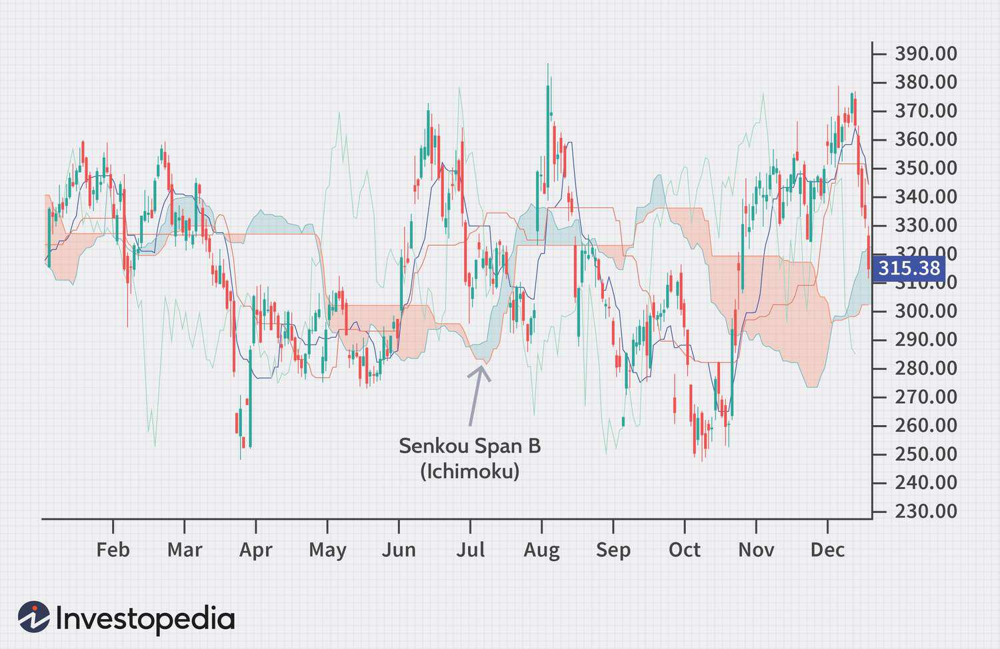

The world of technical analysis offers traders a wide array of tools and indicators designed to interpret market trends and facilitate informed decision-making. Of these tools, the Ichimoku Cloud distinguishes itself through its comprehensive approach to analyzing market dynamics. Central to this indicator are its components, Senkou Span A and Senkou Span B, which play a vital role in offering a unique perspective on market trends and potential reversals.

Senkou Span B, in particular, is a critical component of the Ichimoku framework, primarily utilized for its capacity to provide insights into future potential support and resistance levels. As part of the Ichimoku Cloud, Senkou Span B aids traders in visualizing broader market trends by plotting average values of past price action, which can help anticipate future movements. 



This article examines the technical attributes of Senkou Span B and its practical applications within algorithmic trading systems. By understanding how Senkou Span B functions, traders can better integrate it into their trading strategies to enhance their grasp of market trends and establish strategic support and resistance levels. The discussion will also address the strengths and limitations of relying solely on Senkou Span B, emphasizing the necessity of combining it with other indicators for a more comprehensive trading strategy.

## Table of Contents

## Understanding Senkou Span B

Senkou Span B is a fundamental component of the Ichimoku Cloud, a comprehensive technical analysis tool utilized for assessing market momentum and trend. It is calculated to capture the median level between the highest high and the lowest low over the past 52 trading periods, projecting this midpoint 26 periods into the future. This midpoint formula is expressed as:

$$
\text{Senkou Span B} = \frac{\text{Highest High}_{52} + \text{Lowest Low}_{52}}{2}
$$

Subsequently, this value is plotted ahead on the chart, serving as a predictive tool for traders. The significance of Senkou Span B lies in its ability to establish long-term support and resistance levels, crucial for developing strategic trading positions.

Compared to its counterpart Senkou Span A, Senkou Span B is characterized by its slower response to market changes. This is due to the extended period over which it calculates the midpoint, thus capturing broader trend dynamics rather than reactive short-term fluctuations. The lagging nature of Senkou Span B is instrumental in offering a stable reference point that traders can rely on for long-term trend analysis.

The Ichimoku Cloud itself is formed by the interplay of Senkou Span A and Senkou Span B. When combined, these two spans create a visual representation of market equilibrium. If the price remains above this cloud, it suggests that the market maintains a bullish trend, whereas a price below indicates a bearish trend. The cloud's thickness—determined by the distance between Senkou Span A and B—further reflects market [volatility](/wiki/volatility-trading-strategies), serving as an indicator of the strength of these support and resistance levels.

References: 
- Lambert, B. (2009). *Ichimoku Charts: An Introduction to Ichimoku Kinko Clouds.* Traders Press, Inc.
- TradingSim. "The Ultimate Guide to the Ichimoku Cloud". Retrieved from https://www.tradingsim.com/blog/ichimoku-cloud/

## How Senkou Span B Works

The interaction between Senkou Span A and Senkou Span B is fundamental to the construction of the Ichimoku Cloud, often referred to as the 'kumo'. This cloud plays a significant role in technical analysis by highlighting potential zones of support and resistance based on historical price movements. 

When the market price is situated above the Ichimoku Cloud, Senkou Span B acts as a support level. Conversely, when the price falls below the cloud, Senkou Span B functions as a resistance level. These dynamics are crucial for traders aiming to understand market sentiment and the thresholds at which price corrections might occur. This bifurcation in the role of Senkou Span B underscores its utility in identifying strategic entry and [exit](/wiki/exit-strategy) points in trading.

Crossovers between Senkou Span A and B serve as important indicators of potential trend reversals or intensifications. Specifically, a crossover where Senkou Span A moves above Senkou Span B suggests a bullish market trend, signaling a potential buy opportunity. Conversely, when Senkou Span A falls below Senkou Span B, it indicates a bearish trend, potentially signaling a sell decision. 

The Ichimoku Cloud's thickness is indicative of market volatility and the strength of support or resistance levels. A broader cloud implies heightened volatility and reinforces the strength of the underlying support or resistance. In contrast, a thinner cloud suggests weaker support/resistance levels, potentially making the market more susceptible to rapid changes in price. 

Understanding these interactions and the implications of the cloud's dynamics provides traders with a strategic tool for anticipating market movements and aligning their trading strategies accordingly. This underscores the importance of interpreting the cloud's structural characteristics in conjunction with real-time price actions.

## Calculation of Senkou Span B

Senkou Span B is calculated by identifying the midpoint between the highest high and lowest low over the past 52 periods and then projecting this midpoint 26 periods into the future on a price chart. The formula for calculating Senkou Span B is:

$$
\text{Senkou Span B} = \frac{(\text{Highest High}_{52} + \text{Lowest Low}_{52})}{2}
$$

Where:
- $\text{Highest High}_{52}$ is the highest price observed over the last 52 periods.
- $\text{Lowest Low}_{52}$ is the lowest price observed over the same period.

This computation results in a value that provides a long-term perspective on price action, focusing on mid-range data points. The 26-period forward projection aligns with the lead time of the Ichimoku Cloud, enabling traders to assess future support and resistance levels effectively. Unlike a simple moving average, which solely considers closing prices, Senkou Span B provides a more holistic view by encompassing both high and low price extremes. 

Here is a Python snippet that demonstrates how to calculate Senkou Span B:

```python
def calculate_senkou_span_b(highs, lows):
    if len(highs) < 52 or len(lows) < 52:
        raise ValueError("Not enough data points for calculation")

    highest_high = max(highs[-52:])
    lowest_low = min(lows[-52:])

    senkou_span_b = (highest_high + lowest_low) / 2
    return senkou_span_b

# Example usage with dummy data
highs = [100, 102, 101, 105, 104, 110, 115, 112, 108, 109, 111, 113, 118, 115, 116, 120] * 4
lows = [90, 91, 89, 88, 92, 85, 87, 84, 86, 88, 90, 91, 94, 92, 90, 95] * 4

senkou_span_b = calculate_senkou_span_b(highs, lows)
print("Senkou Span B:", senkou_span_b)
```

The calculation of Senkou Span B provides traders with key insights into market dynamics by contrasting long- and short-term price actions. This alignment helps in identifying significant price levels that may influence future trading decisions.

## Limitations of Senkou Span B

Senkou Span B, a significant component of the Ichimoku Cloud, has limitations that traders must be aware of when utilizing it in their analyses. As a lagging indicator, Senkou Span B reflects past market data, which inherently causes a delay in reacting to sudden price shifts. This delay in adjustment means that significant changes in market conditions, such as new highs or lows, may not be immediately reflected in the indicator, potentially leading to outdated or less accurate insights during volatile times.

One of the key features of the Ichimoku Cloud is the crossover between Senkou Span A and Senkou Span B, which is used to identify potential trend reversals in the market. However, these crossovers often lag behind actual price movements. For instance, a bullish crossover, where Senkou Span A moves above Senkou Span B, may occur well after the price trend has already shifted upward, thereby reducing its effectiveness as a timely trading signal. Similarly, bearish crossovers may already reflect movements that have been in progress, limiting their use for time-sensitive trading strategies.

Furthermore, while the cloud itself is intended to serve as a zone of support or resistance, this is not always consistently reliable. The cloud's efficacy as a boundary varies depending on market conditions, and it may not clearly signal strong support or resistance levels. As a result, traders often find it beneficial to combine Senkou Span B with other technical indicators or analytical tools to achieve more comprehensive and accurate market assessments. Integrating additional indicators can compensate for the lagging nature of Senkou Span B and provide a more robust framework for making trading decisions.

In practice, traders can use Python to test the effectiveness of Senkou Span B by [backtesting](/wiki/backtesting) it in combination with other indicators. For example:

```python
import pandas as pd

# Replace with your own data source/file
data = pd.read_csv('market_data.csv') 

# Function to calculate Senkou Span B
def calculate_senkou_span_b(data, period=52, projection=26):
    # Calculate rolling mean of highest high and lowest low over the specified period
    span_b = (data['High'].rolling(window=period).max() + data['Low'].rolling(window=period).min()) / 2
    # Shift it forward according to the projection
    span_b = span_b.shift(projection)
    return span_b

# Add Senkou Span B to the market data
data['Senkou Span B'] = calculate_senkou_span_b(data)

# Analyze strategy incorporating additional indicators
# (This is just a simple example; traders should build more comprehensive models)
data['Signal'] = 0  # Placeholder for a combination of indicator signals
```

By applying rigorous backtesting and analysis, traders can fine-tune their strategies to mitigate the limitations of relying solely on Senkou Span B, enhancing the precision and responsiveness of their trading approach.

## Integrating Senkou Span B in Algorithmic Trading

Senkou Span B, part of the Ichimoku Cloud, is utilized by algorithmic traders as a crucial indicator of market support and resistance levels. Its implementation in [algorithmic trading](/wiki/algorithmic-trading) strategies can enhance decision-making processes by providing structured conditions for trade execution based on price interaction with the Ichimoku Cloud. Specifically, algorithms are designed to initiate trades when certain conditions are met, such as when the price crosses above or below Senkou Span B.

Incorporating Senkou Span B into algorithmic trading involves creating precise rules or conditions that trigger trade actions. For instance, an algorithm might be set to initiate a long position if the price crosses above the Ichimoku Cloud, interpreted as a bullish signal. Conversely, a short position might be activated if the price crosses below the cloud, indicating a bearish market. The code snippet below illustrates a basic implementation using Python:

```python
def check_trade_signals(price, span_b, current_position):
    if price > span_b and current_position != "long":
        return "enter_long"
    elif price < span_b and current_position != "short":
        return "enter_short"
    else:
        return "hold"

# Example usage
price = 105
span_b = 100
current_position = "none"
signal = check_trade_signals(price, span_b, current_position)
print(signal)
```

In this Python example, `check_trade_signals` function evaluates the current price against Senkou Span B to determine whether to enter a long, short, or hold position based on predefined criteria.

Before deploying any algorithmic strategy, it's crucial to conduct thorough backtesting. Backtesting involves applying the strategy to historical market data to assess its performance and effectiveness. This process is vital because it helps determine the reliability of the strategy across different financial instruments and under varying market conditions, allowing traders to optimize and refine their algorithms. Key metrics such as win rate, profit [factor](/wiki/factor-investing), and maximum drawdown are typically analyzed during backtesting to ensure that the strategy aligns with the trader's objectives and risk tolerance.

## Conclusion

Senkou Span B serves as a critical component within the Ichimoku Cloud framework, primarily designed to identify long-term market trends. Its ability to reflect historical price data through a lagged perspective offers traders a robust mechanism for establishing strategic support and resistance levels. These levels become particularly useful for decision-making processes in trending markets. However, the static nature of Senkou Span B as a lagging indicator implies that it may not react swiftly to sudden market changes, thereby highlighting the necessity for traders to supplement it with other analytical indicators for a comprehensive market view.

For algorithmic traders, Senkou Span B's predictive qualities can be harnessed to improve precision and effectiveness in trading systems. By integrating Senkou Span B into algorithmic strategies, traders can develop systems that respond to the underlying market trends more accurately. Such integrations may involve conditions where trades are executed based on whether the price crosses above or below the Ichimoku Cloud, among other strategies. To maximize reliability, it is advisable to backtest these strategies over diverse financial instruments and varying market conditions, ensuring that the algorithm's performance is robust and adaptable.

## References & Further Reading

[1]: Lambert, B. (2009). ["Ichimoku Charts: An Introduction to Ichimoku Kinko Clouds."](https://books.google.com/books/about/Ichimoku_Charts.html?id=UMvZAgAAQBAJ) Traders Press, Inc.

[2]: TradingSim. ["The Ultimate Guide to the Ichimoku Cloud."](https://www.tradingsim.com/blog/ichimoku-cloud)

[3]: Kirkpatrick, C. D., & Dahlquist, J. R. (2010). ["Technical Analysis: The Complete Resource for Financial Market Technicians."](https://ptgmedia.pearsoncmg.com/images/9780134137049/samplepages/9780134137049.pdf) FT Press.

[4]: Murphy, J. J. (1999). ["Technical Analysis of the Financial Markets: A Comprehensive Guide to Trading Methods and Applications."](https://archive.org/details/technicalanalysi0000murp) New York Institute of Finance.

[5]: Bulkowski, T. N. (2006). ["Encyclopedia of Chart Patterns."](https://books.google.com/books/about/Encyclopedia_of_Chart_Patterns.html?id=tIwlEAAAQBAJ) Wiley.

[6]: ["Algorithmic Trading & DMA: An Introduction to Direct Access Trading Strategies"](https://www.amazon.com/Algorithmic-Trading-DMA-introduction-strategies/dp/0956399207) by Barry Johnson

[7]: ["Quantitative Technical Analysis: An integrated approach to trading system development and trading management"](https://dl.acm.org/doi/book/10.5555/2789309) by Dr. Howard Bandy

[8]: ["Trading Price Action Trends: Technical Analysis of Price Charts Bar by Bar for the Serious Trader"](https://www.amazon.com/Trading-Price-Action-Trends-Technical/dp/1118066510) by Al Brooks