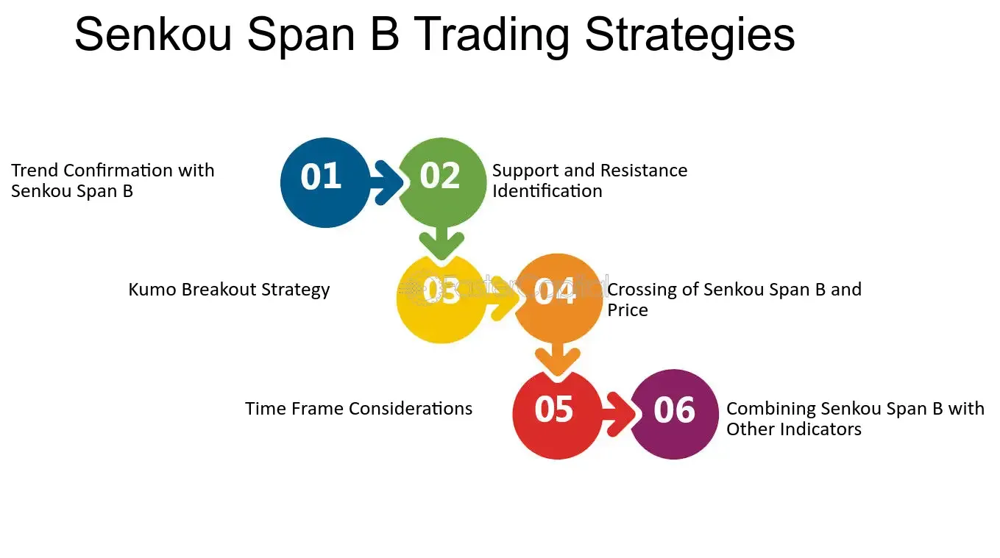

## Table of Contents

## What is Senkou Span B in the context of technical analysis?

Senkou Span B is a part of the Ichimoku Kinko Hyo, which is a popular technical analysis tool used in trading. It is one of the two lines that make up the "cloud" or "Kumo" in the Ichimoku chart. Senkou Span B is calculated by taking the highest high and the lowest low over the past 52 periods and then finding the average of these two values. This average is then plotted 26 periods ahead on the chart.

The purpose of Senkou Span B, along with Senkou Span A, is to help traders identify potential support and resistance levels, as well as to gauge the overall trend and momentum of the market. When Senkou Span B is above Senkou Span A, the cloud is considered bearish, suggesting that the market might be in a downtrend. Conversely, when Senkou Span B is below Senkou Span A, the cloud is bullish, indicating a possible uptrend. This helps traders make more informed decisions about when to buy or sell.

## How does Senkou Span B contribute to the Ichimoku Cloud?

Senkou Span B is an important part of the Ichimoku Cloud, which helps traders see where the market might go next. It is one of the two lines that make the cloud. To find Senkou Span B, you take the highest high and the lowest low over the last 52 periods, add them together, and then divide by two. This number is then put on the chart 26 periods into the future. This helps show where the market might find support or resistance in the future.

The cloud, made up of Senkou Span B and Senkou Span A, tells traders about the market's trend and strength. If Senkou Span B is higher than Senkou Span A, the cloud turns bearish, meaning the market might be going down. But if Senkou Span B is lower than Senkou Span A, the cloud becomes bullish, suggesting the market might be going up. By looking at the cloud, traders can make better choices about buying or selling.

## What is the basic formula used to calculate Senkou Span B?

Senkou Span B is calculated by finding the highest high and the lowest low over the past 52 periods. Once you have these two values, you add them together and then divide by two to get the average. This average is what we call Senkou Span B.

After calculating this average, you plot it on the chart, but you move it forward by 26 periods. This means you are looking at where the market might find support or resistance in the future. By doing this, Senkou Span B helps form part of the Ichimoku Cloud, which traders use to understand market trends and make decisions.

## Can you explain the significance of the 52-period high and low in the calculation of Senkou Span B?

The 52-period high and low used in calculating Senkou Span B are important because they help us understand how the market has been moving over a long time. In trading, a period can be a day, an hour, or even a minute, depending on what you are looking at. By looking at the highest high and the lowest low over these 52 periods, we get a good idea of the range the market has been in. This range tells us about the market's strength and where it might find support or resistance in the future.

Using these 52 periods gives us a bigger picture of the market's trend. It's like looking at the whole story instead of just a small part. When we take the average of the highest high and the lowest low over these 52 periods, we get a number that represents where the market might go next. This number, or Senkou Span B, is then moved forward 26 periods on the chart, helping traders see where the market could be headed and make better trading decisions.

## How does Senkou Span B help in identifying support and resistance levels?

Senkou Span B helps traders find where the market might find support or resistance by using the highest high and lowest low over the last 52 periods. When you take the average of these highs and lows and move it forward 26 periods, you get a line on the chart that shows where the market could go in the future. This line, along with Senkou Span A, makes up the Ichimoku Cloud. The cloud acts like a big area on the chart where the market might have trouble moving through. If the price of something you're trading gets close to this cloud, it might bounce off it or have a hard time getting through it.

This cloud can tell you if the market is strong or weak. If Senkou Span B is above Senkou Span A, the cloud looks bearish, meaning the market might be going down. If it's below Senkou Span A, the cloud looks bullish, suggesting the market might be going up. Traders watch the cloud to see if the price is going to hit it. If the price hits the cloud and bounces back, that cloud area is acting as resistance. If the price goes through the cloud and keeps going, then the cloud was support. By watching where the price is compared to the cloud, traders can guess where the market might go next and make better choices about buying or selling.

## What role does Senkou Span B play in trend analysis?

Senkou Span B is a key part of the Ichimoku Cloud, which helps traders see the big picture of where the market is going. It's calculated by taking the highest high and the lowest low over the last 52 periods, finding the average, and then plotting it 26 periods into the future. This line, along with Senkou Span A, forms the cloud that shows the market's trend. If Senkou Span B is above Senkou Span A, the cloud turns bearish, meaning the market might be going down. But if Senkou Span B is below Senkou Span A, the cloud becomes bullish, suggesting the market might be going up.

By looking at where the price is compared to the cloud, traders can tell if the market is strong or weak. If the price is above the cloud, it's a sign that the market is in an uptrend. If the price is below the cloud, it's a sign of a downtrend. The cloud also helps traders see if the trend might change. If the price starts to move into the cloud, it could mean the trend is getting weaker. So, Senkou Span B helps traders understand the market's direction and make better decisions about when to buy or sell.

## How can traders use Senkou Span B to make trading decisions?

Traders use Senkou Span B to help them decide when to buy or sell. Senkou Span B is part of the Ichimoku Cloud, which shows where the market might go next. When traders see that Senkou Span B is above Senkou Span A, the cloud turns red or bearish, meaning the market might be going down. If Senkou Span B is below Senkou Span A, the cloud turns green or bullish, suggesting the market might be going up. By looking at the color of the cloud, traders can guess if it's a good time to buy or sell. If the cloud is green and the price is above it, traders might want to buy because the market seems strong. If the cloud is red and the price is below it, traders might want to sell because the market seems weak.

Senkou Span B also helps traders see where the market might find support or resistance. When the price gets close to the cloud, it might bounce off it or have a hard time moving through it. If the price hits the cloud and bounces back, that cloud area is acting as resistance. If the price goes through the cloud and keeps going, then the cloud was support. Traders watch these areas to decide when to enter or [exit](/wiki/exit-strategy) trades. For example, if the price is moving towards a green cloud and it looks like it might go through it, a trader might decide to buy, expecting the price to keep going up. If the price is moving towards a red cloud and it looks like it might bounce off it, a trader might decide to sell, expecting the price to go down.

## What are the common time frames used for calculating Senkou Span B?

Senkou Span B is usually calculated using different time frames depending on what the trader is looking at. For people who trade every day, they might use a time frame of 52 days to find the highest high and lowest low. This means they look at the last 52 days to see where the price has been. For people who trade over shorter times, like hours or minutes, they might use 52 hours or 52 minutes instead. The time frame you choose depends on how long you plan to hold your trade.

No matter what time frame you use, the idea is the same. You take the highest high and the lowest low over those 52 periods, find the average, and then move that average forward by 26 periods. This helps you see where the market might go in the future. By using different time frames, traders can look at the market in different ways and make better decisions about when to buy or sell.

## How does Senkou Span B interact with other components of the Ichimoku Kinko Hyo?

Senkou Span B is an important part of the Ichimoku Kinko Hyo, which is a way to look at charts to see where the market might go next. It works with other parts of the Ichimoku, like Senkou Span A, to make the cloud. The cloud shows where the market might find support or resistance. When Senkou Span B is above Senkou Span A, the cloud turns red and looks bearish, meaning the market might be going down. But when Senkou Span B is below Senkou Span A, the cloud turns green and looks bullish, suggesting the market might be going up. Traders watch the cloud to see if the price is going to hit it and decide if it's a good time to buy or sell.

Senkou Span B also works with other lines in the Ichimoku, like the Tenkan-sen and Kijun-sen. The Tenkan-sen is the average of the highest high and lowest low over the last 9 periods, and the Kijun-sen is the average over the last 26 periods. These lines help traders see the short-term and medium-term trends. When the price is above both the Tenkan-sen and Kijun-sen, and they are above the cloud, it's a strong sign that the market is in an uptrend. If the price is below both lines and they are below the cloud, it's a strong sign of a downtrend. By looking at how Senkou Span B and the cloud interact with these other lines, traders can get a better idea of where the market is going and make better trading decisions.

## What are the limitations of using Senkou Span B in volatile markets?

In very up-and-down markets, Senkou Span B can be hard to use because it looks at a long time, like 52 periods, to find the highest high and lowest low. When the market moves a lot, these highs and lows can change quickly. This means the cloud, which is made by Senkou Span B and Senkou Span A, might not show the right support or resistance levels. Traders might see the cloud as bullish or bearish, but the market could change direction before the cloud does. This can make it tough for traders to know when to buy or sell.

Also, in these fast-moving markets, the cloud can be far from where the price is right now. This makes it less helpful for short-term trading because the cloud is looking far into the future. If traders rely too much on the cloud, they might miss good chances to trade or make trades at the wrong times. So, while Senkou Span B is good for seeing big trends, it might not be the best tool to use when the market is jumping around a lot.

## How can the effectiveness of Senkou Span B be improved through additional technical indicators?

To make Senkou Span B work better in trading, you can use other technical indicators to help you see the market more clearly. One good indicator to use with Senkou Span B is the Relative Strength Index (RSI). The RSI helps you see if a market is overbought or oversold. If the RSI shows the market is overbought and the price is near a bearish cloud made by Senkou Span B, it might be a good time to sell. If the RSI shows the market is oversold and the price is near a bullish cloud, it might be a good time to buy. By using the RSI with Senkou Span B, you can get a better idea of when to make your trades.

Another helpful indicator is the Moving Average Convergence Divergence (MACD). The MACD can show you when the market's trend might be changing. If the MACD line crosses above the signal line and the price is above a bullish cloud, it could mean the market is getting stronger and it's a good time to buy. If the MACD line crosses below the signal line and the price is below a bearish cloud, it could mean the market is getting weaker and it's a good time to sell. By looking at the MACD along with Senkou Span B, you can see both the big picture and the smaller changes in the market, helping you make smarter trading choices.

## What advanced strategies involve Senkou Span B for experienced traders?

Experienced traders can use Senkou Span B to make smarter trading choices by combining it with other parts of the Ichimoku Cloud and other indicators. One advanced strategy is to look at how the price moves in relation to the cloud. If the price breaks through a bullish cloud made by Senkou Span B being below Senkou Span A, and it stays above the cloud, it might be a strong sign to buy. On the other hand, if the price breaks through a bearish cloud, where Senkou Span B is above Senkou Span A, and it stays below the cloud, it might be a good time to sell. By watching these breakouts, traders can catch big moves in the market.

Another strategy involves using the Chikou Span, which is the current price plotted 26 periods back on the chart. If the Chikou Span is above the cloud and the price, and Senkou Span B is below Senkou Span A, it can confirm a bullish trend. If the Chikou Span is below the cloud and the price, and Senkou Span B is above Senkou Span A, it can confirm a bearish trend. Experienced traders also combine Senkou Span B with other indicators like the RSI or MACD to get a better sense of the market's [momentum](/wiki/momentum). For example, if the RSI shows the market is overbought and the price is near a bearish cloud, it might be a good time to sell. By using these advanced strategies, traders can make more informed decisions and improve their trading success.

## What is Senkou Span B and how can it be understood?

Senkou Span B is a fundamental component of the Ichimoku Cloud, a comprehensive technical analysis tool utilized for assessing market momentum and trend. It is calculated to capture the median level between the highest high and the lowest low over the past 52 trading periods, projecting this midpoint 26 periods into the future. This midpoint formula is expressed as:

$$
\text{Senkou Span B} = \frac{\text{Highest High}_{52} + \text{Lowest Low}_{52}}{2}
$$

Subsequently, this value is plotted ahead on the chart, serving as a predictive tool for traders. The significance of Senkou Span B lies in its ability to establish long-term support and resistance levels, crucial for developing strategic trading positions.

Compared to its counterpart Senkou Span A, Senkou Span B is characterized by its slower response to market changes. This is due to the extended period over which it calculates the midpoint, thus capturing broader trend dynamics rather than reactive short-term fluctuations. The lagging nature of Senkou Span B is instrumental in offering a stable reference point that traders can rely on for long-term trend analysis.

The Ichimoku Cloud itself is formed by the interplay of Senkou Span A and Senkou Span B. When combined, these two spans create a visual representation of market equilibrium. If the price remains above this cloud, it suggests that the market maintains a bullish trend, whereas a price below indicates a bearish trend. The cloud's thickness—determined by the distance between Senkou Span A and B—further reflects market [volatility](/wiki/volatility-trading-strategies), serving as an indicator of the strength of these support and resistance levels.

References: 
- Lambert, B. (2009). *Ichimoku Charts: An Introduction to Ichimoku Kinko Clouds.* Traders Press, Inc.
- TradingSim. "The Ultimate Guide to the Ichimoku Cloud". Retrieved from https://www.tradingsim.com/blog/ichimoku-cloud/

## How is Senkou Span B calculated?

Senkou Span B is calculated by identifying the midpoint between the highest high and lowest low over the past 52 periods and then projecting this midpoint 26 periods into the future on a price chart. The formula for calculating Senkou Span B is:

$$
\text{Senkou Span B} = \frac{(\text{Highest High}_{52} + \text{Lowest Low}_{52})}{2}
$$

Where:
- $\text{Highest High}_{52}$ is the highest price observed over the last 52 periods.
- $\text{Lowest Low}_{52}$ is the lowest price observed over the same period.

This computation results in a value that provides a long-term perspective on price action, focusing on mid-range data points. The 26-period forward projection aligns with the lead time of the Ichimoku Cloud, enabling traders to assess future support and resistance levels effectively. Unlike a simple moving average, which solely considers closing prices, Senkou Span B provides a more holistic view by encompassing both high and low price extremes. 

Here is a Python snippet that demonstrates how to calculate Senkou Span B:

```python
def calculate_senkou_span_b(highs, lows):
    if len(highs) < 52 or len(lows) < 52:
        raise ValueError("Not enough data points for calculation")

    highest_high = max(highs[-52:])
    lowest_low = min(lows[-52:])

    senkou_span_b = (highest_high + lowest_low) / 2
    return senkou_span_b

# Example usage with dummy data
highs = [100, 102, 101, 105, 104, 110, 115, 112, 108, 109, 111, 113, 118, 115, 116, 120] * 4
lows = [90, 91, 89, 88, 92, 85, 87, 84, 86, 88, 90, 91, 94, 92, 90, 95] * 4

senkou_span_b = calculate_senkou_span_b(highs, lows)
print("Senkou Span B:", senkou_span_b)
```

The calculation of Senkou Span B provides traders with key insights into market dynamics by contrasting long- and short-term price actions. This alignment helps in identifying significant price levels that may influence future trading decisions.

## References & Further Reading

[1]: Lambert, B. (2009). ["Ichimoku Charts: An Introduction to Ichimoku Kinko Clouds."](https://books.google.com/books/about/Ichimoku_Charts.html?id=UMvZAgAAQBAJ) Traders Press, Inc.

[2]: TradingSim. ["The Ultimate Guide to the Ichimoku Cloud."](https://www.tradingsim.com/blog/ichimoku-cloud)

[3]: Kirkpatrick, C. D., & Dahlquist, J. R. (2010). ["Technical Analysis: The Complete Resource for Financial Market Technicians."](https://ptgmedia.pearsoncmg.com/images/9780134137049/samplepages/9780134137049.pdf) FT Press.

[4]: Murphy, J. J. (1999). ["Technical Analysis of the Financial Markets: A Comprehensive Guide to Trading Methods and Applications."](https://archive.org/details/technicalanalysi0000murp) New York Institute of Finance.

[5]: Bulkowski, T. N. (2006). ["Encyclopedia of Chart Patterns."](https://books.google.com/books/about/Encyclopedia_of_Chart_Patterns.html?id=tIwlEAAAQBAJ) Wiley.

[6]: ["Algorithmic Trading & DMA: An Introduction to Direct Access Trading Strategies"](https://www.amazon.com/Algorithmic-Trading-DMA-introduction-strategies/dp/0956399207) by Barry Johnson

[7]: ["Quantitative Technical Analysis: An integrated approach to trading system development and trading management"](https://dl.acm.org/doi/book/10.5555/2789309) by Dr. Howard Bandy

[8]: ["Trading Price Action Trends: Technical Analysis of Price Charts Bar by Bar for the Serious Trader"](https://www.amazon.com/Trading-Price-Action-Trends-Technical/dp/1118066510) by Al Brooks