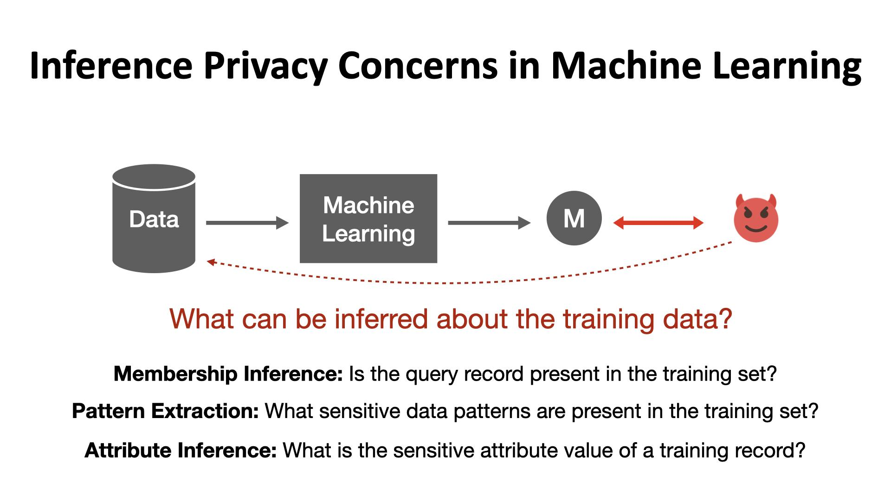

## Table of Contents

## What is a sensitive attribute in the context of machine learning?

In the context of machine learning, a sensitive attribute is a piece of information about individuals that, if used inappropriately, could lead to unfair treatment or discrimination. These attributes often include personal details like race, gender, age, or religion. When machine learning models are trained on data containing sensitive attributes, there's a risk that the models might learn and perpetuate existing biases present in the data, resulting in biased outcomes.

For example, if a machine learning model used for hiring decisions is trained on historical data where certain groups were unfairly underrepresented, the model might mistakenly learn that those groups are less suitable for the job. This could lead to the model continuing to discriminate against those groups, even if unintentionally. Therefore, it's important for data scientists and machine learning practitioners to carefully handle sensitive attributes, often by anonymizing data or using techniques like fairness-aware machine learning to mitigate bias and ensure more equitable outcomes.

## Why are sensitive attributes important in machine learning models?

Sensitive attributes are important in machine learning models because they can help us understand and address issues of fairness and bias. When we know which attributes are sensitive, like someone's race or gender, we can check if our model is treating everyone fairly. If a model is making decisions based on these sensitive attributes in a way that harms certain groups, we need to fix it. This helps make sure that the technology we create is fair and doesn't continue old unfair practices.

At the same time, sensitive attributes can also be a double-edged sword. If we're not careful, our models might learn to make decisions based on these attributes in a way that unfairly impacts people. For example, if a model used for loan approvals learns from past data where certain groups were unfairly denied loans, it might keep making the same mistakes. By being aware of sensitive attributes, we can take steps to prevent this kind of bias, using special techniques to make our models treat everyone more equally.

## Can you give examples of common sensitive attributes?

Sensitive attributes are pieces of information about people that can lead to unfair treatment if used the wrong way in [machine learning](/wiki/machine-learning). Some common examples include race, gender, age, and religion. These are things that we shouldn't use to judge someone's ability or worth, but sometimes, old data can have these biases built in.

For example, if a company is using a computer program to decide who to hire, and the program looks at the race of the applicants, it might unfairly choose one group over another, even if they are equally qualified. This is why it's important to be careful with these sensitive pieces of information.

Another example is age. If a machine learning model for insurance pricing uses age as a [factor](/wiki/factor-investing) and ends up charging older people more just because they are older, that could be unfair. By knowing that age is a sensitive attribute, we can work to make sure the model doesn't treat people differently just because of their age.

## How do sensitive attributes impact fairness in machine learning?

Sensitive attributes, like someone's race, gender, or age, can make machine learning models treat people unfairly if they're not handled carefully. These attributes can show up in the data that we use to train our models. If the old data has unfair biases, like if it shows that certain groups were treated badly in the past, the model might learn these biases and keep making the same unfair decisions. For example, if a model for approving loans learns from past data where certain groups were unfairly denied loans, it might keep denying loans to those groups, even if they should get them.

To make sure our models are fair, we need to pay close attention to these sensitive attributes. We can use special methods to check if our models are treating everyone the same way. If we find that the model is being unfair, we can fix it by using techniques like fairness-aware machine learning. This helps us create models that don't just repeat old mistakes but treat everyone equally, no matter their race, gender, or age. By being careful with sensitive attributes, we can build technology that's fair and helps everyone.

## What are the ethical considerations when handling sensitive attributes?

When handling sensitive attributes in machine learning, it's important to think about the ethical side of things. These attributes, like someone's race or gender, can easily lead to unfair treatment if we're not careful. If we use these attributes the wrong way, our models might end up making decisions that hurt certain groups of people. This could happen if our models learn from old data that already has biases in it. For example, if a model used for hiring learns from past data where certain groups were unfairly not hired, it might keep making the same mistake. So, we need to be careful and use these attributes in a way that doesn't harm anyone.

To handle sensitive attributes ethically, we need to use special techniques to make sure our models are fair. This means checking our models to see if they're treating everyone the same way, no matter their race, gender, or age. If we find that our model is being unfair, we can fix it by using methods like fairness-aware machine learning. This helps us build technology that doesn't repeat old mistakes and treats everyone equally. By being careful with sensitive attributes, we can create models that help everyone and don't cause harm.

## What techniques are used to mitigate bias related to sensitive attributes?

To reduce bias in machine learning models related to sensitive attributes, one common technique is called "fairness-aware machine learning." This method involves making sure that the model treats everyone the same way, no matter their race, gender, or age. For example, if a model is used to decide who gets a loan, fairness-aware techniques can help make sure that the model doesn't unfairly deny loans to certain groups. This can be done by adjusting how the model makes its decisions, so it doesn't rely too much on sensitive attributes. Another way to help is by using "algorithmic fairness" methods, which focus on making sure the model's outcomes are fair for everyone.

Another technique is "data preprocessing," where we clean up the data before using it to train the model. This can involve removing or changing sensitive attributes so they don't affect the model's decisions. For example, if we know that age is a sensitive attribute, we might choose to not include it in the data we use to train our model. This helps prevent the model from learning and repeating old biases. Additionally, "adversarial debiasing" is a method where we train another model to spot and remove bias from the main model. This helps make sure the main model doesn't make decisions based on sensitive attributes in a way that's unfair.

Lastly, "post-processing" techniques can be used to adjust the model's decisions after it has been trained. This means we can look at the model's results and change them if they seem unfair. For example, if a model for hiring seems to be unfairly choosing one group over another, we can adjust the final decisions to make them more equal. By using these different techniques, we can work to make sure our machine learning models are fair and don't harm anyone because of sensitive attributes.

## How can data preprocessing help in managing sensitive attributes?

Data preprocessing is a way to clean up the information we use to train our machine learning models. When we know that certain pieces of information, like someone's race or age, are sensitive and can lead to unfair treatment, we can change or remove these details from our data. For example, if we're making a model to decide who gets a loan, we might take out the age information so the model doesn't learn to give loans based on how old someone is. By doing this, we help make sure the model doesn't keep old biases and treats everyone the same way.

Another way data preprocessing helps is by balancing the data. Sometimes, the data we have might not have enough information about certain groups of people. If we don't fix this, our model might not work well for everyone. By adding more data or changing what we have to make it more even, we can help the model learn to make fair decisions for all groups. This way, we can build models that don't just repeat old mistakes but help everyone equally.

## What are the legal implications of using sensitive attributes in machine learning?

Using sensitive attributes in machine learning can lead to legal problems if not handled carefully. Laws like the General Data Protection Regulation (GDPR) in Europe and the Equal Credit Opportunity Act in the United States say that you can't use things like someone's race, gender, or age to treat them unfairly. If a machine learning model ends up making decisions based on these sensitive attributes in a way that hurts certain groups, the company using the model could get in trouble. They might face fines, lawsuits, or damage to their reputation.

To stay out of legal trouble, companies need to make sure their machine learning models are fair and don't use sensitive attributes in the wrong way. This means they should use special techniques like fairness-aware machine learning to check and fix any unfairness in their models. By doing this, they can make sure they're following the law and treating everyone equally, no matter their race, gender, or age.

## How do you measure bias and fairness concerning sensitive attributes?

To measure bias and fairness in machine learning models when it comes to sensitive attributes, we need to look at how the model treats different groups of people. One common way to do this is by using fairness metrics. These metrics help us see if the model is making decisions fairly for everyone, no matter their race, gender, or age. For example, we might use a metric called "demographic parity," which checks if the model's decisions are spread out evenly across different groups. If the model is fair, the percentage of positive outcomes (like getting a loan or a job) should be the same for all groups.

Another way to measure bias is by looking at the model's performance across different groups. We can use metrics like "equalized odds" or "equal opportunity," which check if the model is equally good at predicting outcomes for everyone. Equalized odds means the model should have the same true positive rate and false positive rate for all groups. Equal opportunity focuses just on the true positive rate being the same. By using these metrics, we can find out if our model is treating everyone the same way or if it's being unfair to certain groups because of sensitive attributes.

## What are some advanced methods for handling sensitive attributes in deep learning models?

In [deep learning](/wiki/deep-learning) models, one advanced method for handling sensitive attributes is using adversarial training. This method involves training another model, called an adversary, to spot and remove bias from the main model. The main model tries to make good predictions without relying on sensitive attributes like race or gender, while the adversary tries to guess these attributes from the main model's decisions. By making the main model and the adversary work against each other, we can help the main model learn to make fair decisions. This is like a game where the main model tries to hide any bias, and the adversary tries to find it. Over time, the main model gets better at making fair choices without using sensitive information.

Another advanced technique is called "domain adaptation." This method helps the model work well for different groups of people by adjusting how it learns from the data. For example, if we're making a model to predict health outcomes, we might have data from different hospitals. Each hospital might have patients from different backgrounds. Domain adaptation helps the model learn from all these different groups without being biased toward any one group. By doing this, the model can treat everyone fairly, no matter where they come from or what sensitive attributes they have. This way, the model can make good decisions for everyone equally.

## How does differential privacy relate to the protection of sensitive attributes?

Differential privacy is a way to protect sensitive attributes in machine learning by adding a bit of randomness to the data. This randomness helps keep personal information private while still letting us learn useful things from the data. For example, if we're looking at a dataset with people's ages, we might add some noise to the ages so no one can tell exactly how old any single person is. This way, the model can still learn about general trends without knowing too much about any one person's sensitive information.

Using differential privacy helps make sure that machine learning models don't learn too much about sensitive attributes like race or gender. If a model knows too much about these details, it might make unfair decisions. By adding noise to the data, we can keep the model from [picking](/wiki/asset-class-picking) up on these sensitive details and using them the wrong way. This helps protect people's privacy and makes sure the model treats everyone fairly.

## What are the current research trends and future directions in handling sensitive attributes in machine learning?

Current research trends in handling sensitive attributes in machine learning focus a lot on making models fairer and more private. One big trend is using methods like fairness-aware machine learning and differential privacy to make sure models don't treat people unfairly because of sensitive details like race or gender. Researchers are working on new ways to measure fairness, like using metrics that check if a model's decisions are the same for everyone, no matter their sensitive attributes. They're also looking at ways to add a bit of randomness to data, so models can learn useful things without knowing too much about any one person's private information. This helps protect people's privacy and makes sure the technology we create is fair.

Future directions in this field are all about improving these methods and finding new ones. Researchers are trying to make fairness-aware techniques work better with big and complex data, like the kind used in deep learning models. They're also looking into ways to make sure models stay fair over time, even as the data changes. Another big area is figuring out how to balance privacy and fairness. For example, adding too much randomness to data can make it hard for models to learn anything useful, so researchers are working on finding the right amount of noise to add. By keeping up with these trends and directions, we can build machine learning models that treat everyone fairly and protect their sensitive information at the same time.

## References & Further Reading

[1]: Barocas, S., Hardt, M., & Narayanan, A. (2019). ["Fairness and Machine Learning: Limitations and Opportunities"](https://fairmlbook.org/). fairmlbook.org.

[2]: Dwork, C., Hardt, M., Pitassi, T., Reingold, O., & Zemel, R. (2012). ["Fairness through Awareness."](https://arxiv.org/abs/1104.3913) Proceedings of the 3rd Innovations in Theoretical Computer Science Conference.

[3]: Mehrabi, N., Morstatter, F., Saxena, N., Lerman, K., & Galstyan, A. (2021). ["A Survey on Bias and Fairness in Machine Learning."](https://dl.acm.org/doi/abs/10.1145/3457607) ACM Computing Surveys.

[4]: Kleinberg, J., Mullainathan, S., & Raghavan, M. (2017). ["Inherent Trade-Offs in the Fair Determination of Risk Scores."](https://arxiv.org/abs/1609.05807) Proceedings of the 8th Innovations in Theoretical Computer Science Conference.

[5]: Kearns, M., & Roth, A. (2020). ["The Ethical Algorithm: The Science of Socially Aware Algorithm Design"](https://dl.acm.org/doi/book/10.5555/3379082). Oxford University Press.

[6]: Shokri, R., & Shmatikov, V. (2015). ["Privacy-Preserving Deep Learning."](https://dl.acm.org/doi/10.1145/2810103.2813687) Proceedings of the 22nd ACM SIGSAC Conference on Computer and Communications Security.

[7]: Hardt, M., Price, E., & Srebro, N. (2016). ["Equality of Opportunity in Supervised Learning."](https://arxiv.org/abs/1610.02413) Advances in Neural Information Processing Systems 29.

[8]: Feldman, M., Friedler, S. A., Moeller, J., Scheidegger, C., & Venkatasubramanian, S. (2015). ["Certifying and Removing Disparate Impact."](https://arxiv.org/abs/1412.3756) Proceedings of the 21th ACM SIGKDD International Conference on Knowledge Discovery and Data Mining.